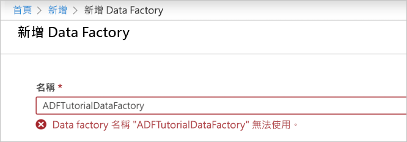

# <a name="transform-data-using-mapping-data-flows"></a>使用對應資料流程來轉換資料

[!INCLUDE[appliesto-adf-xxx-md](includes/appliesto-adf-xxx-md.md)]

如果您不熟悉 Azure Data Factory，請參閱 [Azure Data Factory 簡介](introduction.md)。

在本教學課程中，您將使用 Azure Data Factory 使用者介面 (UX) 建立管線，將資料從 Azure Data Lake Storage (ADLS) Gen2 來源複製和轉換成使用對應資料流程的 ADLS Gen2 接收。 使用對應資料流程來轉換資料時，可以擴充此教學課程中的設定模式

在本教學課程中，您會執行下列步驟：

> [!div class="checklist"]
> * 建立資料處理站。
> * 使用資料流程活動建立管線。
> * 使用四個轉換建立對應的資料流程。
> * 對管線執行測試。
> * 監視資料流程活動

## <a name="prerequisites"></a>必要條件
* **Azure 訂用帳戶**。 如果您沒有 Azure 訂用帳戶，請在開始前建立[免費 Azure 帳戶](https://azure.microsoft.com/free/)。
* **Azure 儲存體帳戶**。 您可以使用 ADLS 儲存體作為 *來源* 和 *接收* 資料存放區。 如果您沒有儲存體帳戶，請參閱[建立 Azure 儲存體帳戶](../storage/common/storage-account-create.md)，按照步驟建立此帳戶。

我們在本教學 [課程](https://raw.githubusercontent.com/djpmsft/adf-ready-demo/master/moviesDB.csv)中轉換的檔案是 MoviesDB.csv，可在此找到。 若要從 GitHub 取出檔案，請將內容複寫到您選擇的文字編輯器，以將本機儲存為 .csv 檔案。 若要將檔案上傳至您的儲存體帳戶，請參閱 [使用 Azure 入口網站上傳 blob](../storage/blobs/storage-quickstart-blobs-portal.md)。 這些範例會參考名為「範例-資料」的容器。

## <a name="create-a-data-factory"></a>建立 Data Factory

在此步驟中，您會建立資料處理站，並開啟 Data Factory UX 在 data factory 中建立管線。

1. 開啟 **Microsoft Edge** 或 **Google Chrome**。 目前，只有在 Microsoft Edge 和 Google Chrome 網頁瀏覽器中才支援 Data Factory 的 UI。
2. 在左側功能表上，選取 [建立資源] > [分析] > [資料處理站]：

   ![在 [新增] 窗格中選取資料處理站](./media/doc-common-process/new-azure-data-factory-menu.png)

3. 在 [新增資料處理站] 頁面的 [名稱] 下，輸入 **ADFTutorialDataFactory**。

   Azure Data Factory 的名稱必須是 *全域唯一的*。 如果您收到有關名稱值的錯誤訊息，請輸入不同的資料處理站名稱。 (例如，使用 yournameADFTutorialDataFactory)。 如需 Data Factory 成品的命名規則，請參閱 [Data Factory 命名規則](naming-rules.md)。

     
4. 選取您要在其中建立資料處理站的 Azure **訂用帳戶**。
5. 針對 [資源群組]，採取下列其中一個步驟︰

    a. 選取 [使用現有的] ，然後從下拉式清單選取現有的資源群組。

    b. 選取 [建立新的] ，然後輸入資源群組的名稱。 
         
    若要了解資源群組，請參閱[使用資源群組管理您的 Azure 資源](../azure-resource-manager/management/overview.md)。 
6. 在 [版本] 下，選取 [V2]。
7. 在 [位置] 下，選取資料處理站的位置。 只有受到支援的位置會顯示在下拉式清單中。 資料存放區 (例如 Azure 儲存體和 SQL Database) 和計算 (例如，資料處理站所使用的 Azure HDInsight) 可位於其他區域。
8. 選取 [建立]  。
9. 建立完成後，您會在 [通知中心] 看到通知。 選取 [移至資源]，以瀏覽至 Data Factory 頁面。
10. 選取 [編寫與監視]，以在個別索引標籤中啟動 Data Factory 使用者介面。

## <a name="create-a-pipeline-with-a-data-flow-activity"></a>使用資料流程活動建立管線

在此步驟中，您將建立包含「資料流程」活動的管線。

1. 在 [現在就開始吧] 頁面中，選取 [建立管線]。

   

1. 在管線的 [ **一般** ] 索引標籤中，輸入 **TransformMovies** 作為管線的 **名稱** 。
1. 在 factory 的頂端列中，滑出 [ **資料流程] 調試** 滑杆。 偵錯工具模式允許針對即時 Spark 叢集進行轉換邏輯的互動式測試。 資料流程叢集需要5-7 分鐘的時間來準備，且如果使用者打算進行資料流程開發，建議先開啟 debug。 如需詳細資訊，請參閱[偵錯模式](concepts-data-flow-debug-mode.md)。

    
1. 在 [ **活動** ] 窗格中，展開 [ **移動和轉換** ] 可折疊。 將 [ **資料流程** ] 活動從窗格拖放到管線畫布。

    
1. 在 [ **加入** 資料流程] 快顯視窗中，選取 [ **建立新** 的資料流程]，然後為您的資料流程命名 **TransformMovies**。 完成時按一下 [完成]。

    

## <a name="build-transformation-logic-in-the-data-flow-canvas"></a>在資料流程畫布中建立轉換邏輯

建立資料流程之後，系統會自動將您傳送到資料流程畫布。 在此步驟中，您將建立會在 ADLS 儲存體中採用 moviesDB.csv 的資料流程，並將 comedies 的平均評等從1910匯總至2000。 然後，您會將此檔案寫回 ADLS 儲存體。

1. 在 [資料流程] 畫布中，按一下 [ **加入來源** ] 方塊來新增來源。

    ![顯示 [新增來源] 方塊的螢幕擷取畫面。](media/tutorial-data-flow/dataflow2.png)
1. 命名您的來源 **MoviesDB**。 按一下 [ **新增** ] 以建立新的源資料集。

    ![顯示在命名來源之後，您選取 [新增] 的螢幕擷取畫面。](media/tutorial-data-flow/dataflow3.png)
1. 選擇 [ **Azure Data Lake Storage Gen2**]。 按一下 [繼續]。

    
1. 選擇 [ **DelimitedText**]。 按一下 [繼續]。

    ![顯示 [DelimitedText] 磚的螢幕擷取畫面。](media/tutorial-data-flow/dataset2.png)
1. 將您的資料集命名為 **MoviesDB**。 在 [連結服務] 下拉式清單中，選擇 [ **新增**]。

    
1. 在 [已連結的服務建立] 畫面中，為您的 ADLS gen2 連結服務 **ADLSGen2** 命名，並指定驗證方法。 然後輸入您的連接認證。 在本教學課程中，我們將使用帳戶金鑰來連線到儲存體帳戶。 您可以按一下 [ **測試連接** ]，確認您的認證是否輸入正確。 在完成作業後，按一下 [建立]。

    
1. 當您回到 [資料集建立] 畫面之後，請在 [檔案 **路徑** ] 欄位下輸入檔案的所在位置。 在本教學課程中，檔案 moviesDB.csv 位於容器範例-資料中。 當檔案有標頭時，請核取 **第一個資料列做為標頭**。 **從連線/存放區**選取，直接從儲存體中的檔案匯入標頭架構。 完成時按一下 [確定]。

    
1. 如果您的 debug 叢集已啟動，請移至來源轉換的 [ **資料預覽** ] 索引標籤， **然後按一下 [** 重新整理] 以取得資料的快照集。 您可以使用 [資料預覽] 來確認是否已正確設定轉換。

    
1. 在 [資料流程] 畫布的來源節點旁，按一下加號圖示以新增轉換。 您要新增的第一個轉換是 **篩選準則**。

    
1. 命名您的篩選轉換 **FilterYears**。 按一下 [ **篩選開啟** ] 旁的 [運算式] 方塊，以開啟 [運算式產生器]。 您將在這裡指定篩選準則。

    ![顯示 [運算式] 方塊的螢幕擷取畫面。](media/tutorial-data-flow/filter1.png)
1. 資料流程運算式產生器可讓您以互動方式建立要在各種轉換中使用的運算式。 運算式可以包含內建函數、輸入架構中的資料行，以及使用者定義的參數。 如需有關如何建立運算式的詳細資訊，請參閱 [資料流程運算式](concepts-data-flow-expression-builder.md)產生器。

    在本教學課程中，您想要篩選在1910年和2000年之間的內容類型喜劇電影。 當 year 目前是字串時，您必須使用函式將它轉換成整數 ```toInteger()``` 。 使用大於或等於 ( # B0 =) 且小於或等於 ( # B1 =) 運算子，以針對常值年份值1910和200進行比較。 將這些運算式與 and ( # A2) 運算子結合在一起。 運算式的形式如下：

    ```toInteger(year) >= 1910 && toInteger(year) <= 2000```

    若要找出哪些電影 comedies，您可以使用函式 ```rlike()``` 來尋找資料行內容中的模式 ' 喜劇 '。 Rlike 運算式的聯集與年度比較以取得：

    ```toInteger(year) >= 1910 && toInteger(year) <= 2000 && rlike(genres, 'Comedy')```

    如果您有作用中的偵錯工具，您可以按一下 [重新整理] 來確認您的邏輯，以 **查看與所** 用輸入相較的運算式輸出。 您可以使用資料流程運算式語言來完成這項邏輯，以提供多個正確的答案。

    

    當您完成運算式之後，請按一下 **[儲存並完成]** 。

1. 提取 **資料預覽** ，以確認篩選器可正常運作。

    
1. 您將新增的下一個轉換是**架構修飾**詞下的**匯總**轉換。

    
1. 命名您的匯總轉換 **AggregateComedyRatings**。 在 [ **分組方式** ] 索引標籤中，從下拉式清單中選取 [ **年** ]，以將匯總的年份依電影出的年份分組。

    ![顯示 [匯總設定] 下 [群組依據] 索引標籤中年份選項的螢幕擷取畫面。](media/tutorial-data-flow/agg2.png)
1. 移至 [ **匯總** ] 索引標籤。在左邊的文字方塊中，將匯總資料行命名為 **AverageComedyRating**。 按一下右邊的 [運算式] 方塊，透過運算式產生器輸入匯總運算式。

    ![顯示 [匯總設定] 下 [匯總] 索引標籤中 [年份] 選項的螢幕擷取畫面。](media/tutorial-data-flow/agg3.png)
1. 若要取得資料行 **分級**的平均值，請使用 ```avg()``` 彙總函式。 由於 **評** 等是字串並 ```avg()``` 接受數位輸入，因此我們必須透過函數將值轉換成數位 ```toInteger()``` 。 這是運算式看起來像這樣：

    ```avg(toInteger(Rating))```

    按一下 **[儲存並完成]** 。

    
1. 移至 [ **資料預覽** ] 索引標籤，以查看轉換輸出。 請注意，其中只有兩個數據行： **year** 和 **AverageComedyRating**。

    
1. 接下來，您想要在**目的地**下新增**接收**轉換。

    ![顯示要在 [目的地] 底下新增接收轉換的螢幕擷取畫面。](media/tutorial-data-flow/sink1.png)
1. 命名接收 **接收器**。 按一下 [ **新增** ] 以建立接收資料集。

    
1. 選擇 [ **Azure Data Lake Storage Gen2**]。 按一下 [繼續]。

    
1. 選擇 [ **DelimitedText**]。 按一下 [繼續]。

    
1. 將接收資料集命名為 **MoviesSink**。 針對 [已連結的服務]，選擇您在步驟6中建立的 ADLS gen2 連結服務。 輸入要寫入資料的輸出檔案夾。 在本教學課程中，我們會寫入容器「範例資料」中的「輸出」資料夾。 資料夾不需要事先存在，而且可以動態建立。 將**第一個資料列設定為標頭**為 true，並針對匯**入架構**選取 [**無**]。 按一下 [完成]。

    

現在您已完成建立資料流程。 您已經準備好在您的管線中執行它。

## <a name="running-and-monitoring-the-data-flow"></a>執行和監視資料流程

您可以在發行管線之前進行調試。 在此步驟中，您將會觸發資料流程管線的 debug 執行。 雖然資料預覽不會寫入資料，但 debug 回合會將資料寫入至您的接收目的地。

1. 移至管線畫布。 按一下 [ **debug** ] 以觸發「偵錯工具執行」。

    ![顯示反白顯示 [偵錯工具] 的管線畫布的螢幕擷取畫面。](media/tutorial-data-flow/pipeline1.png)
1. 資料流程活動的管線偵測會使用作用中的 debug 叢集，但仍需要至少一分鐘的時間來初始化。 您可以透過 [ **輸出** ] 索引標籤來追蹤進度。執行成功後，按一下 [眼鏡] 圖示以開啟 [監視中] 窗格。

    
1. 在 [監視中] 窗格中，您可以看到每個轉換步驟所花費的資料列數和時間。

    ![顯示 [監視中] 窗格的螢幕擷取畫面，您可以在其中查看每個轉換步驟所花費的資料列數和時間。](media/tutorial-data-flow/pipeline3.png)
1. 按一下轉換可取得資料行和資料分割的詳細資訊。

    

如果您已正確遵循本教學課程，您應該將83個數據列和2個數據行寫入至您的接收資料夾。 您可以藉由檢查 blob 儲存體來確認資料是否正確。

## <a name="next-steps"></a>後續步驟

本教學課程中的管線會執行將 comedies 從1910到2000的平均評等進行匯總的資料流程，並將資料寫入 ADLS。 您已了解如何︰

> [!div class="checklist"]
> * 建立資料處理站。
> * 使用資料流程活動建立管線。
> * 使用四個轉換建立對應的資料流程。
> * 對管線執行測試。
> * 監視資料流程活動

深入瞭解 [資料流程運算式語言](data-flow-expression-functions.md)。
