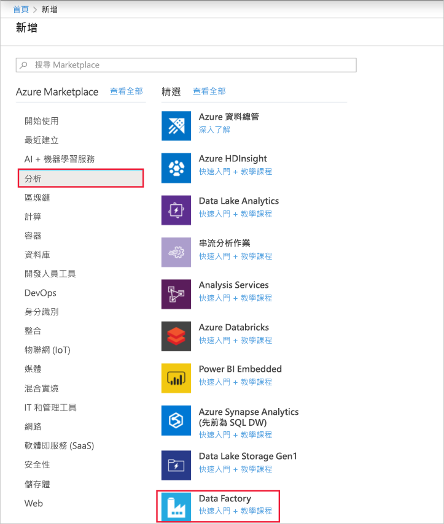

# 使用資料複製工具，根據 LastModifiedDate 以累加方式複製新的和變更的檔案

[!INCLUDE[appliesto-adf-xxx-md](includes/appliesto-adf-xxx-md.md)]

在本教學課程中，您將使用 Azure 入口網站來建立資料處理站。 接著，您將使用資料複製工具來建立管線，以累加方式將新的和變更的檔案從 Azure Blob 儲存體累加地複製到 Azure Blob 儲存體。 它會`LastModifiedDate`使用來判斷要複製的檔案。

當您完成這裡的步驟之後，Azure Data Factory 將會掃描來源存放區中的所有檔案、套用檔案篩選`LastModifiedDate`器，然後複製到目的地存放區，這只是上次新增或已更新的檔案。 請注意，如果 Data Factory 掃描大量檔案，您仍然應該預期長時間。 檔案掃描非常耗時，即使已複製的資料量減少也一樣。

> [!NOTE]
> 如果您不熟悉 Data Factory，請參閱 [Data Factory 簡介](introduction.md)。

在本教學課程中，您將完成下列工作：

> [!div class="checklist"]
> * 建立資料處理站。
> * 使用複製資料工具建立管線。
> * 監視管線和活動執行。

## Prerequisites

* **Azure 訂用帳戶**：如果您沒有 Azure 訂用帳戶，請在開始前建立[免費帳戶](https://azure.microsoft.com/free/)。
* **Azure 儲存體帳戶**：針對來源和接收資料存放區使用 Blob 儲存體。 如果您沒有 Azure 儲存體帳戶，請遵循[建立儲存體帳戶](../storage/common/storage-account-create.md)中的指示。

## 在 Blob 儲存體中建立兩個容器

完成下列步驟，為教學課程準備您的 Blob 儲存體：

1. 建立名為**source**的容器。 您可以使用各種工具來執行這項工作，例如[Azure 儲存體總管](https://storageexplorer.com/)。

2. 建立名為**destination**的容器。

## 建立 Data Factory

1. 在左窗格中選取 [建立資源]****。 選取 [**分析** > **Data Factory**：

   

2. 在 [新增資料處理站]  頁面的 [名稱]  下，輸入 **ADFTutorialDataFactory**。

   資料處理站的名稱必須是「全域唯一」的名稱。 您可能會收到此錯誤訊息：

   

   如果您收到有關名稱值的錯誤訊息，請輸入不同的資料處理站名稱。 例如，使用**您的名稱**__**ADFTutorialDataFactory**。 如需 Data Factory 成品的命名規則，請參閱 [Data Factory 命名規則](naming-rules.md)。
3. 在 [**訂**用帳戶] 下，選取您將在其中建立新資料處理站的 Azure 訂用帳戶。
4. 在 [**資源群組**] 下，採取下列其中一個步驟：

    * 選取 [**使用現有**的]，然後在清單中選取現有的資源群組。

    * 選取 [**新建**]，然後輸入資源群組的名稱。
         
    若要了解資源群組，請參閱[使用資源群組管理您的 Azure 資源](../azure-resource-manager/management/overview.md)。

5. 在 [版本]  下，選取 [V2]  。
6. 在 [位置]**** 下，選取資料處理站的位置。 清單中只會顯示支援的位置。 您的資料處理站所使用的資料存放區（例如，Azure 儲存體和 Azure SQL Database）和計算（例如 Azure HDInsight）可位於其他位置和區域中。
8. 選取 [建立]  。
9. 建立資料處理站之後，會顯示 [data factory] 首頁。
10. 若要在不同的索引標籤上開啟 Azure Data Factory 使用者介面（UI），請選取 [**作者 & 監視器**] 磚：

    

## 使用複製資料工具建立管線

1. 在 [**現在就開始**吧] 頁面上，選取 [**資料複製**] 圖格以開啟 [資料複製] 工具：

   

2. 在 [**屬性**] 頁面上，採取下列步驟：

    a. 在 [工作**名稱**] 下，輸入**DeltaCopyFromBlobPipeline**。

    b. 在 [工作**步調] 或**[工作排程] 底下，選取 [依**排程定期執行**]。

    c. 在 [**觸發程式類型**] 底下，選取 [**輪轉視窗]**。

    d. 在 **[週期**] 底下，輸入**15 分鐘**。

    e. 選取 [下一步]  。

    Data Factory 會使用指定的工作名稱來建立管線。

    

3. 在 [**來源資料存放區**] 頁面上，完成下列步驟：

    a. 選取 [**建立新**連線] 以新增連接。

    b. 從資源庫選取 [ **Azure Blob 儲存體**]，然後選取 [**繼續**]：

    

    c. 在 [**新增連結服務（Azure Blob 儲存體）** ] 頁面上，從 [**儲存體帳戶名稱**] 清單中選取您的儲存體帳戶。 測試連接，然後選取 [**建立**]。

    d. 選取新的連結服務，然後選取 **[下一步]**：

   

4. 在 [選擇輸入檔案或資料夾]**** 頁面上，完成下列步驟︰

    a. 流覽並選取 [**源**] 資料夾，然後選取 [**選擇**]。

    

    b. 在 [檔案**載入行為**] 底下，選取 [累加**式載入： LastModifiedDate**]。

    c. 選取 [**二進位複製**]，然後選取 **[下一步]**：

     ![選擇 [輸入檔案或資料夾] 頁面](./media/tutorial-incremental-copy-lastmodified-copy-data-tool/check-binary-copy.png)

5. 在 [**目的地資料存放區**] 頁面上，選取您建立的**AzureBlobStorage**服務。 這是與來源資料存放區相同的儲存體帳戶。 然後選取 [下一步]  。

6. 在 [選擇輸出檔案或資料夾]**** 頁面上，完成下列步驟︰

    a. 流覽並選取 [**目的地**] 資料夾，然後選取 [**選擇**]：

    ![選擇 [輸出檔案或資料夾] 頁面](./media/tutorial-incremental-copy-lastmodified-copy-data-tool/choose-output-file-folder.png)

    b. 選取 [下一步]  。

7. 在 [設定]**** 頁面上，選取 [下一步]****。

8. 在 [**摘要**] 頁面上，檢查設定，然後選取 **[下一步]**。

    

9. 在**部署頁面**上選取 [監視]**** 來監視管線 (工作)。

    

10. 請注意，系統會自動選取左側的 [監視]**** 索引標籤。 應用程式會切換至 [**監視**] 索引標籤。您會看到管線的狀態。 選取 [重新整理]**** 可重新整理清單。 選取 [**管線名稱**] 底下的連結以查看活動執行詳細資料，或再次執行管線。

    

11. 管線中只有一個活動（複製活動），因此您只會看到一個專案。 如需複製作業的詳細資訊，請在 [**活動名稱**] 資料行中選取 [**詳細資料**] 連結（眼鏡圖示）。 如需屬性的詳細資訊，請參閱[複製活動總覽](copy-activity-overview.md)。

    

    因為 Blob 儲存體帳戶的來源容器中沒有任何檔案，所以您不會看到任何檔案複製到帳戶中的目的地容器：

    

12. 建立空的文字檔，並將其命名為**file1 .txt**。 將此文字檔上傳至儲存體帳戶中的來源容器。 您可以使用各種工具來執行這些工作，例如[Azure 儲存體總管](https://storageexplorer.com/)。

    

13. 若要返回 [**管線執行**] 視圖，請選取 [**所有管線執行**]，然後等候相同的管線再次觸發。  

    

14. 當第二個管線執行完成時，請遵循先前所述的相同步驟來檢查活動執行詳細資料。  

    您會看到一個檔案（file1 .txt）已從來源容器複製到 Blob 儲存體帳戶的目的地容器：

    

15. 建立另一個空的文字檔，並將它命名為**file2 .txt**。 將此文字檔上傳至 Blob 儲存體帳戶中的來源容器。

16. 針對第二個文字檔重複步驟13和14。 您會看到在此管線執行期間，只有新的檔案（file2）已從來源容器複製到儲存體帳戶的目的地容器。  

    您也可以使用[Azure 儲存體總管](https://storageexplorer.com/)來確認只有一個檔案已複製，以掃描檔案：

    

## 後續步驟
請移至下列教學課程，以瞭解如何使用 Azure 上的 Apache Spark 叢集來轉換資料：

> [!div class="nextstepaction"]
>[使用 Apache Spark 叢集來轉換雲端中的資料](tutorial-transform-data-spark-portal.md)
