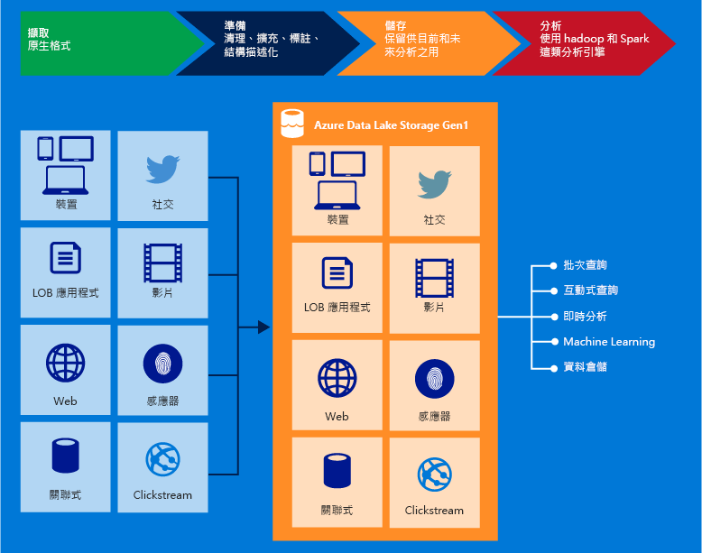

# 什麼是 Azure Data Lake Storage Gen1？

[!INCLUDE [data-lake-storage-gen1-rename-note.md](../../includes/data-lake-storage-gen1-rename-note.md)]

Azure Data Lake Storage Gen1 是容納巨量資料分析工作負載的企業級超大規模存放庫。 Azure Data Lake 可讓您在單一位置擷取任何大小、類型和擷取速度的資料，以便進行運作和探究分析。

使用與 WebHDFS 相容的 REST API，可以從 Hadoop (HDInsight 叢集所提供) 存取 Data Lake Storage Gen1。 其設計目的是要針對儲存的資料啟用分析，並針對資料分析案例的效能進行調整。 Data Lake Storage Gen1 包含所有企業級功能：安全性、管理性、擴充性、可靠性和可用性。

## 主要功能

Data Lake Storage Gen1 的一些重要功能包括下列項目。

### 專為 Hadoop 而建置

Data Lake Storage Gen1 是與 Hadoop 分散式檔案系統（HDFS）相容的 Apache Hadoop 檔案系統，並可搭配 Hadoop 生態系統使用。 採用 WebHDFS API 的現有 HDInsight 應用程式或服務可以輕易地與 Data Lake Storage Gen 1 整合。 Data Lake Storage Gen1 也會公開適用於應用程式的 WebHDFS 相容 REST 介面。

您可以使用 Hadoop 分析架構（例如 MapReduce 或 Hive），輕鬆地分析儲存在 Data Lake Storage Gen1 中的資料。 您可以布建 Azure HDInsight 叢集，並將它們設定為直接存取儲存在 Data Lake Storage Gen1 中的資料。

### 無限制的儲存空間、PB 檔案

Data Lake Storage Gen1 提供無限制的儲存體，並可儲存各種資料以供分析。 它不會對帳戶大小、檔案大小，或可儲存在 data lake 中的資料量施加任何限制。 個別檔案的大小範圍可以從 kb 到 pb。 建立多個複本以永久儲存資料。 資料可以儲存在 data lake 中的持續時間沒有任何限制。

### 針對巨量資料分析調整效能

Data Lake Storage Gen1 是針對執行大規模的分析系統所建立，需要大量的輸送量來查詢和分析大量資料。 資料湖會將檔案的各個部分散於數個個別的儲存體伺服器。 這可改善以平行方式讀取檔案以便執行資料分析時的輸送量。

### 企業就緒：高可用性和安全

Data Lake Storage Gen1 提供符合業界標準的可用性與可靠性。 您的資料資產可藉由製作備援複本來長期儲存，以防範任何未預期的失敗。

Data Lake Storage Gen1 也可對預存資料提供企業級安全性。 如需詳細資訊，請參閱[在 Azure Data Lake Storage Gen1 中保護資料](#DataLakeStoreSecurity)。

### 所有資料

Data Lake Storage Gen1 可以儲存其原生格式的任何資料，而不需要任何先前的轉換。 載入資料前，Data Lake Storage Gen1 不需要定義結構描述，而是留待個別的分析架構在分析時解譯資料及定義結構描述。 儲存任意大小和格式檔案的能力，可讓 Data Lake Storage Gen1 處理結構化、半結構化和非結構化資料。

Data Lake Storage Gen1 的資料容器基本上是資料夾與檔案。 您可以使用 Sdk、Azure 入口網站和 Azure Powershell 來操作儲存的資料。 如果您使用這些介面並使用適當的容器將資料放入存放區中，則可以儲存任何類型的資料。 Data Lake Storage Gen1 不會根據其儲存的資料類型來對資料執行任何特殊處理。

## 保護資料

Data Lake Storage Gen1 使用 Azure Active Directory （Azure AD）進行驗證，而存取控制清單（Acl）則是用來管理資料的存取權。

| 功能 | 描述 |
| --- | --- |
| 驗證 |Data Lake Storage Gen1 與 Azure AD 整合 Data Lake Storage Gen1 中儲存之所有資料的身分識別和存取管理。 由於整合的關係，Data Lake Storage Gen1 所有 Azure AD 功能的優點，例如多重要素驗證、條件式存取、角色型存取控制、應用程式使用方式監視、安全性監視和警示等。 Data Lake Storage Gen1 支援 OAuth 2.0 通訊協定以便在 REST 介面中進行驗證。 請參閱[Data Lake Storage Gen1 驗證](data-lakes-store-authentication-using-azure-active-directory.md)。|
| 存取控制 |Data Lake Storage Gen1 透過支援 WebHDFS 通訊協定所公開的 POSIX 樣式權限，以提供存取控制。 您可以在根資料夾、子資料夾和個別檔案上啟用 Acl。 如需 Acl 如何在 Data Lake Storage Gen1 內容中工作的詳細資訊，請參閱[Data Lake Storage Gen1 中的存取控制](data-lake-store-access-control.md)。 |
| 加密 |Data Lake Storage Gen1 也會為帳戶中儲存的資料提供加密。 您會在建立 Data Lake Storage Gen1 帳戶時指定加密設定。 您可以選擇將資料加密，或選擇不使用加密。 如需詳細資訊，請參閱 [Data Lake Storage Gen1 的加密](data-lake-store-encryption.md)。 如需有關如何提供加密相關設定的指示，請參閱[使用 Azure 入口網站開始使用 Data Lake Storage Gen1](data-lake-store-get-started-portal.md)。 |

如需有關如何在 Data Lake Storage Gen1 中保護資料的指示，請參閱[在 Azure Data Lake Storage Gen1 中保護資料](data-lake-store-secure-data.md)。

## 應用程式相容性

Data Lake Storage Gen1 與 Hadoop 生態系統中的大部分開放原始碼元件相容。 它也可以與其他 Azure 服務完美整合。 若要深入瞭解如何搭配開放原始碼元件和其他 Azure 服務使用 Data Lake Storage Gen1，請使用下列連結：

- 如需可與 Data Lake Storage Gen1 互通的開放原始碼應用程式清單，請參閱[與 Azure Data Lake Storage Gen1 相容的應用程式與服務](data-lake-store-compatible-oss-other-applications.md)。
- 請參閱[與其他 azure 服務整合](data-lake-store-integrate-with-other-services.md)，以瞭解如何搭配其他 azure 服務使用 Data Lake Storage Gen1，以啟用更廣泛的案例。
- 請參閱[使用 Data Lake Storage Gen1 的案例](data-lake-store-data-scenarios.md)，以了解如何在擷取資料、處理資料、下載資料和視覺化資料等案例中使用 Data Lake Storage Gen1。

## Data Lake Storage Gen1 檔案系統

Data Lake Storage Gen1 可以透過 Hadoop 環境中的 filesystem AzureDataLakeFilesystem （adl://）來存取（可與 HDInsight 叢集搭配使用）。 使用 adl://的應用程式和服務可以利用 WebHDFS 中目前無法使用的進一步效能優化。 如此一來，Data Lake Storage Gen1 可讓您彈性地使用最佳效能，方法是使用 adl://的建議選項，或是繼續直接使用 WebHDFS API 來維護現有的程式碼。 Azure HDInsight 充分利用 AzureDataLakeFilesystem 來提供 Data Lake Storage Gen1 的最佳效能。

您可以使用 `adl://<data_lake_storage_gen1_name>.azuredatalakestore.net`，在 Data Lake Storage Gen1 中存取您的資料。 如需如何在 Data Lake Storage Gen1 中存取資料的詳細資訊，請參閱 View properties of the 已[儲存的資料](data-lake-store-get-started-portal.md#properties)。

## 後續步驟

- [使用 Azure 入口網站開始使用 Data Lake Storage Gen1](data-lake-store-get-started-portal.md)
- [使用 .NET SDK 開始使用 Data Lake Storage Gen1](data-lake-store-get-started-net-sdk.md)
- [搭配 Data Lake Storage Gen1 使用 Azure HDInsight](data-lake-store-hdinsight-hadoop-use-portal.md)