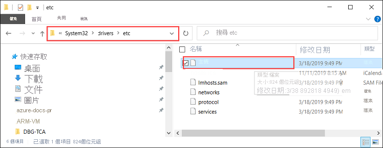

# <a name="deploy-vms-on-your-azure-stack-edge-pro-gpu-device-via-azure-powershell-script"></a>透過 Azure PowerShell 腳本在您的 Azure Stack Edge Pro GPU 裝置上部署 Vm

<!--[!INCLUDE [applies-to-skus](../../includes/azure-stack-edge-applies-to-all-sku.md)]-->

本教學課程說明如何使用 Azure PowerShell 腳本，在您的 Azure Stack Edge Pro 裝置上建立和管理 VM。

## <a name="prerequisites"></a>必要條件

在您開始使用此腳本在 Azure Stack Edge Pro 裝置上建立和管理 VM 之前，您必須確定已完成下列步驟中所列的必要條件：

### <a name="for-azure-stack-edge-pro-device-via-the-local-web-ui"></a>透過本機 web UI 進行 Azure Stack Edge Pro 裝置

1. 您已在 Azure Stack Edge Pro 裝置上完成網路設定，如[步驟1：設定 Azure Stack Edge Pro 裝置](azure-stack-edge-j-series-connect-resource-manager.md#step-1-configure-azure-stack-edge-pro-device)所述。

2. 已啟用網路介面進行計算。 此網路介面 IP 用來建立 VM 部署的虛擬交換器。 下列步驟會逐步引導您進行程序：

    1. 移至 [ **計算] 設定**。 選取您將用來建立虛擬交換器的網路介面。

        > [!IMPORTANT] 
        > 您只能設定一個連接埠進行計算。

    2. 在網路介面上啟用計算。 Azure Stack Edge Pro 會建立和管理對應至該網路介面的虛擬交換器。

3. 您已在 Azure Stack Edge Pro 裝置和用戶端的受根信任存放區中建立並安裝所有憑證。 請遵循[步驟 2：建立和安裝用戶端憑證](azure-stack-edge-j-series-connect-resource-manager.md#step-2-create-and-install-certificates)中所述的程序。

### <a name="for-your-windows-client"></a>適用于您的 Windows 用戶端

1. 您已在裝置的本機 web UI 中，于 [ **網路** ] 頁面上定義了 [Azure 一致服務虛擬網際網路通訊協定] (VIP) 。 您必須將此 VIP 新增至：

    - 用戶端上的 hosts 檔案，或
    - DNS 伺服器組態
    
    > [!IMPORTANT]
    > 建議您修改 DNS 伺服器設定以進行端點名稱解析。

    1. 以系統管理員身分啟動 [記事本] (需有系統管理員權限才能儲存檔案)，然後開啟位於 `C:\Windows\System32\Drivers\etc` 的 **hosts** 檔案。
    
        
    
    2. 將下列項目新增至 **hosts** 檔案，並以您裝置的適當值加以取代：
    
        ```
        <Azure consistent services VIP> login.<appliance name>.<DNS domain>
        <Azure consistent services VIP> management.<appliance name>.<DNS domain>
        <Azure consistent services VIP> <storage name>.blob.<appliance name>.<DNS domain>
        ```
        針對儲存體帳戶，您可以提供要讓腳本稍後用來建立新儲存體帳戶的名稱。 腳本不會檢查該儲存體帳戶是否存在。

    3. 使用下圖進行參考。 儲存 **hosts** 檔案。

        

2. 下載此程式中使用[的 PowerShell 腳本](https://aka.ms/ase-vm-powershell)。

3. 確定您的 Windows 用戶端正在執行 PowerShell 5.0 或更新版本。

4. 請確定 `Azure.Storage Module version 4.5.0` 已在您的系統上安裝。 您可以從 [PowerShell 資源庫](https://www.powershellgallery.com/packages/Azure.Storage/4.5.0)取得此模組。 若要安裝此模組，請輸入：

    `Install-Module -Name Azure.Storage -RequiredVersion 4.5.0`

    若要確認已安裝模組的版本，請輸入：

    `Get-InstalledModule -name Azure.Storage`

    若要卸載任何其他版本模組，請輸入：

    `Uninstall-Module -Name Azure.Storage`

5. 將[AzCopy 10 下載](https://docs.microsoft.com/azure/storage/common/storage-use-azcopy-v10#download-azcopy)到您的 Windows 用戶端。 請記下這個位置，因為在執行腳本時，您會將它當作參數傳遞。

6. 確定您的 Windows 用戶端正在執行 TLS 1.2 或更新版本。


## <a name="create-a-vm"></a>建立 VM

1. 以系統管理員身分執行 PowerShell。
2. 移至您在用戶端上下載腳本的資料夾。  
3. 使用下列命令執行指令碼：
 
    `.\ArmPowershellClient.ps1 -VNetAddressSpace <AddressSpace> -NicPrivateIp <Private IP> -VHDPath <Path> -VHDFile <VHD File, with extension> -StorageAccountName <Name> -OS <Windows/Linux> -VMSize <Supported VM Size> -VMUserName <UserName to be used to login into VM> -VMPassword <Password for the VM login> --AzCopy10Path <Absolute Path>`

    以下是執行腳本來建立 Windows VM 和 Linux VM 的範例。

    **針對 Windows VM：**

    `.\ArmPowershellClient.ps1 -VNetAddressSpace 5.5.0.0/16 -NicPrivateIp 5.5.168.73 -VHDPath \\intel01\d$\vm_vhds\AzureWindowsVMmode -VHDFile WindowsServer2016Datacenter.vhd -StorageAccountName teaaccount1 -OS Windows -VMSize Standard_D1_v2 -VMUserName Administrator -VMPassword Password1 -AzCopy10Path C:\azcopy10\azcopy.exe`

    **針對 Linux VM：**

    `.\ArmPowershellClient.ps1 -VNetAddressSpace 5.5.0.0/16 -NicPrivateIp 5.5.168.83 -VHDPath \\intel01\d$\vm_vhds\AzurestackLinux -VHDFile ubuntu13.vhd -StorageAccountName sa2 -OS Linux -VMSize Standard_D1_v2 -VMUserName Administrator -VMPassword Password1 -AzCopy10Path C:\azcopy10\azcopy.exe`
    
4. 若要清除腳本所建立的資源，請使用下列命令：
    
    ```powershell
    Get-AzureRmVM | Remove-AzureRmVM -Force
    Get-AzureRmNetworkInterface | Remove-AzureRmNetworkInterface -Force
    Get-AzureRmResource | Remove-AzureRmResource -f
    Get-AzureRmResourceGroup | Remove-AzureRmResourceGroup -f
    ```


## <a name="next-steps"></a>後續步驟

[使用 Azure PowerShell Cmdlet 部署 Vm](azure-stack-edge-j-series-deploy-virtual-machine-powershell.md)
