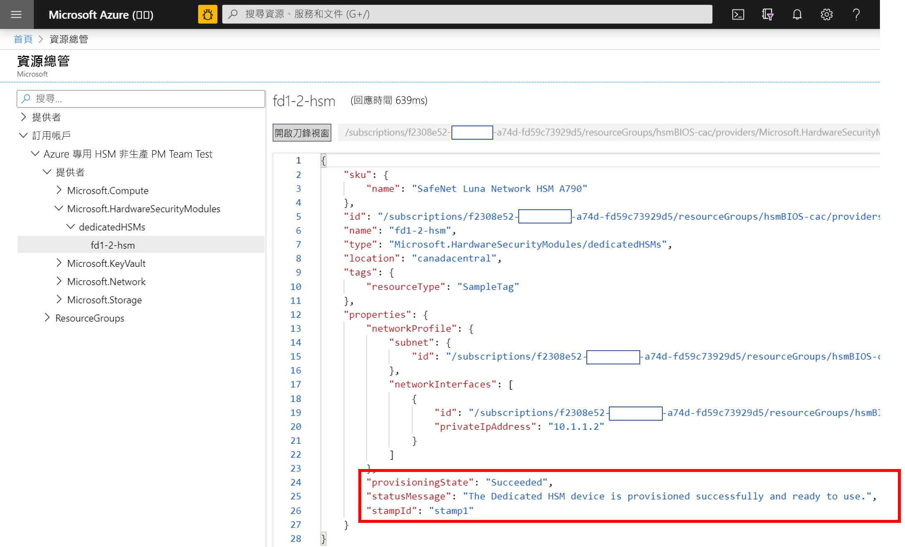
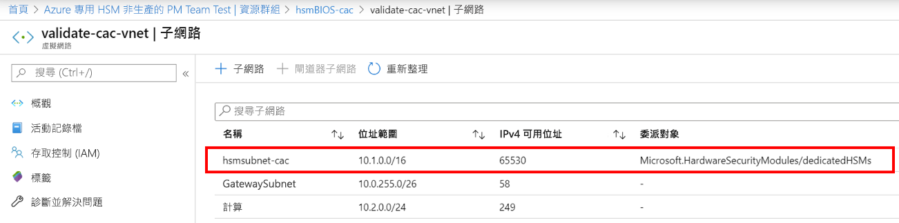
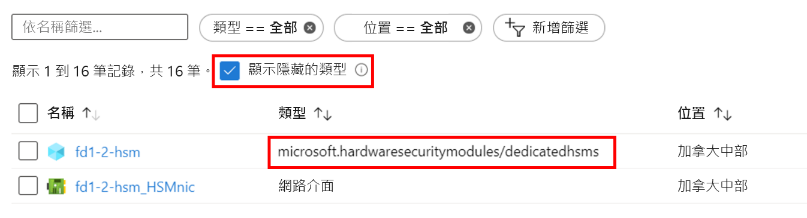

# <a name="troubleshooting-the-azure-dedicated-hsm-service"></a>針對 Azure 專用 HSM 服務進行疑難排解

Azure 專用 HSM 服務有兩個不同的 Facet。 首先，在 HSM 裝置的 Azure 中使用其基礎網路元件進行註冊和部署。 接著，在準備使用/整合指定的工作負載或應用程式時，進行 HSM 裝置的設定。 雖然 Azure 中的 Thales Luna Network HSM 裝置與您直接向 Thales 購買的相同，但其為 Azure 中會產生一些獨特考量的資源。 這些考量及任何產生的疑難排解見解或最佳做法都記載於此，以確保關鍵資訊的高可見度和存取權。 一旦服務正在使用中，就可以透過對 Microsoft 或 Thales 的支援要求直接取得決定性資訊。 

> [!NOTE]
> 請注意，在新部署的 HSM 裝置上執行任何設定之前，應先使用任何相關的修補程式進行更新。 特定的必要修補程式是 Thales 支援入口網站中的 [KB0019789](https://supportportal.gemalto.com/csm?id=kb_article_view&sys_kb_id=19a81c8bdb9a1fc8d298728dae96197d&sysparm_article=KB0019789)，其可解決系統在重新開機期間變得沒有回應的問題。

## <a name="hsm-registration"></a>HSM 註冊

專用 HSM 並非免費提供使用，由於其會在雲端提供硬體資源，因此是需要保護的珍貴資源。 因此，我們會使用 HSMrequest@microsoft.com，透過電子郵件使用允許清單流程。 

### <a name="getting-access-to-dedicated-hsm"></a>取得專用 HSM 的存取權

如果您相信專用 HSM 會符合您的金鑰儲存需求，則可透過電子郵件 HSMrequest@microsoft.com 要求存取權。 概述您的應用程式、您想使用 HSM 的區域，以及您要尋找的 HSM 數量。 如果您與 Microsoft 代表 (例如帳戶執行或雲端解決方案架構師) 接洽，請將其包含在任何要求中。

## <a name="hsm-provisioning"></a>HSM 佈建

在 Azure 中佈建 HSM 裝置可透過 CLI 或 PowerShell 來完成。 在註冊服務時，系統會提供範例 ARM 範本，並給予初始自訂的協助。 

### <a name="hsm-deployment-failure-information"></a>HSM 部署失敗資訊

專用 HSM 支援用於部署的 CLI 和 PowerShell，因此以入口網站為基礎的錯誤資訊會受到限制，而不是詳細資訊。 您可以使用資源總管找到更好的資訊。 入口網站首頁上有其圖示並提供更詳細的錯誤資訊。 如果在建立與部署問題相關的支援要求時貼入此資訊，此資訊的幫助很大。



### <a name="hsm-subnet-delegation"></a>HSM 子網路委派
部署失敗的首要原因就是忘記針對將佈建 HSM 的客戶定義子網路設定適當的委派。 設定該委派屬於部署 VNet 和子網路必要條件的一部分，而在教學課程中可找到更多詳細資料。



### <a name="hsm-deployment-race-condition"></a>HSM 部署競爭條件

針對部署所提供的標準 ARM 範本具有 HSM 和 ExpressRoute 閘道相關資源。 網路資源是成功部署 HSM 的相依性，而且時機至關重要。  有時候，我們發現與相依性問題相關的部署失敗，而重新執行部署通常可解決此問題。 如果不能，則刪除資源而後重新部署通常會成功。 嘗試此動作但仍發現問題之後，在 Azure 入口網站中提出支援要求，並選取「設定 Azure 安裝程式時發生問題」問題類型。

### <a name="hsm-deployment-using-terraform"></a>使用 Terraform 進行 HSM 部署

少量客戶已使用 Terraform 作為自動化環境，而不是註冊此服務時所提供的 ARM 範本。 HSM 無法以這種方式部署，但相依的網路資源可以。 Terraform 有一個模組可叫出剛好有 HSM 部署的最小 ARM 範本。  在此情況下，請格外小心以確保網路資源 (例如必要的 ExpressRoute 閘道) 在部署 HSM 之前完整部署。 您可以使用下列 CLI 命令來測試已完成的部署，並視需要進行整合。 取代角括弧預留位置，進行特定命名。 您應該尋找「provisioningState 已成功」的結果。

```azurecli
az resource show --ids /subscriptions/<subid>/resourceGroups/<myresourcegroup>/providers/Microsoft.Network/virtualNetworkGateways/<myergateway>
```

### <a name="deployment-failure-based-on-quota"></a>以配額為基礎的部署失敗
如果您超出每個戳記 2 個 HSM 和每個區域 4 個 HSM 的配額，部署可能會失敗。 若要避免這種情況，請確保從先前失敗的部署中刪除資源，而後再次部署。 請參閱下面的「如何查看 HSM」項目，以檢查資源。 如果您認為您需要超過此配額 (其主要作為保護措施)，請透過電子郵件 HSMrequest@microsoft.com 提供詳細資料。

### <a name="deployment-failure-based-on-capacity"></a>以容量為基礎的部署失敗
當特定戳記或區域已滿時 (也就是，幾乎所有免費 HSM 都已佈建)，這可能會導致部署失敗。 每個戳記都有 11 個 HSM 可供客戶使用，這表示每個區域 22 個。 每個戳記中也有 3 個備援項目和 1 個測試裝置。 如果您認為您可能已達到限制，則透過電子郵件 HSMrequest@microsoft.com來取得特定戳記的填滿層級資訊。

###  <a name="how-do-i-see-hsms-when-provisioned"></a>如何查看已佈建的 HSM？
由於專用 HSM 是允許的服務，因此會被視為 Azure 入口網站中的「隱藏類型」。 若要查看 HSM 資源，您必須勾選 [顯示隱藏的類型] 核取方塊，如下所示。 NIC 資源一律會遵循 HSM，而且是在使用 SSH 連線之前，用來找出 HSM IP 位址的最佳位置。



## <a name="networking-resources"></a>網路資源

部署專用 HSM 相依於網路資源，以及一些要留意的後續限制。

### <a name="provisioning-expressroute"></a>佈建 ExpressRoute

專用 HSM 使用 ExpressRoute 閘道作為「通道」，以便在客戶私人 IP 位址空間與 Azure 資料中心內的實體 HSM 之間進行通訊。  考量每個 VNet 有一個閘道的限制，需要透過 ExpressRoute 連線到其內部部署資源的客戶，必須使用另一個 VNet 來進行該連線。  

### <a name="hsm-private-ip-address"></a>HSM 私人 IP 位址

針對專用 HSM 所提供的範例範本假設會自動從指定的子網路範圍中取得 HSM IP。 您可以透過 ARM 範本中的 "NetworkInterfaces" 屬性，為 HSM 指定明確的 IP 位址。 


## <a name="hsm-initialization"></a>HSM 初始化

初始化會準備新的 HSM 以供使用，或現有的 HSM 以供重複使用。 您必須先完成 HSM 的初始化，才能產生或儲存物件、允許用戶端連線，或執行密碼編譯作業。

### <a name="lost-credentials"></a>遺失認證

遺失 Shell 系統管理員密碼將會導致遺失 HSM 金鑰資料。 應提出支援要求以重設 HSM。
在初始化 HSM 時，安全地儲存認證。 應根據貴公司的原則來保留 Shell 和 HSM 認證。

### <a name="failed-logins"></a>登入失敗

對 HSM 提供不正確的認證可能會造成毀滅性結果。 以下是 HSM 角色的預設行為。

| 角色 | 閾值 (嘗試次數) | 太多錯誤登入嘗試的結果 | 復原 |
|--|--|--|--|
| HSM SO | 3 |  HSM 已歸零 (所有 HSM 物件身分識別，以及所有分割區都已消失)  |  HSM 必須重新初始化。 可從備份還原內容。 | 
| 分割區 SO | 10 |  分割區已歸零。 |  分割區必須重新初始化。 可從備份還原內容。 |  
| 稽核 | 10 | 鎖定 | 10 分鐘後會自動解除鎖定。 |  
| 密碼編譯人員 | 10 (可減少) | 如果 HSM 原則 15：可讓分割區 PIN 的 SO 重設設為 1 (已啟用)，則共同和 CU 角色會被鎖定。<br>如果 HSM 原則 15：可讓分割區 PIN 的 SO 重設設為 0 (未啟用)，則 CO 和 CU 角色會永久鎖定，且無法再存取分割區內容。 這是預設值。 | CO 角色必須解除鎖定，且分割區 SO 會使用 `role resetpw -name co` 重設認證。<br>分割區必須重新初始化，並從備份裝置還原金鑰資料。 |  

## <a name="hsm-configuration"></a>HSM 設定 

下列項目的處境是設定錯誤很常見或有值得求救的影響：

### <a name="hsm-documentation-and-software"></a>HSM 文件和軟體
Microsoft 無法提供 Thales SafeNet Luna 7 HSM 裝置的軟體和文件，必須直接從 Thales 下載。 在註冊程序期間必須使用所收到的 Thales 客戶識別碼進行註冊。 Microsoft 所提供的裝置具有軟體版本 7.2 和韌體版本 7.0.3。 在 2020 年初，Thales 將文件公開，在[這裡](https://thalesdocs.com/gphsm/luna/7.2/docs/network/Content/Home_network.htm)即可找到文件。  

### <a name="hsm-networking-configuration"></a>HSM 網路設定

在 HSM 內設定網路功能時，請務必小心。  HSM 會透過 ExpressRoute 閘道，從客戶的私人 IP 位址空間直接連線到 HSM。  此通訊通道僅適用於客戶通訊，Microsoft 沒有存取權。 如果 HSM 是以此網路路徑受到影響的方式設定，這表示會移除與 HSM 的所有通訊。  在此情況下，唯一的選項是透過 Azure 入口網站提出 Microsoft 支援要求，以重設裝置。 此重設程序會將 HSM 設定回其初始狀態，而所有設定和金鑰資料都會遺失。  必須重建設定，而當裝置加入 HA 群組時，就會取得已複寫的金鑰資料。  

### <a name="hsm-device-reboot"></a>HSM 裝置重新開機

有些設定變更需要將 HSM 重啟電源或重新開機。 Microsoft 在 Azure 中進行 HSM 測試判定了在某些情況下，重新開機有可能會停止回應。 這暗示必須在 Azure 入口網站中建立支援要求以要求強制重新開機，而且最多可能需要 48 小時的時間才能完成 (考量到這是 Azure 資料中心的手動程序)。  若要避免這種情況，請確保您已部署可直接從 Thales 取得的重新開機修補程式。 請參閱 Thales Luna Network HSM 7.2 下載中的 [KB0019789](https://supportportal.gemalto.com/csm?sys_kb_id=d66911e2db4ffbc0d298728dae9619b0&id=kb_article_view&sysparm_rank=1&sysparm_tsqueryId=d568c35bdb9a4850d6b31f3b4b96199e&sysparm_article=KB0019789)，以針對系統在重新開機期間變得沒有回應的問題取得建議的修補程式 (注意：您必須已在 Thales 支援入口網站中註冊才能下載)。

### <a name="ntls-certificates-out-of-sync"></a>NTLS 憑證不同步
當憑證過期或已透過設定更新覆寫時，用戶端可能會失去與 HSM 連線的能力。 每個 HSM 都應該重新套用憑證交換用戶端設定。
憑證無效的範例 NTLS 記錄：

> NTLS[8508]: info :0 :Incoming connection request... :192.168.50.2/59415 NTLS[8508]:Error message from SSLAccept is : error:14094418:SSL routines:ssl3_read_bytes:tlsv1 alert unknown ca NTLS[8508]:Error during SSL accept ( RC_SSL_ERROR ) NTLS[8508]: info :0xc0000711 :Fail to establish a secure channel with client :192.168.50.2/59415 :RC_SSL_FAILED_HANDSHAKE NTLS[8508]: info :0 :NTLS Client "Unknown host name" Connection instance removed :192.168.50.2/59415

### <a name="failed-tcp-communication"></a>TCP 通訊失敗

從 Luna 用戶端安裝到 HSM 的通訊，最少需要 TCP 通訊埠 1792。 請考慮這點，因為環境中的任何網路設定都有所變更。

### <a name="failed-ha-group-member-doesnt-recover"></a>失敗的 HA 群組成員未復原

如果失敗的 HA 群組成員未復原，則必須使用 hagroup recover 命令，以手動方式從 Luna 用戶端進行復原。
必須設定 HA 群組的重試計數，才能啟用自動復原。 根據預設，HA 群組在復原時，不會嘗試將 HA 成員復原到群組中。

### <a name="ha-group-doesnt-sync"></a>HA 群組未同步

在成員分割區沒有相同複製網域的情況下，HA 同步處理命令會顯示下列內容：警告：同步處理可能失敗。  位置 0 和位置 1 的成員具有與私密金鑰複製相衝突的設定。
具有正確複製網域的新分割區應新增至 HA 群組，然後移除設定不正確的分割區。

## <a name="hsm-deprovisioning"></a>取消佈建 HSM 

只有在完全取消佈建 HSM 後，Microsoft 會將其重設並將其傳回至可用的集區。 

### <a name="how-to-delete-an-hsm-resource"></a>如何刪除 HSM 資源

除非 HSM 處於「歸零」狀態，否則無法刪除 HSM 的 Azure 資源。  因此，嘗試將金鑰資料當作資源刪除之前，必須先將其刪除。 最快的歸零方式就是讓 HSM 管理員的密碼連錯 3 次 (注意：這是指 HSM 管理員，而不是設備層級管理員)。 Luna shell 具有可歸零的 `hsm -factoryreset` 命令，但只能透過序列埠上的主控台執行，客戶沒有其存取權。

## <a name="next-steps"></a>後續步驟

本文針對 HSM 部署生命週期中可能有問題或需要疑難排解或仔細考量的領域，提供了深入解析。 希望本文可協助您避免不必要的延遲和挫折，如果您有相關的新增或變更部分，請向 Microsoft 提出支援要求並且讓我們知道。 
