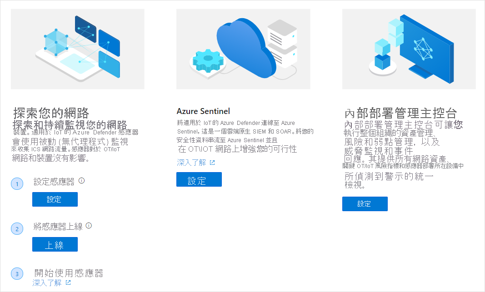

# 快速入門：準備您的網路以部署適用於 Azure Defender 的 IoT

## 選擇您的硬體
適用於 Azure Defender 的 IoT 支援各種認證設備，包括：
- 已預先設定好的認證設備，且已安裝好軟體
- 未設定好的認證設備，您可以在其上下載並安裝感應器軟體
- 內部部署管理主控台設備規格。 內部部署管理主控台無法作為預先設定好的設備。 

如需詳細資訊，請參閱[硬體規格指南](https://aka.ms/AzureDefenderforIoTBareMetalAppliance)

## 安裝元件
取得硬體元件並從適用於 Azure Defender 的 IoT 入口網站下載您的軟體套件之後，您就可以安裝元件軟體。 如需詳細資訊，請參閱[安裝指南](https://aka.ms/AzureDefenderforIoTInstallSensorISO)。

## 將感應器上線到適用於 Azure Defender 的 IoT 入口網站 
 本文概述適用於 Azure Defender 的 IoT 感應器和內部部署管理主控台的部署、上線和更新流程。 此流程會遵循 [歡迎使用適用於 Azure Defender 的 IoT] 頁面和後續頁面中的指示來進行。

若要開啟 [歡迎使用] 頁面：

1. 登入您的 Azure 帳戶，並搜尋「適用於 Azure Defender 的 IoT」。

1. **感應器部署** 需要您執行下列其中一項動作：從 Arrow 購買預先設定好的硬體，或購買您自己的裝置並在其上安裝感應器軟體。
1. **內部部署管理主控台部署** 需要您購買自己的裝置，並在其上安裝內部部署管理主控台軟體。 如需詳細資訊，

## 網路設定
在安裝適用於 Azure Defender 的 IoT 系統元件之後，您可以設定網路設備以獲得最佳的網路監視效果。 如需詳細資訊，請參閱[網路設定指南](https://aka.ms/AzureDefenderForIoTNetworkSetup)。   

## 後續步驟

在本文中，您已了解如何準備使用適用於 Azure Defender 的 IoT。 若要深入了解如何開始使用，請參閱下列文章：

- [快速入門](getting-started.md)