#  <a name="quickstart-create-a-cicd-pipeline-in-azure-pipelines-for-nodejs-with-azure-devops-projects"></a>快速入門：使用 Azure DevOps Projects 在 Azure Pipelines 中建立適用於 Node.js 的 CI/CD 管線
在本快速入門中，您會使用 [GatsbyJS](https://www.gatsbyjs.org/) 和簡化的 Azure DevOps 專案建立體驗，建立 NodeJS 漸進式 Web 應用程式 (PWA)。 完成後，您 Azure Pipelines 中的 PWA 就會有可用的持續整合 (CI) 和持續傳遞 (CD) 管線。 Azure DevOps Projects 會設定您在開發、部署和監視時所需的功能。

## <a name="prerequisites"></a>Prerequisites

- 具有有效訂用帳戶的 Azure 帳戶。 [免費建立帳戶](https://azure.microsoft.com/free/?ref=microsoft.com&utm_source=microsoft.com&utm_medium=docs&utm_campaign=visualstudio)。 
- [Azure DevOps](https://azure.microsoft.com/services/devops/) 組織。

## <a name="sign-in-to-the-azure-portal"></a>登入 Azure 入口網站

DevOps Projects 會在 Azure Pipelines 中建立 CI/CD 管線。 您可以建立新的 Azure DevOps 組織或使用現有組織。 DevOps Projects 也會在您選擇的 Azure 訂用帳戶中建立 Azure 資源。

1. 登入 [Azure 入口網站](https://portal.azure.com)，然後在左窗格中選取 [建立資源]  。 

   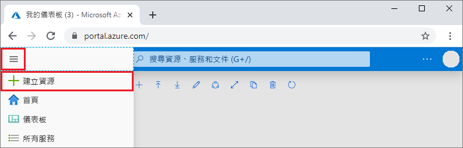

2. 搜尋並選取 [DevOps Projects]  ，然後選取 [建立]  。

 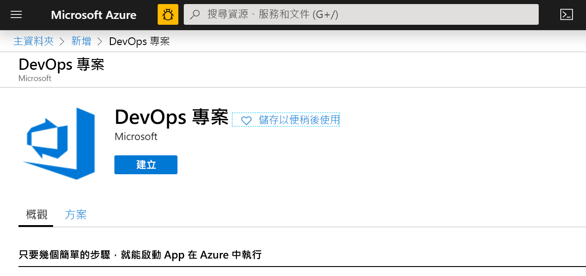 

## <a name="select-a-sample-application-and-azure-service"></a>選取應用程式範例和 Azure 服務

1. 選取 Node.js 應用程式範例。   

 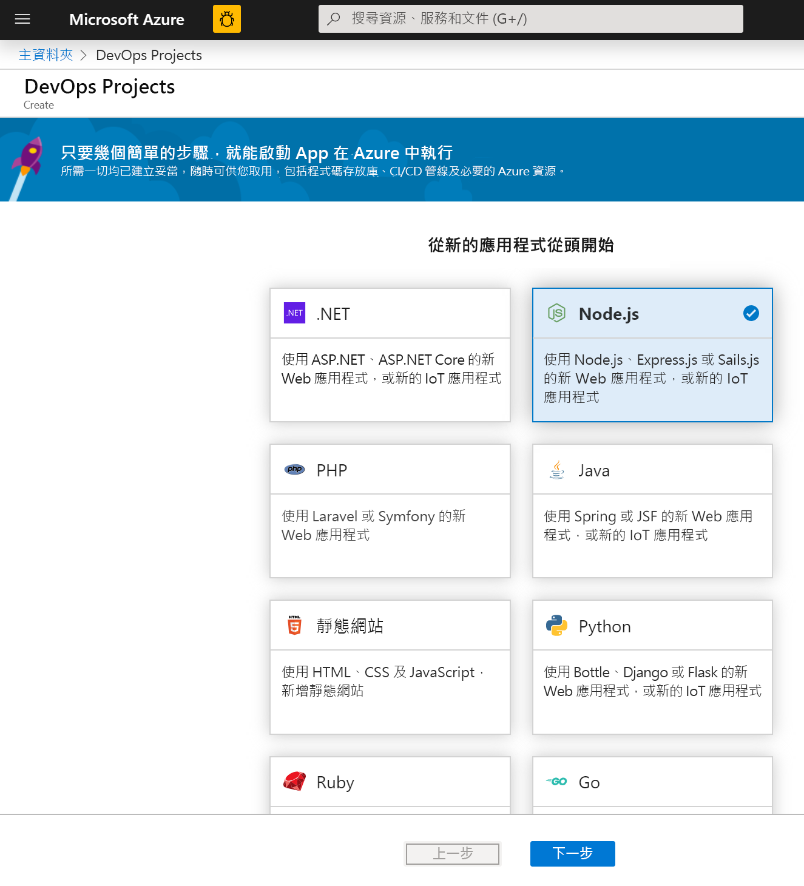 

2. 預設範例架構為 **Express.js**。 將選取項目變更為 [簡單的 Node.js 應用程式]  ，然後選取 [下一步]  。 

 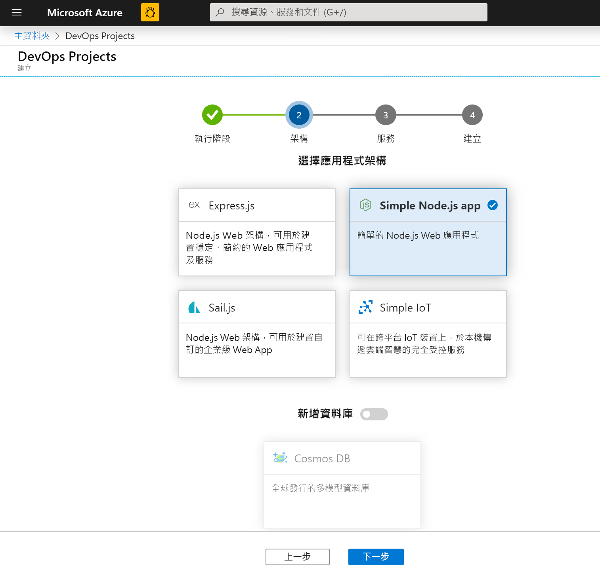 

3. 此步驟中可用的部署目標，由先前在步驟 2 中選取的應用程式架構所決定。  在此範例中，[Windows Web 應用程式]  是預設的部署目標。  保留 [用於容器的 Web App 設定]  ，然後選取 [下一步]  。

 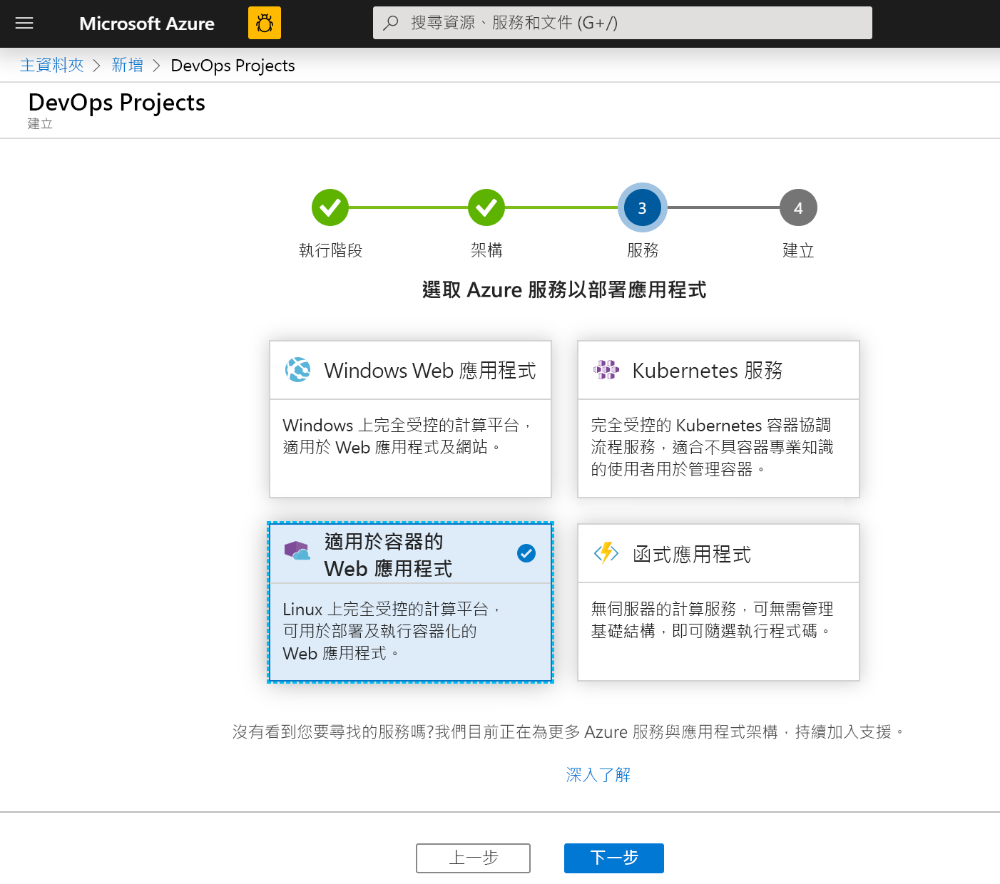 

## <a name="configure-a-project-name-and-an-azure-subscription"></a>設定專案名稱和 Azure 訂用帳戶

1. 在 DevOps 專案建立工作流程的最後一個步驟中，您會指派專案名稱、選取 Azure 訂用帳戶，然後選取 [完成]  。  

 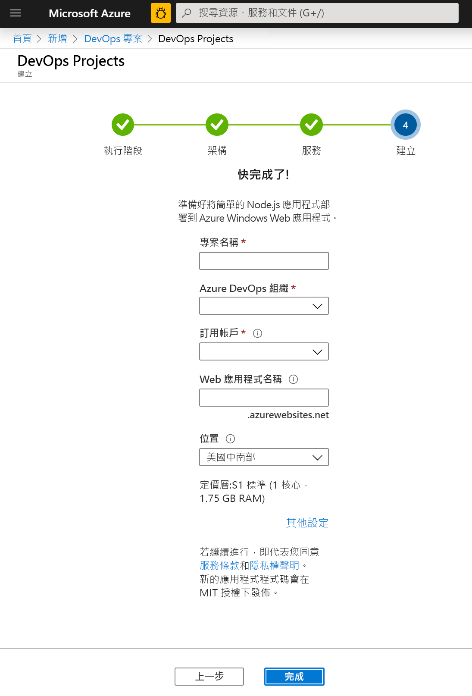 

2. 在專案已建置，且應用程式部署至 Azure 時，會顯示摘要頁面。 不久後，就會在您的 [Azure DevOps 組織](https://dev.azure.com/)中建立專案，其中包含 Git 存放庫、工作流程看板、部署管線、測試計劃，以及應用程式所需的成品。  

## <a name="managing-your-project"></a>管理您的專案

1. 瀏覽至 [所有資源]  並尋找您的 DevOps 專案。 選取您的 **DevOps 專案**。

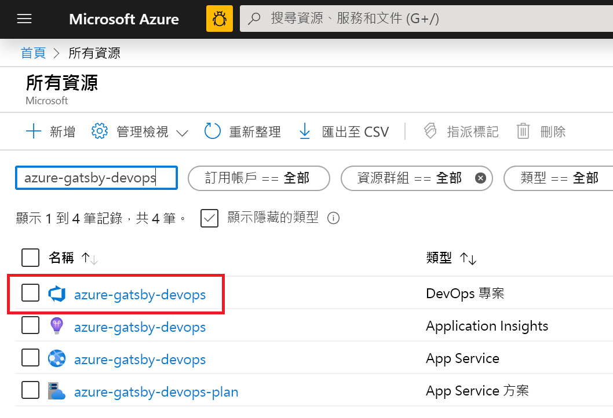

2. 系統會將您導向至儀表板，讓您檢視您的專案首頁、程式碼存放庫、CI/CD 管線，以及執行中應用程式的連結。 選取 [專案首頁]  ，可檢視您在 **Azure DevOps** 中的應用程式，而在另一個瀏覽器索引標籤中選取 [應用程式端點]  ，則可檢視即時範例應用程式。  我們稍後會變更此範例，以使用 GatsbyJS 產生的 PWA。

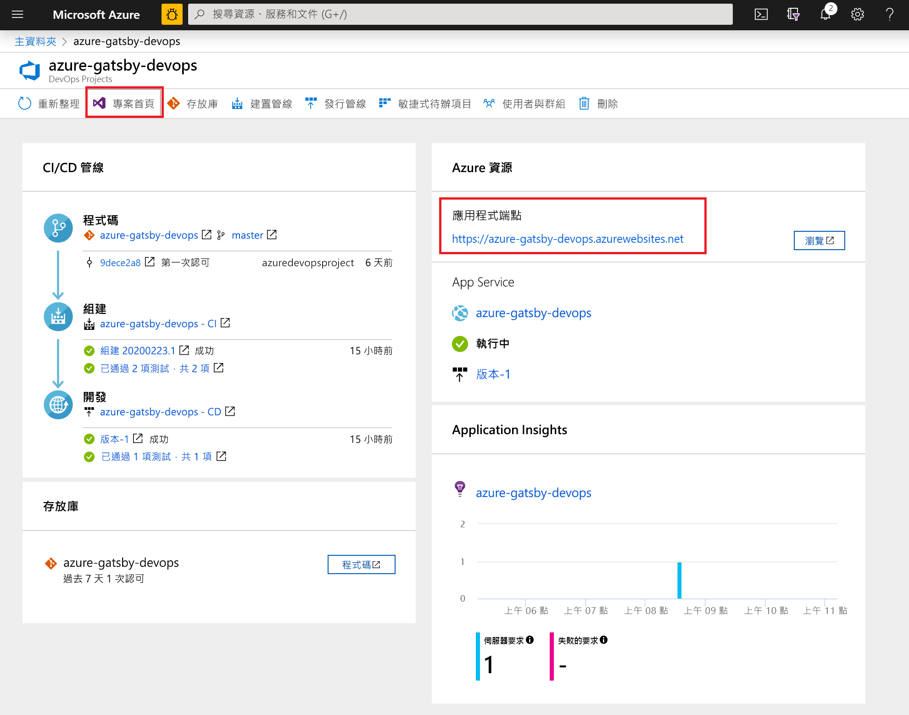 

3. 從您的 Azure DevOps 專案，您可以邀請小組成員進行共同作業，並建立工作流程看板以開始追蹤您的工作。  如需詳細資訊，請參閱[這裡](https://docs.microsoft.com/azure/devops/user-guide/what-is-azure-devops?view=azure-devops)。

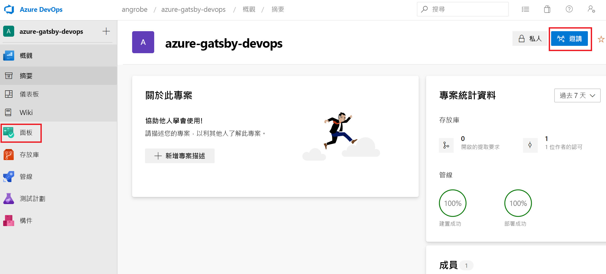

## <a name="clone-the-repo-and-install-your-gatsby-pwa"></a>複製存放庫並安裝您的 Gatsby PWA

DevOps Projects 會在 Azure Repos 或 GitHub 中建立 Git 存放庫。 此範例已建立 Azure 存放庫。  下一步是複製存放庫並進行變更。

1. 從 **DevOps 專案**中選取 [存放庫]  ，然後按一下 [複製]  。  有多種機制可將 Git 存放庫複製到您的桌面。  請依據您的開發體驗選擇適合的機制。  

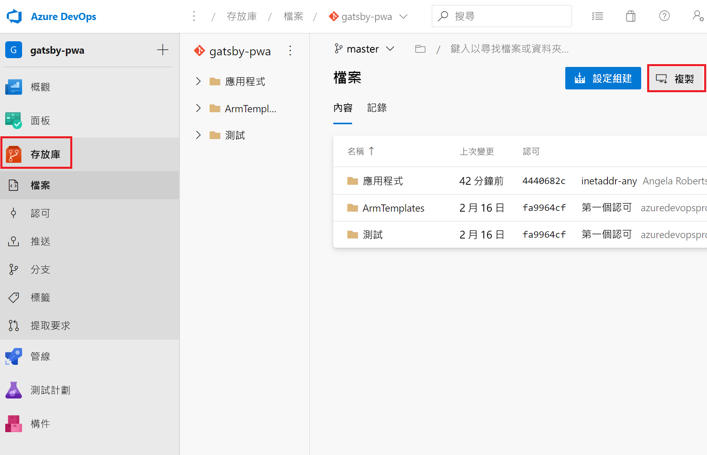

2. 將存放庫複製到您的桌面後，請對起始範本進行一些變更。 首先請從終端機安裝 GatsbyJS CLI。
```powershell
npm install -g gatsby
```

3. 從終端機瀏覽至存放庫的根目錄。 其中應該會包含三個資料夾，如下所示：
```powershell
Mode                LastWriteTime         Length Name
----                -------------         ------ ----
d-----        2/23/2020  10:42 PM                Application
d-----        2/23/2020   3:05 PM                ArmTemplates
d-----        2/23/2020   3:05 PM                Tests
```

4. 我們不需要應用程式資料夾中的所有檔案，因為我們要將其取代為 Gatsby 起始範本。 請依序執行下列命令，以將其修剪。
```powershell
cp .\Application\Dockerfile .
rmdir Application
```

5. 使用 Gatsby CLI 產生範例 PWA。 從終端機執行 `gatsby new` 以開始進行 PWA 精靈，然後針對您的起始範本選取 `gatsby-starter-blog`。 其內容會類似於下列範例：
```powershell
c:\myproject> gatsby new
√ What is your project called? ... my-gatsby-project
? What starter would you like to use? » - Use arrow-keys. Return to submit.
    gatsby-starter-default
    gatsby-starter-hello-world
>   gatsby-starter-blog
    (Use a different starter)
```

6. 您現在具有名為 `my-gatsby-project` 的資料夾。 請將其重新命名為 `Application`，並將 `Dockerfile` 複製到其中。
```powershell
mv my-gatsby-project Application
mv Dockerfile Application
```

7. 在您慣用的編輯器中開啟 Dockerfile，並將第一行從 `FROM node:8` 變更為 `FROM node:12`。 這項變更可確保您的容器會使用 Node.js 12.x 版，而不是 8.x 版。 GatsbyJS 需要較新版本的 Node.js。

8. 接著，開啟應用程式資料夾中的 package.json 檔案，然後編輯[指令碼欄位](https://docs.npmjs.com/files/package.json#scripts)以確保您的開發和實際執行伺服器會接聽所有可用的網路介面 (例如 0.0.0.0) 和連接埠 80。 如果沒有這些設定，容器應用程式服務就無法將流量路由到在您的容器內執行的 Node.js 應用程式。 `scripts` 欄位的內容應該會如下所示。 具體而言，您想要將 `develop`、`serve` 和 `start` 目標變更為預設以外的值。
```json
  "scripts": {
    "build": "gatsby build",
    "develop": "gatsby develop  -H 0.0.0.0 -p 80",
    "format": "prettier --write \"**/*.{js,jsx,json,md}\"",
    "start": "npm run serve",
    "serve": "npm run build && gatsby serve -H 0.0.0.0 -p 80",
    "clean": "gatsby clean",
    "test": "echo \"Write tests! -> https://gatsby.dev/unit-testing\" && exit 1"
  }
```

## <a name="edit-your-cicd-pipelines"></a>編輯您的 CI/CD 管線

1. 在您認可上一節中的程式碼之前，請先對組建和發行管線進行一些變更。 編輯您的「組建管線」，並更新節點工作以使用 Node.js 12.x 版。 將 [工作版本]  欄位設定為 1.x，並將 [版本]  欄位設為 12.x。
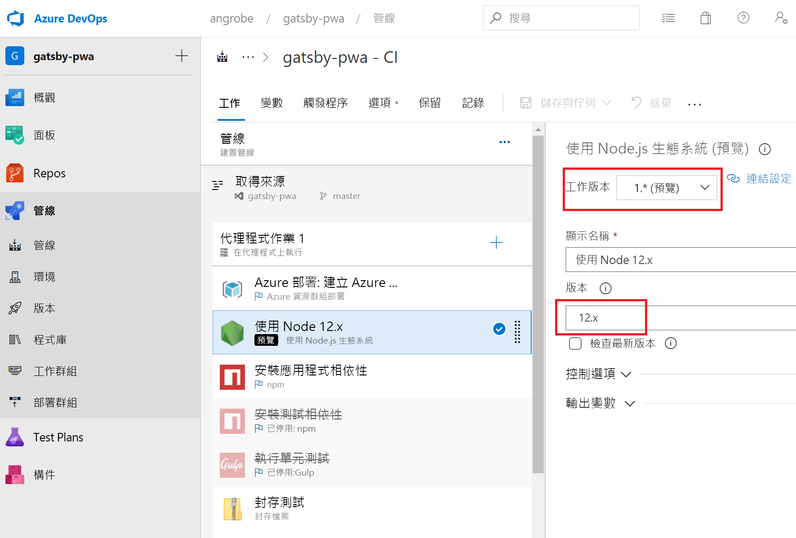

2. 在本快速入門中，我們不會建立單元測試，且會在組建管線中停用這些步驟。 當您撰寫測試時，您可以重新啟用這些步驟。 按一下滑鼠右鍵以選取標示為「安裝測試相依性」  和「執行單元測試」  的工作，並將其停用。

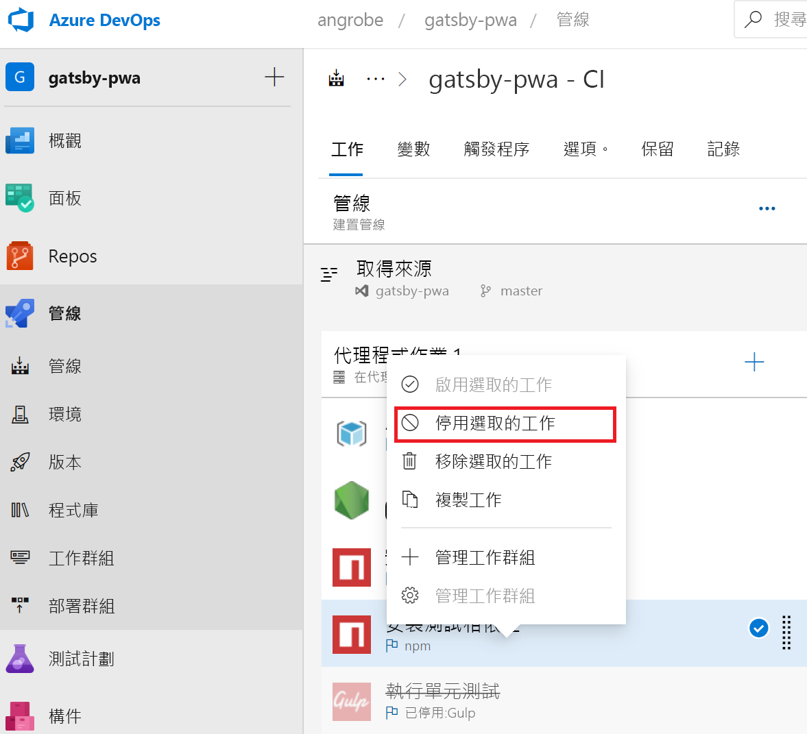

3. 編輯您的發行管線。
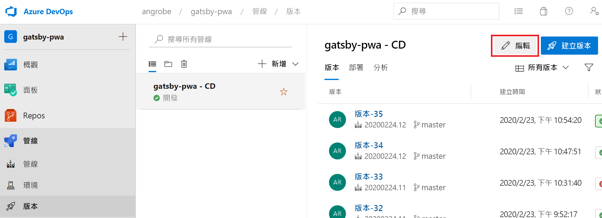

4. 如同組建管線，請將節點工作變更為使用 12.x，並停用這兩項測試工作。 您的版本應該會類似於下列螢幕擷取畫面。

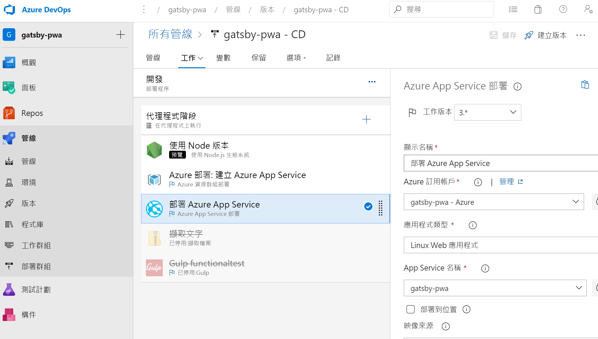

1. 在瀏覽器的左側，移至 **views/index.pug** 檔案。

1. 選取 [編輯]  ，並進行 h2 標題的變更。  
    例如，輸入**立即開始使用 Azure DevOps Projects** 或進行其他變更。

1. 選取 [認可]  ，然後儲存您的變更。

1. 在瀏覽器中，移至 DevOps Projects 儀表板。   
您現在應該會看到正在進行中的建置。 您所做的變更會透過 CI/CD 管線自動建置及部署。

## <a name="commit-your-changes-and-examine-the-azure-cicd-pipeline"></a>認可您的變更，並檢查 Azure CI/CD 管線

在前兩個步驟中，您已將 Gatsby 產生的 PWA 新增至 Git 存放庫，且已編輯用來建置和部署程式碼的管線。 我們可以認可程式碼，並觀察其組建和發行管線觀的進度。

1. 在終端機中，從專案 Git 存放庫的根目錄執行下列命令，以將您的程式碼推送至 Azure DevOps 專案：
```powershell
git add .
git commit -m "My first Gatsby PWA"
git push
```

2. `git push` 完成後，即會啟動組建。 您可以在 [Azure DevOps 儀表板]  中追蹤進度。


3. 您的組建和發行管線應該會在幾分鐘後完成，且您的 PWA 應會部署至容器。 從上方的儀表板按一下 [應用程式端點]  連結，您應該會看到部落格的 Gatsby 起始專案。


## <a name="clean-up-resources"></a>清除資源

當您不再需要已建立的 Azure App Service 和其他相關資源時，可以將其刪除。 請使用 DevOps Projects 儀表板上的 [刪除]  功能。


## <a name="next-steps"></a>後續步驟

在設定 CI/CD 程序後，組建和發行管線會自動建立。 您可以變更這些組建和發行管線，以符合小組的需求。 若要深入了解 CI/CD 管線，請參閱：

> [!div class="nextstepaction"]
> [自訂 CD 程序](https://docs.microsoft.com/azure/devops/pipelines/release/define-multistage-release-process?view=vsts)

