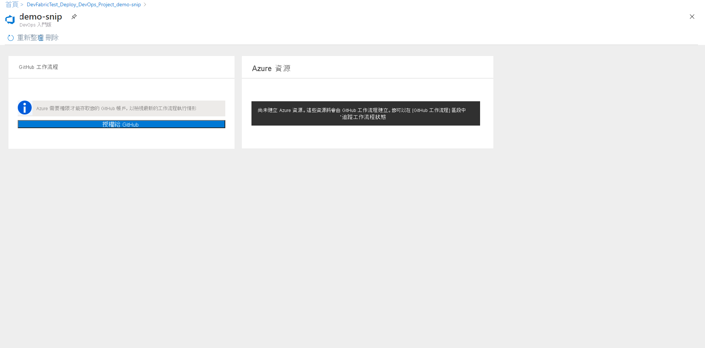

# 使用 GitHub Actions 透過 DevOps 入門版設定 Node.js 應用程式的 CI/CD

在本快速入門中，您會使用簡化的 DevOps 入門版體驗，透過 GitHub Actions 為 Node.js 應用程式設定持續整合 (CI) 與持續傳遞 (CD) 工作流程。 您可以使用 DevOps 入門版來設定您在開發、部署及監控應用程式時所需的一切。 

## 必要條件

- 具有有效訂用帳戶的 Azure 帳戶。 [免費建立帳戶](https://azure.microsoft.com/free/?ref=microsoft.com&utm_source=microsoft.com&utm_medium=docs&utm_campaign=visualstudio)。 
- 一個 [GitHub](https://github.com/) 帳戶。

## 登入 Azure 入口網站

DevOps 入門版會使用 GitHub 動作來建立 CI/CD 工作流程。 DevOps 入門版也會在您選擇的 Azure 訂用帳戶中建立 Azure 資源。

1. 登入 [Azure 入口網站](https://portal.azure.com)。

1. 在搜尋方塊中，鍵入並選取 **DevOps 入門版**。 按一下 [新增] 以建立新項目。

    

## 選取應用程式範例和 Azure 服務

1. 按一下右側橫幅上的 [使用 GitHub 設定 DevOps 入門版]。

    

1. 請確定已選取 CI/CD 提供者作為 **GitHub Actions**。

    

1. 選取 **Node.js** 應用程式範例。 Node.js 範例包含數種應用程式架構的選擇。

1. 預設範例架構為 **Express.js**。 保留預設設定，然後選取 [下一步]。   

2. Windows Web 應用程式是預設的部署目標。 您先前選擇的應用程式架構，會指出這裡可用的 Azure 服務部署目標類型。 保留預設的服務，然後選取 [下一步]。
 
## 設定 GitHub 帳戶和 Azure 訂用帳戶 

1. 使用 GitHub 進行驗證。

   1. 按一下 [授權] 按鈕。 
   
   1. 登入 GitHub。 如果您沒有 GitHub 帳戶，也可以在這裡註冊。

2. 選擇現有的 **GitHub 組織**。 
   
   1. 選擇您的 GitHub 存放庫名稱。 
   
   1. 選取 Azure 訂用帳戶和位置、選擇應用程式名稱，然後選取 [完成]。
    
       

    在幾分鐘後，Azure 入口網站中便會顯示 DevOps Starter 儀表板。 系統會在您 Azure DevOps 組織中的存放庫內設定範例應用程式、觸發 GitHub 工作流程，然後將您的應用程式部署到 Azure。 此儀表板可顯示您的程式碼存放庫、GitHub 工作流程，和您在 Azure 中的應用程式。
   
3. 選取 [瀏覽]以檢視執行中應用程式。
    
    儀表板內包含 GitHub 工作流程和 Azure 資源的詳細資料。 若要檢視 GitHub 工作流程的詳細資料，例如最新的執行、認可和作業狀態，您將需要 **授權給 GitHub**。
   
   

DevOps 入門版已使用 GitHub 動作，自動設定具有建置和部署作業的 GitHub 工作流程。 您現在已準備好利用 CI/CD 程序與小組共同進行 Node.js 應用程式的作業，這個程序會自動將您的最新工作部署到網站上。

   

## 認可程式碼變更並執行 CI/CD

DevOps 入門版會在 GitHub 中建立存放庫。 若要檢視存放庫並變更您應用程式的程式碼，請執行下列作業：

1. 在 DevOps 入門版儀表板的左側，選取主分支的連結。 此連結會開啟新建立 GitHub 存放庫的檢視。

1. 若要檢視存放庫複製 URL，請在瀏覽器右上方選取 [複製]。 您可以在最愛的 IDE 中複製 Git 存放庫。 在接下來的幾個步驟中，您可以使用網頁瀏覽器，直接進行和認可主分支的程式碼變更。

1. 在瀏覽器的左側，移至 **/Application/views/index.pug** 檔案。

1. 選取 [編輯]，然後進行部分文字的變更。
    例如，變更其中一個標籤的部分文字。

1. 選取 [認可]  ，然後儲存您的變更。

1. 在瀏覽器中，移至 DevOps 入門版儀表板。   
您現在應該會看到正在進行的 GitHub 工作流程建置作業。 您剛才所做的變更會透過 GitHub 工作流程自動建置及部署。

## 檢視 GitHub 工作流程

在上一個步驟中，DevOps 入門版已自動設定完整的 GitHub 工作流程。 瀏覽工作流程，並視需要進行自訂。 請採取下列步驟來熟悉工作流程。

1. 在 DevOps 入門版儀表板的左側，選取 [GitHub 工作流程]。 此連結會開啟瀏覽器索引標籤和新專案的 GitHub 工作流程。
    > [!NOTE]
    > 請勿將工作流程檔案重新命名。 工作流程檔案的名稱應是 **devops-starter-workflow.yml**，才能讓儀表板反映變更

1. 工作流程 yaml 檔包含建置及部署應用程式所需的所有 GitHub Actions。 按一下 [編輯檔案] 選項，以自訂您的工作流程檔案。

1. 在存放庫的 [程式碼] 索引標籤下，按一下 [認可]。 此檢視會顯示與特定部署相關聯的程式碼認可。

1. 在存放庫的 [動作] 索引標籤下，您可以檢視存放庫中所有工作流程執行的歷程記錄。

1. 選取 [最新的執行]，以檢視工作流程中執行的所有作業。

1. 按一下 [作業] 以檢視工作流程執行的詳細記錄。 記錄包含關於部署程序的實用資訊。 您可以在部署期間和部署之後加以檢視。

1. 按一下 [提取要求] 索引標籤，以檢視存放庫中的所有提取要求

## 清除資源

當您不再需要 Azure App Service 和其他相關的資源時，可將其刪除。 請使用 DevOps 入門版儀表板的 [刪除] 功能。

## 後續步驟

您在設定 CI/CD 流程時已自動建立 GitHub 工作流程。 您可以修改此工作流程，以符合小組的需求。 若要深入了解 GitHub Actions 和工作流程，請參閱：

> [!div class="nextstepaction"]
> [自訂 GitHub 工作流程](https://docs.github.com/actions/configuring-and-managing-workflows/configuring-and-managing-workflow-files-and-runs)
