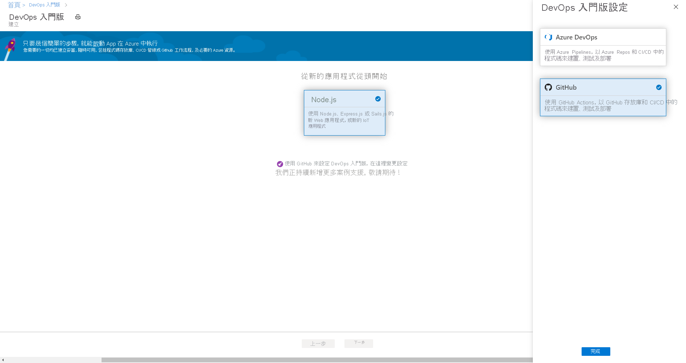
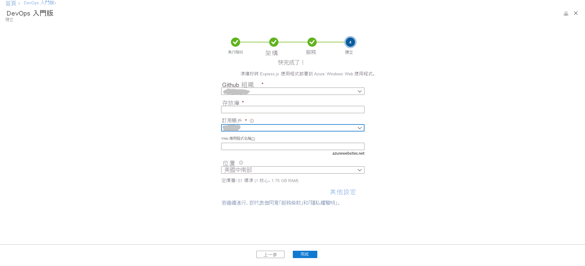
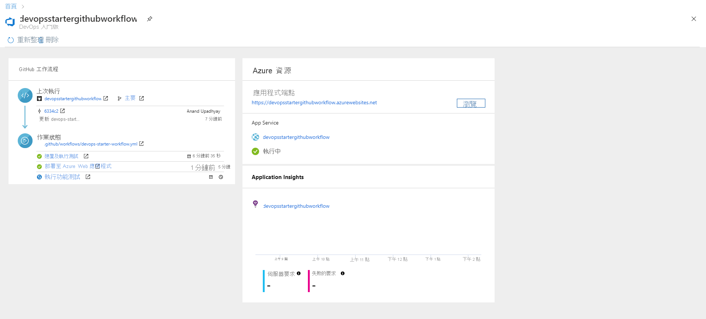

# 教學課程：使用適用於 GitHub Actions 的 DevOps 入門版將 Node.js 應用程式部署至 Azure Web 應用程式

適用於 GitHub Actions 的 DevOps 入門版提供簡化的體驗，可讓您選擇範例應用程式來建立可部署至 Azure 的持續整合 (CI) 和持續傳遞 (CD) 工作流程。 

DevOps 入門版也能夠：
* 自動建立 Azure 資源，例如新的 Azure Web 應用程式。
* 在 GitHub 中建立並設定包含 CI 建置作業的工作流程。
* 工作流程也包含適用於 CD 的部署作業。 
* 建立用於監視的 Azure Application Insights 資源。

在本教學課程中，您將：

> [!div class="checklist"]
> * 使用 DevOps 入門版來部署 Node.js 應用程式
> * 設定 GitHub 和 Azure 訂用帳戶 
> * 檢查 GitHub 工作流程
> * 將變更認可至 GitHub 並自動部署至 Azure
> * 設定 Azure Application Insights 監視
> * 清除資源

## 必要條件

* 具有有效訂用帳戶的 Azure 帳戶。 [免費建立帳戶](https://azure.microsoft.com/free/)。

## 使用 DevOps 入門版來部署 Node.js 應用程式

DevOps 入門版會在 GitHub 中建立工作流程。 您可以使用現有的 GitHub 組織。 DevOps 入門版也會在所選的 Azure 訂用帳戶中建立 Azure 資源，例如 Web 應用程式。

1. 登入 [Azure 入口網站](https://portal.azure.com)。

1. 在搜尋方塊中，鍵入並選取 **DevOps 入門版** 。 按一下 [新增] 以建立新項目。

    

1. 請確定已選取 CI/CD 提供者作為 **GitHub Actions** 。

    

1. 選取 [Node.js]，然後選取 [下一步]。

1. 在 [選擇應用程式架構] 下 選取 [Express.js]，然後選取 [下一步]。 您在先前步驟中選擇的應用程式架構，會指出這裡可用的 Azure 服務部署目標類型。 

1. 選取 [Windows Web 應用程式]，然後選取 [下一步]。

## 設定 GitHub 和 Azure 訂用帳戶

1. **授權** GitHub 並選取現有的 GitHub 組織。 

1. 輸入 **Git 存放庫** 的名稱。 

1. 選取 Azure 訂用帳戶服務。 您可以選擇性地選取 [變更]，然後輸入更多組態詳細資料，例如 Azure 資源的位置。
 
1. 輸入 Web 應用程式名稱，然後選取 [完成]。 幾分鐘後，Azure Web 應用程式就會就緒。 Node.js 範例應用程式會在您 GitHub 組織的存放庫中設定，然後觸發工作流程，接著您的應用程式就會部署至新建立的 Azure Web 應用程式。

       

   完成後，Azure 入口網站中便會顯示 DevOps 入門版儀表板。 您可以直接從 Azure 入口網站中的 [所有資源] 瀏覽至該儀表板。 

   此儀表板會顯示 GitHub 程式碼存放庫、CI/CD 工作流程，以及在 Azure 中執行的應用程式。   

   

DevOps 入門版會自動設定觸發程序，而將程式碼變更部署至存放庫。
    
## 檢查 GitHub 工作流程

在上一個步驟中，DevOps 入門版已自動設定完整的 GitHub 工作流程。 瀏覽工作流程，並視需要進行自訂。 請採取下列步驟來熟悉工作流程。

1. 在 DevOps 入門版儀表板的左側，選取 [GitHub 工作流程]。 此連結會開啟瀏覽器索引標籤和新專案的 GitHub 工作流程。
    > [!NOTE]
    > 請勿將工作流程檔案重新命名。 工作流程檔案的名稱應是 **devops-starter-workflow.yml** ，才能讓儀表板反映變更

1. 工作流程 yaml 檔包含建置及部署應用程式所需的所有 GitHub Actions。 按一下 [編輯檔案] 選項，以自訂您的工作流程檔案。

1. 在存放庫的 [程式碼] 索引標籤下，按一下 [認可]。 此檢視會顯示與特定部署相關聯的程式碼認可。

1. 在存放庫的 [動作] 索引標籤下，您可以檢視存放庫中所有工作流程執行的歷程記錄。

1. 選取 [最新的執行]，以檢視工作流程中執行的所有作業。

1. 按一下 [作業] 以檢視工作流程執行的詳細記錄。 記錄包含關於部署程序的實用資訊。 您可以在部署期間和部署之後加以檢視。

1. 按一下 [提取要求] 索引標籤，以檢視存放庫中的所有提取要求

## 認可程式碼變更並執行 CI/CD

DevOps 入門版會在 GitHub 中建立存放庫。 若要檢視存放庫並變更您應用程式的程式碼，請執行下列作業：

1. 在 DevOps Starter 儀表板的左側，選取您主要分支的連結。 此連結會開啟新建立 GitHub 存放庫的檢視。

1. 若要檢視存放庫複製 URL，請在瀏覽器右上方選取 [複製]。 您可以在最愛的 IDE 中複製 Git 存放庫。 在接下來的幾個步驟中，您可以使用網頁瀏覽器，直接進行和認可主要分支的程式碼變更。

1. 在瀏覽器的左側，移至 **/Application/views/index.pug** 檔案。

1. 選取 [編輯]，然後進行部分文字的變更。
    例如，變更其中一個標籤的部分文字。

1. 選取 [認可]  ，然後儲存您的變更。

1. 在瀏覽器中，移至 DevOps 入門版儀表板。   
您現在應該會看到正在進行的 GitHub 工作流程建置作業。 您剛才所做的變更會透過 GitHub 工作流程自動建置及部署。

1. 部署完成之後，請重新整理您的應用程式，以確認變更。

## 設定 Azure Application Insights 監視

Azure Application Insights 可讓您輕鬆監視應用程式的效能和使用情形。 DevOps 入門版會自動為您的應用程式設定 Application Insights 資源。 您可以視需要進一步設定各種警示和監視功能。

1. 在 Azure 入口網站中，前往 DevOps 入門版儀表板。 

1. 從右下角選取應用程式的 **Application Insights** 連結。 **Application Insights** 窗格會隨即開啟。 此檢視包含您應用程式的使用情形、效能和可用性監視資訊。

    

1. 選取 [時間範圍]，然後選取 [過去一小時]。 選取 [更新] 以篩選結果。 此時您可以看到過去 60 分鐘內的所有活動。 
    
1. 若要結束此時間範圍，請選取 [x]。

1. 選取 [警示]，然後選取 [新增計量警示]。 

1. 輸入警示的名稱。

1. 在 [計量] 下拉式清單中，檢查各種警示計量。 預設警示是 **伺服器回應時間大於 1 秒** 的警示。 您可以輕鬆地設定各種警示，以改善應用程式的監視功能。

1. 選取 [透過電子郵件擁有者、參與者和讀取者進行通知] 核取方塊。 您也可以選擇性地執行 Azure 邏輯應用程式，以在警示顯示時執行其他動作。

1. 選取 [確定] 可建立警示。 不久之後，警示就會在儀表板上呈現為作用中狀態。 

1. 退出 [警示] 區域，並返回 [Application Insights] 窗格。

1. 選取 [可用性]，然後選取 [新增測試]。 

1. 輸入測試名稱，然後選取 [建立]。 此時會建立簡單的 Ping 測試，以確認應用程式的可用性。 幾分鐘後即會產生測試結果，且 Application Insights 儀表板會顯示可用性狀態。

## 清除資源

如果要進行測試，您可以清除資源，以避免產生費用。 如果不再需要，您可以刪除在此教學課程中建立的 Azure 虛擬機器和相關資源。 若要這樣做，請使用 DevOps 入門版儀表板的 [刪除] 功能。 

> [!IMPORTANT]
> 下列程序會永久刪除資源。 [刪除] 功能會終結 Azure DevOps 入門版專案在 Azure 內建立的資料，您將無法再擷取這些資料。 請務必在仔細閱讀提示之後，再使用此程序。

1. 在 Azure 入口網站中，前往 DevOps 入門版儀表板。
1. 在右上方，選取 [刪除]。 
1. 在提示中，請選取 [是] 以 *永久刪除* 資源。

您可以選擇性地修改工作流程，以符合小組的需求。 您也可以使用此 CI/CD 模式作為其他存放庫的範本。 

## 後續步驟

在本教學課程中，您已了解如何：

> [!div class="checklist"]
> * 使用 DevOps 入門版來部署 Node.js 應用程式
> * 設定 GitHub 和 Azure 訂用帳戶 
> * 檢查 GitHub 工作流程
> * 將變更認可至 GitHub 並自動部署至 Azure
> * 設定 Azure Application Insights 監視
> * 清除資源

若要深入了解 GitHub Actions 和工作流程，請參閱：

> [!div class="nextstepaction"]
> [自訂 GitHub 工作流程](https://docs.github.com/actions/configuring-and-managing-workflows/configuring-and-managing-workflow-files-and-runs)
