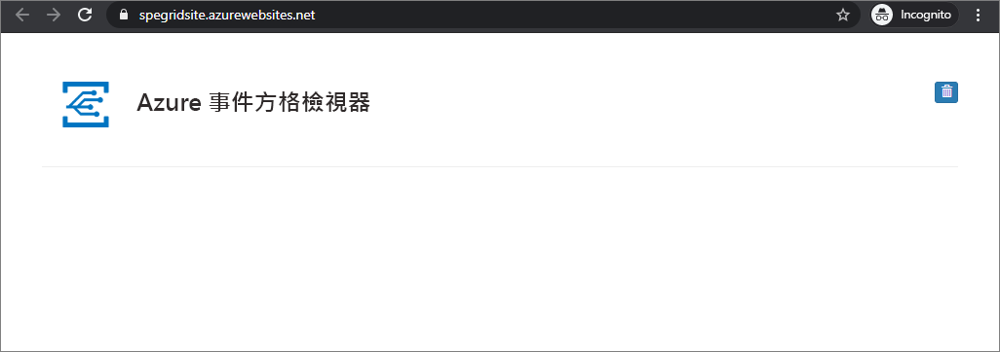

# 使用 ARM 範本將 Blob 儲存體事件路由至 Web 端點

Azure Event Grid 是一項雲端事件服務。 在本文中，您會使用 Azure Resource Manager 範本 (ARM 範本) 建立 Blob 儲存體帳戶、訂閱該 Blob 儲存體的事件，以及觸發事件以檢視結果。 通常，您會將事件傳送至可處理事件資料及採取行動的端點。 不過，若要簡化這篇文章，您可將事件傳送至可收集及顯示訊息的 Web 應用程式。

[!INCLUDE [About Azure Resource Manager](../../includes/resource-manager-quickstart-introduction.md)]

如果您的環境符合必要條件，而且您很熟悉 ARM 範本，請選取 [部署至 Azure] 按鈕。 範本會在 Azure 入口網站中開啟。

## 必要條件

如果您沒有 Azure 訂用帳戶，請在開始前建立[免費帳戶](https://azure.microsoft.com/free/)。

### 建立訊息端點

在訂閱 Blob 儲存體的事件之前，我們要先建立事件訊息的端點。 通常，端點會根據事件資料採取動作。 若要簡化此快速入門，請部署[預先建置的 Web 應用程式](https://github.com/Azure-Samples/azure-event-grid-viewer)以顯示事件訊息。 已部署的解決方案包含 App Service 方案、App Service Web 應用程式，以及 GitHub 中的原始程式碼。

1. 選取 [部署至 Azure]，將解決方案部署至您的訂用帳戶。 在 Azure 入口網站中，提供參數的值。

    [部署至 Azure](https://portal.azure.com/#create/Microsoft.Template/uri/https%3A%2F%2Fraw.githubusercontent.com%2FAzure-Samples%2Fazure-event-grid-viewer%2Fmaster%2Fazuredeploy.json)
1. 部署需要幾分鐘的時間才能完成。 成功部署之後，檢視 Web 應用程式，確定它正在執行。 在網頁瀏覽器中，瀏覽至：`https://<your-site-name>.azurewebsites.net`

1. 您看到網站，但其中尚未發佈任何事件。

   

## 檢閱範本

本快速入門中使用的範本是來自 [Azure 快速入門範本](https://azure.microsoft.com/resources/templates/101-event-grid-subscription-and-storage/)。

:::code language="json" source="~/quickstart-templates/101-event-grid-subscription-and-storage/azuredeploy.json" range="1-91" highlight="40-85":::

範本中定義了兩個 Azure 資源：

* [**Microsoft.Storage/storageAccounts**](/azure/templates/microsoft.storage/storageaccounts)：建立 Azure 儲存體帳戶。
* [**Microsoft.EventGrid/systemTopics**](/azure/templates/microsoft.eventgrid/systemtopics)：針對儲存體帳戶建立具有指定名稱的系統主題。
* [**Microsoft.EventGrid/systemTopics/eventSubscriptions**](/azure/templates/microsoft.eventgrid/systemtopics/eventsubscriptions)：針對系統主題建立 Azure 事件方格訂閱。

## 部署範本

1. 選取以下連結來登入 Azure 並開啟範本。 此範本會建立金鑰保存庫和祕密。

    

2. 指定**端點**：提供您的 Web 應用程式 URL，並將 `api/updates` 新增至首頁 URL。
3. 選取 [購買] 以部署範本。

  Azure 入口網站在此用於部署範本。 您也可以使用 Azure PowerShell、Azure CLI 和 REST API。 若要了解其他部署方法，請參閱[部署範本](../azure-resource-manager/templates/deploy-powershell.md)。

> [!NOTE]
> 您可以在[這裡](https://azure.microsoft.com/resources/templates/?resourceType=Microsoft.Eventgrid&pageNumber=1&sort=Popular)找到更多 Azure 事件方格範本範例。

## 驗證部署

再次檢視 Web 應用程式，並注意訂用帳戶的驗證事件已傳送給它。 選取眼睛圖示來展開事件資料。 Event Grid 會傳送驗證事件，以便端點確認它要接收事件資料。 Web 應用程式包含用來驗證訂用帳戶的程式碼。

現在，讓我們觸發事件以了解 Event Grid 如何將訊息散發至您的端點。

您可以藉由上傳檔案來觸發 Blob 儲存體的事件。 此檔案不需要任何特定內容。 相關文章假設您具有名為 testfile.txt 的檔案，但是您可以使用任何檔案。

當您將檔案上傳至 Azure Blob 儲存體時，事件方格會將訊息傳送至您在訂閱時設定的端點。 訊息為 JSON 格式，且其包含具有一或多個事件的陣列。 在下列範例中，JSON 訊息會包含具有單一事件的陣列。 檢視您的 Web 應用程式，並留意已接收到 Blob 所建立的事件。

## 清除資源

當不再需要時，請[刪除資源群組](../azure-resource-manager/management/delete-resource-group.md?tabs=azure-portal#delete-resource-group
)。

## 後續步驟

如需 Azure Resource Manager 範本的詳細資訊，請參閱下列文章：

* [Azure Resource Manager 文件](../azure-resource-manager/index.yml)
* [定義 Azure Resource Manager 範本中的資源](/azure/templates/)
* [Azure 快速入門範本](https://azure.microsoft.com/resources/templates/)
* [Azure 事件方格範本](https://azure.microsoft.com/resources/templates/?resourceType=Microsoft.Eventgrid)。
