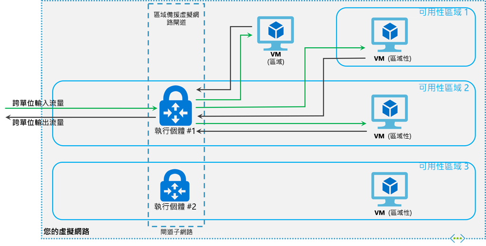

# <a name="about-expressroute-virtual-network-gateways"></a>關於快速路由虛擬網路閘道

要通過 ExpressRoute 連接 Azure 虛擬網路和本地網路，必須首先創建虛擬網路閘道。 虛擬網路閘道有兩個用途：在網路和路由網路流量之間交換 IP 路由。 本文介紹 SKU 的閘道類型、閘道 SKU 和估計性能。 本文還解釋了 ExpressRoute [FastPath，](#fastpath)此功能使本地網路的網路流量能夠繞過虛擬網路閘道以提高性能。

## <a name="gateway-types"></a>閘道類型

當您建立虛擬網路閘道時，您必須指定數項設定。 其中一個必要設定 '-GatewayType' 會指定是否要對 ExpressRoute 或 VPN 閘道流量使用閘道。 兩種閘道類型如下：

* **Vpn** - 若要透過公用網際網路傳送已加密的流量，請使用 'Vpn' 閘道類型。 也稱之為 VPN 閘道。 站對站、點對站和 VNet 對 VNet 連線都使用 VPN 閘道。

* **ExpressRoute** - 若要在私人連線上傳送網路流量，請使用 'ExpressRoute' 閘道類型。 這也稱為 ExpressRoute 閘道，而且是您設定 ExpressRoute 時所用的閘道類型。

對於每種閘道類型，每個虛擬網路只能有一個虛擬網路閘道。 例如，您可以有一個使用 -GatewayType Vpn 的虛擬網路閘道，以及一個使用 -GatewayType ExpressRoute 的虛擬網路閘道。

## <a name="gateway-skus"></a><a name="gwsku"></a>閘道 SKU
[!INCLUDE [expressroute-gwsku-include](../../includes/expressroute-gwsku-include.md)]

如果要將閘道升級到更強大的閘道 SKU，在大多數情況下，您可以使用"調整大小-Az虛擬網路閘道"PowerShell Cmdlet。 這適用於升級至 Standard 和 HighPerformance SKU。 不過，若要升級至 UltraPerformance SKU，您必須重新建立閘道器。 重新建立閘道時會導致停機。

### <a name="estimated-performances-by-gateway-sku"></a><a name="aggthroughput"></a>閘道 SKU 預估的效能
下表顯示閘道類型和預估的效能。 此資料表適用於資源管理員與傳統部署模型。

[!INCLUDE [expressroute-table-aggthroughput](../../includes/expressroute-table-aggtput-include.md)]

> [!IMPORTANT]
> 應用程式效能取決於多項因素，例如端對端延遲以及應用程式開啟之流量的數目。 表格中的數字代表應用程式在理想的環境中，理論上可以達成的最高上限。
>
>

## <a name="gateway-subnet"></a><a name="gwsub"></a>閘道子網

在創建 ExpressRoute 閘道之前，必須創建閘道子網。 閘道子網路包含虛擬網路閘道 VM 與服務所使用的 IP 位址。 創建虛擬網路閘道時，閘道 VM 將部署到閘道子網，並配置所需的 ExpressRoute 閘道設置。 切勿將任何其他內容（例如，其他 VM）部署到閘道子網。 此閘道子網路必須命名為 'GatewaySubnet' 才能正常運作。 將閘道子網路命名為 'GatewaySubnet' 可讓 Azure 知道這是要用來部署虛擬網路閘道 VM 和服務的子網路。

>[!NOTE]
>[!INCLUDE [vpn-gateway-gwudr-warning.md](../../includes/vpn-gateway-gwudr-warning.md)]
>

當您建立閘道子網路時，您可指定子網路包含的 IP 位址數目。 閘道子網路中的 IP 位址會配置給閘道 VM 和閘道服務。 有些組態需要的 IP 位址比其他組態多。 

規劃閘道子網大小時，請參閱計畫創建的配置的文檔。 例如，ExpressRoute/VPN 閘道共存配置需要比大多數其他配置更大的閘道子網。 此外，您可能會想要確定閘道子網路包含足夠的 IP 位址，以因應未來可能的額外組態需求。 雖然您可以創建小到 /29 的閘道子網，但如果有可用的位址空間，我們建議您創建 /27 或更大的閘道子網（/27、/26 等）。 這將適應大多數配置。

下列 Resource Manager PowerShell 範例顯示名為 GatewaySubnet 的閘道子網路。 您可以看到 CIDR 標記法指定 /27，這可提供足以供大多數現有組態使用的 IP 位址。

```azurepowershell-interactive
Add-AzVirtualNetworkSubnetConfig -Name 'GatewaySubnet' -AddressPrefix 10.0.3.0/27
```

[!INCLUDE [vpn-gateway-no-nsg](../../includes/vpn-gateway-no-nsg-include.md)]

### <a name="zone-redundant-gateway-skus"></a><a name="zrgw"></a>區域備援閘道 SKU

您也可以在 Azure 可用性區域中部署 ExpressRoute 閘道。 這能夠在實際上和邏輯上將閘道分隔為不同的可用性區域，同時還能在發生區域層級的失敗時，保護內部部署項目與 Azure 的網路連線。



區域備援閘道會使用適用於 ExpressRoute 閘道的特定新式閘道 SKU。

* ErGw1AZ
* ErGw2AZ
* ErGw3AZ

新的閘道 SKU 也支援其他部署選項，以充分符合您的需求。 使用新的閘道 SKU 建立虛擬網路閘道時，您也可選擇在特定區域中部署閘道。 稱之為區域閘道。 當您部署分區閘道時，閘道的所有執行個體都會部署在相同的可用性區域中。

## <a name="fastpath"></a><a name="fastpath"></a>FastPath

ExpressRoute虛擬網路閘道旨在切換式網路路由和路由網路流量。 FastPath 旨在提高本地網路和虛擬網路之間的資料路徑性能。 啟用後，FastPath 會繞過閘道將網路流量直接發送到虛擬網路中的虛擬機器。

有關快速路徑的詳細資訊（包括限制和要求），請參閱關於[FastPath](about-fastpath.md)。

## <a name="rest-apis-and-powershell-cmdlets"></a><a name="resources"></a>REST API 和 PowerShell Cmdlet
如需將 REST API 和 PowerShell Cmdlet 使用於虛擬網路閘道組態時的其他技術資源和特定語法需求，請參閱下列頁面︰

| **經典** | **資源管理器** |
| --- | --- |
| [電源外殼](https://docs.microsoft.com/powershell/module/servicemanagement/azure/?view=azuresmps-4.0.0#azure) |[電源外殼](https://docs.microsoft.com/powershell/module/az.network#networking) |
| [REST API](https://msdn.microsoft.com/library/jj154113.aspx) |[REST API](https://msdn.microsoft.com/library/mt163859.aspx) |

## <a name="next-steps"></a>後續步驟

有關可用連接配置的詳細資訊，請參閱[ExpressRoute 概述](expressroute-introduction.md)。

有關創建快速路由閘道的詳細資訊，請參閱[為 ExpressRoute 創建虛擬網路閘道](expressroute-howto-add-gateway-resource-manager.md)。

有關配置區域冗余閘道的詳細資訊，請參閱[創建區域冗余虛擬網路閘道](../../articles/vpn-gateway/create-zone-redundant-vnet-gateway.md)。

有關快速路徑的詳細資訊，請參閱[有關快速路徑](about-fastpath.md)。