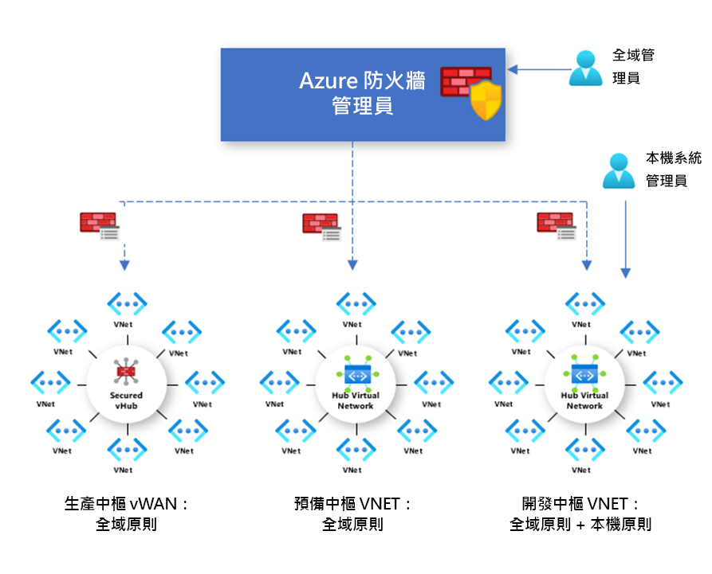

# Azure 防火牆管理員原則概觀

防火牆原則是一種 Azure 資源，其中包含 NAT、網路和應用程式規則集合，以及威脅情報設定。 這是全域資源，可使用於安全虛擬中樞及中樞虛擬網路中的多個 Azure 防火牆執行個體。 原則可跨地區和訂用帳戶運作。

## 建立和關聯原則

您可透過多種方式來建立和管理原則，包括 Azure 入口網站、REST API、範本、Azure PowerShell 和 CLI。

您也可以使用入口網站或 Azure PowerShell，從 Azure 防火牆遷移現有的規則，以建立原則。 如需詳細資訊，請參閱[如何將 Azure 防火牆組態遷移至 Azure 防火牆原則](migrate-to-policy.md)。 

原則可與一或多個虛擬中樞或 VNet 相關聯。 防火牆可位於與您的帳戶相關聯的任何訂用帳戶以及任何區域中。

## 階層式原則

您可從頭開始建立新原則，或繼承自現有的原則。 繼承可讓 DevOps 在組織規定的基本原則之上建立本機防火牆原則。

使用非空白父代原則所建立的原則，會繼承父代原則的所有規則集合。 繼承自父代原則的網路規則集合，一律優先於已定義為新原則一部分的網路規則集合。 相同的邏輯也適用於應用程式規則集合。 然而，不管繼承，網路規則集合一律比應用程式規則集合優先處理。

威脅情報模式也是繼承自父代原則。 您可以將威脅情報模式設定為不同的值來覆寫此行為，但是無法將其關閉。 您只能使用更嚴格的值覆寫。 例如，如果父代原則設為 [僅限警示]，您可將此本機原則設定為 [警示並拒絕]。

就像威脅情報模式一樣，威脅情報允許清單也是繼承自父代原則。 子系原則可以將其他 IP 位址新增至允許清單。

NAT 規則集合不會被繼承，因為其專屬於特定的防火牆。

透過繼承，對父代原則所做的任何變更都會自動向下套用至相關聯的防火牆子系原則。

## 傳統規則和原則

Azure 防火牆支援傳統規則和原則。 下表是原則和規則的比較：

| 主體 | 原則  | 規則 |
| ------- | ------- | ----- |
|包含     |NAT、網路、應用程式規則、自訂 DNS 和 DNS Proxy 設定、IP 群組和威脅情報設定 (包括允許清單)|NAT、網路和應用程式規則、自訂 DNS 和 DNS Proxy 設定、IP 群組和威脅情報設定 (包括允許清單)|
|保護     |虛擬中樞與虛擬網路|僅限虛擬網路|
|入口網站體驗     |使用防火牆管理員進行集中管理|獨立防火牆體驗|
|多重防火牆支援     |防火牆原則是可跨防火牆使用的個別資源|手動匯出和匯入規則，或使用第三方管理解決方案 |
|定價     |根據防火牆關聯計費。 請參閱[定價](#pricing)。|免費|
|支援的部署機制     |入口網站、REST API、範本、Azure PowerShell 和 CLI|入口網站、REST API、範本、PowerShell 和 CLI。 |

## 定價

原則會根據防火牆關聯計費。 具有零個或一個防火牆關聯的原則是免費的。 具有多個防火牆關聯的原則會以固定費率計費。 如需詳細資訊，請參閱 [Azure 防火牆管理員定價](https://azure.microsoft.com/pricing/details/firewall-manager/)。

## 後續步驟

若要深入了解如何部署 Azure 防火牆，請參閱[教學課程：使用 Azure 入口網站以 Azure 防火牆管理員保護您的雲端網路](secure-cloud-network.md)。
