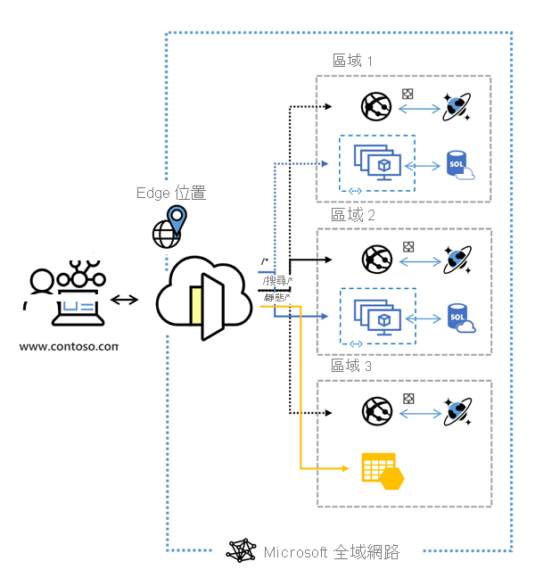

# Azure Front Door 是什麼？

Azure Front Door 是全球可調整的進入點，使用 Microsoft 全球周邊網路來建立快速、安全且可大規模調整的 Web 應用程式。 透過 Front Door，您可以將全球消費者和企業應用程式轉換成健全、高效能的個人化新式應用程式，以及透過 Azure 觸及全球對象的內容。

  

Front Door 會在第 7 層 (HTTP/HTTPS 層) 上運作，使用任一傳播通訊協定搭配分割 TCP 和 Microsoft 的全球網路來改善全球連線能力。 根據您的路由傳送方法，您可以確保 Front Door 將用戶端要求路由傳送至最快速且最可用的應用程式後端。 應用程式後端是裝載於 Azure 內部或外部的任何網際網路對向服務。 Front Door 提供[流量路由方法](front-door-routing-methods.md)和[後端健康情況監視選項](front-door-health-probes.md)的範圍，以符合不同的應用程式需求和自動容錯移轉案例。 Front Door 類似於[流量管理員](../traffic-manager/traffic-manager-overview.md)，可針對失敗彈性應變，包括整個 Azure 區域的失敗。

>[!NOTE]
> Azure 會為您的案例提供一套完整受控的負載平衡解決方案。 
> * 如果您想要執行 DNS 型全域路由，而且**沒有**傳輸層安全性 (TLS) 通訊協定終止 (「SSL 卸載」)、每一 HTTP/HTTPS 要求或應用程式層的需求，請檢閱[流量管理員](../traffic-manager/traffic-manager-overview.md)。 
> * 如果您想要在應用程式層區域中的伺服器之間進行負載平衡，請參閱[應用程式閘道](../application-gateway/application-gateway-introduction.md)
> * 若要執行網路層負載平衡，請參閱 [Load Balancer](../load-balancer/load-balancer-overview.md)。 
> 
> 視需要結合這些解決方案，可能有益於您的端對端案例。
> 如需 Azure 負載平衡選項的比較，請參閱 [Azure 中的負載平衡選項概觀](https://docs.microsoft.com/azure/architecture/guide/technology-choices/load-balancing-overview)。

## 為何使用 Azure Front Door？

透過 Front Door，您可以建置、操作及擴增動態 Web 應用程式和靜態內容。 Front Door 可讓您透過快速全域容錯移轉針對最上層使用者效能和可靠性進行最佳化，以定義、管理及監視網路流量的全域路由。

Front Door 隨附的重要功能：

* 藉由使用 **[分割 TCP](front-door-routing-architecture.md#splittcp)** 型 **[任一傳播通訊協定](front-door-routing-architecture.md#anycast)** ，加速應用程式效能。

* 監視後端資源的智慧型 **[健全狀態探查](front-door-health-probes.md)** 。

*  用於要求的 **[URL 路徑型路由](front-door-route-matching.md)** 。

* 可裝載多個網站以提供有效率的應用程式基礎結構。 

* Cookie 型 **[工作階段親和性](front-door-routing-methods.md#affinity)** 。

* **[SSL 卸載](front-door-custom-domain-https.md)** 和憑證管理。

* 定義您自己的 **[自訂網域](front-door-custom-domain.md)** 。 

* 具有整合式 **[Web 應用程式防火牆 (WAF)](../web-application-firewall/overview.md)** 的應用程式安全性。

* 使用 **[URL 重新導向](front-door-url-redirect.md)** ，將 HTTP 流量重新導向到 HTTPS。

* 搭配 **[URL 重寫](front-door-url-rewrite.md)** 的自訂轉送路徑。

* 端對端 IPv6 連線能力和 **[HTTP/2 通訊協定](front-door-http2.md)** 的原生支援。

## 定價

如需定價資訊，請參閱 [Front Door 定價](https://azure.microsoft.com/pricing/details/frontdoor/)。 請參閱 [SLA for Azure Front Door](https://azure.microsoft.com/en-us/support/legal/sla/frontdoor/v1_0/)。

## 新功能

訂閱 RSS 摘要，並在 [Azure 更新](https://azure.microsoft.com/updates/?category=networking&query=Azure%20Front%20Door)頁面上檢視最新的 Azure Front Door 功能更新。

## 後續步驟

- 了解如何[建立 Front Door](quickstart-create-front-door.md)。
- 了解 [Front Door 的運作方式](front-door-routing-architecture.md)。
