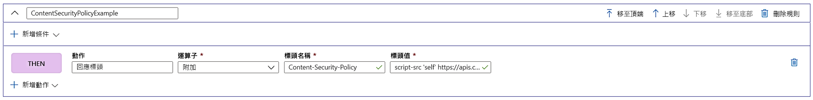

# 教學課程：使用規則引擎新增安全性標頭

本教學課程說明如何實作安全性標頭以防止以瀏覽器為基礎的漏洞，例如 HTTP Strict-Transport-Security (HSTS)、X-XSS-Protection、Content-Security-Policy 或 X-Frame-Options。 以安全性為基礎的屬性也可以使用 Cookie 來定義。

下列範例示範如何將 Content-Security-Policy 標頭新增至所有符合規則引擎組態相關聯路由中所定義路徑的傳入要求。 在這裡我們只允許來自信任網站 **https://apiphany.portal.azure-api.net** 的指令碼在我們的應用程式上執行。

在本教學課程中，您會了解如何：
> [!div class="checklist"]
> - 設定規則引擎內的內容安全性原則。

## Prerequisites

* 您必須先建立 Front Door，才能完成本教學課程中的步驟。 如需詳細資訊，請參閱[快速入門：建立前端](quickstart-create-front-door.md)。
* 如果這是您第一次使用「規則引擎」功能，請參閱如何[設定規則引擎](front-door-tutorial-rules-engine.md)。

## 在 Azure 入口網站中新增 Content-Security-Policy 標頭

1. 按一下 [新增] 以新增新的規則。 提供規則的名稱，然後按一下 [新增動作]  >  [回應標頭]。

1. 將運算子設定為 [附加] 以新增此標頭，作為對此路由所有傳入要求的回應。

1. 新增標頭名稱：**Content-Security-Policy**，並且定義此標頭應該接受的值。 在此案例中，我們選擇「*script-src 'self' https://apiphany.portal.azure-api.net 」。*

1. 將所有想要的規則新增至您的組態之後，請別忘了移至慣用的路由，並且將您的規則引擎組態與您的路由規則產生關聯。 必須執行此步驟，才能讓規則生效。 

> [!NOTE]
> 在此案例中，我們不會將[比對條件](front-door-rules-engine-match-conditions.md)新增至規則。 所有符合路由規則中所定義路徑的傳入要求都會套用此規則。 如果您只想要將規則套用到這些要求的子集，請務必將您的特定**比對條件**新增至此規則。

## 清除資源

在上述步驟中，您已使用規則引擎設定安全性標頭。 如果您不再想要此規則，可以按一下 [刪除規則] 將其移除。

:::image type="content" source="./media/front-door-rules-engine/rules-engine-delete-rule.png" alt-text="刪除規則":::

## 下一步

若要了解如何為您的 Front Door 設定 Web 應用程式防火牆，請繼續進行下一個教學課程。

> [!div class="nextstepaction"]
> [Web 應用程式防火牆和 Front Door](front-door-waf.md)