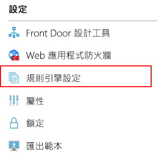
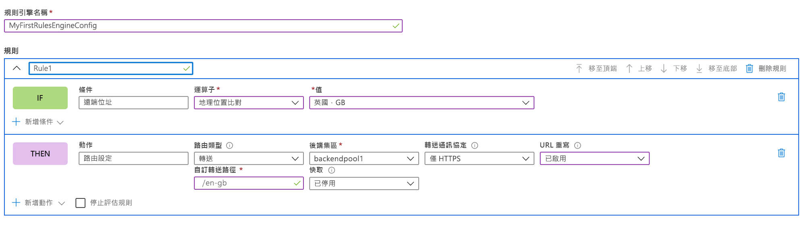
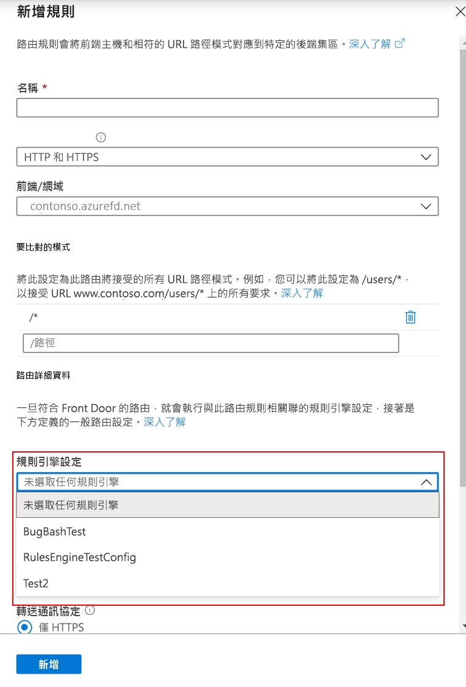

# <a name="configure-your-rules-engine"></a>設定規則引擎 

> [!IMPORTANT]
> 此公開預覽版是在沒有服務等級協定的情況下提供，不得用於生產工作負載。 可能不支援特定功能、可能已經限制功能，或者可能無法在所有 Azure 位置提供使用。 如需詳細資訊，請參閱 [Microsoft Azure 預覽專用的補充使用條款](https://azure.microsoft.com/support/legal/preview-supplemental-terms/)。
>

## <a name="configure-rules-engine-in-azure-portal"></a>在 Azure 入口網站中設定規則引擎 
1. 建立規則引擎組態之前，[建立 Front Door](quickstart-create-front-door.md)。

2. 在您的 Front Door 資源內，移至 [設定]，然後選取 [規則引擎組態]。 按一下 [新增]，為您的組態指定名稱，然後開始建立您的第一個規則引擎組態。 



3. 按一下 [新增規則]，以建立您的第一個規則。 然後，按一下 [新增條件] 或 [新增動作]，即可定義您的規則。 
    
    *注意：*
    - 若要從規則中刪除條件或動作，請使用特定條件或動作右手邊的垃圾桶。
    - 若要建立適用於所有連入流量的規則，請勿指定任何條件。 
    - 若要在符合第一個比對條件時停止評估規則，請勾選 [停止評估規則]。 



4. 使用 [上移]、[下移] 和 [移至頂端] 按鈕，判斷您組態內的規則優先順序。 優先順序採用遞增順序，表示第一個列出的規則是最重要的規則。 

5. 建立一或多個規則之後，請按 [儲存]。 此動作會建立規則引擎組態。 

6. 建立一或多個組態之後，請將規則引擎組態與路由規則建立關聯。 雖然單一組態可以套用至許多路由規則，但一個路由規則只能包含一個規則引擎組態。 若要建立關聯，請移至您的 [Front Door 設計工具] > [路由規則]。 選取您想要新增規則引擎組態的路由規則，移至 [路由詳細資料] > [規則引擎組態]，然後選取您要建立關聯的組態。 




## <a name="configure-rules-engine-in-azure-cli"></a>在 Azure CLI 中設定規則引擎 

1. 如果尚未安裝 [Azure CLI](https://docs.microsoft.com/cli/azure/install-azure-cli?view=azure-cli-latest)，請先安裝。 新增 “front-door” extension:- az extension add --name front-door。 然後，登入並切換至您的訂用帳戶 az account set --subscription <name_or_Id>。 

2. 從建立規則引擎著手 - 此範例會顯示一個規則，其中包含一個以標頭為基礎的動作和一個比對條件。 

```azurecli-interactive
az network front-door rules-engine rule create -f {front_door} -g {resource_group} --rules-engine-name {rules_engine} --name {rule1} --priority 1 --action-type RequestHeader --header-action Overwrite --header-name Rewrite --header-value True --match-variable RequestFilenameExtension --operator Contains --match-values jpg png --transforms Lowercase
```

2.  列出所有規則。 

```azurecli-interactive
az network front-door rules-engine rule list -f {front_door} -g {rg} --name {rules_engine}
```

3.  新增轉送路由覆寫動作。 

```azurecli-interactive
az network front-door rules-engine rule action add -f {front_door} -g {rg} --rules-engine-name {rules_engine} --name {rule1} --action-type ForwardRouteOverride --backend-pool {backend_pool_name} --caching Disabled
```

4.  列出規則中的所有動作。 

```azurecli-interactive
az network front-door rules-engine rule action list -f {front_door} -g {rg} -r {rules_engine} --name {rule1}
```

5. 將規則引擎組態連結至路由規則。  

```azurecli-interactive
az network front-door routing-rule update -g {rg} -f {front_door} -n {routing_rule_name} --rules-engine {rules_engine}
```

6. 取消連結規則引擎。 

```azurecli-interactive
az network front-door routing-rule update -g {rg} -f {front_door} -n {routing_rule_name} --remove rulesEngine # case sensitive word ‘rulesEngine’
```

如需詳細資訊，在[這裡](https://docs.microsoft.com/cli/azure/ext/front-door/network/front-door/rules-engine?view=azure-cli-latest)可找到 AFD 規則引擎命令的完整清單。   

## <a name="next-steps"></a>後續步驟

- 深入了解 [AFD 規則引擎](front-door-rules-engine.md)。 
- 了解如何[建立 Front Door](quickstart-create-front-door.md)。
- 了解 [Front Door 的運作方式](front-door-routing-architecture.md)。
- 如需詳細資訊，請參閱 AFD 規則引擎 [CLI 參考](https://docs.microsoft.com/cli/azure/ext/front-door/network/front-door/rules-engine?view=azure-cli-latest)。 
- 如需詳細資訊，請參閱 AFD 規則引擎 [PowerShell 參考](https://docs.microsoft.com/powershell/module/az.frontdoor/?view=azps-3.8.0)。 
