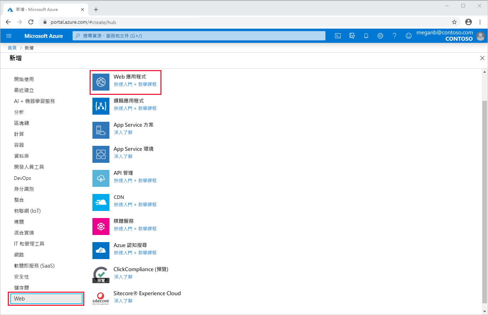
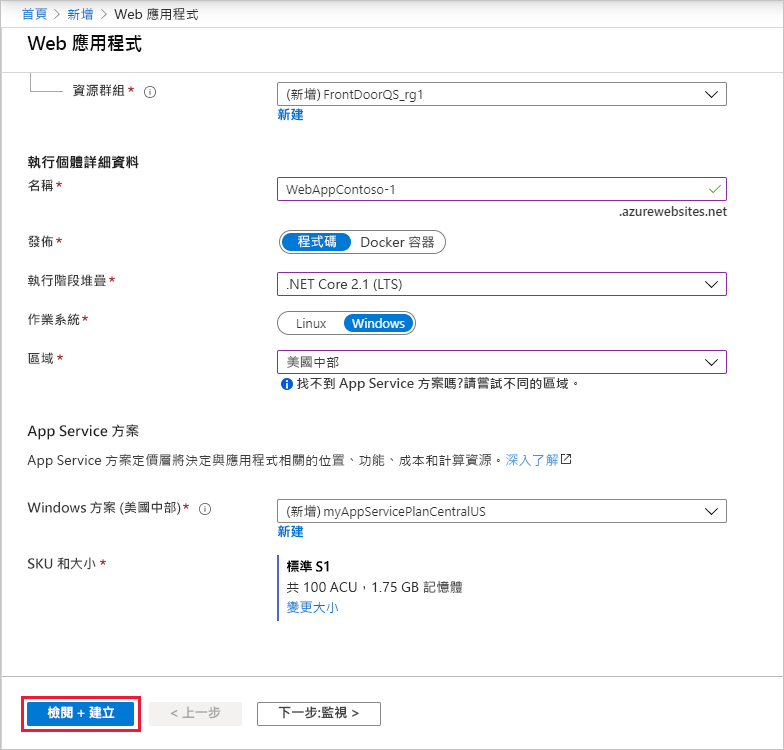
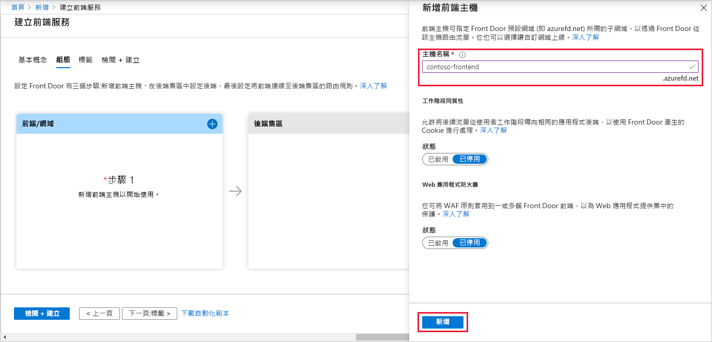
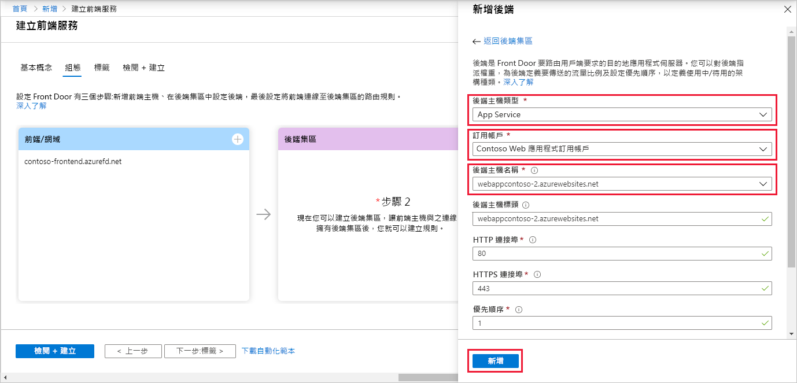
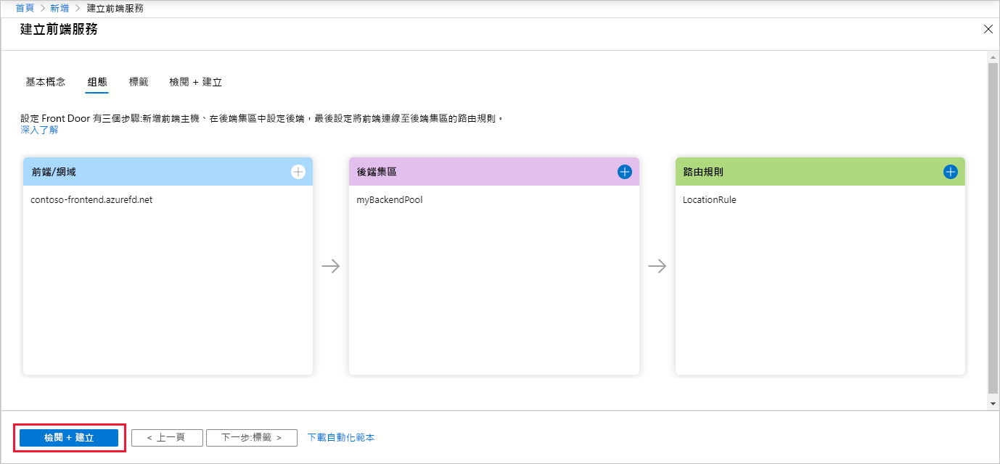
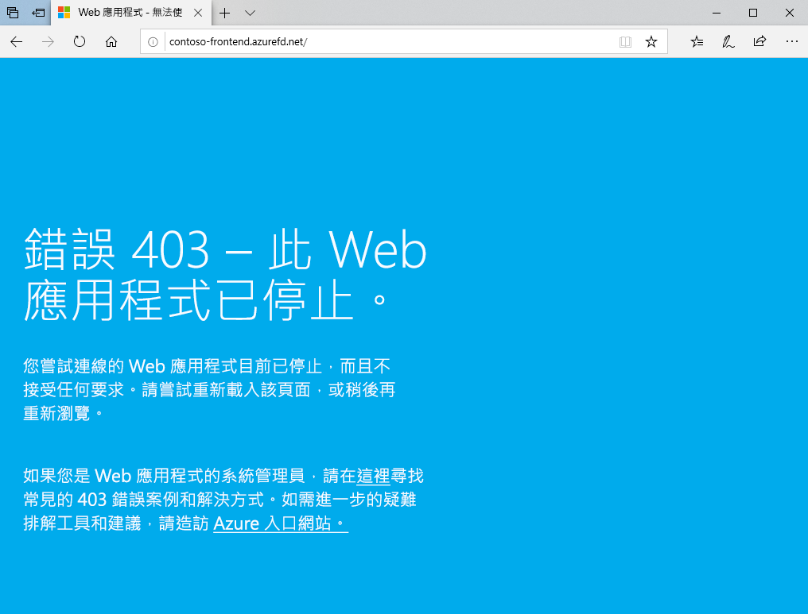

# 快速入門：為高可用性的全球 Web 應用程式建立 Front Door

您可以透過 Azure 入口網站來開始使用 Azure Front Door，並為 Web 應用程式設定高可用性。

在本快速入門中，Azure Front Door 會集中兩個在不同 Azure 區域中執行的 Web 應用程式執行個體。 您可以根據相同加權和相同優先順序的後端來建立 Front Door 組態。 此組態會將流量導向執行應用程式且最接近的網站。 Azure Front Door 會持續監視 Web 應用程式。 當最近的網站無法使用時，服務會提供自動容錯移轉至下一個可用網站的功能。

## Prerequisites

- 具有有效訂用帳戶的 Azure 帳戶。 [免費建立帳戶](https://azure.microsoft.com/free/?WT.mc_id=A261C142F)。

## 建立 Web 應用程式的兩個執行個體

本快速入門需要兩個在不同 Azure 區域中執行的 Web 應用程式執行個體。 這兩個 Web 應用程式執行個體都會以「主動/主動」  模式執行，因此其中任一個都可以接受流量。 此組態不同於「主動/待命」  組態，也就是其中一個執行個體會用來作為容錯移轉。

如果您還沒有 Web 應用程式，請使用下列步驟來設定 Web 應用程式範例。

1. 在 https://portal.azure.com 登入 Azure 入口網站。

1. 從首頁或 Azure 功能表選取 [建立資源]  。

1. 選取 [Web]   > [Web 應用程式]  。

   

1. 在 [Web 應用程式]  中選取要使用的**訂用帳戶**。

1. 在 [資源群組]  中，選取 [新建]  。 輸入 FrontDoorQS_rg1  作為 [名稱]  ，然後選取 [確定]  。

1. 在 [執行個體詳細資料]  底下，為您的 Web 應用程式輸入唯一的**名稱**。 此範例會使用 WebAppContoso-1  。

1. 選取**執行階段堆疊**，在此範例中，請選取 [.NET Core 2.1 (LTS)]  。

1. 選取區域，例如 [美國中部]  。

1. 在 [Windows 方案]  中，選取 [新建]  。 輸入 myAppServicePlanCentralUS  作為 [名稱]  ，然後選取 [確定]  。

1. 請確定 [SKU 和大小]  是 [標準 S1 100 總 ACU，1.75 GB 記憶體]  。

1. 選取 [檢閱 + 建立]  ，檢閱**摘要**，然後選取 [建立]  。 可能需要數分鐘的時間，部署才會完成。

   

部署完成之後，請建立第二個 Web 應用程式。 請使用相同的程序及相同的值，但下列值除外：

| 設定          | 值     |
| ---              | ---  |
| **資源群組**   | 選取 [新建]  並輸入 *FrontDoorQS_rg2* |
| **名稱**             | 為您的 Web 應用程式輸入唯一的名稱，在此範例中為 *WebAppContoso-2*  |
| **區域**           | 使用不同的區域，在此範例中為 [美國中南部]  |
| [App Service 方案]   > [Windows 方案]          | 選取 [新建]  並輸入 myAppServicePlanSouthCentralUS  ，然後選取 [確定]  |

## 為您的應用程式建立 Front Door

設定 Azure Front Door 以根據兩個 Web 應用程式伺服器之間的最低延遲來引導使用者流量。 若要開始，請新增 Azure Front Door 的前端主機。

1. 從首頁或 Azure 功能表選取 [建立資源]  。 選取 [網路]   > [Front Door]  。

1. 在 [建立 Front Door]  中選取**訂用帳戶**。

1. 針對 [資源群組]  ，請選取 [新增]  ，然後輸入 FrontDoorQS_rg0  並選取 [確定]  。  您也可以使用現有的資源群組。

1. 如果您已建立資源群組，請選取**資源群組位置**，然後選取 [下一步：  設定]。

1. 在 [前端/網域]  中，選取 [ **+** ] 以開啟 [新增前端主機]  。

1. 在 [主機名稱]  中，輸入全域唯一的主機名稱。 此範例使用 contoso-frontend  。 選取 [新增]  。

   

接下來，建立包含兩個 Web 應用程式的後端集區。

1. 繼續在 [建立 Front Door]  的 [後端集區]  中，選取 [ **+** ] 以開啟 [新增後端集區]  。

1. 在 [名稱]  中，輸入 myBackendPool  。

1. 選取 [新增後端]  。 針對 [後端主機類型]  ，請選取 [App Service]  。

1. 選取您的訂用帳戶，然後選擇您從 [後端主機名稱]  中選擇您建立的第一個 Web 應用程式。 在此範例中，此 Web 應用程式為 WebAppContoso-1  。 選取 [新增]  。

1. 再次選取 [新增後端]  。 針對 [後端主機類型]  ，請選取 [App Service]  。

1. 選取您的訂用帳戶，然後再次從 [後端主機名稱]  中選擇您建立的第二個 Web 應用程式。 選取 [新增]  。

   

最後，新增路由規則。 路由規則會將您的前端主機對應至後端集區。 此規則會將 `contoso-frontend.azurefd.net` 的要求轉送至 **myBackendPool**。

1. 繼續在 [建立 Front Door]  的 [路由規則]  中，選取 [ **+** ] 來設定路由規則。

1. 在 [新增規則]  的 [名稱]  中，請輸入 LocationRule  。 接受所有預設值，然後選取 [新增]  來新增路由規則。

   >[!WARNING]
   > 您**必須**確保 Front Door 中的每部前端主機都具有一個路由規則，其中含有與其相關聯的預設路徑 (`\*`)。 也就是說，在您的所有路由規則中，至少必須有一個適用於您每個前端主機的路由規則，這類主機會以預設路徑 (`\*`) 來定義。 無法執行這項操作，可能導致您的使用者流量無法被正確路由傳送。

1. 選取 [檢閱 + 建立]  ，然後選取 [建立]  。

   

## 檢視 Azure Front Door 的實際運作

建立 Front Door 之後，將需要幾分鐘的時間，才能全域性部署該組態。 完成後，請存取您所建立的前端主機。 在瀏覽器中移至 `contoso-frontend.azurefd.net`。 您的要求將會從後端集區中指定的伺服器，自動路由到最離您最近的伺服器。

如果您已在本快速入門中建立這些應用程式，您會看到資訊頁面。

若要測試即時全域容錯移轉的運作，請嘗試下列步驟：

1. 如上面所述開啟瀏覽器，然後移至前端位址：`contoso-frontend.azurefd.net`。

1. 在 Azure 入口網站中，搜尋並選取「應用程式服務」  。 向下捲動以尋找您的其中一個 Web 應用程式，在此範例中為 **WebAppContoso-1**。

1. 選取您的 Web 應用程式，然後依序選取 [停止]  及 [是]  來進行驗證。

1. 重新整理您的瀏覽器。 您應該會看到相同的資訊頁面。

   >[!TIP]
   >這些動作會有一些延遲。 您可能需要再次重新整理。

1. 尋找其他 Web 應用程式，並將其停止。

1. 重新整理您的瀏覽器。 此時，您應該會看到一則錯誤訊息。

   

## 清除資源

完成之後，您可以移除您建立的所有項目。 刪除資源群組也會刪除其內容。 如果您不打算使用此 Front Door，則應移除資源以避免不必要的費用。

1. 在 Azure 入口網站中，搜尋並選取**資源群組**，或從 Azure 入口網站功能表選取**資源群組**。

1. 篩選或向下捲動以尋找資源群組，例如 **FrontDoorQS_rg0**。

1. 選取資源群組，然後選取 [刪除資源群組]  。

   >[!WARNING]
   >此動作無法復原。

1. 輸入資源群組名稱以確認，然後選取 [刪除]  。

針對其他兩個群組重複此程序。

## 後續步驟

前往下一篇文章，以了解如何將自訂網域新增至您的 Front Door。
> [!div class="nextstepaction"]
> [新增自訂網域](front-door-custom-domain.md)
