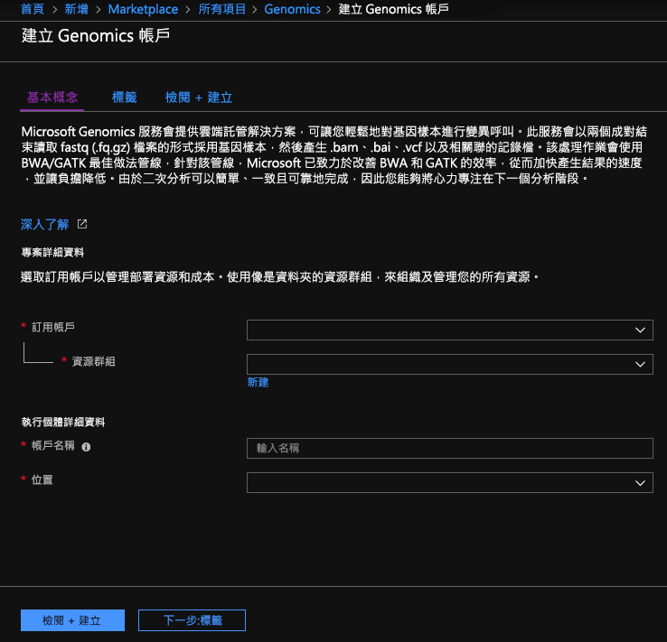
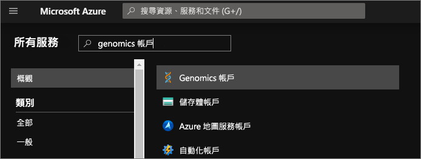
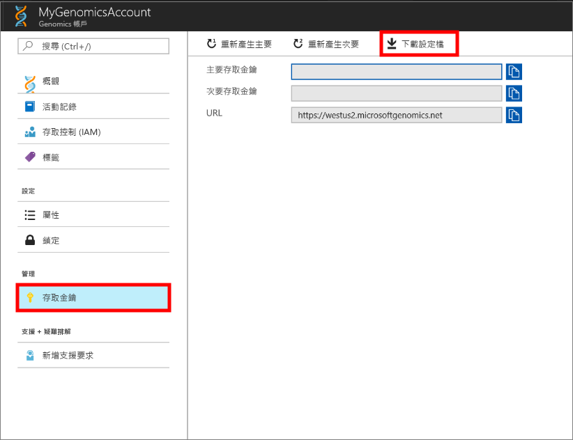
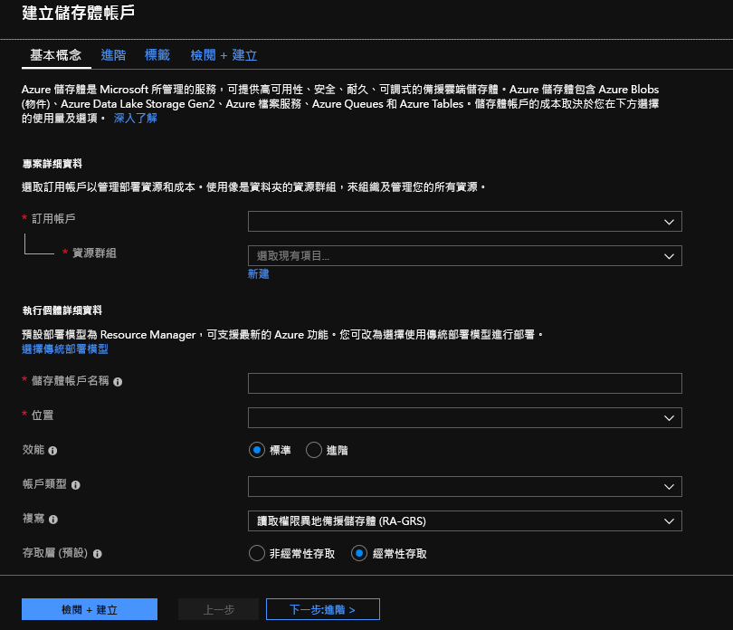

# <a name="quickstart-run-a-workflow-through-the-microsoft-genomics-service"></a>快速入門：透過 Microsoft Genomics 服務執行工作流程

在本快速入門中，您會將輸入資料上傳至 Azure Blob 儲存體帳戶中，並使用 Python Genomics 用戶端透過 Microsoft Genomics 服務執行工作流程。 Microsoft Genomics 是用於基因組次級分析的可調式安全服務，可快速處理基因組，從原始讀取開始，並產生對齊的讀取和變數呼叫。 

## <a name="prerequisites"></a>Prerequisites

- 具有有效訂用帳戶的 Azure 帳戶。 [免費建立帳戶](https://azure.microsoft.com/free/?ref=microsoft.com&utm_source=microsoft.com&utm_medium=docs&utm_campaign=visualstudio)。 
- 已安裝 `pip`、且 `python` 位於系統路徑中的 [Python 2.7.12+](https://www.python.org/downloads/release/python-2714/)。 Microsoft Genomics 用戶端與 Python 3 不相容。 

## <a name="set-up-create-a-microsoft-genomics-account-in-the-azure-portal"></a>設定：在 Azure 入口網站中建立 Microsoft Genomics 帳戶

若要建立 Microsoft Genomics 帳戶，請瀏覽至 Azure 入口網站中的[建立 Genomics 帳戶](https://portal.azure.com/#create/Microsoft.Genomics)。 如果您還沒有 Azure 訂用帳戶，請在建立 Microsoft Genomics 帳戶之前先建立一個。 



使用下列資訊設定 Genomics 帳戶，如上圖所示。 

 |**設定**          |  **建議的值**  | **欄位描述** |
 |:-------------       |:-------------         |:----------            |
 |訂用帳戶         | 您的訂用帳戶名稱|這是您 Azure 服務的計費單位 - 如需關於您訂用帳戶的詳細資訊，請參閱[訂用帳戶](https://account.azure.com/Subscriptions) |      
 |資源群組       | MyResourceGroup       |  資源群組可讓您將多個 Azure 資源 (儲存體帳戶、Genomics 帳戶等) 群組為單一群組來簡化管理。 如需詳細資訊，請參閱[資源群組](../azure-resource-manager/management/overview.md#resource-groups)。 如需有效的資源群組名稱，請參閱[命名規則](/azure/architecture/best-practices/resource-naming) |
 |帳戶名稱         | MyGenomicsAccount     |請選擇唯一的帳戶識別碼。 如需有效的名稱，請參閱[命名規則](/azure/architecture/best-practices/resource-naming) |
 |Location                   | 美國西部 2                    |    可在美國西部 2、西歐和東南亞提供服務 |

您可以選取頂端功能表列中的 [通知]  來監視部署程序。


如需 Microsoft Genomics 的詳細資訊，請參閱[什麼是 Microsoft Genomics？](overview-what-is-genomics.md)

## <a name="set-up-install-the-microsoft-genomics-python-client"></a>設定：安裝 Microsoft Genomics Python 用戶端

您必須在本機環境中安裝 Python 和 Microsoft Genomics Python 用戶端 `msgen`。 

### <a name="install-python"></a>安裝 Python

Microsoft Genomics Python 用戶端與 Python 2.7.12 或更新的 2.7.xx 版相容。 2.7.14 是建議版本。 您可以在[這裡](https://www.python.org/downloads/release/python-2714/)找到下載。 

> [!IMPORTANT]
> Python 3.x 與 Python 2.7.xx 不相容。  `msgen` 是 Python 2.7 應用程式。 執行 `msgen` 時，請確定您作用中的 Python 環境使用的是 Python 的 2.7.xx 版本。 嘗試搭配使用 `msgen` 與 Python 的 3.x 版時，可能會發生錯誤。

### <a name="install-the-microsoft-genomics-python-client-msgen"></a>安裝 Microsoft Genomics Python 用戶端 `msgen`

使用 Python `pip` 來安裝 Microsoft Genomics 用戶端 `msgen`。 下列指示假設 Python2.x 已在您的系統路徑中。 如果您遇到 `pip` 安裝無法辨識的問題，您必須將 Python 和指令碼子資料夾新增至系統路徑。

```
pip install --upgrade --no-deps msgen
pip install msgen
```

如果您不想要安裝 `msgen` 作為全系統的二進位檔並修改全系統的 Python 套件，請使用 `–-user` 旗標與 `pip`。
如果您使用的是以套件為基礎的安裝或 setup.py，就已安裝所有必要套件。

### <a name="test-msgen-python-client"></a>測試 `msgen` Python 用戶端
若要測試 Microsoft Genomics 用戶端，請從 Genomics 帳戶下載組態檔。 在 Azure 入口網站中，選取左上方的 [所有服務]，然後搜尋並選取 Genomics 帳戶，以瀏覽至您的 Genomics 帳戶。



選取您剛建立的 Genomics 帳戶，瀏覽至 [存取金鑰]，並下載組態檔。



測試 Microsoft Genomics Python 用戶端可使用下列命令

```Python
msgen list -f "<full path where you saved the config file>"
```

## <a name="create-a-microsoft-azure-storage-account"></a>建立 Microsoft Azure 儲存體帳戶 
Microsoft Genomics 服務預期會輸入儲存為 Azure 儲存體帳戶中的區塊 blob。 它也會將輸出檔案作為區塊 Blob 寫入 Azure 儲存體帳戶中的使用者指定容器。 輸入和輸出可以位於不同的儲存體帳戶中。
如果您在 Azure 儲存體帳戶中已擁有您的資料，就只需要確定資料與 Genomics 帳戶在相同的位置。 否則，在執行 Microsoft Genomics 服務時就會產生輸出費用。 如果您還沒有 Azure 儲存體帳戶，就必須加以建立並上傳您的資料。 您可以在[這裡](../storage/common/storage-account-create.md)找到更多關於 Azure 儲存體帳戶的資訊，包括儲存體帳戶的定義，及其提供的服務。 若要建立 Azure 儲存體帳戶，請瀏覽至 Azure 入口網站中的[建立儲存體帳戶](https://portal.azure.com/#create/Microsoft.StorageAccount-ARM)。  



使用下列資訊設定儲存體帳戶，如上圖所示。 對於儲存體帳戶大部分應使用標準選項，而僅指定帳戶為 BlobStorage，非一般用途。 Blob 儲存體的下載及上傳速度可能快 2-5 倍。  建議使用預設的部署模型：Azure Resource Manager。  

 |**設定**          |  **建議的值**  | **欄位描述** |
 |:-------------------------       |:-------------         |:----------            |
 |訂用帳戶         | 您的 Azure 訂用帳戶 |如需訂用帳戶的詳細資訊，請參閱[訂用帳戶](https://account.azure.com/Subscriptions) |      
 |資源群組       | MyResourceGroup       |  您可以選取相同的資源群組作為 Genomics 帳戶。 如需有效的資源群組名稱，請參閱[命名規則](/azure/architecture/best-practices/resource-naming) |
 |儲存體帳戶名稱         | MyStorageAccount     |請選擇唯一的帳戶識別碼。 如需有效的名稱，請參閱[命名規則](/azure/architecture/best-practices/resource-naming) |
 |Location                  | 美國西部 2                  | 使用相同位置作為 Genomics 帳戶的位置，可減少輸出費用並降低延遲。  | 
 |效能                  | 標準                   | 預設值是 [標準]。 如需標準和進階儲存體帳戶的詳細資訊，請參閱 [Microsoft Azure 儲存體簡介](../storage/common/storage-introduction.md)    |
 |帳戶類型       | BlobStorage       |  Blob 儲存體的下載及上傳速度可能比一般用途的快 2-5 倍。 |
 |複寫                  | 本地備援儲存體                  | 本地備援儲存體會在您建立儲存體帳戶的區域資料中心內複寫資料。 如需詳細資訊，請參閱 [Azure 儲存體複寫](../storage/common/storage-redundancy.md)    |
 |存取層                  | 經常性存取層                   | 經常性存取表示會更頻繁地存取儲存體帳戶中的物件。    |

然後，選取 [檢閱 + 建立] 以建立儲存體帳戶。 如同建立 Genomics 帳戶，您可以選取頂端功能表列中的 [通知] 來監視部署程序。 

## <a name="upload-input-data-to-your-storage-account"></a>將輸入資料上傳至儲存體帳戶

Microsoft Genomics 服務預期會使用成對端讀取 (fastq 或 bam 檔案) 作為輸入檔案。 您可以選擇要上傳自己的資料，或是使用提供給您的公開可用範例資料進行瀏覽。 如果您要使用公開可用的範例資料，它會裝載在這裡：

[https://msgensampledata.blob.core.windows.net/small/chr21_1.fq.gz](https://msgensampledata.blob.core.windows.net/small/chr21_1.fq.gz)
[https://msgensampledata.blob.core.windows.net/small/chr21_2.fq.gz](https://msgensampledata.blob.core.windows.net/small/chr21_2.fq.gz)

在儲存體帳戶內，您必須建立一個輸入資料的 blob 容器，和輸出資料的第二個 blob 容器。  將輸入資料上傳到您的輸入 blob 容器。 您可使用各種工具來執行，包括 [Microsoft Azure 儲存體總管](https://azure.microsoft.com/features/storage-explorer/)、[BlobPorter](https://github.com/Azure/blobporter) 或 [AzCopy](../storage/common/storage-use-azcopy-v10.md?toc=%252fazure%252fstorage%252fblobs%252ftoc.json)。 

## <a name="run-a-workflow-through-the-microsoft-genomics-service-using-the-msgen-python-client"></a>使用 `msgen` Python 用戶端透過 Microsoft Genomics 服務執行工作流程

若要透過 Microsoft Genomics 服務來執行工作流程，請編輯 *config.txt* 檔案，以指定資料的輸入和輸出儲存體容器。
開啟您從 Genomics 帳戶下載的 *config.txt* 檔案。 您必須指定的小節包括您的訂用帳戶金鑰，以及底部的六個項目、儲存體帳戶名稱、輸入和輸出的金鑰與容器名稱。 您可以在 Azure 入口網站中瀏覽至儲存體帳戶的 [存取金鑰]，或直接從 Azure 儲存體總管找到這項資訊。  


如果您想要執行 GATK4，請將 `process_name` 參數設定為 `gatk4`。

根據預設，Genomics 服務會輸出 VCF 檔案。 如果您想要 gVCF 輸出而不是 VCF 輸出 (相當於 GATK 3.x 中的 `-emitRefConfidence` 及 GATK 4.x 中的 `emit-ref-confidence`)，請將 `emit_ref_confidence` 參數新增至您的 *config.txt* ，並將其設定為 `gvcf`，如上圖所示。  若要變更回 VCF 輸出，請從 *config.txt* 檔案中移除該參數，或將 `emit_ref_confidence` 參數設定為 `none`。 

`bgzip` 是一種用來壓縮 vcf 或 gvcf 檔案的工具，而 `tabix` 會建立壓縮檔案的索引。 根據預設，Genomics 服務會執行 `bgzip` 後面接著 ".g.vcf" 輸出的 `tabix`，但預設不會針對 ".vcf" 輸出執行這些工具。 執行時，服務會產生 ".gz" (bgzip 輸出) 和 ".tbi" (tabix 輸出) 檔案。 引數是布林值，預設會將 ".vcf" 輸出設為 False，並將 ".g.vcf" 輸出設定為 True。 若要在命令列上使用，請將 `-bz` 或 `--bgzip-output` 指定為 `true` (執行 bgzip 和 tabix) 或 `false`。 若要在 config.txt 檔案中使用此引數，請將 `bgzip_output: true` 或 `bgzip_output: false` 新增至檔案。

### <a name="submit-your-workflow-to-the-microsoft-genomics-service-using-the-msgen-python-client"></a>使用 `msgen` Python 用戶端將工作流程提交至 Microsoft Genomics 服務

使用 Microsoft Genomics Python 用戶端搭配下列命令來提交工作流程：

```python
msgen submit -f [full path to your config file] -b1 [name of your first paired end read] -b2 [name of your second paired end read]
```

您可以使用下列命令來檢視工作流程的狀態： 
```python
msgen list -f c:\temp\config.txt 
```

工作流程完成後，您可以在您設定的輸出容器中檢視 Azure 儲存體帳戶中的輸出檔案。 

## <a name="next-steps"></a>後續步驟

在本文中，您已將範例輸入資料上傳至 Azure 儲存體，並已透過 `msgen` Python 用戶端將工作流程提交至 Microsoft Genomics 服務。 若要了解有關可與 Microsoft Genomics 服務搭配使用的其他輸入檔案類型詳細資訊，請參閱下列頁面：[配對的 FASTQ](quickstart-input-pair-FASTQ.md) | [BAM](quickstart-input-BAM.md) | [多個 FASTQ 或 BAM](quickstart-input-multiple.md)。 您也可以下載 "Genomics Tutorial.ipynb" 檔案，並使用像是 [Jupyter](../notebooks/tutorial-create-run-jupyter-notebook.md) 的筆記本讀取程式來開啟檔案並執行，以使用我們的 [Azure Notebooks 範例](https://aka.ms/genomicsnotebook)探索本教學課程。