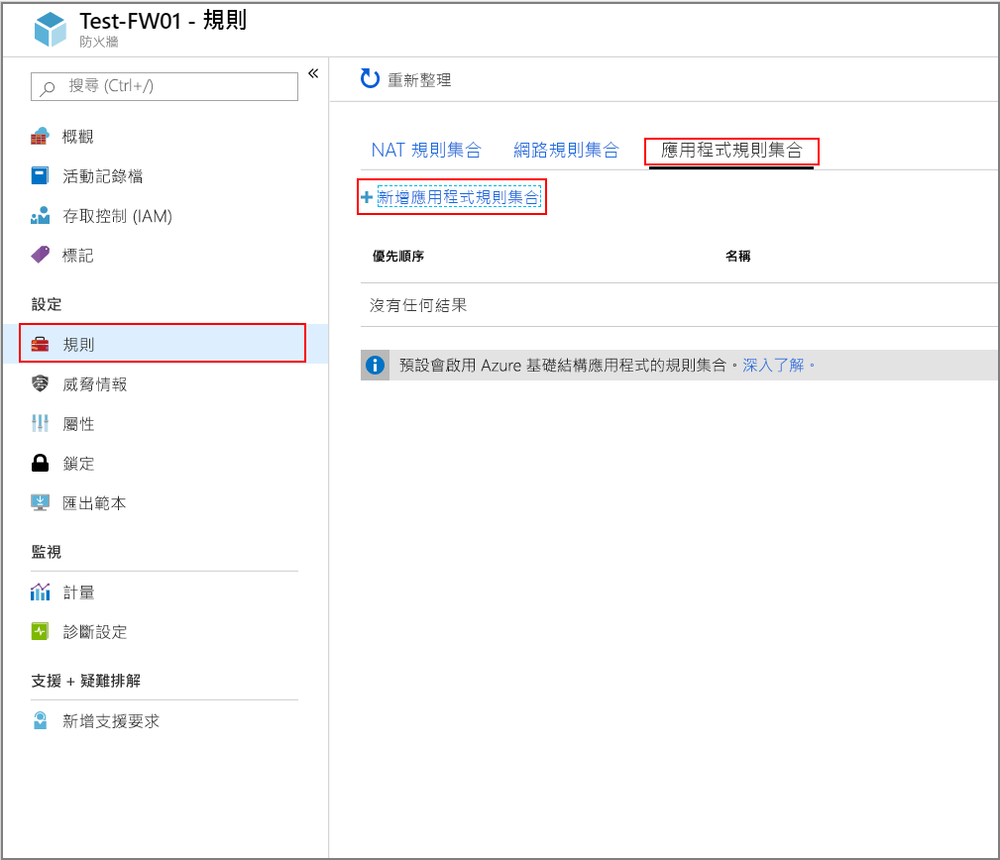
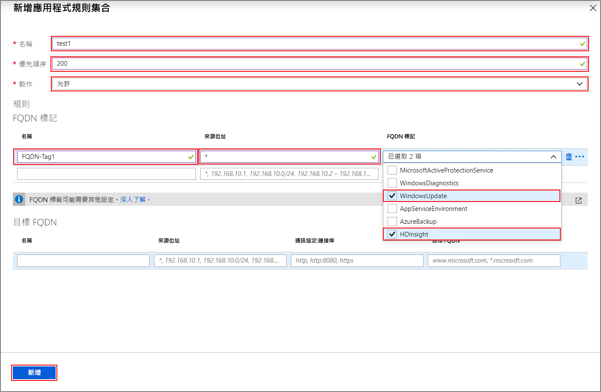
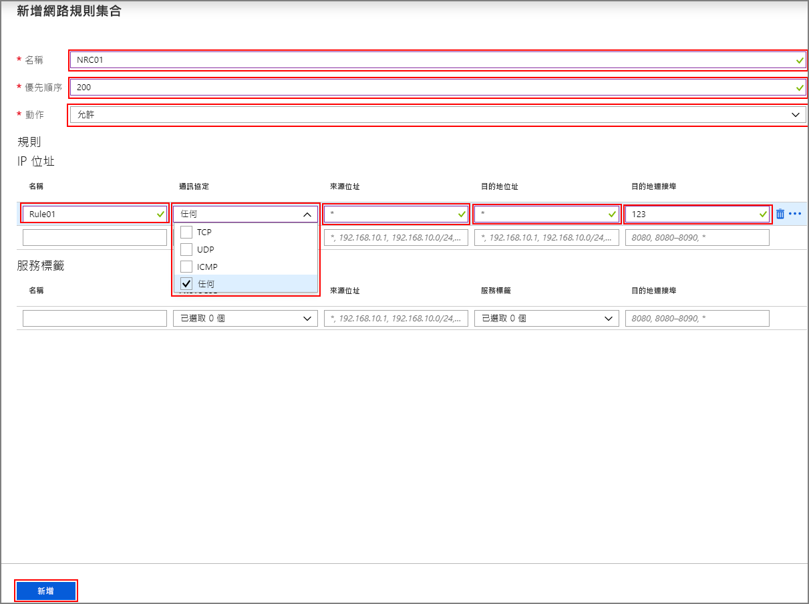

# <a name="configure-outbound-network-traffic-for-azure-hdinsight-clusters-using-firewall"></a>使用防火牆設定 Azure HDInsight 叢集的輸出網路流量

本文提供的步驟可讓您使用 Azure 防火牆來保護來自 HDInsight 叢集的輸出流量。 下列步驟假設您要為現有的叢集設定 Azure 防火牆。 如果您要在防火牆後方部署新的叢集，請先建立您的 HDInsight 叢集和子網。 然後依照本指南中的步驟進行。

## <a name="background"></a>背景

HDInsight 叢集通常會部署在虛擬網路中。 叢集具有該虛擬網路外部服務的相依性。

有數個需要輸入流量的相依性。 輸入管理流量無法透過防火牆裝置傳送。 此流量的來源位址是已知的，[並在此發佈。](hdinsight-management-ip-addresses.md) 您也可以使用此資訊來建立網路安全性群組（NSG）規則，以保護對叢集的輸入流量。

HDInsight 輸出流量相依性幾乎會與 Fqdn 完全定義。 其後面沒有靜態 IP 位址。 缺少靜態位址表示網路安全性群組（Nsg）無法鎖定來自叢集的輸出流量。 這些位址經常變更，而無法根據目前的名稱解析和使用來設定規則。

使用防火牆來保護輸出位址，以控制以功能變數名稱為基礎的輸出流量。 Azure 防火牆會根據目的地或[fqdn 標記](../firewall/fqdn-tags.md)的 fqdn 來限制輸出流量。

## <a name="configuring-azure-firewall-with-hdinsight"></a>使用 HDInsight 設定 Azure 防火牆

使用 Azure 防火牆來鎖定現有 HDInsight 輸出的步驟摘要如下：

1. 建立子網路。
1. 建立防火牆。
1. 將應用程式規則新增至防火牆
1. 將網路規則新增至防火牆。
1. 建立路由表。

### <a name="create-new-subnet"></a>建立新的子網

在您叢集所在的虛擬網路中，建立名為**AzureFirewallSubnet**的子網。

### <a name="create-a-new-firewall-for-your-cluster"></a>為叢集建立新的防火牆

使用從教學課程**部署防火牆** [：使用 Azure 入口網站部署和設定 Azure 防火牆](../firewall/tutorial-firewall-deploy-portal.md#deploy-the-firewall)中的步驟，建立名為**Test test-fw01**的防火牆。

### <a name="configure-the-firewall-with-application-rules"></a>使用應用程式規則設定防火牆

建立應用程式規則集合，讓叢集能夠傳送和接收重要的通訊。

1. 從 [Azure 入口網站中選取 [新增防火牆]**測試 test-fw01** 。

1. 流覽至 [**設定** > ] [**規則** > ] [**應用程式規則集合** > **+ 新增應用程式規則集合**]。

    

1. 在 [**新增應用程式規則集合**] 畫面上，提供下列資訊：

    **頂端區段**

    | 屬性|  值|
    |---|---|
    |名稱| FwAppRule|
    |優先順序|200|
    |動作|Allow|

    **FQDN 標記區段**

    | 名稱 | 來源地址 | FQDN 標籤 | 注意 |
    | --- | --- | --- | --- |
    | Rule_1 | * | Windowsupdate.log 和 HDInsight | HDI 服務的必要 |

    **目標 Fqdn 區段**

    | 名稱 | 來源位址 | `Protocol:Port` | 目標 FQDN | 注意 |
    | --- | --- | --- | --- | --- |
    | Rule_2 | * | HTTPs：443 | login.windows.net | 允許 Windows 登入活動 |
    | Rule_3 | * | HTTPs：443 | login.microsoftonline.com | 允許 Windows 登入活動 |
    | Rule_4 | * | HTTPs：443，HTTP：80 | storage_account_name. core。 | 以`storage_account_name`您實際的儲存體帳戶名稱取代。 如果您的叢集是由 WASB 支援，則請新增 WASB 的規則。 若只要使用 HTTPs 連線，請確定已在儲存體帳戶上啟用「[需要安全傳輸](../storage/common/storage-require-secure-transfer.md)」。 |

   

1. 選取 [新增]  。

### <a name="configure-the-firewall-with-network-rules"></a>使用網路規則設定防火牆

建立網路規則，以正確設定您的 HDInsight 叢集。

1. 從先前的步驟繼續，流覽至 [**網路規則集合** > ]**+ [新增網路規則集合**]。

1. 在 [**新增網路規則集合**] 畫面上，提供下列資訊：

    **頂端區段**

    | 屬性|  值|
    |---|---|
    |名稱| FwNetRule|
    |優先順序|200|
    |動作|Allow|

    **IP 位址區段**

    | 名稱 | 通訊協定 | 來源位址 | 目的地位址 | 目的地連接埠 | 注意 |
    | --- | --- | --- | --- | --- | --- |
    | Rule_1 | UDP | * | * | 123 | 時間服務 |
    | Rule_2 | 任意 | * | DC_IP_Address_1，DC_IP_Address_2 | * | 如果您使用企業安全性套件（ESP），請在 [IP 位址] 區段中新增網路規則，以允許 ESP 叢集與 AAD DS 通訊。 您可以在入口網站的 [AAD-DS] 區段中找到網域控制站的 IP 位址 |
    | Rule_3 | TCP | * | Data Lake Storage 帳戶的 IP 位址 | * | 如果您使用 Azure Data Lake Storage，則可以在 [IP 位址] 區段中新增網路規則，以解決 ADLS Gen1 和 Gen2 的 SNI 問題。 此選項會將流量路由傳送至防火牆。 這可能會導致大量資料載入的成本較高，但流量會記錄下來並在防火牆記錄中進行審核。 判斷 Data Lake Storage 帳戶的 IP 位址。 您可以使用 PowerShell 命令（例如） `[System.Net.DNS]::GetHostAddresses("STORAGEACCOUNTNAME.blob.core.windows.net")`將 FQDN 解析為 IP 位址。|
    | Rule_4 | TCP | * | * | 12000 | 選擇性如果您使用的是 Log Analytics，請在 [IP 位址] 區段中建立網路規則，以啟用與 Log Analytics 工作區的通訊。 |

    **服務標記區段**

    | 名稱 | 通訊協定 | 來源位址 | 服務標籤 | 目的地埠 | 注意 |
    | --- | --- | --- | --- | --- | --- |
    | Rule_7 | TCP | * | SQL | 1433 | 在 SQL 的 [服務標籤] 區段中設定網路規則，可讓您記錄和審計 SQL 流量。 除非您已在 HDInsight 子網上設定 SQL Server 的服務端點，否則會略過防火牆。 |

   

1. 選取 [新增]  。

### <a name="create-and-configure-a-route-table"></a>建立和設定路由表

建立包含下列專案的路由表：

* 來自[健康狀態和管理服務](../hdinsight/hdinsight-management-ip-addresses.md#health-and-management-services-all-regions)的所有 IP 位址： [下一個躍點類型] 為 [**網際網路**] 的所有區域。

* 從[健康狀態和管理服務](../hdinsight/hdinsight-management-ip-addresses.md#health-and-management-services-specific-regions)建立叢集的區域有兩個 IP 位址： [下一個躍點類型] 為 [**網際網路**] 的特定區域。

* IP 位址 0.0.0.0/0 的一個虛擬裝置路由，而下一個躍點是您的 Azure 防火牆私人 IP 位址。

例如，若要為在美國東部地區建立的叢集設定路由表，請使用下列步驟：

1. 選取您的 Azure 防火牆**測試-[test-fw01**]。 複製 [**總覽**] 頁面上所列的 [**私人 IP 位址**]。 在此範例中，我們將使用**範例位址 10.0.2.4**。

1. 然後流覽至 [**所有服務** > ] [**網路** > **] [路由表]** 和 [**建立路由表**]。

1. 從新的路由，流覽至 [**設定** > ] [**路由** > ] [**+ 新增**]。 新增下列路由：

| 路由名稱 | 位址首碼 | 下一個躍點類型 | 下一個躍點位址 |
|---|---|---|---|
| 168.61.49.99 | 168.61.49.99/32 | Internet | NA |
| 23.99.5.239 | 23.99.5.239/32 | Internet | NA |
| 168.61.48.131 | 168.61.48.131/32 | Internet | NA |
| 138.91.141.162 | 138.91.141.162/32 | Internet | NA |
| 13.82.225.233 | 13.82.225.233/32 | Internet | NA |
| 40.71.175.99 | 40.71.175.99/32 | Internet | NA |
| 0.0.0.0 | 0.0.0.0/0 | 虛擬設備 | 10.0.2.4 |

完成路由表設定：

1. 選取 [**設定**] 底下的 [**子**網]，將您建立的路由表指派給您的 HDInsight 子網。

1. 選取 [ **+ 關聯**]。

1. 在 [**關聯子網**] 畫面上，選取您的叢集建立所在的虛擬網路。 和您用於 HDInsight 叢集的**子網**。

1. 選取 [確定]  。

## <a name="edge-node-or-custom-application-traffic"></a>邊緣節點或自訂應用程式流量

上述步驟可讓叢集在沒有問題的情況下運作。 您仍然需要設定相依性，以配合在邊緣節點上執行的自訂應用程式（如果適用的話）。

必須識別應用程式相依性，並將其新增至 Azure 防火牆或路由表。

必須為應用程式流量建立路由，以避免非對稱式路由問題。

如果您的應用程式有其他相依性，則必須將它們新增至您的 Azure 防火牆。 建立應用程式規則來允許 HTTP/HTTPS 流量，以及建立網路規則來允許其他一切流量。

## <a name="logging-and-scale"></a>記錄和調整

Azure 防火牆可以將記錄傳送到幾個不同的儲存系統。 如需為您的防火牆設定記錄的指示，請遵循[教學課程：監視 Azure 防火牆記錄和計量](../firewall/tutorial-diagnostics.md)中的步驟。

完成記錄設定後，如果您正在使用 Log Analytics，您可以使用下列查詢來查看已封鎖的流量：

```Kusto
AzureDiagnostics | where msg_s contains "Deny" | where TimeGenerated >= ago(1h)
```

當第一次讓應用程式運作時，將 Azure 防火牆與 Azure 監視器記錄整合會很有用。 特別是當您不知道所有應用程式相依性時。 您可以從[分析 Azure 監視器中的記錄資料](../azure-monitor/log-query/log-query-overview.md)深入了解 Azure 監視器記錄

若要深入瞭解 Azure 防火牆和要求增加的規模限制，請參閱[這](../azure-resource-manager/management/azure-subscription-service-limits.md#azure-firewall-limits)份檔或參閱[常見問題](../firewall/firewall-faq.md)。

## <a name="access-to-the-cluster"></a>存取叢集

成功設定防火牆之後，您可以使用內部端點（`https://CLUSTERNAME-int.azurehdinsight.net`）從虛擬網路內部存取 Ambari。

若要使用公用端點（`https://CLUSTERNAME.azurehdinsight.net`）或 ssh 端點（`CLUSTERNAME-ssh.azurehdinsight.net`），請確定路由表中有正確的路由和 NSG 規則，以避免[此處](../firewall/integrate-lb.md)說明的非對稱式路由問題。 具體而言，在此情況下，您必須允許輸入 NSG 規則中的用戶端 IP 位址，並將下一個躍點設為`internet`，將它新增至使用者定義的路由表。 如果路由未正確設定，您會看到逾時錯誤。

## <a name="configure-another-network-virtual-appliance"></a>設定另一個網路虛擬裝置

> [!Important]
> 只有當您想要設定 Azure 防火牆以外的網路虛擬裝置（NVA）時，**才**需要下列資訊。

先前的指示可協助您設定 Azure 防火牆，以限制來自 HDInsight 叢集的輸出流量。 Azure 防火牆會自動設定為允許許多常見重要案例的流量。 使用另一個網路虛擬裝置時，您必須設定一些額外的功能。 當您設定網路虛擬裝置時，請記住下列因素：

* 應使用服務端點來設定支援的服務端點服務。
* IP 位址相依性適用于非 HTTP/S 流量（TCP 和 UDP 流量）。
* FQDN HTTP/HTTPS 端點可以放在您的 NVA 裝置中。
* 萬用字元 HTTP/HTTPS 端點是相依性，可能會根據數個限定詞而有所不同。
* 將您建立的路由表指派給您的 HDInsight 子網。

### <a name="service-endpoint-capable-dependencies"></a>支援服務端點的相依性

| **端點** |
|---|
| Azure SQL |
| Azure 儲存體 |
| Azure Active Directory |

#### <a name="ip-address-dependencies"></a>IP 位址相依性

| **端點** | **詳細資料** |
|---|---|
| \*:123 | NTP 時鐘檢查。 在連接埠 123 上的多個端點檢查流量 |
| [這裡](hdinsight-management-ip-addresses.md)發佈的 ip | 這些 Ip 是 HDInsight 服務 |
| ESP 叢集的 AAD-DS 私人 Ip |
| \*：16800（適用于 KMS Windows 啟用） |
| \*適用于 Log Analytics 的12000 |

#### <a name="fqdn-httphttps-dependencies"></a>FQDN HTTP/HTTPS 相依性

> [!Important]
> 下列清單只提供幾個最重要的 Fqdn。 在[此檔案中](https://github.com/Azure-Samples/hdinsight-fqdn-lists/blob/master/HDInsightFQDNTags.json)設定 NVA 時，您可以取得額外的 fqdn （大多是 Azure 儲存體和 Azure 服務匯流排）。

| **端點**                                                          |
|---|
| azure.archive.ubuntu.com:80                                           |
| security.ubuntu.com:80                                                |
| ocsp.msocsp.com:80                                                    |
| ocsp.digicert.com:80                                                  |
| wawsinfraprodbay063.blob.core.windows.net:443                         |
| registry-1.docker.io:443                                              |
| auth.docker.io:443                                                    |
| production.cloudflare.docker.com:443                                  |
| download.docker.com:443                                               |
| us.archive.ubuntu.com:80                                              |
| download.mono-project.com:80                                          |
| packages.treasuredata.com:80                                          |
| security.ubuntu.com:80                                                |
| azure.archive.ubuntu.com:80                                           |
| ocsp.msocsp.com:80                                                    |
| ocsp.digicert.com:80                                                  |

## <a name="next-steps"></a>後續步驟

* [Azure HDInsight 虛擬網路架構](hdinsight-virtual-network-architecture.md)
