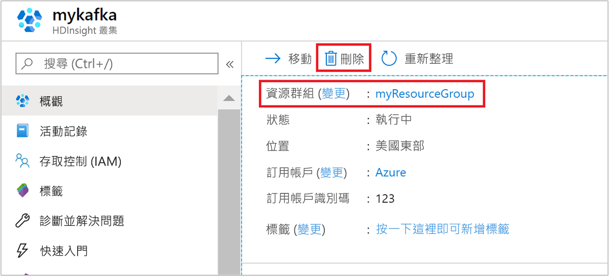

# <a name="quickstart-create-apache-kafka-cluster-in-azure-hdinsight-using-arm-template"></a>快速入門：在 Azure HDInsight 中使用 ARM 範本建立 Apache Kafka 叢集

在本快速入門中，您會使用 Azure Resource Manager 範本 (ARM 範本)，在 Azure HDInsight 中建立 [Apache Kafka](./apache-kafka-introduction.md) 叢集。 Kafka 是一個開放原始碼的分散式串流平台。 它通常會用來作為訊息代理程式，因為可以提供類似「發佈-訂閱」訊息佇列的功能。

[!INCLUDE [About Azure Resource Manager](../../../includes/resource-manager-quickstart-introduction.md)]

Kafka API 只能由同一個虛擬網路中的資源來存取。 在本快速入門中，您會使用 SSH 直接存取叢集。 若要將其他服務、網路或虛擬機器連線到 Kafka，您必須先建立虛擬網路，然後建立網路中的資源。 如需詳細資訊，請參閱[使用虛擬網路連線到 Apache Kafka](apache-kafka-connect-vpn-gateway.md) 文件。

如果您的環境符合必要條件，而且您很熟悉 ARM 範本，請選取 [部署至 Azure] 按鈕。 範本會在 Azure 入口網站中開啟。

[](https://portal.azure.com/#create/Microsoft.Template/uri/https%3A%2F%2Fraw.githubusercontent.com%2FAzure%2Fazure-quickstart-templates%2Fmaster%2F101-hdinsight-kafka%2Fazuredeploy.json)

## <a name="prerequisites"></a>必要條件

如果您沒有 Azure 訂用帳戶，請在開始前建立[免費帳戶](https://azure.microsoft.com/free/?WT.mc_id=A261C142F)。

## <a name="review-the-template"></a>檢閱範本

本快速入門中使用的範本是來自 [Azure 快速入門範本](https://azure.microsoft.com/resources/templates/101-hdinsight-kafka/)。

:::code language="json" source="~/quickstart-templates/101-hdinsight-kafka/azuredeploy.json":::

範本中定義了兩個 Azure 資源：

* [Microsoft.Storage/storageAccounts](/azure/templates/microsoft.storage/storageaccounts)：建立 Azure 儲存體帳戶。
* [Microsoft HDInsight/cluster](/azure/templates/microsoft.hdinsight/clusters)：建立 HDInsight 叢集。

## <a name="deploy-the-template"></a>部署範本

1. 選取下方的 [部署至 Azure] 按鈕來登入 Azure，並開啟 ARM 範本。

   [](https://portal.azure.com/#create/Microsoft.Template/uri/https%3A%2F%2Fraw.githubusercontent.com%2FAzure%2Fazure-quickstart-templates%2Fmaster%2F101-hdinsight-kafka%2Fazuredeploy.json)

1. 輸入或選取下列值：

    |屬性 |描述 |
    |---|---|
    |訂用帳戶|從下拉式清單中，選取用於此叢集的 Azure 訂用帳戶。|
    |資源群組|從下拉式清單中選取現有資源群組，或選取 [新建]。|
    |Location|此值會以資源群組所用的位置來自動填入。|
    |叢集名稱|輸入全域唯一名稱。 針對此範本，請只使用小寫字母和數字。|
    |叢集登入使用者名稱|提供使用者名稱，預設值為 **admin**。|
    |叢集登入密碼|提供密碼。 密碼長度至少必須為 10 個字元，且必須包含至少一個數字、一個大寫字母及一個小寫字母、一個非英數字元 (除了字元 ' " `)。 |
    |SSH 使用者名稱|提供使用者名稱，預設值為 **sshuser**|
    |SSH 密碼|請提供密碼。|

    

1. 檢閱**條款及條件**。 然後選取 [我同意上方所述的條款及條件]，然後選取 [購買]。 您會收到一則通知，內容指出您的部署正在進行中。 大約需要 20 分鐘的時間來建立叢集。

## <a name="review-deployed-resources"></a>檢閱已部署的資源

叢集建立好之後，您會收到**部署成功**通知，內有 [移至資源] 連結。 [資源群組] 頁面會列出新的 HDInsight 叢集以及與叢集相關聯的預設儲存體。 每個叢集都具備 [Azure 儲存體帳戶](../hdinsight-hadoop-use-blob-storage.md)或 [Azure Data Lake Storage 帳戶](../hdinsight-hadoop-use-data-lake-store.md)相依性。 也稱為預設儲存體帳戶。 HDInsight 叢集及其預設儲存體帳戶必須共置於相同的 Azure 區域中。 刪除叢集並不會刪除儲存體帳戶。

## <a name="get-the-apache-zookeeper-and-broker-host-information"></a>取得 Apache Zookeeper 和訊息代理程式主機資訊

使用 Kafka 時，您必須知道 Apache Zookeeper 主機和「訊息代理程式」主機。 這些主機可搭配 Kafka API 以及 Kafka 隨附的許多公用程式使用。

在本節中，您會從叢集上的 Ambari REST API 取得主機資訊。

1. 使用 [ssh 命令](../hdinsight-hadoop-linux-use-ssh-unix.md)來連線到您的叢集。 編輯以下命令並將 CLUSTERNAME 取代為您叢集的名稱，然後輸入命令：

    ```cmd
    ssh sshuser@CLUSTERNAME-ssh.azurehdinsight.net
    ```

1. 從 SSH 連線中，使用下列命令來安裝 `jq` 公用程式。 此公用程式可用來剖析 JSON 文件，而且在擷取主機資訊時很有用：

    ```bash
    sudo apt -y install jq
    ```

1. 若要將環境變數設為叢集名稱，請使用下列命令：

    ```bash
    read -p "Enter the Kafka on HDInsight cluster name: " CLUSTERNAME
    ```

    出現提示時，輸入 Kafka 叢集的名稱。

1. 若要使用 Zookeeper 主機資訊設定環境變數，請使用以下命令。 此命令會擷取所有的 Zookeeper 主機，然後只傳回前兩個項目。 這是因為考量備援之故，以防某一部主機無法連線。

    ```bash
    export KAFKAZKHOSTS=`curl -sS -u admin -G https://$CLUSTERNAME.azurehdinsight.net/api/v1/clusters/$CLUSTERNAME/services/ZOOKEEPER/components/ZOOKEEPER_SERVER | jq -r '["\(.host_components[].HostRoles.host_name):2181"] | join(",")' | cut -d',' -f1,2`
    ```

    出現提示時，輸入叢集登入帳戶 (不是 SSH 帳戶) 的密碼。

1. 若要確認是否已正確設定環境變數，請使用下列命令：

    ```bash
     echo '$KAFKAZKHOSTS='$KAFKAZKHOSTS
    ```

    此命令會傳回類似以下文字的資訊：

    `zk0-kafka.eahjefxxp1netdbyklgqj5y1ud.ex.internal.cloudapp.net:2181,zk2-kafka.eahjefxxp1netdbyklgqj5y1ud.ex.internal.cloudapp.net:2181`

1. 若要使用 Kafka 訊息代理程式主機資訊來設定環境變數，請使用下列命令：

    ```bash
    export KAFKABROKERS=`curl -sS -u admin -G https://$CLUSTERNAME.azurehdinsight.net/api/v1/clusters/$CLUSTERNAME/services/KAFKA/components/KAFKA_BROKER | jq -r '["\(.host_components[].HostRoles.host_name):9092"] | join(",")' | cut -d',' -f1,2`
    ```

    出現提示時，輸入叢集登入帳戶 (不是 SSH 帳戶) 的密碼。

1. 若要確認是否已正確設定環境變數，請使用下列命令：

    ```bash
    echo '$KAFKABROKERS='$KAFKABROKERS
    ```

    此命令會傳回類似以下文字的資訊：

    `wn1-kafka.eahjefxxp1netdbyklgqj5y1ud.cx.internal.cloudapp.net:9092,wn0-kafka.eahjefxxp1netdbyklgqj5y1ud.cx.internal.cloudapp.net:9092`

## <a name="manage-apache-kafka-topics"></a>管理 Apache Kafka 主題

Kafka 會將資料串流儲存於「主題」中。 您可以使用 `kafka-topics.sh` 公用程式來管理主題。

* **若要建立主題**，請在 SSH 連線中使用下列命令：

    ```bash
    /usr/hdp/current/kafka-broker/bin/kafka-topics.sh --create --replication-factor 3 --partitions 8 --topic test --zookeeper $KAFKAZKHOSTS
    ```

    此命令會使用 `$KAFKAZKHOSTS` 中儲存的主機資訊連線到 Zookeeper。 然後建立名為 **test** 的 Kafka 主題。

    * 此主題中所儲存的資料會分割到八個分割區。

    * 每個分割區都會在叢集中的三個背景工作節點之間進行複寫。

        如果您已在 Azure 區域中建立叢集來提供三個容錯網域，請使用複寫因子 3。 否則，使用複寫因子 4。
        
        在具有三個容錯網域的區域中，複寫因子 3 可讓複本散佈於容錯網域中。 在具有兩個容錯網域的區域中，複寫因子 4 會在網域中平均散佈複本。
        
        如需區域中的容錯網域數目的資訊，請參閱 [Linux 虛擬機器的可用性](../../virtual-machines/windows/manage-availability.md#use-managed-disks-for-vms-in-an-availability-set)文件。

        Kafka 不知道 Azure 容錯網域。 為主題建立副本時，可能無法正確發散副本以實現高可用性。

        若要確保高可用性，請使用 [Apache Kafka 分割重新平衡工具](https://github.com/hdinsight/hdinsight-kafka-tools)。 您必須從連往 Kafka 叢集前端節點的 SSH 連線來執行此工具。

        針對 Kafka 資料的最高可用性，您應該在下列情況中重新平衡主題的分割區複本：

        * 建立新主題或磁碟分割時

        * 擴大叢集時

* **若要列出主題**，請使用下列命令：

    ```bash
    /usr/hdp/current/kafka-broker/bin/kafka-topics.sh --list --zookeeper $KAFKAZKHOSTS
    ```

    此命令會列出可在 Kafka 叢集上使用的主題。

* **若要刪除主題**，請使用下列命令：

    ```bash
    /usr/hdp/current/kafka-broker/bin/kafka-topics.sh --delete --topic topicname --zookeeper $KAFKAZKHOSTS
    ```

    此命令會刪除名為 `topicname` 的主題。

    > [!WARNING]  
    > 如果您刪除先前建立的 `test` 主題，則必須加以重新建立。 本文件稍後的步驟會用到此主題。

如需 `kafka-topics.sh` 公用程式可用命令的詳細資訊，請使用下列命令：

```bash
/usr/hdp/current/kafka-broker/bin/kafka-topics.sh
```

## <a name="produce-and-consume-records"></a>產生和取用記錄

Kafka 會在主題中儲存「記錄」。 記錄是由「產生者」產生，並由「取用者」取用。 產生者與取用者會與「Kafka 訊息代理程式」服務進行通訊。 HDInsight 叢集中的每個背景工作節點都是一部 Kafka 訊息代理程式主機。

若要將記錄儲存至您稍早建立的 test 主題，然後利用取用者進行讀取，請使用下列步驟：

1. 若要將記錄寫入主題，請從 SSH 連線使用 `kafka-console-producer.sh` 公用程式：

    ```bash
    /usr/hdp/current/kafka-broker/bin/kafka-console-producer.sh --broker-list $KAFKABROKERS --topic test
    ```

    在此命令之後，您會抵達空白行。

1. 在空白行中輸入文字訊息並按一下 enter 鍵。 如此輸入幾個訊息，然後使用 **Ctrl + C** 返回一般提示。 每一行都會以個別記錄傳送至 Kafka 主題。

1. 若要從主題讀取記錄，請從 SSH 連線使用 `kafka-console-consumer.sh` 公用程式：

    ```bash
    /usr/hdp/current/kafka-broker/bin/kafka-console-consumer.sh --bootstrap-server $KAFKABROKERS --topic test --from-beginning
    ```

    此命令會擷取主題中的記錄並加以顯示。 使用 `--from-beginning` 告知取用者從串流的開頭開始，所以會擷取所有的記錄。

    如果您使用舊版 Kafka，請以 `--zookeeper $KAFKAZKHOSTS` 取代 `--bootstrap-server $KAFKABROKERS`。

1. 使用 __Ctrl + C__ 來停止取用者。

您也可以利用程式設計方式建立產生者和取用者。 如需使用此 API 的範例，請參閱[使用 Apache Kafka Producer 和 Consumer API 搭配 HDInsight](apache-kafka-producer-consumer-api.md) 文件。

## <a name="clean-up-resources"></a>清除資源

完成此快速入門之後，您可以刪除叢集。 利用 HDInsight，您的資料會儲存在 Azure 儲存體中，以便您在未使用叢集時安全地刪除該叢集。 您也需支付 HDInsight 叢集的費用 (即使未使用該叢集)。 由於叢集費用是儲存體費用的許多倍，所以刪除未使用的叢集符合經濟效益。

在 Azure 入口網站中瀏覽至您的叢集，然後選取 [刪除]。



您也可以選取資源群組名稱來開啟資源群組頁面，然後選取 [刪除資源群組]。 刪除資源群組時，會同時刪除 HDInsight 叢集及預設儲存體帳戶。

## <a name="next-steps"></a>後續步驟

在本快速入門中，您已了解如何使用 ARM 範本在 HDInsight 中建立 Apache Kafka 叢集。 在下篇文章中，您將了解如何建立應用程式，讓應用程式使用 Apache Kafka 串流 API，並且與 HDInsight 上的 Kafka 搭配使用。

> [!div class="nextstepaction"]
> [在 Azure HDInsight 中使用 Apache Kafka 串流 API](./apache-kafka-streams-api.md)
