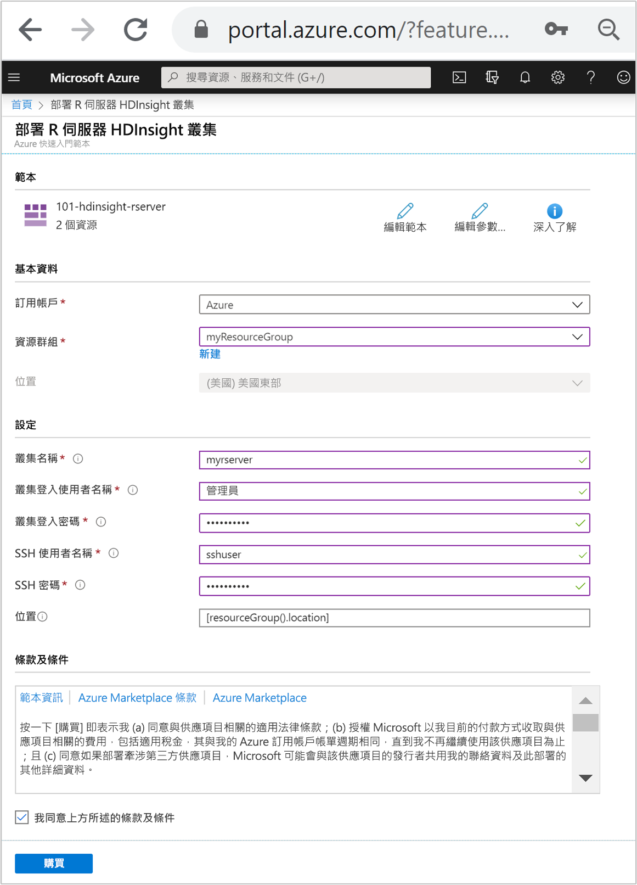
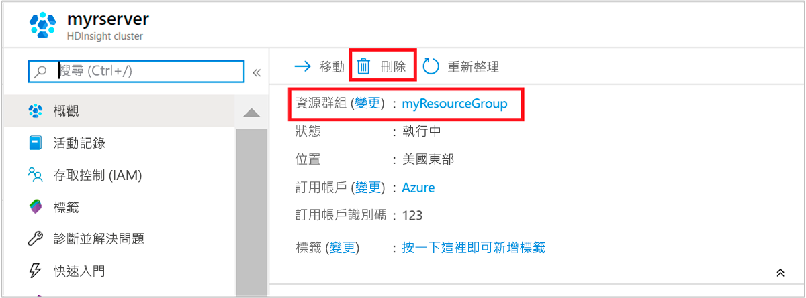

# 快速入門：使用 Resource Manager 範本在 Azure HDInsight 中建立 ML 服務叢集

在本快速入門中，您會使用 Azure Resource Manager 範本，在 Azure HDInsight 中建立 [ML 服務](./r-server-overview.md)叢集。 在 Azure 中建立 HDInsight 叢集時，可選擇 Microsoft Machine Learning Server 作為部署選項。 提供此選項的叢集類型稱為「ML 服務」。 這項功能可讓資料科學家、統計學家以及 R 程式設計人員隨其所需存取 HDInsight 上可調整大小的分散式分析方法。

[!INCLUDE [About Azure Resource Manager](../../../includes/resource-manager-quickstart-introduction.md)]

如果您沒有 Azure 訂用帳戶，請在開始前建立[免費帳戶](https://azure.microsoft.com/free/?WT.mc_id=A261C142F)。

## 建立 ML 服務叢集

### 檢閱範本

本快速入門中使用的範本是來自 [Azure 快速入門範本](https://github.com/Azure/azure-quickstart-templates/tree/master/101-hdinsight-rserver)。

:::code language="json" source="~/quickstart-templates/101-hdinsight-rserver/azuredeploy.json" range="1-171":::

範本中定義了兩個 Azure 資源：

* [Microsoft.Storage/storageAccounts](https://docs.microsoft.com/azure/templates/microsoft.storage/storageaccounts)：建立 Azure 儲存體帳戶。
* [Microsoft HDInsight/cluster](https://docs.microsoft.com/azure/templates/microsoft.hdinsight/clusters)：建立 HDInsight 叢集。

### 部署範本

1. 選取下方的 [部署至 Azure]  按鈕來登入 Azure，並開啟 Resource Manager 範本。

    

1. 輸入或選取下列值：

    |屬性 |描述 |
    |---|---|
    |訂用帳戶|從下拉式清單中，選取用於此叢集的 Azure 訂用帳戶。|
    |資源群組|從下拉式清單中選取現有資源群組，或選取 [新建]  。|
    |Location|此值會以資源群組所用的位置來自動填入。|
    |叢集名稱|輸入全域唯一名稱。 針對此範本，請只使用小寫字母和數字。|
    |叢集登入使用者名稱|提供使用者名稱，預設值為 **admin**。|
    |叢集登入密碼|提供密碼。 密碼長度至少必須為 10 個字元，且必須包含至少一個數字、一個大寫字母及一個小寫字母、一個非英數字元 (除了字元 ' " `)。 |
    |SSH 使用者名稱|提供使用者名稱，預設值為 sshuser|
    |SSH 密碼|請提供密碼。|

    

1. 檢閱**條款及條件**。 然後選取 [我同意上方所述的條款及條件]  ，然後選取 [購買]  。 您會收到一則通知，內容指出您的部署正在進行中。 大約需要 20 分鐘的時間來建立叢集。

## 檢閱已部署的資源

叢集建立好之後，您會收到**部署成功**通知，內有 [移至資源]  連結。 [資源群組] 頁面會列出新的 HDInsight 叢集以及與叢集相關聯的預設儲存體。 每個叢集都具備 [Azure 儲存體帳戶](../hdinsight-hadoop-use-blob-storage.md)或 [Azure Data Lake Storage 帳戶](../hdinsight-hadoop-use-data-lake-store.md)相依性。 也稱為預設儲存體帳戶。 HDInsight 叢集及其預設儲存體帳戶必須共置於相同的 Azure 區域中。 刪除叢集並不會刪除儲存體帳戶。

## 清除資源

完成此快速入門之後，您可以刪除叢集。 利用 HDInsight，您的資料會儲存在 Azure 儲存體中，以便您在未使用叢集時安全地刪除該叢集。 您也需支付 HDInsight 叢集的費用 (即使未使用該叢集)。 由於叢集費用是儲存體費用的許多倍，所以刪除未使用的叢集符合經濟效益。

在 Azure 入口網站中瀏覽至您的叢集，然後選取 [刪除]  。

您也可以選取資源群組名稱來開啟資源群組頁面，然後選取 [刪除資源群組]  。 刪除資源群組時，會同時刪除 HDInsight 叢集及預設儲存體帳戶。

## 後續步驟

在本快速入門中，您已了解如何使用 Resource Manager 範本在 HDInsight 中建立 ML 服務叢集。 在下一篇文章中，您將了解如何使用 RStudio Server 執行 R 指令碼，以示範如何使用 Spark 進行分散式 R 計算。

> [!div class="nextstepaction"]
> [使用 RStudio Server 對 Azure HDInsight 中的 ML 服務叢集執行 R 指令碼](./machine-learning-services-quickstart-job-rstudio.md)
