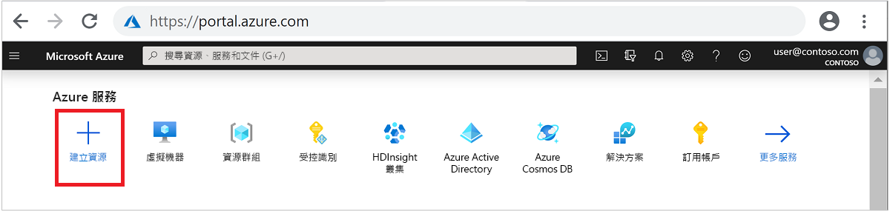
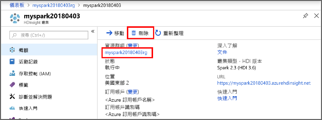

# <a name="quickstart-create-apache-spark-cluster-in-azure-hdinsight-using-azure-portal"></a>快速入門：使用 Azure 入口網站在 Azure HDInsight 中建立 Apache Spark 叢集

在本快速入門中，您會使用 Azure 入口網站在 Azure HDInsight 中建立 Apache Spark 叢集。 接著，您會建立 Jupyter Notebook，並將其用於對 Apache Hive 資料表執行 Spark SQL 查詢。 Azure HDInsight 是供企業使用的受控、全方位的開放原始碼分析服務。 適用於 HDInsight 的 Apache Spark 架構能夠運用記憶體內部處理，使得資料分析及叢集運算更為快速。 Jupyter Notebook 可讓您與資料互動、將程式碼與 Markdown 文字相結合，以及執行簡單的視覺效果。

如需可用設定的深入說明，請參閱[在 HDInsight 中設定叢集](../hdinsight-hadoop-provision-linux-clusters.md)。 如需如何使用入口網站來建立叢集的詳細資訊，請參閱[在入口網站中建立叢集](../hdinsight-hadoop-create-linux-clusters-portal.md)。

如果您同時使用多個叢集，您會想要建立虛擬網路，如果您使用的是 Spark 叢集，也會想要使用 Hive Warehouse Connector。 如需詳細資訊，請參閱[針對 Azure HDInsight 規劃虛擬網路](../hdinsight-plan-virtual-network-deployment.md)和[整合 Apache Spark 和 Apache Hive 與 Hive Warehouse Connector](../interactive-query/apache-hive-warehouse-connector.md)。

> [!IMPORTANT]  
> 不論使用與否，HDInsight 叢集都是按分鐘計費。 請務必在使用完叢集後將其刪除。 如需詳細資訊，請參閱本文的[清除資源](#clean-up-resources)一節。

## <a name="prerequisites"></a>Prerequisites

具有有效訂用帳戶的 Azure 帳戶。 [免費建立帳戶](https://azure.microsoft.com/free/?ref=microsoft.com&utm_source=microsoft.com&utm_medium=docs&utm_campaign=visualstudio)。

## <a name="create-an-apache-spark-cluster-in-hdinsight"></a>在 HDInsight 中建立 Apache Spark 叢集

您會使用 Azure 入口網站，建立使用 Azure 儲存體 Blob 作為叢集儲存體的 HDInsight 叢集。 如需有關如何使用 Data Lake Storage Gen2 的詳細資訊，請參閱[快速入門：在 HDInsight 中設定叢集](../../storage/data-lake-storage/quickstart-create-connect-hdi-cluster.md)。

1. 登入 [Azure 入口網站](https://portal.azure.com/)。

1. 在頂端功能表中，選取 [+ 建立資源]  。

    

1. 選取 [分析]   > [Azure HDInsight]  以移至 [建立 HDInsight 叢集]  頁面。

1. 在 [基本資料]  索引標籤中提供下列資訊：

    |屬性  |描述  |
    |---------|---------|
    |訂用帳戶  | 從下拉式清單中，選取用於此叢集的 Azure 訂用帳戶。 |
    |資源群組 | 從下拉式清單中選取現有資源群組，或選取 [新建]  。|
    |叢集名稱 | 輸入全域唯一名稱。|
    |區域   | 從下拉式清單中，選取要在其中建立叢集的區域。 |
    |叢集類型| 選取 [選取叢集類型] 以開啟清單。 從清單中選取 [Spark]  。|
    |叢集版本|一旦選取叢集類型，此欄位就會自動填入預設版本。|
    |叢集登入使用者名稱| 輸入叢集登入使用者名稱。  預設名稱為 **admin**。您稍後會在本快速入門中使用此帳戶來登入 Jupyter Notebook。 |
    |叢集登入密碼| 輸入叢集登入密碼。 |
    |安全殼層 (SSH) 使用者名稱| 輸入 SSH 使用者名稱。 針對本快速入門所使用的 SSH 使用者名稱是 **sshuser**。 根據預設，此帳戶會共用與「叢集登入使用者名稱」  帳戶相同的密碼。 |

    ![此螢幕擷取畫面顯示 [建立 H D 見解叢集]，並已選取 [基本] 索引標籤。](./media/apache-spark-jupyter-spark-sql-use-portal/azure-portal-cluster-basics-spark.png "在 HDInsight 中建立 Spark 叢集基本設定")

    完成時，選取 [下一步:  儲存體>>] 繼續前往 [儲存體]  頁面。

1. 在 [儲存體]  下方，提供下列值：

    |屬性  |描述  |
    |---------|---------|
    |主要儲存體類型|使用預設值 [Azure 儲存體]  。|
    |選取方法|使用預設值 [從清單中選取]  。|
    |主要儲存體帳戶|使用自動填入的值。|
    |容器|使用自動填入的值。|

    ![此螢幕擷取畫面顯示 [建立 H D 見解叢集]，並已選取 [儲存體] 索引標籤。](./media/apache-spark-jupyter-spark-sql-use-portal/azure-portal-cluster-storage.png "在 HDInsight 中建立 Spark 叢集基本設定")

    選取 [檢閱 + 建立]  繼續執行。

1. 在 [檢閱 + 建立]  底下，選取 [建立]  。 大約需要 20 分鐘的時間來建立叢集。 您必須先建立叢集，才能繼續前往下一個工作階段。

如果您在建立 HDInsight 叢集時遇到問題，可能是因為您沒有執行此動作的適當權限。 如需詳細資訊，請參閱[存取控制需求](../hdinsight-hadoop-customize-cluster-linux.md#access-control)。

## <a name="create-a-jupyter-notebook"></a>建立 Jupyter Notebook

Jupyter Notebook 是支援各種程式設計語言的互動式 Notebook 環境。 Notebook 可讓您與資料互動、將程式碼與 Markdown 文字相結合，並執行簡單的視覺效果。

1. 從網頁瀏覽器瀏覽至 `https://CLUSTERNAME.azurehdinsight.net/jupyter`，其中 `CLUSTERNAME` 是叢集的名稱。 出現提示時，輸入叢集的叢集登入認證。

1. 選取 [新增]   > [PySpark]  來建立 Notebook。

   

   新的 Notebook 隨即建立並以 Untitled(Untitled.pynb) 名稱開啟。

## <a name="run-apache-spark-sql-statements"></a>執行 Apache Spark SQL 陳述式

SQL (結構化查詢語言) 是最常見且廣泛使用的語言，可用於查詢及定義資料。 Spark SQL 可作為 Apache Spark 的擴充功能，可讓您使用熟悉的 SQL 語法來處理結構化資料。

1. 確認核心已就緒。 當您在 Notebook 中的核心名稱旁邊看到一個空心圓時，表示核心已準備就緒。 實心圓表示核心忙碌中。

    

    當您第一次啟動 Notebook 時，核心會在背景執行某些工作。 等待核心準備就緒。

1. 將以下程式碼貼入空白儲存格，然後按下 **SHIFT + ENTER** 鍵以執行此程式碼。 此命令會列出叢集上的 Hive 資料表：

    ```PySpark
    %%sql
    SHOW TABLES
    ```

    當您使用 Jupyter Notebook 搭配 HDInsight 叢集時，您可取得預設的 `sqlContext`，用來執行使用 Spark SQL 的 Hive 查詢。 `%%sql` 會告知 Jupyter Notebook 使用預設的 `sqlContext` 來執行 Hive 查詢。 此查詢會擷取 Hive 資料表 (**hivesampletable**) 中的前 10 個資料列，依預設所有 HDInsight 叢集均隨附該資料表。 大約需要 30 秒才能取得結果。 輸出看起來如下：

    

    每當您在 Jupyter 中執行查詢時，網頁瀏覽器視窗標題將會顯示 Notebook 標題和 **(忙碌)** 狀態。 您也會在右上角的 **PySpark** 文字旁看到一個實心圓。

1. 執行另一個查詢，以查看 `hivesampletable` 中的資料。

    ```PySpark
    %%sql
    SELECT * FROM hivesampletable LIMIT 10
    ```

    畫面應會重新整理以顯示查詢輸出。

    

1. 從 Notebook 的 [檔案]  功能表中，選取 [關閉並終止]  。 關閉 Notebook 可釋出叢集資源。

## <a name="clean-up-resources"></a>清除資源

HDInsight 會將您的資料儲存於 Azure 儲存體或 Azure Data Lake Storage 中，以便您在未使用叢集時安全地進行刪除。 您也需支付 HDInsight 叢集的費用 (即使未使用該叢集)。 由於叢集費用是儲存體費用的許多倍，所以刪除未使用的叢集符合經濟效益。 如果您打算立即進行[後續步驟](#next-steps)中所列的教學課程，則建議保留叢集。

切換回 Azure 入口網站，然後選取 [刪除]  。



您也可以選取資源群組名稱來開啟資源群組頁面，然後選取 [刪除資源群組]  。 刪除資源群組時，會同時刪除 HDInsight 叢集及預設儲存體帳戶。

## <a name="next-steps"></a>後續步驟

在本快速入門中，您已了解如何在 HDInsight 中建立 Apache Spark 叢集和執行基本的 Spark SQL 查詢。 前往下一個教學課程，以了解如何使用 HDInsight 叢集來執行範例資料的互動式查詢。

> [!div class="nextstepaction"]
> [在 Apache Spark 上執行互動式查詢](./apache-spark-load-data-run-query.md)
