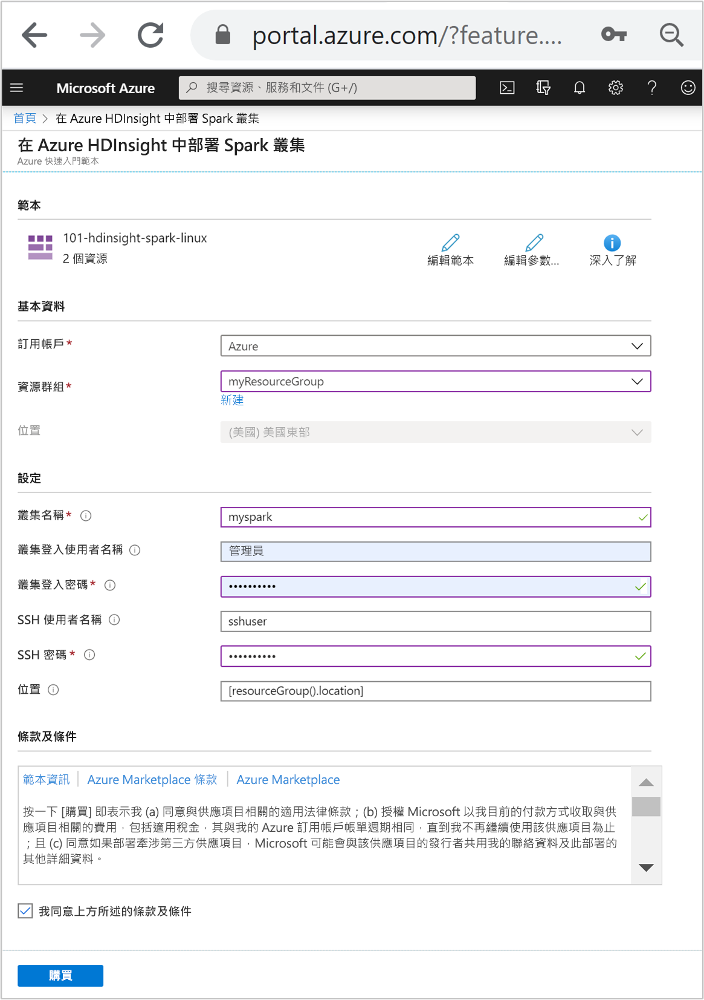

# <a name="quickstart-create-apache-spark-cluster-in-azure-hdinsight-using-arm-template"></a>快速入門：使用 ARM 範本在 Azure HDInsight 中建立 Apache Spark 叢集

在本快速入門中，您會使用 Azure Resource Manager 範本 (ARM 範本)，在 Azure HDInsight 中建立 [Apache Spark](./apache-spark-overview.md) 叢集。 接著，您會建立 Jupyter Notebook 檔案，並將其用於對 Apache Hive 資料表執行 Spark SQL 查詢。 Azure HDInsight 是供企業使用的受控、全方位的開放原始碼分析服務。 適用於 HDInsight 的 Apache Spark 架構能夠運用記憶體內部處理，使得資料分析及叢集運算更為快速。 Jupyter Notebook 可讓您與資料互動、將程式碼與 Markdown 文字相結合，以及執行簡單的視覺效果。

如果您同時使用多個叢集，您會想要建立虛擬網路，如果您使用的是 Spark 叢集，也會想要使用 Hive Warehouse Connector。 如需詳細資訊，請參閱[針對 Azure HDInsight 規劃虛擬網路](../hdinsight-plan-virtual-network-deployment.md)和[整合 Apache Spark 和 Apache Hive 與 Hive Warehouse Connector](../interactive-query/apache-hive-warehouse-connector.md)。

[!INCLUDE [About Azure Resource Manager](../../../includes/resource-manager-quickstart-introduction.md)]

如果您的環境符合必要條件，而且您很熟悉 ARM 範本，請選取 [部署至 Azure] 按鈕。 範本會在 Azure 入口網站中開啟。

[](https://portal.azure.com/#create/Microsoft.Template/uri/https%3A%2F%2Fraw.githubusercontent.com%2FAzure%2Fazure-quickstart-templates%2Fmaster%2F101-hdinsight-spark-linux%2Fazuredeploy.json)

## <a name="prerequisites"></a>必要條件

如果您沒有 Azure 訂用帳戶，請在開始前建立[免費帳戶](https://azure.microsoft.com/free/?WT.mc_id=A261C142F)。

## <a name="review-the-template"></a>檢閱範本

本快速入門中使用的範本是來自 [Azure 快速入門範本](https://azure.microsoft.com/resources/templates/101-hdinsight-spark-linux)。

:::code language="json" source="~/quickstart-templates/101-hdinsight-spark-linux/azuredeploy.json":::

範本中定義了兩個 Azure 資源：

* [Microsoft.Storage/storageAccounts](/azure/templates/microsoft.storage/storageaccounts)：建立 Azure 儲存體帳戶。
* [Microsoft HDInsight/cluster](/azure/templates/microsoft.hdinsight/clusters)：建立 HDInsight 叢集。

## <a name="deploy-the-template"></a>部署範本

1. 選取下方的 [部署至 Azure] 按鈕來登入 Azure，並開啟 ARM 範本。

    [](https://portal.azure.com/#create/Microsoft.Template/uri/https%3A%2F%2Fraw.githubusercontent.com%2FAzure%2Fazure-quickstart-templates%2Fmaster%2F101-hdinsight-spark-linux%2Fazuredeploy.json)

1. 輸入或選取下列值：

    |屬性 |描述 |
    |---|---|
    |訂用帳戶|從下拉式清單中，選取用於此叢集的 Azure 訂用帳戶。|
    |資源群組|從下拉式清單中選取現有資源群組，或選取 [新建]。|
    |Location|此值會以資源群組所用的位置來自動填入。|
    |叢集名稱|輸入全域唯一名稱。 針對此範本，請只使用小寫字母和數字。|
    |叢集登入使用者名稱|提供使用者名稱，預設值為 **admin**。|
    |叢集登入密碼|提供密碼。 密碼長度至少必須為 10 個字元，且必須包含至少一個數字、一個大寫字母及一個小寫字母、一個非英數字元 (除了字元 ' " `)。 |
    |SSH 使用者名稱|提供使用者名稱，預設值為 **sshuser**|
    |SSH 密碼|請提供密碼。|

    

1. 檢閱 **條款及條件**。 然後選取 [我同意上方所述的條款及條件]，然後選取 [購買]。 您會收到一則通知，內容指出您的部署正在進行中。 大約需要 20 分鐘的時間來建立叢集。

如果您在建立 HDInsight 叢集時遇到問題，可能是因為您沒有執行此動作的適當權限。 如需詳細資訊，請參閱[存取控制需求](../hdinsight-hadoop-customize-cluster-linux.md#access-control)。

## <a name="review-deployed-resources"></a>檢閱已部署的資源

叢集建立好之後，您會收到 **部署成功** 通知，內有 [移至資源] 連結。 [資源群組] 頁面會列出新的 HDInsight 叢集以及與叢集相關聯的預設儲存體。 每個叢集都具備 [Azure 儲存體](../hdinsight-hadoop-use-blob-storage.md)、[Azure Data Lake Storage Gen1](../hdinsight-hadoop-use-data-lake-storage-gen1.md) 或 [`Azure Data Lake Storage Gen2`](../hdinsight-hadoop-use-data-lake-storage-gen2.md) 相依性。 也稱為預設儲存體帳戶。 HDInsight 叢集及其預設儲存體帳戶必須共置於相同的 Azure 區域中。 刪除叢集並不會刪除儲存體帳戶相依性。 也稱為預設儲存體帳戶。 HDInsight 叢集及其預設儲存體帳戶必須共置於相同的 Azure 區域中。 刪除叢集並不會刪除儲存體帳戶。

## <a name="create-a-jupyter-notebook-file"></a>建立 Jupyter 筆記本檔案

[Jupyter Notebook](https://jupyter.org/) 是支援各種程式設計語言的互動式 Notebook 環境。 您可以使用 Jupyter Notebook 檔案來與資料互動、將程式碼與 Markdown 文字相結合，以及執行簡單的視覺效果。

1. 開啟 [Azure 入口網站](https://portal.azure.com)。

2. 選取 [HDInsight 叢集]，然後選取您所建立的叢集。

    

3. 從入口網站的 [叢集儀表板] 區段，選取 [Jupyter Notebook]。 出現提示時，輸入叢集的叢集登入認證。

   

4. 選取 [新增] > [PySpark] 來建立 Notebook。

   

   新的 Notebook 隨即建立並以 Untitled(Untitled.pynb) 名稱開啟。

## <a name="run-apache-spark-sql-statements"></a>執行 Apache Spark SQL 陳述式

SQL (結構化查詢語言) 是最常見且廣泛使用的語言，可用於查詢及轉換資料。 Spark SQL 可作為 Apache Spark 的擴充功能，可讓您使用熟悉的 SQL 語法來處理結構化資料。

1. 確認核心已就緒。 當您在 Notebook 中的核心名稱旁邊看到一個空心圓時，表示核心已準備就緒。 實心圓表示核心忙碌中。

    

    當您第一次啟動 Notebook 時，核心會在背景執行某些工作。 等待核心準備就緒。

1. 將以下程式碼貼入空白儲存格，然後按下 **SHIFT + ENTER** 鍵以執行此程式碼。 此命令會列出叢集上的 Hive 資料表：

    ```sql
    %%sql
    SHOW TABLES
    ```

    當您使用 Jupyter Notebook 檔案搭配 HDInsight 叢集時，您可取得預設的 `spark` 工作階段，用來執行使用 Spark SQL 的 Hive 查詢。 `%%sql` 會告知 Jupyter Notebook 使用預設的 `spark` 工作階段來執行 Hive 查詢。 此查詢會擷取 Hive 資料表 (**hivesampletable**) 中的前 10 個資料列，依預設所有 HDInsight 叢集均隨附該資料表。 第一次提交查詢時，Jupyter 會建立 Notebook 的 Spark 應用程式。 大約需要 30 秒才能完成。 Spark 應用程式準備就緒後，查詢便會在大約一秒內執行，並產生結果。 輸出看起來如下：

    

    每當您在 Jupyter 中執行查詢時，網頁瀏覽器視窗標題將會顯示 Notebook 標題和 **(忙碌)** 狀態。 您也會在右上角的 **PySpark** 文字旁看到一個實心圓。

1. 執行另一個查詢，以查看 `hivesampletable` 中的資料。

    ```sql
    %%sql
    SELECT * FROM hivesampletable LIMIT 10
    ```

    畫面應會重新整理以顯示查詢輸出。

    

1. 從 Notebook 的 [檔案]  功能表中，選取 [關閉並終止]  。 關閉 Notebook 可釋出叢集資源，包括 Spark 應用程式。

## <a name="clean-up-resources"></a>清除資源

完成此快速入門之後，您可以刪除叢集。 利用 HDInsight，您的資料會儲存在 Azure 儲存體中，以便您在未使用叢集時安全地刪除該叢集。 您也需支付 HDInsight 叢集的費用 (即使未使用該叢集)。 由於叢集費用是儲存體費用的許多倍，所以刪除未使用的叢集符合經濟效益。

在 Azure 入口網站中瀏覽至您的叢集，然後選取 [刪除]。


您也可以選取資源群組名稱來開啟資源群組頁面，然後選取 [刪除資源群組]  。 刪除資源群組時，會同時刪除 HDInsight 叢集及預設儲存體帳戶。

## <a name="next-steps"></a>後續步驟

在本快速入門中，您已了解如何在 HDInsight 中建立 Apache Spark 叢集和執行基本的 Spark SQL 查詢。 前往下一個教學課程，以了解如何使用 HDInsight 叢集來執行範例資料的互動式查詢。

> [!div class="nextstepaction"]
> [在 Apache Spark 上執行互動式查詢](./apache-spark-load-data-run-query.md)
