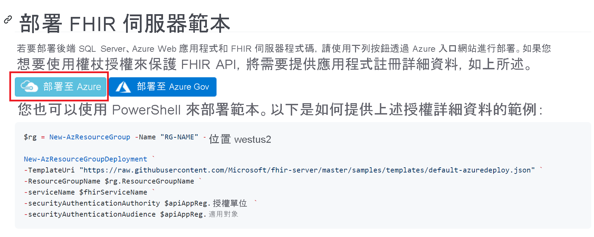
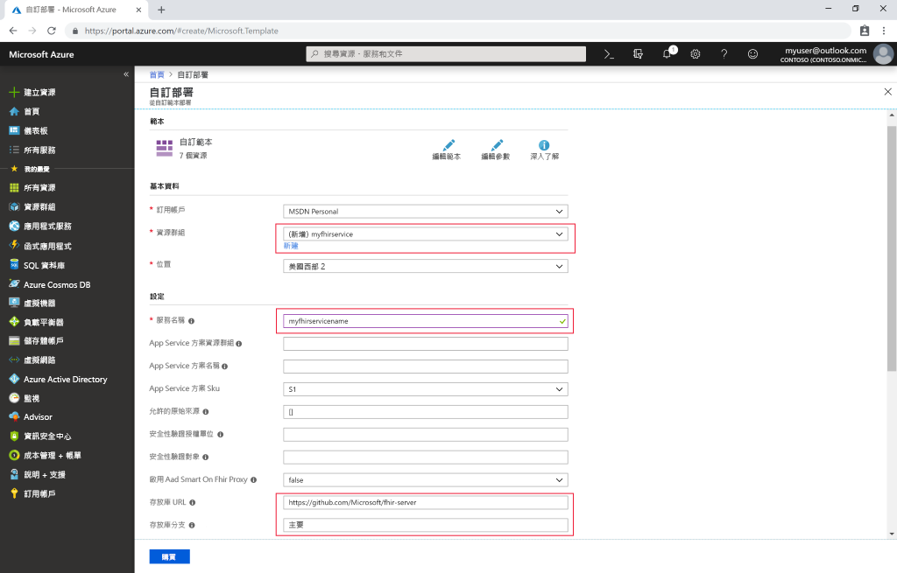

# 快速入門：使用 Azure 入口網站部署開放原始碼 FHIR 伺服器

在本快速入門中，您將了解如何使用 Azure 入口網站在 Azure 中部署開放原始碼 FHIR 伺服器。 我們將在[開放原始碼存放庫](https://github.com/Microsoft/fhir-server)中使用簡單的部署連結

如果您沒有 Azure 訂用帳戶，請在開始前建立[免費帳戶](https://azure.microsoft.com/free/?WT.mc_id=A261C142F)。

## GitHub 開放原始碼存放庫

瀏覽至 [GitHub 部署頁面](https://github.com/Microsoft/fhir-server/blob/master/docs/DefaultDeployment.md)並找出 [部署至 Azure] 按鈕：

按一下部署按鈕，Azure 入口網站隨即開啟。

## 填入部署參數

選擇建立新的資源群組並賦予其名稱。 只有其他必要參數是服務的名稱。

請注意，部署會直接從 GitHub 上的開放原始碼存放庫提取原始程式碼。 如果您已對存放庫進行分支處理，則可指向您自有和特定分支。

填入詳細資料之後，您就可以開始部署。

## 確認 FHIR 伺服器正在執行

部署完成後，您就可以將瀏覽器指向 `https://SERVICENAME.azurewebsites.net/metadata` 以取得功能陳述式。 這需要一分鐘左右的時間，伺服器才會第一次回應。

## 清除資源

若不再需要，您可以刪除資源群組及所有相關資源。 若要這麼做，請選取包含已佈建資源的資源群組，選取 [刪除資源群組]****，然後確認要刪除的資源群組名稱。

## 後續步驟

在本教學課程中，您已將適用於 Azure 的 Microsoft 開放原始碼 FHIR 伺服器部署至您的訂用帳戶。 若要了解如何使用 Postman 存取 FHIR API，請繼續進行 Postman 教學課程。
 
>[!div class="nextstepaction"]
>[使用 Postman 存取 FHIR API](access-fhir-postman-tutorial.md)