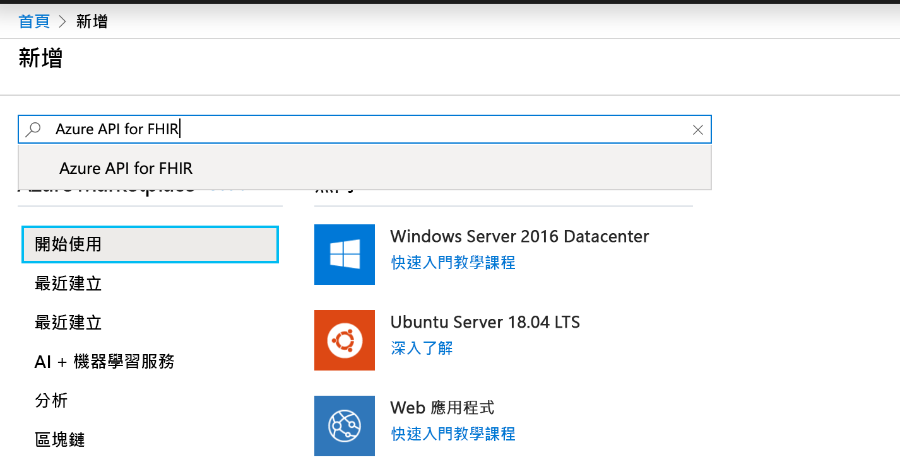
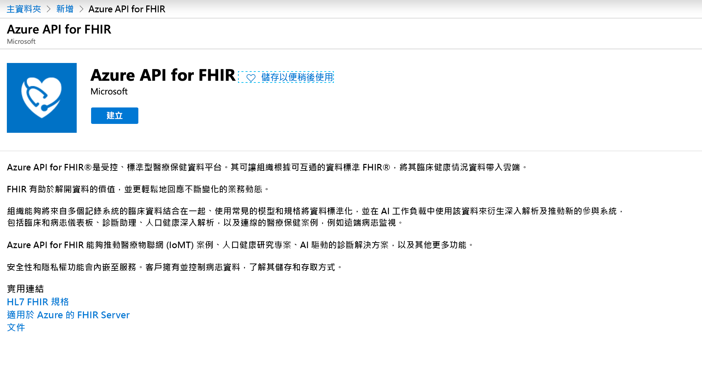
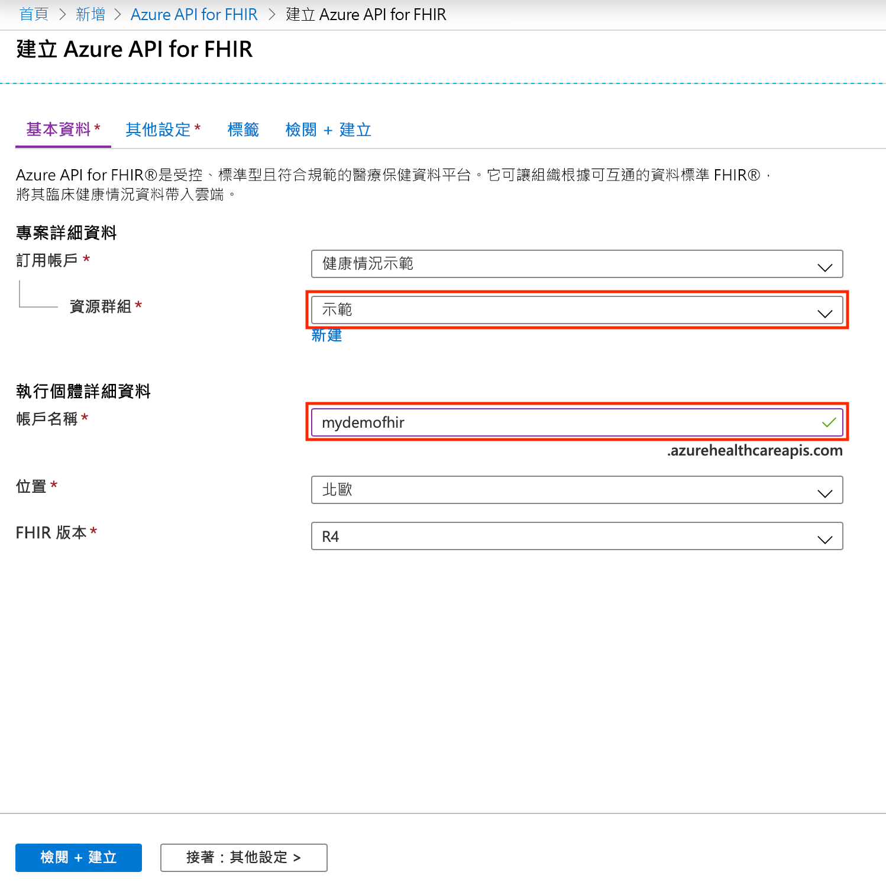

# 快速入門：使用 Azure 入口網站部署 Azure API for FHIR

在本快速入門中，您將了解如何使用 Azure 入口網站部署 Azure API for FHIR。

如果您沒有 Azure 訂用帳戶，請在開始前建立[免費帳戶](https://azure.microsoft.com/free/?WT.mc_id=A261C142F)。

## 建立新資源

開啟 [Azure 入口網站](https://portal.azure.com)，然後按一下 [建立資源]****。

## 搜尋 Azure API for FHIR

您可以在搜尋方塊中輸入 "FHIR" 來尋找 Azure API for FHIR：

## 建立 Azure API for FHIR 帳戶

選取 [建立]**** 以建立新的 Azure API for FHIR 帳戶：

## 輸入帳戶詳細資料

選取現有的資源群組或建立新的資源群組，選擇帳戶的名稱，最後按一下 [檢閱 + 建立]****：

確認建立並等待 FHIR API 部署。

## 其他設定

按一下 **[下一步**其他設定] 以設定應獲准存取此 Azure API for FHIR 的授權單位、對象、身分識別物件識別碼，視需要啟用 SMART on FHIR，以及設定資料庫輸送量：

- **授權單位：** 您可以指定與您登入為服務的驗證授權單位不同的 Azure AD 租用戶。
- **對象：** 最佳做法和預設設定，是將對象設定為 FHIR 伺服器的 URL。 您可以在此進行變更。 對象可識別適用權杖的收件者。 在此內容中，應將其設定為代表 FHIR API 本身的項目。
- **允許的物件識別碼：** 您可以指定應獲准存取此 Azure API for FHIR 的身分識別物件識別碼。 您可以在[尋找身分識別物件識別碼](find-identity-object-ids.md)操作指南中，深入了解如何尋找使用者和服務主體的物件識別碼。  
- **Smart On FHIR Proxy：** 您可以啟用 SMART on FHIR Proxy。 如需如何設定 Azure API for FHIR v的詳細資訊，請參閱教學課程 [Azure API for FHIR SMART on FHIR Proxy](https://docs.microsoft.com/azure/healthcare-apis/use-smart-on-fhir-proxy)  
- **佈建的輸送量 (RU/秒)：** 您可以在此為 Azure API for FHIR 指定基礎資料庫的輸送量設定。 您稍後可以在 [資料庫] 刀鋒視窗中變更此設定。 如需詳細資訊，請參閱[設定資料庫設定](configure-database.md)頁面。

## 擷取 FHIR API 功能陳述式

若要驗證是否已佈建新的 FHIR API 帳戶，請將瀏覽器指向 `https://<ACCOUNT-NAME>.azurehealthcareapis.com/metadata`，以擷取功能陳述式。

## 清除資源

若不再需要，您可以刪除資源群組、Azure API for FHIR 和所有相關資源。 若要這麼做，請選取包含 Azure API for FHIR 帳戶的資源群組，選取 [刪除資源群組]****，然後確認要刪除的資源群組名稱。

## 後續步驟

在本快速入門手冊中，您已將 Azure API for FHIR 部署至您的訂用帳戶。 若要在 Azure API for FHIR 中設定其他設定，請繼續進行其他設定操作指南。

>[!div class="nextstepaction"]
>[Azure API for FHIR 中的其他設定](azure-api-for-fhir-additional-settings.md)
