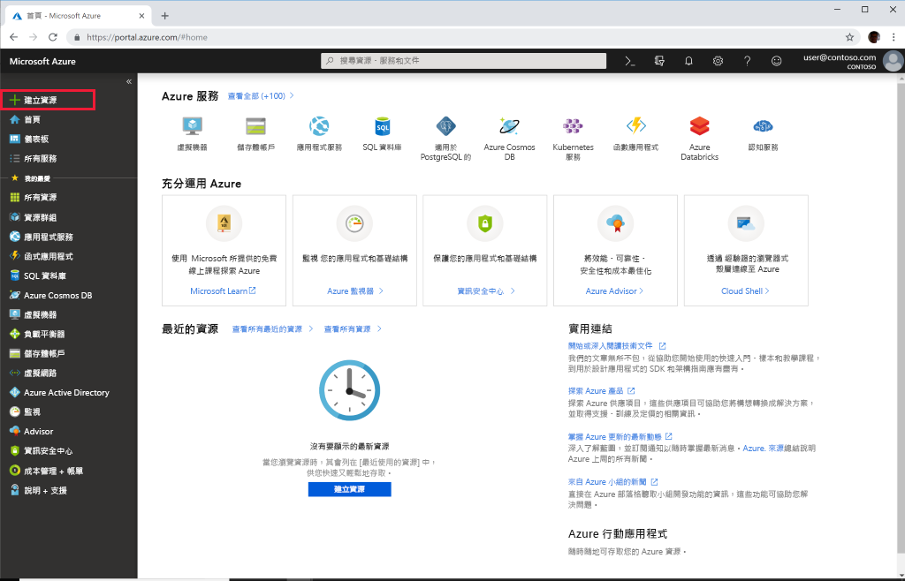

# 快速入門：使用 Azure 入口網站部署 Azure API for FHIR

在本快速入門中，您將了解如何使用 Azure 入口網站部署 Azure API for FHIR。

如果您沒有 Azure 訂用帳戶，請在開始前建立[免費帳戶](https://azure.microsoft.com/free/?WT.mc_id=A261C142F)。

## 建立新資源

開啟 [Azure 入口網站](https://portal.azure.com)，然後按一下 [建立資源]****。

## 搜尋 Azure API for FHIR

您可以在搜尋方塊中輸入 "FHIR" 來尋找 Azure API for FHIR：

:::image type="content" source="media/quickstart-paas-portal/portal-search-healthcare-apis.png" alt-text="搜尋健康照護 API":::

## 建立 Azure API for FHIR 帳戶

選取 [建立]**** 以建立新的 Azure API for FHIR 帳戶：

:::image type="content" source="media/quickstart-paas-portal/portal-create-healthcare-apis.png" alt-text="搜尋健康照護 API":::

## 輸入帳戶詳細資料

選取現有的資源群組或建立新的資源群組，選擇帳戶的名稱，最後按一下 [檢閱 + 建立]****：

:::image type="content" source="media/quickstart-paas-portal/portal-new-healthcareapi-details.png" alt-text="搜尋健康照護 API":::

確認建立並等待 FHIR API 部署。

## 其他設定 (選擇性)

您也可以按 [下一步:其他設定] 來檢視驗證設定。 Azure API for FHIR 的預設設定是要[使用 Azure RBAC 來指派資料平面角色](configure-azure-rbac.md)。 在此模式中設定時，FHIR 服務的「授權單位」將會設定為訂用帳戶的 Azure Active Directory 租用戶：

:::image type="content" source="media/rbac/confirm-azure-rbac-mode-create.png" alt-text="搜尋健康照護 API":::

請注意，用於輸入允許物件識別碼的方塊會呈現灰色，因為我們在此案例中使用 Azure RBAC 來設定角色指派。

如果您想要將 FHIR 服務設定為使用外部或次要 Azure Active Directory 租用戶，則可以變更授權單位，並為應該允許存取伺服器的使用者和群組輸入物件識別碼。 如需詳細資訊，請參閱[本機 RBAC 設定](configure-local-rbac.md)指南。

## 擷取 FHIR API 功能陳述式

若要驗證是否已佈建新的 FHIR API 帳戶，請將瀏覽器指向 `https://<ACCOUNT-NAME>.azurehealthcareapis.com/metadata`，以擷取功能陳述式。

## 清除資源

若不再需要，您可以刪除資源群組、Azure API for FHIR 和所有相關資源。 若要這麼做，請選取包含 Azure API for FHIR 帳戶的資源群組，選取 [刪除資源群組]****，然後確認要刪除的資源群組名稱。

## 後續步驟

在本快速入門手冊中，您已將 Azure API for FHIR 部署至您的訂用帳戶。 若要在 Azure API for FHIR 中設定其他設定，請繼續進行其他設定操作指南。

>[!div class="nextstepaction"]
>[Azure API for FHIR 中的其他設定](azure-api-for-fhir-additional-settings.md)
