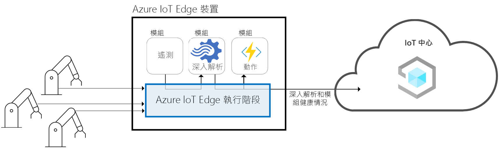
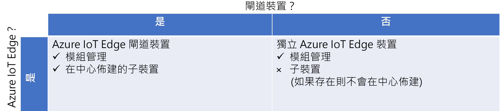
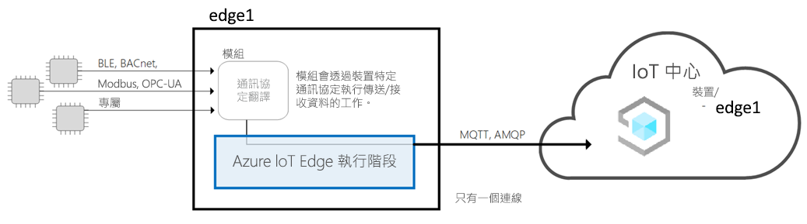
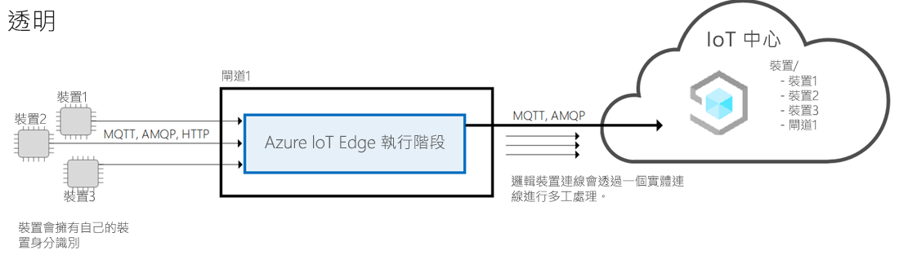
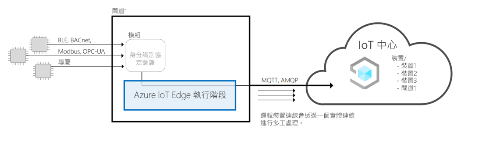
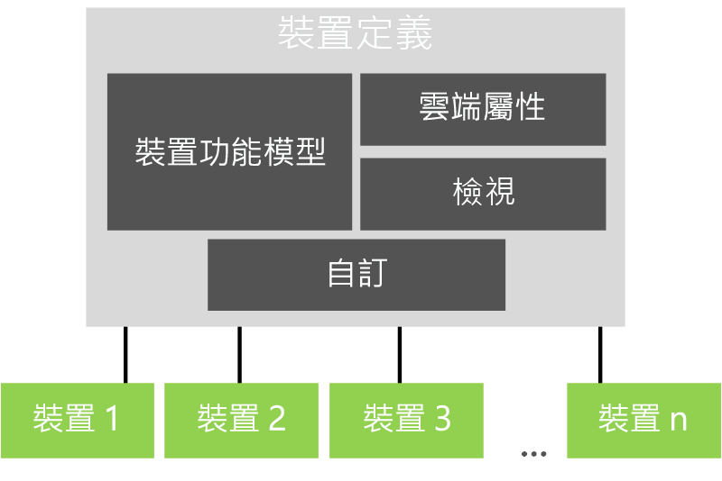

# Azure IoT 中心架構

本文提供 Microsoft Azure IoT 中心架構的概觀。

## 裝置

與 Azure IoT 中心應用程式交換資料的裝置。 裝置可以︰

- 傳送遙測等量值。
- 同步處理您應用程式的設定。

在 Azure IoT Central 中，可和您應用程式交換的裝置資料是在裝置範本中定義。 如需裝置範本的詳細資訊，請參閱[中繼資料管理](#metadata-management)。

若要深入了解如何將裝置連線到 Azure IoT 中心應用程式，請參閱[裝置連線能力](concepts-get-connected.md)。

## Azure IoT Edge 裝置

如同使用 [Azure IoT SDK](https://github.com/Azure/azure-iot-sdks) 建立的裝置，您也可以將 [Azure IoT Edge 裝置](../../iot-edge/about-iot-edge.md)連線到 IoT Central 應用程式。 IoT Edge 可讓您直接在由 IoT Central 管理的 IoT 裝置上執行雲端智慧和自訂邏輯。 IoT Edge 執行階段可讓您：

- 在裝置上安裝和更新工作負載。
- 維護裝置上 IoT Edge 的安全性標準。
- 確定 IoT Edge 模組始終在執行。
- 將模組健康情況報告至雲端，以便進行遠端監控。
- 管理下游分葉裝置與 IoT Edge 裝置之間、IoT Edge 裝置上的模組之間，以及 IoT Edge 裝置與雲端之間的通訊。

IoT Central 啟用 IoT Edge 裝置的下列功能：

- 描述 IoT Edge 裝置功能的裝置範本，例如：
  - 部署資訊清單上傳功能，可協助您管理一群裝置的資訊清單。
  - 在 IoT Edge 裝置上執行的模組。
  - 每個模組傳送的遙測。
  - 每個模組所報告的屬性。
  - 每個模組所回應的命令。
  - IoT Edge 閘道裝置與下游裝置之間的關聯性。
  - 未儲存在 IoT Edge 裝置上的雲端屬性。
  - 屬於 IoT Central 應用程式一部分的自訂、儀表板和表單。

  如需詳細資訊，請參閱將 [Azure IoT Edge 裝置連線至 Azure IoT Central 應用程式](./concepts-iot-edge.md) 文章。

- 使用 Azure IoT 裝置布建服務大規模布建 IoT Edge 裝置的能力
- 規則和動作。
- 自訂儀表板和分析。
- 從 IoT Edge 裝置的遙測資料連續匯出。

### IoT Edge 裝置類型

IoT Central 分類 IoT Edge 裝置類型，如下所示：

- 分葉裝置。 IoT Edge 裝置可以有下游分葉裝置，但不會在 IoT Central 中布建這些裝置。
- 具有下游裝置的閘道裝置。 閘道裝置和下游裝置都會佈建在 IoT Central 中

### IoT Edge 模式

IoT Central 支援下列 IoT Edge 裝置模式：

#### IoT Edge 為分葉裝置

IoT Edge 裝置會布建在 IoT Central 中，而任何下游裝置和其遙測都會以來自 IoT Edge 裝置的形式表示。 未在 IoT Central 中布建連線到 IoT Edge 裝置的下游裝置。

#### 使用身分識別連線到下游裝置 IoT Edge 閘道裝置

IoT Edge 裝置會在 IoT Central 中布建，以及連線到 IoT Edge 裝置的下游裝置。 目前不支援透過閘道布建下游裝置的執行時間支援。

#### 使用 IoT Edge 閘道所提供的身分識別連線到下游裝置 IoT Edge 閘道裝置

IoT Edge 裝置會在 IoT Central 中布建，以及連線到 IoT Edge 裝置的下游裝置。 目前不支援對下游裝置提供身分識別和布建下游裝置的執行時間支援。 如果您攜帶自己的身分識別轉譯模組，IoT Central 可以支援此模式。

## 雲端閘道

Azure IoT 中心使用 Azure IoT 中樞作為裝置連線的雲端閘道。 IoT 中樞可讓您︰

- 在雲端大規模擷取資料。
- 裝置管理。
- 安全的裝置連線能力。

若要深入了解 IoT 中樞，請參閱 [Azure IoT 中樞](../../iot-hub/index.yml)。

若要深入了解 Azure IoT 中心的裝置連線能力，請參閱[裝置連線能力](concepts-get-connected.md)。

## 資料存放區

Azure IoT 中心會在雲端儲存應用程式資料。 儲存的應用程式資料包括：

- 裝置範本。
- 裝置身分識別。
- 裝置中繼資料。
- 使用者和角色資料。

Azure IoT 中心會使用時間序列來儲存您的裝置所傳送的量值資料。 分析服務會使用裝置的時間序列資料。

## 分析

分析服務負責產生應用程式顯示的自訂報告資料。 操作者可以[自訂分析](howto-create-analytics.md) (適用於應用程式中顯示的分析)。 分析服務是以 [Azure 時間序列深入解析](https://azure.microsoft.com/services/time-series-insights/)為基礎，可處理您的裝置所傳送的量值資料。

## 執行和動作

[規則和動作](tutorial-create-telemetry-rules.md)會密切搭配運作，讓應用程式內的工作自動化。 建置者可以根據裝置遙測定義規則，例如超過所定義閾值的溫度。 Azure IoT 中心會使用資料流處理器來判斷何時符合規則條件。 符合規則條件時，就會觸發建置者所定義的動作。 例如，動作可以傳送一封電子郵件來通知工程師，裝置的溫度過高。

## 中繼資料管理

在 Azure IoT 中心應用程式中，裝置範本可定義各類型裝置的行為與功能。 例如，冰箱裝置範本可指定冰箱傳送給應用程式的遙測。

在 IoT Central [裝置範本](concepts-device-templates.md) 中包含：

- **裝置模型**，用來指定裝置的功能，例如它所傳送的遙測資料、定義裝置狀態的屬性，以及裝置所回應的命令。 裝置功能會組織成一或多個介面。
- **雲端屬性** 會為裝置指定 IoT Central 存放區的屬性。 這些屬性只會儲存在 IoT Central 中，而且永遠不會傳送到裝置。
- **Views** 會指定產生器所建立的儀表板和表單，讓操作員能夠監視和管理裝置。
- **自訂** 可讓 builder 覆寫裝置模型中的某些定義，使其更符合 IoT Central 應用程式的關聯。

根據每個裝置範本，應用程式可以有一或多個模擬與真實裝置。

## 資料匯出

在 Azure IoT Central 應用程式中，您可以將 [資料持續匯出](howto-export-data.md) 至自己的 Azure 事件中樞和 Azure 服務匯流排實例。 您也可以定期將資料匯出至 Azure Blob 儲存體帳戶。 IoT Central 可以匯出度量、裝置和裝置範本。

## Batch 裝置更新

在 Azure IoT Central 應用程式中，您可以 [建立及執行作業](howto-run-a-job.md) 來管理已連線的裝置。 這些作業可讓您對裝置屬性或設定進行大量更新，或執行命令。 例如，您可以建立工作來增加多部冷藏自動販賣機器的風扇速度。

## 角色型存取控制 (RBAC)

每個 IoT Central 應用程式都有自己的內建 RBAC 系統。 [系統管理員可以](howto-manage-users-roles.md)使用其中一個預先定義的角色，或藉由建立自訂角色，來定義 Azure IoT Central 應用程式的存取規則。 角色會決定使用者可存取的應用程式區域，以及他們可以執行的動作。

## 安全性

Azure IoT 中心內的安全性功能包括：

- 資料在傳送過程及待用期間都會予以加密。
- 驗證會經由 Azure Active Directory 或 Microsoft 帳戶提供。 支援雙因素驗證。
- 完整租用戶隔離。
- 裝置層級安全性。

## UI Shell

UI Shell 是現代化、回應式、HTML5 瀏覽器型應用程式。
系統管理員可以藉由套用自訂主題和修改說明連結來自訂應用程式的 UI，以指向您自己的自訂說明資源。 若要深入瞭解 UI 自訂，請參閱 [自訂 AZURE IOT CENTRAL ui](howto-customize-ui.md) 文章。

操作員可以建立個人化的應用程式儀表板。 您可以具有多個顯示不同資料的儀表板，並在它們之間進行切換。

## 後續步驟

既然您已瞭解 Azure IoT Central 的架構，建議的下一個步驟是瞭解 Azure IoT Central 中的 [裝置連線能力](concepts-get-connected.md) 。