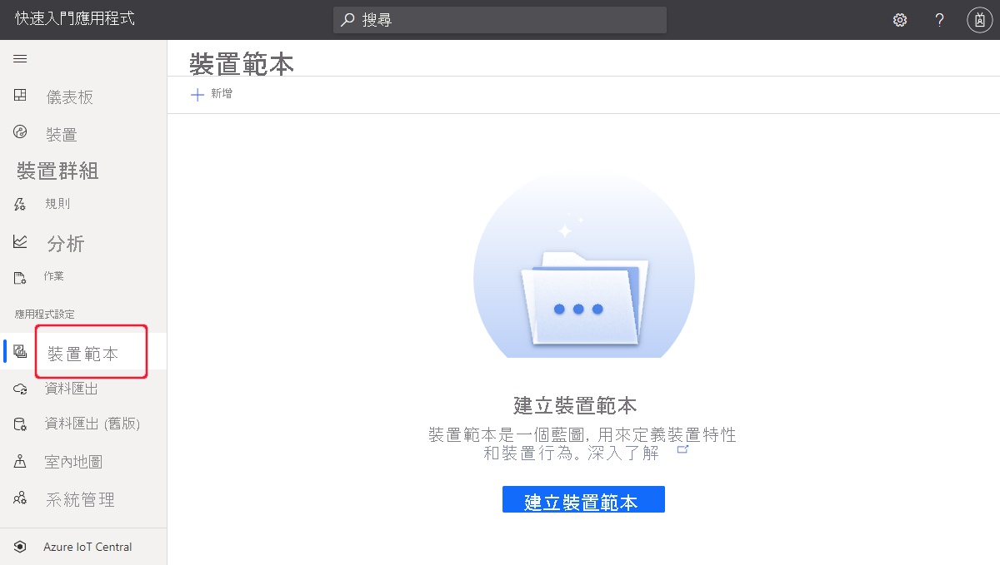
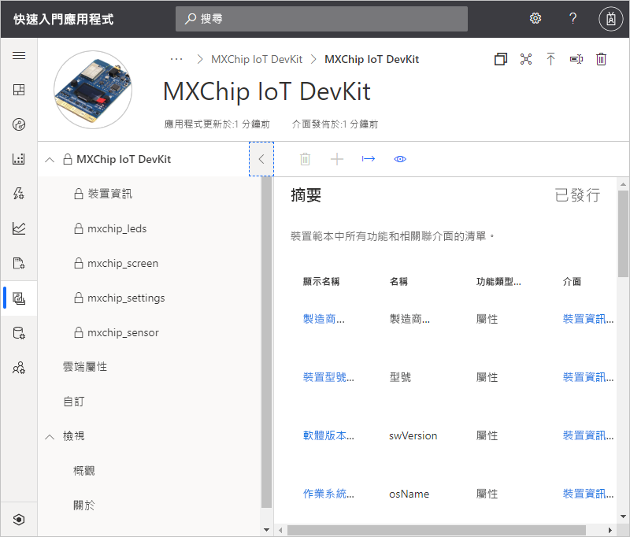
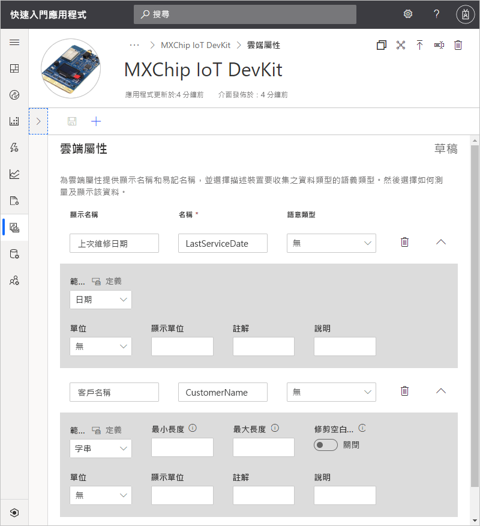
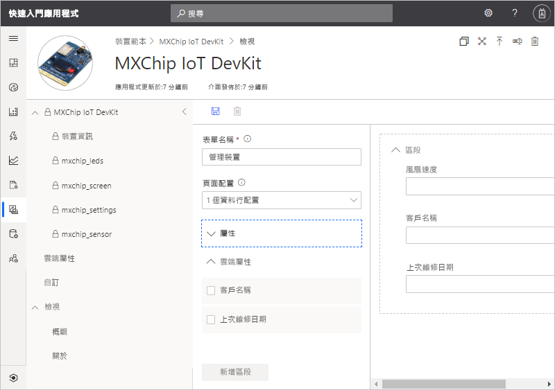
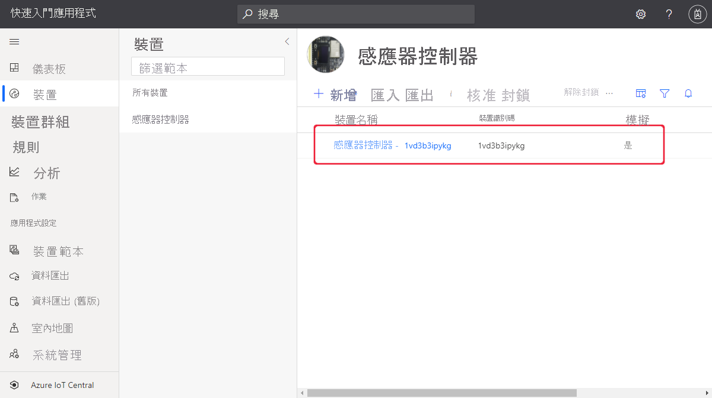
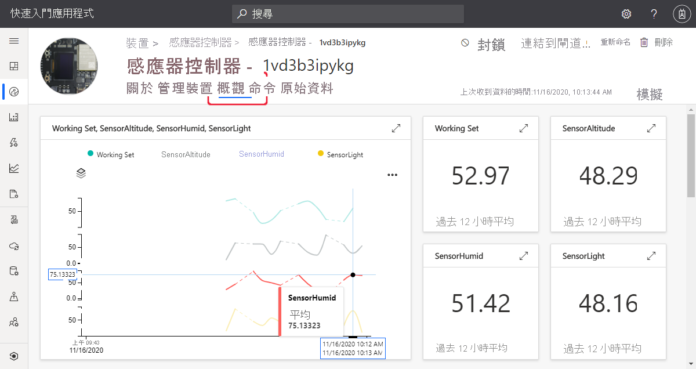
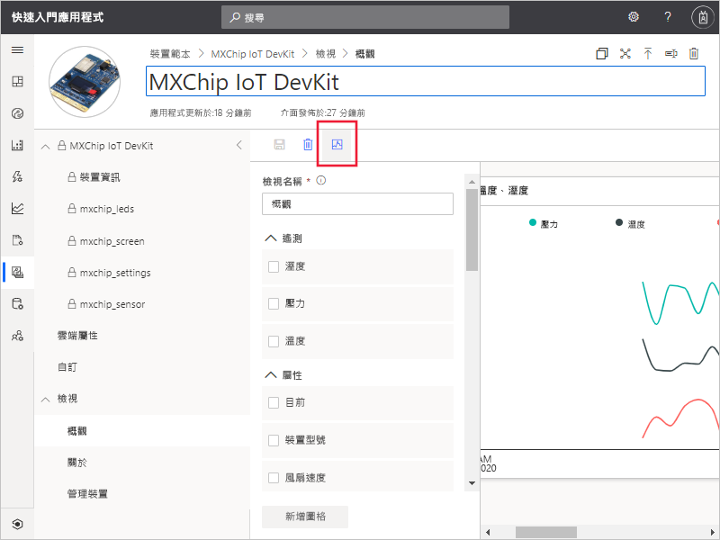

# 快速入門：將模擬裝置新增至 IoT Central 應用程式

*本文適用於操作員、建置員及系統管理員。*

裝置範本會為連線至 IoT Central 應用程式的裝置定義功能。 這些功能包括裝置傳送的遙測資料、裝置屬性，以及裝置所回應的命令。 建置者或操作員可從裝置範本將實際和模擬的裝置新增至應用程式。 模擬裝置可讓您在連線實際裝置之前先測試應用程式的行為。

在本快速入門中，您會新增 MXChip IoT DevKit  (DevKit) 面板的裝置範本，並建立模擬裝置。 若要完成本快速入門，您不需要實際的裝置，而是使用模擬裝置。 DevKit 裝置：

* 傳送遙測資料，例如溫度。
* 報告裝置特定屬性，例如亮度層級。
* 回應命令，例如開啟和關閉。
* 報告一般裝置屬性，例如裝置的韌體版本和序號。

## Prerequisites

完成[建立 Azure IoT Central 應用程式](./quick-deploy-iot-central.md)快速入門，以使用 [自訂應用程式] > [自訂應用程式]  範本建立 IoT Central 應用程式。

## 建立範本

身為建置者，您可以在 IoT Central 應用程式中建立和編輯裝置範本。 發佈裝置範本之後，您可以產生模擬裝置，或從裝置範本連線實際的裝置。 模擬裝置可讓您在連線實際裝置之前先測試您應用程式的行為。

若要將新的裝置範本新增至應用程式，請選取左側窗格上的 [裝置範本]  索引標籤。

裝置範本包含裝置功能模型，其可定義裝置所傳送的遙測、裝置屬性，以及裝置所回應的命令。

### 新增裝置功能模型

有數個選項可用來在 IoT Central 應用程式中新增裝置功能模型。 您可以從頭開始建立模型、從檔案匯入模型，或從裝置目錄選取裝置。 IoT Central 也支援「裝置優先」  方法，其會在裝置第一次連線時自動從存放庫匯入模型。 在本快速入門中，您會從裝置目錄中選擇裝置，以匯入其裝置功能模型。

下列步驟示範如何使用裝置目錄來匯入 **MXChip IoT DevKit** 裝置的功能模型。 這些裝置會將遙測資料 (例如溫度) 傳送至您的應用程式：

1. 若要新增裝置範本，請選取 [裝置範本]  頁面上的 **+** 。

1. 在 [選取範本類型]  頁面上，向下捲動直到您找到 **MXChip IoT DevKit** 圖格為止。

1. 選取 **MXChip IoT DevKit** 圖格，然後選取 [下一步:  自訂]。

1. 在 [檢閱]  頁面上，選取 [建立]  。

1. 幾秒鐘後，您可以看到新的裝置範本：

    

    MXChip IoT DevKit 功能模型包含 **mxchip_sensor** 、 **mxchip_settings** 和 [裝置資訊]  等介面。 介面會定義 MXChip IoT DevKit 裝置的功能。 這些功能包括裝置傳送的遙測資料、裝置所報告的屬性，以及裝置所回應的命令。

### 新增雲端屬性

裝置範本可包含雲端屬性。 雲端屬性僅存在於 IoT Central 應用程式中，且一律不會傳送至或接收自裝置。 若要新增雲端屬性：

1. 依序選取 [雲端屬性]  和 [+ 新增雲端屬性]  。 請使用下表中的資訊，將兩個雲端屬性新增至您的裝置範本：

    | 顯示名稱      | 語意類型 | 結構描述 |
    | ----------------- | ------------- | ------ |
    | 上次維修日期 | None          | Date   |
    | 客戶名稱     | None          | String |

1. 選取 [儲存]  以儲存變更：

    

## 檢視

身為建置者，您可以自訂應用程式，以對操作員顯示裝置相關資訊。 您的自訂將使操作員能夠管理已連線至應用程式的裝置。 您可以建立兩種類型的檢視，讓操作員用來與裝置互動：

* 用於檢視及編輯裝置和雲端屬性的表單。
* 用來視覺化裝置的儀表板，包括其所傳送的遙測。

### 預設檢視

產生檢視是開始將重要裝置資訊視覺化的快速方式。 您最多可以為裝置範本產生三個預設檢視：

* [命令]  檢視可讓您的操作員將命令分派至裝置。
* [概觀]  檢視會使用圖表和計量來顯示裝置遙測資料。
* [關於]  檢視會顯示裝置屬性。

在裝置範本中選取 [檢視]  節點。 您可以看到，當您新增範本時，IoT Central 會為您產生 [概觀]  和 [檢視]  。

若要新增 [管理裝置]  表單，讓操作員可用來管理裝置：

1. 選取 [檢視]  節點，然後選取 [編輯裝置和雲端資料]  圖格來新增檢視。

1. 將表單名稱變更為 [管理裝置]  。

1. 選取 [客戶名稱]  和 [上次服務日期]  雲端屬性，以及 [風扇速度]  屬性。 然後選取 [新增區段]  ：

    

1. 選取 [儲存]  以儲存您的新表單。

## 發佈裝置範本

您必須先發佈裝置範本，才能建立模擬裝置，或連線實際的裝置。 雖然 IoT Central 在您第一次建立範本時便發佈範本，但您必須發佈更新的版本。

若要發佈裝置範本：

1. 從 [裝置範本]  頁面移至您的裝置範本。

1. 選取 [發佈]  ：

    

1. 在 [將此裝置範本發佈至應用程式]  對話方塊上，選取 [發佈]  。 

在您發佈裝置範本之後，其會顯示在 [裝置]  頁面上。 在已發佈的裝置範本中，您無法直接編輯裝置功能模型而不建立新版本。 不過，您可以直接在已發佈的裝置範本中更新雲端屬性、自訂和檢視，而無須進行版本控制。 進行任何變更之後，請選取 [發佈]  ，將這些變更推送給您的操作員。

## 新增模擬裝置

若要將模擬裝置新增至應用程式，您可使用您所建立的 [MXChip IoT DevKit]  裝置範本。

1. 若要以操作員的身分新增裝置，請選擇左窗格中的 [裝置]  。 [裝置]  索引標籤會顯示 [所有裝置]  和 [MXChip IoT DevKit]  裝置範本。 選取 [MXChip IoT DevKit]  。

1. 若要新增模擬的 DevKit 裝置，請選取 **+** 。 使用建議的 **裝置識別碼** 或輸入您自己的識別碼。 裝置識別碼可以包含字母、數字和 `-` 字元。 您也可以輸入新裝置的名稱。 確定 [模擬]  切換開關已切換為 [開啟]  ，然後選取 [建立]  。

    

現在，您可以與建置者使用模擬資料為裝置範本建立的檢視進行互動：

1. 在 [裝置] 頁面上選取您的模擬裝置

    * [概觀]  檢視會顯示模擬遙測的繪圖：

        

    * [關於]  會顯示屬性值，包括您新增到檢視的雲端屬性。

    * [命令]  檢視可讓您執行命令，例如在裝置上 **閃爍** 。

    * [管理裝置]  檢視是您為操作員所建立的表單，可用來管理裝置。

    * [未經處理資料] 檢視可讓您檢視裝置所傳送的原始遙測和屬性值。 此檢視有助於偵錯裝置。

## 使用模擬裝置來改善檢視

在您建立新的模擬裝置之後，建置者可以使用此裝置繼續改善及建置裝置範本的檢視。

1. 選擇左窗格中的 [裝置範本]  ，然後選取 [MXChip IoT DevKit]  範本。

1. 選取您要編輯的任何檢視，或建立新的檢視。 選取 [設定預覽裝置]  ，然後按 [從執行中的裝置選取]  。 在此，您可選擇沒有預覽裝置、針對測試所設定的實際裝置，或您已新增至 IoT Central 的現有裝置。

1. 在清單中選擇您的模擬裝置。 然後，選取 [套用]  。 現在，您可以在裝置範本檢視建置體驗中看到相同的模擬裝置。 此檢視適用於圖表和其他視覺效果。

    

## 後續步驟

在本快速入門中，您已了解如何建立 [MXChip IoT DevKit]  裝置範本，並將模擬裝置新增至應用程式。

若要深入了解如何監視連線至應用程式的裝置，請繼續進行下列快速入門：

> [!div class="nextstepaction"]
> [設定規則和動作](./quick-configure-rules.md)
