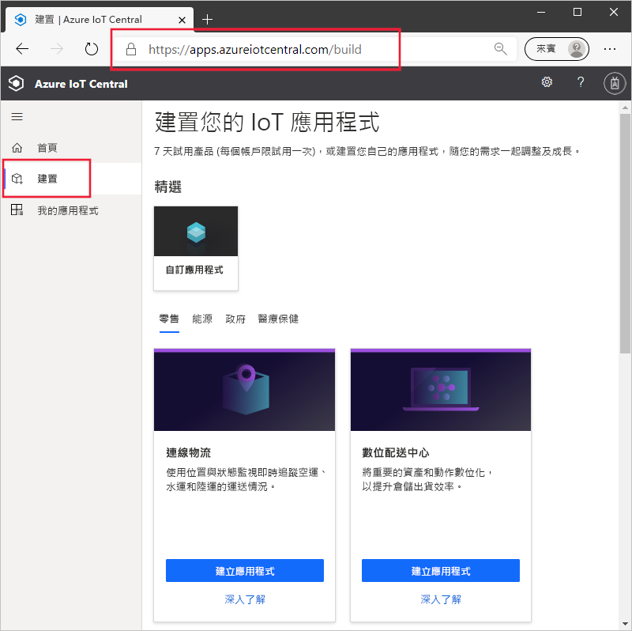
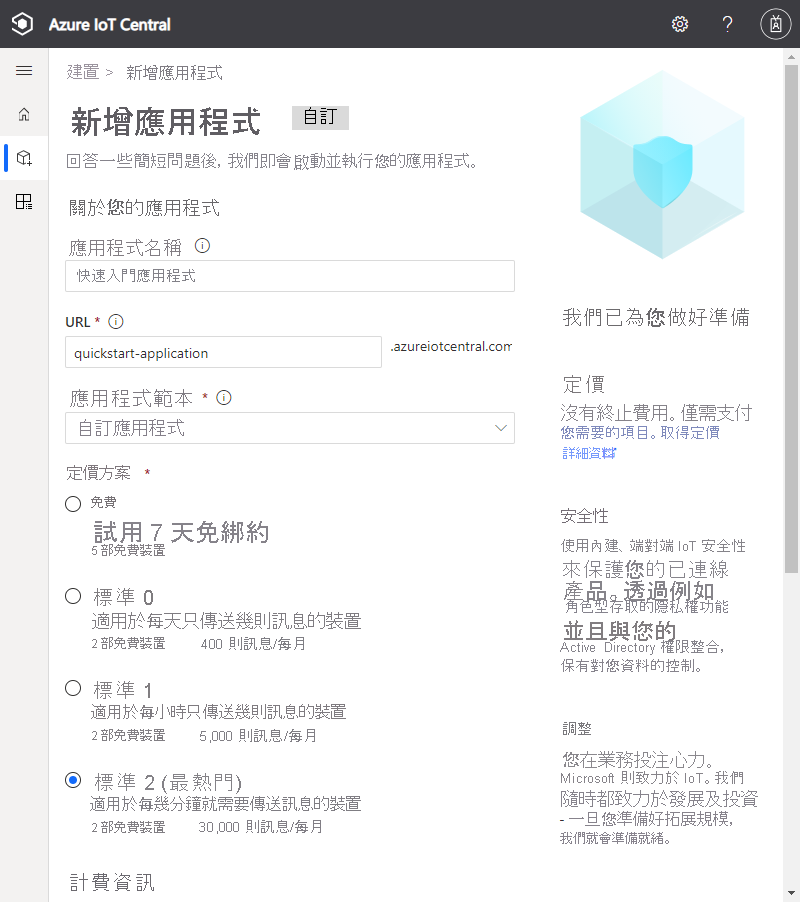
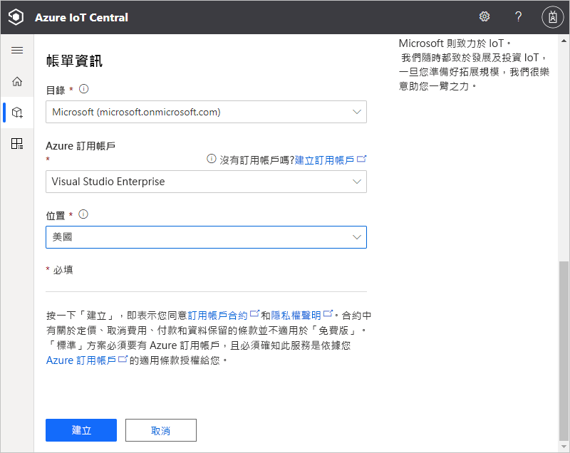
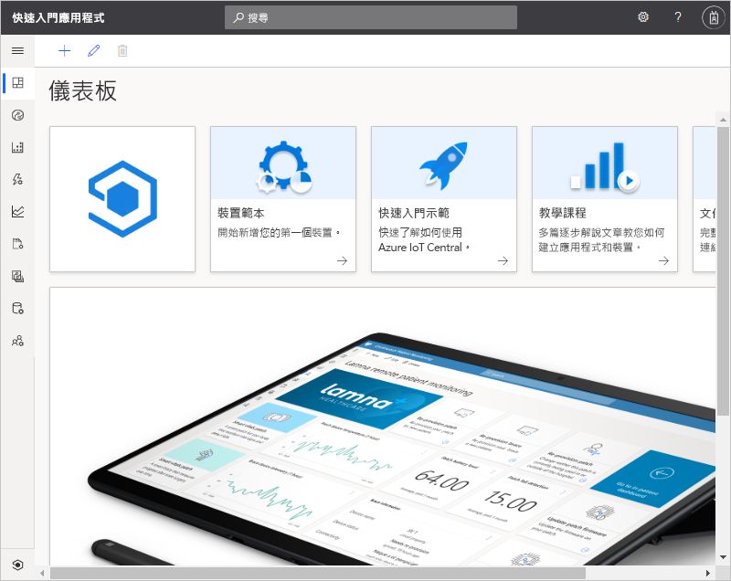

# 建立 Azure IoT Central 應用程式

本快速入門說明如何建立 Azure IoT Central 應用程式。

## 建立應用程式

瀏覽至 [Azure IoT Central 組建](https://aka.ms/iotcentral)網站。 然後，使用 Microsoft 的個人、公司或學校帳戶登入。

您可以從產業相關的 IoT Central 範本清單建立新的應用程式，以便快速開始使用，或使用**自訂應用程式**範本從頭開始建立。 在本快速入門中，您會使用**自訂應用程式**範本。

若要從**自訂應用程式**範本建立新的 Azure IoT Central 應用程式：

1. 瀏覽至 [建置]  頁面：

    

1. 選擇 [自訂應用程式]  ，然後確定已選取 [自訂應用程式]  範本。

1. Azure IoT Central 會根據您所選取的應用程式範本自動建議**應用程式名稱**。 您可以使用此名稱，或自行輸入易記的應用程式名稱。

1. Azure IoT Central 也會根據應用程式名稱，為您產生唯一的**應用程式 URL** 前置詞。 您可以使用此 URL 來存取應用程式。 依個人需求將其變更為更好記的 URL 前置詞。

    

    

    > [!NOTE]
    > 如果您在上一頁選擇 [自訂應用程式]  ，就會看到 [應用程式範本]  下拉式清單。 在這裡，您可以在自訂和舊版範本之間進行切換。 您可能也會看到已提供給您的組織的其他範本。

1. 選擇使用 7 天免費試用定價方案或其中一個標準定價方案來建立此應用程式：

    - 使用「免費」  方案建立的應用程式可以免費試用七天，且最多可支援五個裝置。 您可以在到期前，隨時將其轉換為使用標準定價方案。
    - 您使用「標準」  方案建立的應用程式會根據每個裝置來計費，您可以選擇**標準 1** 或**標準 2** 定價方案，而且前兩個裝置免費。 若要深入了解免費和標準定價方案，請參閱 [Azure IoT Central 定價頁面](https://azure.microsoft.com/pricing/details/iot-central/)。 如果您使用標準定價方案來建立應用程式，則必須選取 [目錄]  、[Azure 訂用帳戶]  和 [位置]  ：
        - [目錄]  是您用來建立應用程式的 Azure Active Directory。 Azure Active Directory 包含使用者身分識別、認證和其他組織資訊。 如果您沒有 Azure Active Directory，系統會在您建立 Azure 訂用帳戶時為您建立一個租用戶。
        - *Azure 訂用帳戶*可讓您建立 Azure 服務執行個體。 IoT Central 會在您的訂用帳戶中佈建資源。 如果您沒有 Azure 訂用帳戶，則可以在 [Azure 註冊頁面](https://aka.ms/createazuresubscription)上免費建立一個。 建立 Azure 訂用帳戶之後，請瀏覽回到 [新增應用程式]  頁面。 新的訂用帳戶現在會出現在 [Azure 訂用帳戶]  下拉式清單中。
        - [位置]  是您要在其中建立應用程式的[地理位置](https://azure.microsoft.com/global-infrastructure/geographies/)。 一般而言，您應選擇實際上與您的裝置最接近的位置，以取得最佳效能。 選擇位置後，就無法再將應用程式移到不同的位置。

1. 檢閱條款和條件，然後選取頁面底部的 [建立]  。 幾分鐘後，IoT Central 應用程式便已準備好而可供使用：

    

## 後續步驟

在本快速入門中，您已建立 IoT Central 應用程式。 以下是繼續學習 IoT Central 的建議後續步驟：

> [!div class="nextstepaction"]
> [將模擬裝置新增至 IoT Central 應用程式](./quick-create-simulated-device.md)

如果您是裝置開發人員，而且想要深入了解一些程式碼，建議的後續步驟是：
> [!div class="nextstepaction"]
> [建立用戶端應用程式並將其連線到您的 Azure IoT Central 應用程式](./tutorial-connect-device-nodejs.md)
