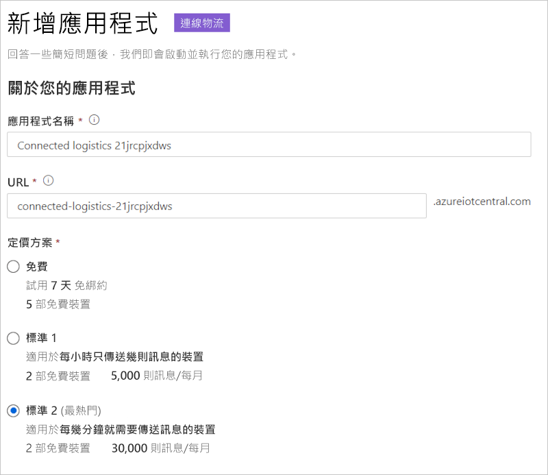

# 教學課程：部署並逐步執行聯網物流應用程式範本

此教學課程示範如何開始 IoT Central「聯網物流」應用程式範本。 您會了解如何部署和使用範本。

在本教學課程中，您會了解如何：

> [!div class="checklist"]
> * 建立聯網物流應用程式。
> * 使用應用程式中的主要功能。
> * 使用 [儀表板] 以顯示重要的物流裝置操作活動。
> * 使用裝置範本
> * 遵循規則
> * 使用作業

## 必要條件

* 部署此應用程式不需要特定的先決條件。
* 您可以使用免費定價方案，或使用 Azure 訂用帳戶。

## 建立聯網物流應用程式

使用下列步驟來建立應用程式：

1. 瀏覽至 [Azure IoT Central 組建](https://aka.ms/iotcentral)網站。 然後，使用 Microsoft 的個人、公司或學校帳戶登入。 從左側導覽列選取 [建置]，然後選取 [零售] 索引標籤：

    :::image type="content" source="media/tutorial-iot-central-connected-logistics/iotc-retail-homepage.png" alt-text="聯網物流範本":::

2. 在 [聯網物流應用程式] 底下，選取 [建立應用程式]。

3. [建立應用程式] 會開啟 [新增應用程式] 表單。 輸入下列詳細資料：

    * **應用程式名稱**：您可以使用建議的預設名稱，或輸入易記應用程式名稱。
    * **URL**：您可以使用建議的預設 URL，或輸入易記且獨特的 URL。 接下來，若您已經有 Azure 訂用帳戶，將建議預設設定。 您可以從 7 天免費試用定價方案開始，並隨時在免費試用到期之前選擇轉換成標準定價方案。
    * **帳單資訊**：您需要目錄、Azure 訂用帳戶和區域詳細資料，才能佈建資源。
    * **建立**：選取頁面底部的 [建立]，以部署您的應用程式。

    :::image type="content" source="media/tutorial-iot-central-connected-logistics/connected-logistics-app-create.png" alt-text="聯網物流範本":::

    :::image type="content" source="media/tutorial-iot-central-connected-logistics/connected-logistics-app-create-billinginfo.png" alt-text="聯網物流範本":::

## 逐步執行應用程式

以下螢幕擷取畫面顯示如何選取聯網物流應用程式範本。

> [!div class="mx-imgBorder"]
> 

下列各節將逐步解說應用程式的主要功能。

### 儀表板

部署應用程式範本之後，您的預設儀表板是以聯網物流操作員為主的入口網站。 Northwind Trader 是一家虛構的物流業者，負責管理海運船隊和陸運車隊。 在此儀表板中，您會看到兩個不同的閘道，其中提供有關出貨的遙測資料，以及相關聯命令、作業和動作。

> [!div class="mx-imgBorder"]
> 

> [!div class="mx-imgBorder"]
> 

此儀表板已預先設定來展示重要的物流裝置操作活動。

儀表板會啟用兩個不同的閘道裝置管理操作：

* 檢視卡車運送的物流路線，以及海運運送的位置詳細資料。
* 檢視閘道狀態與其他相關資訊。

:::image type="content" source="media/tutorial-iot-central-connected-logistics/connected-logistics-dashboard1.png" alt-text="聯網物流範本":::

* 您可以追蹤閘道、作用中和未知標籤的總數。
* 您可以執行裝置管理操作，例如：更新韌體、停用和啟用感應器、更新感應器閾值、更新遙測間隔，以及更新裝置服務合約。
* 檢視裝置電池耗用量。

:::image type="content" source="media/tutorial-iot-central-connected-logistics/connected-logistics-dashboard2.png" alt-text="聯網物流範本":::

#### 裝置範本

選取 [裝置範本] 以查看閘道功能模型。 功能模型會以 [閘道遙測和屬性] 和 [閘道命令] 介面來結構化。

**閘道遙測和屬性** - 此介面會定義與感應器、位置和裝置資訊相關的所有遙測。 介面也會定義裝置對應項屬性功能，例如感應器閾值和更新間隔。

:::image type="content" source="media/tutorial-iot-central-connected-logistics/connected-logistics-devicetemplate1.png" alt-text="聯網物流範本":::

**閘道命令** - 此介面會組織所有閘道命令功能：

:::image type="content" source="media/tutorial-iot-central-connected-logistics/connected-logistics-devicetemplate2.png" alt-text="聯網物流範本":::

### 規則

選取 [規則] 索引標籤，以前往此應用程式範本中的規則。 這些規則會設定為向操作員傳送電子郵件通知，以供進一步調查：

**遭竊警示**：當感應器在路途中意外偵測到光線時，就會觸發此規則。 操作員必須立即收到通知，才能調查潛在的竊盜行為。

**閘道沒有回應**：如果閘道長時間未向雲端回報，此規則將會觸發。 閘道可能因為電池電力不足、連線中斷或裝置損毀而導致沒有回應。

:::image type="content" source="media/tutorial-iot-central-connected-logistics/connected-logistics-rules.png" alt-text="聯網物流範本":::

### 工作

選取 [作業] 索引標籤，以查看此應用程式中的作業：

:::image type="content" source="media/tutorial-iot-central-connected-logistics/connected-logistics-jobs.png" alt-text="聯網物流範本":::

您可以使用作業來執行整個應用程式的操作。 此應用程式中的作業會使用裝置命令和對應項功能來執行工作，例如，停用所有閘道上的特定感應器，或根據出貨模式和路線修改感應器閾值：

* 這是一項標準操作，可在海運期間停用震動感應器以節省電池，或在冷鏈運輸過程中降低溫度閾值。

* 作業可讓您執行全系統操作，例如，更新閘道上的韌體，或更新服務合約以保持最新的維修活動。

## 清除資源

如果您不打算繼續使用此應用程式，請瀏覽 [系統管理]  >  [應用程式設定]，然後選取 [刪除] 以刪除應用程式範本。

:::image type="content" source="media/tutorial-iot-central-connected-logistics/connected-logistics-cleanup.png" alt-text="聯網物流範本":::

## 下一步
* 深入了解 
> [!div class="nextstepaction"]
> [聯網物流概念](./architecture-connected-logistics.md)
* 深入了解其他 [IoT Central 零售範本](./overview-iot-central-retail.md)
* 深入了解 [IoT Central 概觀](../core/overview-iot-central.md)
