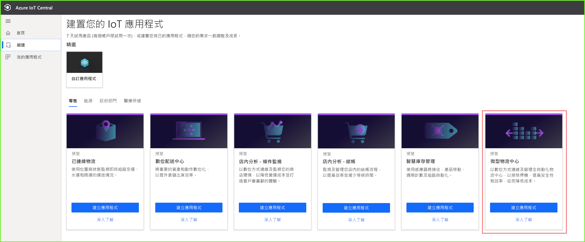
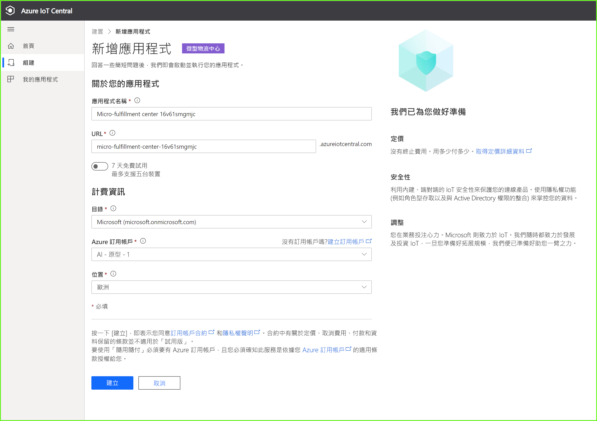
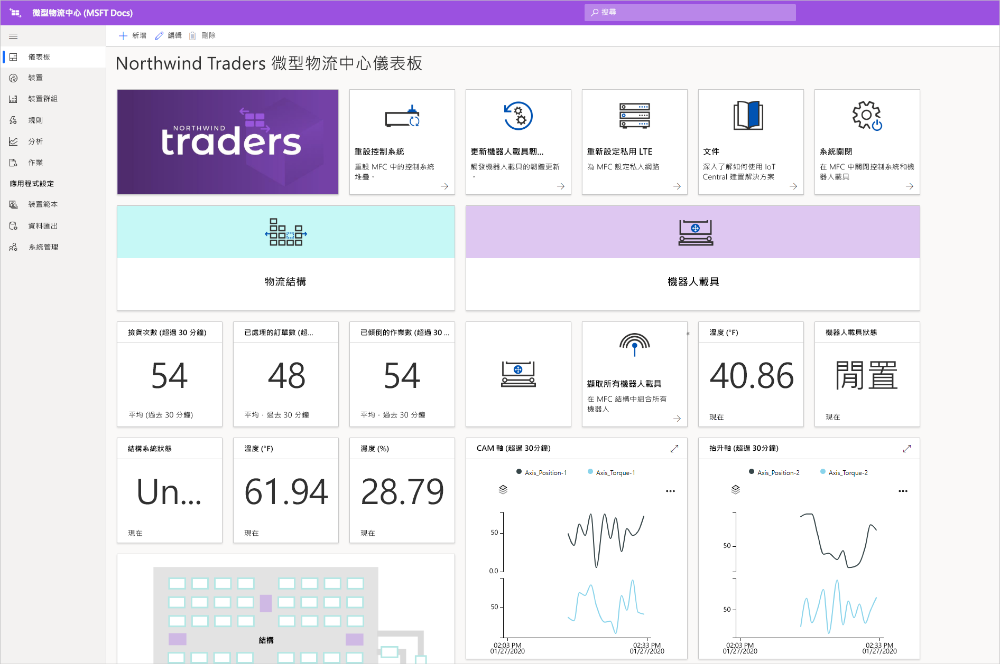
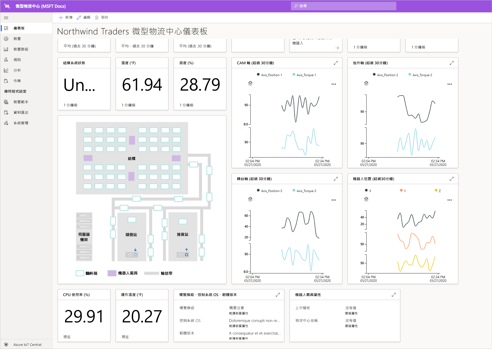
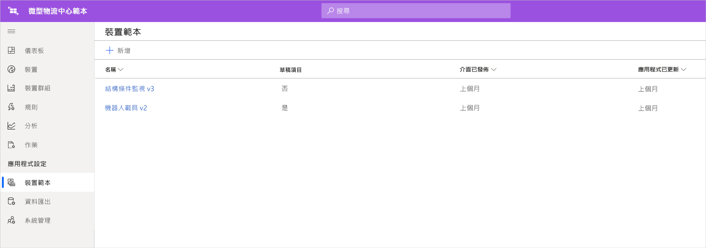
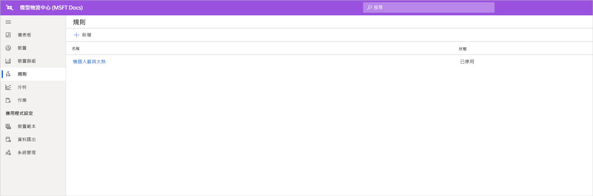
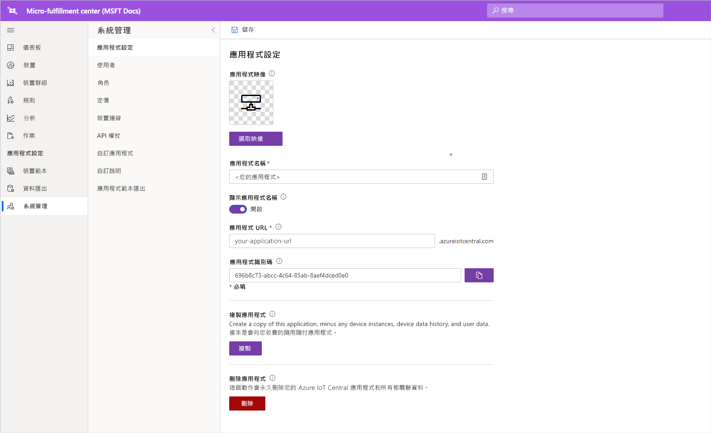

# 教學課程：部署並逐步執行微型物流中心應用程式範本

在本教學課程中，我們將利用 Azure IoT Central ***微型物流中心***應用程式範本，向您示範如何建立零售解決方案。 您將了解如何部署 MFC 範本、現成可用的項目，以及您接下來可能想要執行的動作。

在本教學課程中，您會了解如何： 
> [!div class="checklist"]
> * 使用 Azure IoT Central **微型物流中心** 範本來建立零售應用程式
> * 逐步執行應用程式 

## Prerequisites
若要完成本教學課程系列，您需要：
* Azure 訂用帳戶。 您可以選擇使用免費的 7 天試用版。 如果您沒有 Azure 訂用帳戶，則可以在 [Azure 註冊頁面](https://aka.ms/createazuresubscription)上建立一個。

## 建立應用程式 
在本節中，您會從範本建立新的 Azure IoT Central 應用程式。 您會在整個教學課程系列中，使用此應用程式來建置完整的解決方案。

若要建立新的 Azure IoT Central 應用程式：

1. 瀏覽至 [Azure IoT Central 的應用程式管理員](https://aka.ms/iotcentral)網站。
1. 如果您有 Azure 訂用帳戶，請使用您存取時所用的認證來登入，否則請使用 Microsoft 帳戶來登入：

   

1. 若要開始建立新的 Azure IoT Central 應用程式，請選取 [新增應用程式]  。

1. 選取 [零售]  。  [零售] 頁面會顯示數個零售應用程式範本。

若要建立新的微型物流中心應用程式並讓其使用預覽功能：  
1. 開始使用**微型物流中心**應用程式範本。 針對本教學課程中使用的所有裝置，其裝置範本皆包含在此範本中。 此範本也會提供操作員儀表板，以便監視物流中心內的條件，以及您的機器人載具條件。 

    > [!div class="mx-imgBorder"]
    > 
    
1. (選擇性) 選擇易記的 [應用程式名稱]  。  此應用程式範本的製作基礎是虛構公司 Northwind Traders。 

    > [!NOTE]
    > 如果您使用易記的**應用程式名稱**，您仍然必須針對應用程式的 **URL** 使用唯一值。

1. 如果您有 Azure 訂用帳戶，請輸入您的 [目錄]、[Azure 訂用帳戶] 和 [區域]  。 如果您沒有訂用帳戶，則可以啟用 [7 天免費試用]  並填妥必要的連絡人資訊。  

    如需關於目錄和訂用帳戶的詳細資訊，請參閱[建立應用程式快速入門](../preview/quick-deploy-iot-central.md)。

1. 選取 [建立]  。

> [!div class="mx-imgBorder"]
> 

## 逐步執行應用程式 

### 儀表板 

成功部署應用程式範本之後，您會先登陸在 [Northwind Traders 微型物流中心儀表板]  。 Northwind Traders 是一家虛構的零售商，其在此 IoT Central 應用程式中管理微型物流中心。 在這個操作員儀表板上，您會看到此範本的裝置相關資訊和遙測資料，還有一組可供您採行的命令、作業和動作。 儀表板會以邏輯方式分割成兩個區段 (左和右)。 您可以在左側監視物流結構內的環境條件，而在右側監視設備內的機器人載具健康情況。  

您可以在儀表板上執行以下操作：
   * 查看裝置遙測，例如揀貨次數、處理的訂單數目，以及結構系統狀態等屬性。  
   * 檢視物流結構內機器人載具的**平面圖**和位置。
   * 觸發命令，例如重設控制系統、更新載具的韌體、重新設定網路等等。

> [!div class="mx-imgBorder"]
> 
   * 請參閱操作員可用來監視物流中心內條件的儀表板範例。 
   * 監視在物流中心內閘道裝置上運行的承載健康情況。    

> [!div class="mx-imgBorder"]
> 

## 裝置範本
如果按一下 [裝置範本] 索引標籤，您會看到範本中有兩種不同的裝置類型： 
   * **機器人載具**：此裝置範本代表運作中機器人載具的定義，而該機器人載具已部署於物流結構且正在執行適當的倉儲作業。 如果您按一下範本，您會看到機器人正在傳送裝置資料，例如溫度、軸位置和屬性 (如機器人載具狀態等)。 
   * **結構條件監視**：此裝置範本代表一個裝置集合，可讓您監視環境條件，以及裝載各種邊緣工作負載的閘道裝置，進而強化您的物流中心。 除了在您環境中執行的計算工作負載狀態和健康情況以外，裝置也會傳送遙測資料，例如溫度、揀貨次數、訂單數目等等。 

> [!div class="mx-imgBorder"]
> 

如果您按一下 [裝置群組] 索引標籤，就會發現這些裝置範本會自動建立裝置群組。

## 規則
當跳躍至 [規則] 索引標籤時，您會看到應用程式範本中有一個範例規則，用以監視機器人載具的溫度條件。 如果設備中有特定機器人過熱，而需要離線進行維修，您可以使用此規則來警示操作員。 

請利用範例規則作為靈感，定義更適合您商務功能的規則。

   - **機器人載具太暖**：如果機器人載具在一段時間內達到溫度閾值，此規則就會觸發。 

> [!div class="mx-imgBorder"]
> 

## 清除資源

如果您不打算繼續使用此應用程式，請覽 [系統管理]   > [應用程式設定]  ，然後按一下 [刪除]  以刪除應用程式範本。

> [!div class="mx-imgBorder"]
> 

## 後續步驟
* 深入了解[微型物流中心解決方案架構](./architecture-micro-fulfillment-center-pnp.md)
* 深入了解其他 [IoT Central 零售範本](./overview-iot-central-retail-pnp.md)
* 若要深入了解 IoT Central，請參閱 [IoT Central 概觀](../preview/overview-iot-central.md)