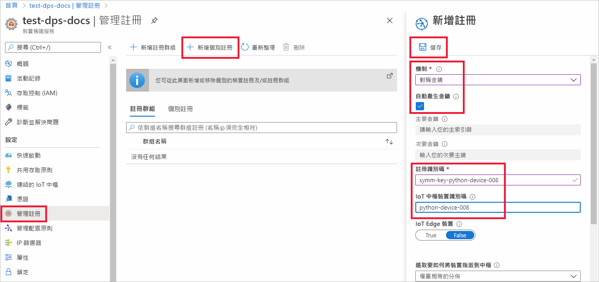
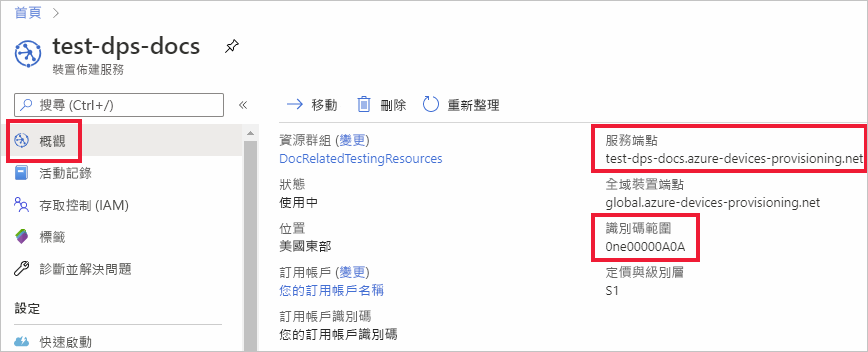
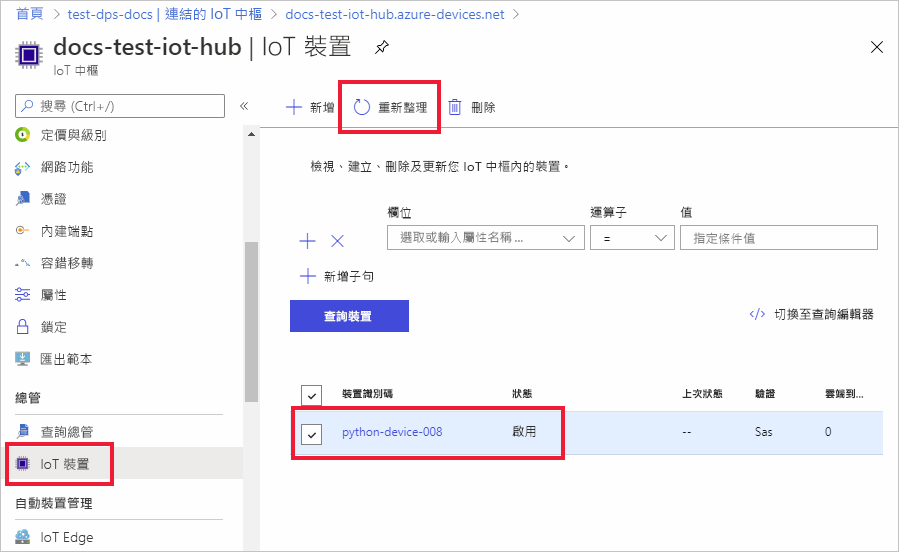

# <a name="quickstart-provision-a-python-device-with-symmetric-keys"></a>使用對稱金鑰佈建 Python 裝置

在本快速入門中，您將了解如何使用 Python，將 Windows 開發機器當作裝置，佈建到 IoT 中樞。 此裝置將會使用對稱金鑰和個別註冊來搭配裝置佈建服務 (DPS) 執行個體進行驗證，以指派給 IoT 中樞。 [Azure IoT Python SDK](https://github.com/Azure/azure-iot-sdk-python) 的範例程式碼將用來佈建裝置。 

雖然此文章示範如何使用個別註冊來佈建，但您也可以使用註冊群組。 使用註冊群組的過程會有一些差異。 例如，您必須使用具有裝置唯一註冊識別碼的衍生裝置金鑰。 雖然對稱金鑰註冊群組不僅限於傳統裝置，但[如何使用對稱金鑰證明來佈建傳統裝置](how-to-legacy-device-symm-key.md)提供了註冊群組範例。 如需詳細資訊，請參閱[對稱金鑰證明的群組註冊](concepts-symmetric-key-attestation.md#group-enrollments)。

如果您不熟悉自動佈建程序，請檢閱[佈建](about-iot-dps.md#provisioning-process)概觀。 

此外，繼續進行此快速入門之前，請務必完成[使用 Azure 入口網站設定 IoT 中樞裝置佈建服務](./quick-setup-auto-provision.md)中的步驟。 此快速入門要求您必須已建立您的裝置佈建服務執行個體。

此文章以 Windows 工作站為基礎來說明。 不過，您可以在 Linux 上執行上述程序。 如需 Linux 範例，請參閱[如何針對多組織用戶管理佈建](how-to-provision-multitenant.md)。


[!INCLUDE [quickstarts-free-trial-note](../../includes/quickstarts-free-trial-note.md)]


## <a name="prerequisites"></a>必要條件

* 請確定您已在 Windows 電腦上安裝 [Python 3.7](https://www.python.org/downloads/) 或更新版本。 您可以藉由執行 `python --version` 來檢查您的 Python 版本。

* 已安裝最新版的 [Git](https://git-scm.com/download/)。

<a id="setupdevbox"></a>

## <a name="prepare-the-python-sdk-environment"></a>準備 Python SDK 環境 

1. 確定 Git 已安裝在機器上，並已新增至命令視窗可存取的環境變數。 請參閱 [軟體自由保護協會的 Git 用戶端工具](https://git-scm.com/download/)以取得所要安裝的最新版 `git` 工具，其中包括 **Git Bash** (您可用來與本機 Git 存放庫互動的命令列應用程式)。 

2. 開啟命令提示字元。 複製 Azure IoT Python SDK 的 GitHub 存放庫：
    
    ```console
    git clone https://github.com/Azure/azure-iot-sdk-python.git --recursive
    ```
3. 瀏覽至 `azure-iot-sdk-python\azure-iot-device\samples\async-hub-scenarios` 目錄，範例檔案 _provision_symmetric_key.py_ 位於該目錄中。
   
   ```console
   cd azure-iot-sdk-python\azure-iot-device\samples\async-hub-scenarios
   ```
4. 執行下列命令來安裝 _azure-iot-device_ 程式庫。

    ```console
    pip install azure-iot-device
    ```


## <a name="create-a-device-enrollment"></a>建立裝置註冊

1. 登入 [Azure 入口網站](https://portal.azure.com)，選取左側功能表上的 [所有資源] 按鈕，然後開啟您的裝置佈建服務 (DPS) 執行個體。

2. 選取 [管理註冊] 索引標籤，然後選取頂端的 [新增個別註冊] 按鈕。 

3. 在 [新增註冊] 面板中，輸入下列資訊，然後按 [儲存] 按鈕。

   - **機制** ：選取 [對稱金鑰] 作為身分識別證明「機制」。

   - **自動產生金鑰** ︰選取此方塊。

   - **註冊識別碼** ：輸入註冊識別碼以識別註冊。 只使用小寫英數字元與破折號 ('-') 字元。 例如， **symm-key-python-device-008** 。

   - **IoT 中樞裝置識別碼：** 輸入裝置識別碼。 例如， **python-device-008** 。

     

4. 一旦儲存您的註冊，將會產生 [主要金鑰] 與 [次要金鑰] 並新增到註冊項目。 您的對稱金鑰裝置註冊會在 [個別註冊] 索引標籤中的 [註冊識別碼] 欄下顯示為 **symm-key-python-device-008** 。 

5. 開啟註冊並複製您產生之 [主要金鑰] 的值。 稍後當您新增要與裝置佈建範例程式碼搭配使用的環境變數時，將會使用此金鑰值和 **註冊識別碼** 。


<a id="firstbootsequence"></a>

## <a name="prepare-the-device-provisioning-code"></a>準備裝置佈建程式碼

在本節中，您將新增下列四個環境變數，作為對稱金鑰裝置的裝置佈建範例程式碼參數。 

* `PROVISIONING_HOST`
* `PROVISIONING_IDSCOPE`
* `PROVISIONING_REGISTRATION_ID`
* `PROVISIONING_SYMMETRIC_KEY`

佈建程式碼會根據這些變數來與 DPS 執行個體聯繫，以便驗證您的裝置。 然後，裝置會根據個別註冊組態，指派給已連結至 DPS 執行個體的 IoT 中樞。 佈建之後，範例程式碼會將一些測試遙測傳送至 IoT 中樞。

1. 在 [Azure 入口網站](https://portal.azure.com)的 [裝置佈建服務] 功能表上，選取 [概觀] 並且複製 [服務端點] 和 [識別碼範圍]。 您會將這些值用於 `PROVISIONING_HOST` 和 `PROVISIONING_IDSCOPE` 環境變數。

    

2. 在您的 Python 命令提示字元中，使用您所複製的值來新增環境變數。 

    下列命令是顯示命令語法的範例。 請務必使用正確的值。

    ```console
    set PROVISIONING_HOST=test-dps-docs.azure-devices-provisioning.net
    ```

    ```console
    set PROVISIONING_IDSCOPE=0ne00000A0A
    ```

3. 在您的 Python 命令提示字元中，為您在上一節中從個別註冊複製的註冊識別碼和對稱金鑰新增環境變數。 

    下列命令是顯示命令語法的範例。 請務必使用正確的值。

    ```console
    set PROVISIONING_REGISTRATION_ID=symm-key-python-device-008
    ```

    ```console
    set PROVISIONING_SYMMETRIC_KEY=sbDDeEzRuEuGKag+kQKV+T1QGakRtHpsERLP0yPjwR93TrpEgEh/Y07CXstfha6dhIPWvdD1nRxK5T0KGKA+nQ==
    ```

4. 在 _provision_symmetric_key.py_ 中執行 Python 範例程式碼。

    ```console
    D:\azure-iot-sdk-python\azure-iot-device\samples\async-hub-scenarios>python provision_symmetric_key.py
    ```

5. 預期的輸出看起來應該像下面這樣，其中顯示根據個別註冊設定獲指派裝置的已連結 IoT 中樞。 部分範例風速遙測訊息也會傳送至中樞作為測試：

    ```output
    D:\azure-iot-sdk-python\azure-iot-device\samples\async-hub-scenarios>python provision_symmetric_key.py
    RegistrationStage(RequestAndResponseOperation): Op will transition into polling after interval 2.  Setting timer.
    The complete registration result is
    python-device-008
    docs-test-iot-hub.azure-devices.net
    initialAssignment
    null
    Will send telemetry from the provisioned device
    sending message #8
    sending message #9
    sending message #3
    sending message #10
    sending message #4
    sending message #2
    sending message #6
    sending message #7
    sending message #1
    sending message #5
    done sending message #8
    done sending message #9
    done sending message #3
    done sending message #10
    done sending message #4
    done sending message #2
    done sending message #6
    done sending message #7
    done sending message #1
    done sending message #5
    ```
    
6. 在 Azure 入口網站中，瀏覽到連結至您佈建服務的 IoT 中樞，並開啟 [IoT 裝置] 刀鋒視窗。 將對稱金鑰裝置成功佈建到中樞之後，會顯示裝置識別碼，且 [狀態] 為 [啟用]。 如果您在執行裝置範例程式碼之前開啟了刀鋒視窗，可能需要按下頂端的 [重新整理] 按鈕。 

     

> [!NOTE]
> 如果您在裝置的註冊項目中變更了 *初始裝置對應項狀態* (變更自預設值)，它即可從中樞提取所需的對應項狀態並採取適當的動作。 如需詳細資訊，請參閱[了解和使用 Azure IoT 中樞的裝置對應項](../iot-hub/iot-hub-devguide-device-twins.md)。
>


## <a name="clean-up-resources"></a>清除資源

如果您打算繼續使用並探索裝置用戶端範例，請勿清除在此快速入門中建立的資源。 如果您不打算繼續，請使用下列步驟來刪除本快速入門建立的所有資源。

1. 從 Azure 入口網站的左側功能表中，選取 [所有資源]，然後選取您的裝置佈建服務。 為您的服務開啟 [管理註冊]  ，然後選取 [個別註冊]  索引標籤。選取您在本快速入門中所註冊裝置的 [註冊識別碼]  旁的核取方塊，然後按窗格頂端的 [刪除]  按鈕。 
1. 從 Azure 入口網站的左側功能表中，選取 [所有資源]  ，然後選取您的 IoT 中樞。 開啟您中樞的 [IoT 裝置]  ，選取您在本快速入門所註冊裝置的 [裝置識別碼]  旁的核取方塊，然後按窗格頂端的 [刪除]  按鈕。

## <a name="next-steps"></a>後續步驟

在本快速入門中，您已使用 IoT 中樞裝置佈建服務，將以 Windows 為基礎的對稱金鑰裝置佈建到您的 IoT 中樞。 若要了解如何使用 Python 佈建 X.509 憑證裝置，請繼續下方適用於 X.509 裝置的快速入門。 

> [!div class="nextstepaction"]
> [Azure 快速入門 - 使用 DPS 和 Python 佈建 X.509 裝置](quick-create-simulated-device-x509-python.md)
