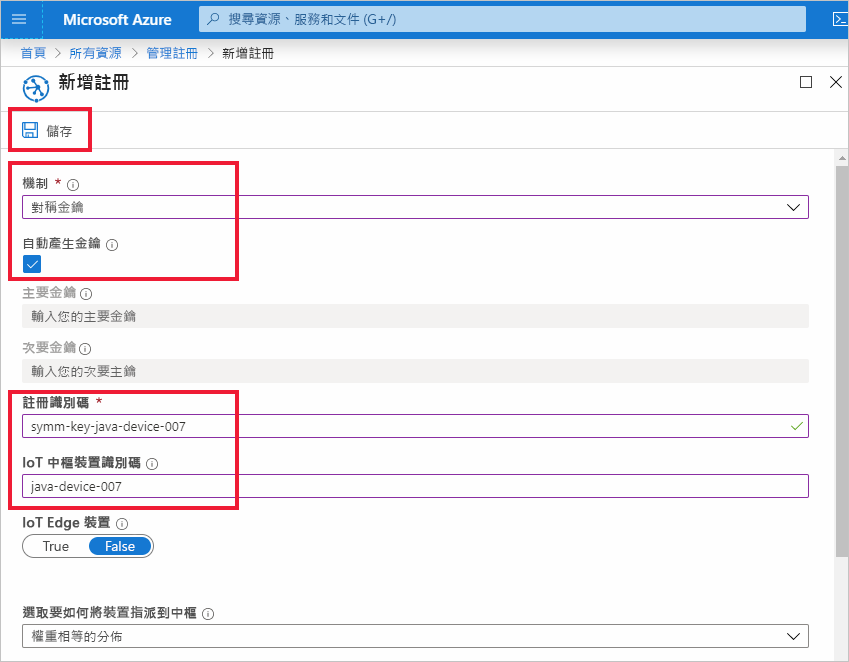
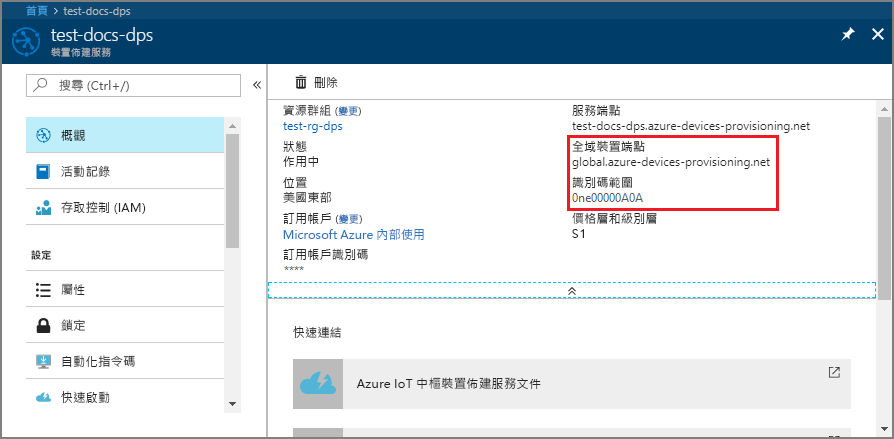
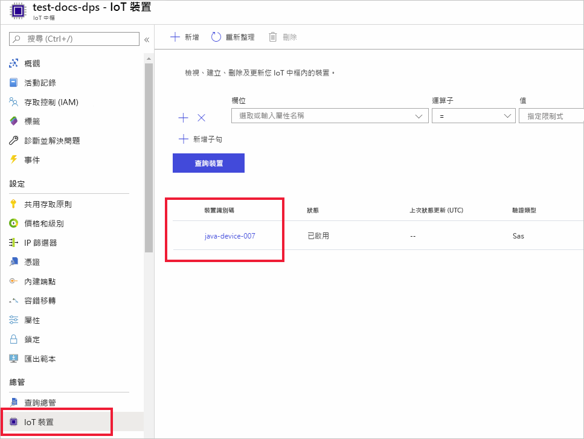

# <a name="quickstart-provision-a-simulated-device-with-symmetric-keys"></a>快速入門：使用對稱金鑰佈建模擬的裝置

在此快速入門中，您將了解如何在 Windows 開發機器上建立並執行裝置模擬器。 您將設定此模擬裝置，以使用對稱金鑰來搭配裝置佈建服務 (DPS) 執行個體進行驗證並指派給 IoT 中樞。 來自[適用於 Java 的 Microsoft Azure IoT SDK](https://github.com/Azure/azure-iot-sdk-java)的程式碼範例將用來模擬起始佈建之裝置的開機順序。 將根據 DPS 服務執行個體並指派給 IoT 中樞的個別註冊來識別裝置。

雖然此文章示範如何使用個別註冊來佈建，但您也可以使用註冊群組。 使用註冊群組的過程會有一些差異。 例如，您必須使用具有裝置唯一註冊識別碼的衍生裝置金鑰。 雖然對稱金鑰註冊群組不僅限於傳統裝置，但[如何使用對稱金鑰證明來佈建傳統裝置](how-to-legacy-device-symm-key.md)提供了註冊群組範例。 如需詳細資訊，請參閱[對稱金鑰證明的群組註冊](concepts-symmetric-key-attestation.md#group-enrollments)。

如果您不熟悉自動佈建程序，請檢閱[自動佈建概念](concepts-auto-provisioning.md)。 

此外，繼續進行此快速入門之前，請務必完成[使用 Azure 入口網站設定 IoT 中樞裝置佈建服務](./quick-setup-auto-provision.md)中的步驟。 此快速入門要求您必須已建立您的裝置佈建服務執行個體。

此文章以 Windows 工作站為基礎來說明。 不過，您可以在 Linux 上執行上述程序。 如需 Linux 範例，請參閱[如何針對多組織用戶管理佈建](how-to-provision-multitenant.md)。


[!INCLUDE [quickstarts-free-trial-note](../../includes/quickstarts-free-trial-note.md)]


## <a name="prerequisites"></a>Prerequisites

* 請確定您已在電腦上安裝 [Java SE 開發套件 8](https://aka.ms/azure-jdks) 或更新版本。

* 下載並安裝 [Maven](https://maven.apache.org/install.html)。

* 已安裝最新版的 [Git](https://git-scm.com/download/)。

<a id="setupdevbox"></a>

## <a name="prepare-the-java-sdk-environment"></a>準備 Java SDK 環境 

1. 確定 Git 已安裝在機器上，並已新增至命令視窗可存取的環境變數。 請參閱[軟體自由保護協會的 Git 用戶端工具](https://git-scm.com/download/)以取得所要安裝的最新版 `git` 工具，其中包括 **Git Bash** (您可用來與本機 Git 存放庫互動的命令列應用程式)。 

2. 開啟命令提示字元。 複製裝置模擬程式碼範例的 GitHub 存放庫：
    
    ```cmd/sh
    git clone https://github.com/Azure/azure-iot-sdk-java.git --recursive
    ```
3. 瀏覽至 `azure-iot-sdk-java` 根目錄並建置專案，以下載所需的所有套件。
   
   ```cmd/sh
   cd azure-iot-sdk-java
   mvn install -DskipTests=true
   ```

## <a name="create-a-device-enrollment"></a>建立裝置註冊

1. 登入 [Azure 入口網站](https://portal.azure.com)，選取左側功能表上的 [所有資源]  按鈕，然後開啟您的裝置佈建服務 (DPS) 執行個體。

2. 選取 [管理註冊]  索引標籤，然後選取頂端的 [新增個別註冊]  按鈕。 

3. 在 [新增註冊]  面板中，輸入下列資訊，然後按 [儲存]  按鈕。

   - **機制**：選取 [對稱金鑰]  作為身分識別證明*機制*。

   - **自動產生金鑰**：核取此方塊。

   - **註冊識別碼**：輸入註冊識別碼以識別註冊。 只使用小寫英數字元與破折號 ('-') 字元。 例如，**symm-key-java-device-007**。

   - **IoT 中樞裝置識別碼：** 輸入裝置識別碼。 例如，**java-device-007**。

     

4. 一旦儲存您的註冊，將會產生 [主要金鑰]  與 [次要金鑰]  並新增到註冊項目。 您的對稱金鑰裝置註冊會在 [個別註冊]  索引標籤中的 [註冊識別碼]  欄下顯示為 **symm-key-java-device-007**。 

    開啟註冊並複製您產生之 [主要金鑰]  的值。 您稍後更新裝置的 Java 程式碼時，將使用此金鑰值和 [註冊識別碼]  。


<a id="firstbootsequence"></a>

## <a name="simulate-device-boot-sequence"></a>模擬裝置開機順序

在本節中，您將更新範例程式碼以將裝置的開機順序傳送至 DPS 執行個體。 此開機順序會使裝置經過辨識、驗證，並指派給連結至 DPS 執行個體的 IoT 中樞。

1. 從 [裝置佈建服務] 功能表中，選取 [概觀]  ，並記下您的 [識別碼範圍]  和 [佈建服務全域端點]  。

    

2. 開啟 Java 裝置範例程式碼以供編輯。 裝置範例程式碼的完整路徑為：

    `azure-iot-sdk-java/provisioning/provisioning-samples/provisioning-symmetrickey-sample/src/main/java/samples/com/microsoft/azure/sdk/iot/ProvisioningSymmetricKeySampleSample.java`

   - 新增您 DPS 執行個體的 [識別碼範圍]  和 [佈建服務全域端點]  。 還有納入您針對個別註冊所選擇的主要對稱金鑰和註冊識別碼。 儲存您的變更。 

      ```java
        private static final String SCOPE_ID = "[Your scope ID here]";
        private static final String GLOBAL_ENDPOINT = "[Your Provisioning Service Global Endpoint here]";
        private static final String SYMMETRIC_KEY = "[Enter your Symmetric Key here]";
        private static final String REGISTRATION_ID = "[Enter your Registration ID here]";
      ```

3. 開啟命令提示字元以便建置。 瀏覽至 Java SDK 存放庫的佈建範例專案資料夾。

    ```cmd/sh
    cd azure-iot-sdk-java/provisioning/provisioning-samples/provisioning-symmetrickey-sample
    ```

4. 建置範例，然後瀏覽至 `target` 資料夾以執行所建立的 .jar 檔案。

    ```cmd/sh
    mvn clean install
    cd target
    java -jar ./provisioning-symmetrickey-sample-{version}-with-deps.jar
    ```

5. 預期的輸出應如下所示：

    ```cmd/sh
      Starting...
      Beginning setup.
      Waiting for Provisioning Service to register
      IotHUb Uri : <Your DPS Service Name>.azure-devices.net
      Device ID : java-device-007
      Sending message from device to IoT Hub...
      Press any key to exit...
      Message received! Response status: OK_EMPTY
    ```

6. 在 Azure 入口網站中，瀏覽到連結至您佈建服務的 IoT 中樞，並開啟 [Device Explorer]  刀鋒視窗。 在模擬對稱金鑰裝置成功佈建到中樞時，其裝置識別碼會出現在 [Device Explorer]  刀鋒視窗上，且 [狀態]  顯示為 [已啟用]  。  如果您在執行範例裝置應用程式之前開啟了刀鋒視窗，可能需要按頂端的 [重新整理]  按鈕。 

     

> [!NOTE]
> 如果您在裝置的註冊項目中變更了*初始裝置對應項狀態* (變更自預設值)，它即可從中樞提取所需的對應項狀態並採取適當的動作。 如需詳細資訊，請參閱[了解和使用 Azure IoT 中樞的裝置對應項](../iot-hub/iot-hub-devguide-device-twins.md)。
>


## <a name="clean-up-resources"></a>清除資源

如果您打算繼續使用並探索裝置用戶端範例，請勿清除在此快速入門中建立的資源。 如果您不打算繼續，請使用下列步驟來刪除本快速入門建立的所有資源。

1. 在您的電腦上關閉裝置用戶端範例輸出視窗。
1. 從 Azure 入口網站的左側功能表中，選取 [所有資源]  ，然後選取您的裝置佈建服務。 為您的服務開啟 [管理註冊]  ，然後選取 [個別註冊]  索引標籤。選取您在本快速入門中所註冊裝置的 [註冊識別碼]  旁的核取方塊，然後按窗格頂端的 [刪除]  按鈕。 
1. 從 Azure 入口網站的左側功能表中，選取 [所有資源]  ，然後選取您的 IoT 中樞。 開啟您中樞的 [IoT 裝置]  ，選取您在本快速入門所註冊裝置的 [裝置識別碼]  旁的核取方塊，然後按窗格頂端的 [刪除]  按鈕。

## <a name="next-steps"></a>後續步驟

在此快速入門中，您已在 Windows 電腦上建立模擬裝置，並搭配入口網站上的 Azure IoT 中樞裝置佈建服務使用對稱金鑰，將它佈建到 IoT 中樞。 若要了解如何以程式設計方式註冊您的裝置，請繼續閱讀以程式設計方式註冊 X.509 裝置的快速入門。 

> [!div class="nextstepaction"]
> [Azure 快速入門 - 向 Azure IoT 中樞裝置佈建服務註冊 X.509 裝置](quick-enroll-device-x509-java.md)
