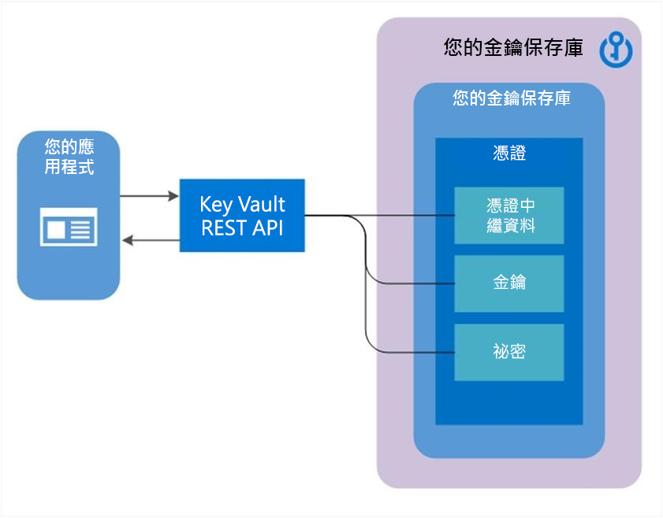

# 關於 Azure Key Vault 憑證

金鑰保存庫憑證支援提供管理 x509 憑證和下列行為︰  

-   允許憑證擁有者透過金鑰保存庫建立程序或匯入現有憑證來建立憑證。 同時包含自我簽署和憑證授權單位所產生的憑證。
-   允許金鑰保存庫憑證擁有者實作 X509 憑證的安全儲存和管理，而不需要與私密金鑰資料互動。  
-   允許憑證擁有者建立原則，以指示金鑰保存庫管理憑證的生命週期。  
-   允許憑證擁有者提供有關憑證到期和更新生命週期事件的通知的連絡資訊。  
-   支援與所選簽發者的自動更新 - 金鑰保存庫夥伴 X509 憑證提供者/憑證授權單位。

>[!Note]
>也允許無合作關係的提供者/授權單位，但不支援自動更新功能。

## 憑證的構成要素

建立 Key Vault 憑證時，可定址的金鑰和秘密也會以相同名稱建立。 Key Vault 金鑰可讓金鑰作業和 Key Vault 秘密允許擷取憑證值作為秘密。 Key Vault 憑證也會包含公用 x509 憑證的中繼資料。  

憑證的識別碼和版本類似於金鑰和密碼。 以 Key Vault 憑證版本建立的特定可定址金鑰和秘密版本，可用於 Key Vault 憑證的回應。
 

## 可匯出或不可匯出金鑰

Key Vault 憑證建立後，該憑證將可透過可定址秘密和 PFX 或 PEM 格式的私密金鑰來擷取。 用來建立憑證的原則必須指出金鑰是可匯出的。 如果原則指出金鑰是不可匯出的，則擷取為祕密的值不會包含私密金鑰。  

可定址的金鑰會變成與不可匯出的 KV 憑證有較高相關性。 用來建立 KV 憑證的 KV 憑證原則欄位 keyusage  ，會對應至可定址 KV 金鑰的作業。  

 - 支援的金鑰類型：RSA、RSA-HSM、EC、EC-HSM、oct (列於[此處](https://docs.microsoft.com/rest/api/keyvault/createcertificate/createcertificate#jsonwebkeytype)) 僅允許匯出 RSA、EC。 HSM 金鑰不可匯出。

## 憑證屬性與標記

除了憑證中繼資料、可定址的金鑰和可定址的秘密，Key Vault 憑證也會包含屬性和標記。  

### 屬性

憑證屬性會對映至建立 KV 憑證時建立的可定址金鑰和秘密。  

Key Vault 憑證具有下列屬性：  

-   enabled  ：選擇性的布林值，預設值是 **true**。 可指定以指出憑證資料是否可以擷取為秘密，或是否可以作為金鑰執行。 也可再作業發生於 nbf  和 exp  之間時，用來搭配 nbf  和 exp  使用，只有在 enabled 設定為 true 時，才能允許此作業。 在 nbf  和 exp  範圍以外的作業會自動禁止。  

回應中會包含其他唯讀屬性：

-   *created*：IntDate：指出此憑證版本的建立時間。  
-   *updated*：IntDate：指出此憑證版本的更新時間。  
-   *exp*：IntDate：包含 x509 憑證的到期日值。  
-   *nbf*：IntDate：包含 x509 憑證的日期值。  

> [!Note] 
> 如果 Key Vault 憑證到期，其可定址金鑰和秘密將變得無法使用。  

### Tags

 用戶端指定的金鑰值組字典，類似於金鑰與秘密中的標記。  

 > [!Note]
> 如果標記具有可對物件類型 (金鑰、秘密或憑證) 執行「列出」  或「取得」  的權限，則呼叫者可讀取這些標記。

## Certificate policy

憑證原則包含如何建立和管理 Key Vault 憑證生命週期的資訊。 當憑證與私密金鑰匯入金鑰保存庫時，系統即會透過讀取 x509 憑證來建立預設的原則。  

從頭建立 Key Vault 憑證時，必須提供原則。 原則會指定如何建立此 Key Vault 憑證版本，或下一個 Key Vault 憑證版本。 原則建立之後，在後續版本的建立作業中就不需要再次建立原則。 所有 Key Vault 憑證版本只會有一個原則執行個體。  

概括而言，憑證原則包含下列資訊 (其定義可在[這裡](https://docs.microsoft.com/powershell/module/az.keyvault/set-azkeyvaultcertificatepolicy?view=azps-4.4.0)找到)：  

-   X509 憑證屬性：包含主體名稱、主體替代名稱，以及其他用來建立 X509 憑證要求的屬性。  
-   金鑰屬性：包含金鑰類型、金鑰長度、可匯出和 ReuseKeyOnRenewal 欄位。 這些欄位會指示金鑰保存庫如何產生金鑰。 
     - 支援的金鑰類型：RSA、RSA-HSM、EC、EC-HSM、oct (列於[此處](https://docs.microsoft.com/rest/api/keyvault/createcertificate/createcertificate#jsonwebkeytype)) 
-   秘密屬性：包含用來產生秘密值的秘密屬性，例如可定址秘密的內容類型，進而擷取憑證作為秘密。  
-   存留期動作：包含 KV 憑證的存留期動作。 每個存留期動作包含：  

     - 觸發程序：透過到期或存留期範圍百分比前的天數來指定  

     - 動作：指定動作類型 – emailContacts  或 autoRenew  

-   簽發者：要用來簽發 x509 憑證的憑證簽發者相關參數。  
-   原則屬性：包含與原則相關聯的屬性  

### X509 與 Key Vault 使用方式的對應

下表代表 x509 金鑰使用原則與有效金鑰 (Key Vault 憑證建立時一起建立的金鑰) 作業的對應。

|**X509 金鑰使用方式旗標**|**Key Vaul 金鑰作業**|**預設行為**|
|----------|--------|--------|
|DataEncipherment|加密、解密| N/A |
|DecipherOnly|解密| N/A  |
|DigitalSignature|簽署、驗證| Key Vault 的預設是憑證建立時不包含使用規格 | 
|EncipherOnly|encrypt| N/A |
|KeyCertSign|簽署、驗證|N/A|
|KeyEncipherment|包裝金鑰、解除包裝金鑰| Key Vault 的預設是憑證建立時不包含使用規格 | 
|NonRepudiation|簽署、驗證| N/A |
|crlsign|簽署、驗證| N/A |

## 憑證簽發者

Key Vault 憑證物件會保存用來與所選憑證簽發者之提供者通訊的組態，以訂購 x509 憑證。  

-   Key Vault 與下列憑證簽發者的提供者有夥伴關係 (適用於 TLS/SSL 憑證)

|**提供者名稱**|**位置**|
|----------|--------|
|DigiCert|支援所有位在公用雲端和 Azure Government 中的金鑰保存庫服務|
|GlobalSign|支援所有位在公用雲端和 Azure Government 中的金鑰保存庫服務|

您必須成功完成下列先決條件的步驟 1 和 2，才可在 Key Vault 中建立憑證簽發者。  

1. 上架至憑證授權單位 (CA) 提供者  

    -   組織系統管理員必須至少使用一個 CA 提供者來讓其公司 ( 例如 Contoso) 上架。  

2. 管理員會建立 Key Vault 的要求者憑證，以註冊 (和更新) TLS/SSL 憑證  

    -   提供組態，以用來建立金鑰保存庫中提供者的簽發者物件  

如需有關從憑證入口網站建立簽發者物件的詳細資訊，請參閱 [Key Vault 憑證部落格](https://aka.ms/kvcertsblog)  

Key Vault 可讓您以不同簽發者的提供者組態，來建立多個簽發者物件。 簽發者物件建立之後，其名稱可以在一個或多個憑證原則中進行參考。 在建立與更新憑證期間，從 CA 提供者中要求 x509 憑證時，參考簽發者物件會指示 Key Vault 使用簽發者物件中所指定的組態。  

簽發者物件會在保存庫中建立，而且只能搭配相同保存庫中的 KV 憑證使用。  

## 憑證連絡人

憑證連絡人中包含連絡資訊，用來傳送由憑證存留期事件觸發的通知。 連絡人資訊會由金鑰保存庫中的所有憑證共用。 若金鑰保存庫中發生任何憑證事件，系統會將通知傳送給所有指定的連絡人。  

如果將憑證的原則設定為自動更新，則發生下列事件時會傳送通知。  

- 憑證更新之前
- 在憑證更新之後，指出是否已成功更新憑證，或是如果發生錯誤，需要手動更新憑證。  

  如果憑證的原則設定為以手動方式更新 (僅限電子郵件)，則會在需更新憑證時傳送通知。  

## 憑證存取控制

 憑證的存取控制是由 Key Vault 所管理，且在 Key Vault 的層級上提供的，即包含這些憑證的 Key Vault。 在相同 Key Vault 中，憑證的存取控制原則與金鑰及秘密的存取控制原則並不相同。 使用者可建立一或多個保存庫來保存憑證，以及維護適當區分和管理憑證的案例。  

 下列權限可以在金鑰保存庫上的祕密存取控制項目中使用 (以每個主體為基礎)，且密切地對映秘密物件上所允許的作業：  

- 憑證管理作業的權限
  - *get*：取得目前憑證版本，或任何憑證版本 
  - *list*：列出目前憑證或憑證版本  
  - *update*：更新憑證
  - *create*：建立 Key Vault 憑證
  - *import*：將憑證內容匯入至 Key Vault 憑證
  - *delete*：刪除憑證、其原則及其所有版本  
  - *recover*：復原已刪除的憑證
  - *backup*：備份金鑰保存庫中的憑證
  - *restore*：將備份的憑證還原至金鑰保存庫
  - *managecontacts*：管理 Key Vault 憑證連絡人  
  - *manageissuers*：管理 Key Vault 憑證授權單位/簽發者
  - *getissuers*：取得憑證的授權單位/簽發者
  - *listissuers*：列出憑證的授權單位/簽發者  
  - *setissuers*：建立或更新 Key Vault 憑證的授權單位/簽發者  
  - *deleteissuers*：刪除 Key Vault 憑證的授權單位/簽發者  
 
- 特殊權限作業的權限
  - *purge*：清除 (永久刪除) 已刪除的憑證

如需詳細資訊，請參閱 [Key Vault REST API 參考中的憑證作業](/rest/api/keyvault)。 如需建立權限的相關資訊，請參閱[保存庫 - 建立或更新](/rest/api/keyvault/vaults/createorupdate)和[保存庫 - 更新存取原則](/rest/api/keyvault/vaults/updateaccesspolicy)。

## 後續步驟

- [關於 Key Vault](../general/overview.md)
- [關於金鑰、密碼與憑證](../general/about-keys-secrets-certificates.md)
- [關於金鑰](../keys/about-keys.md)
- [關於秘密](../secrets/about-secrets.md)
- [驗證、要求和回應](../general/authentication-requests-and-responses.md)
- [Key Vault 開發人員指南](../general/developers-guide.md)
