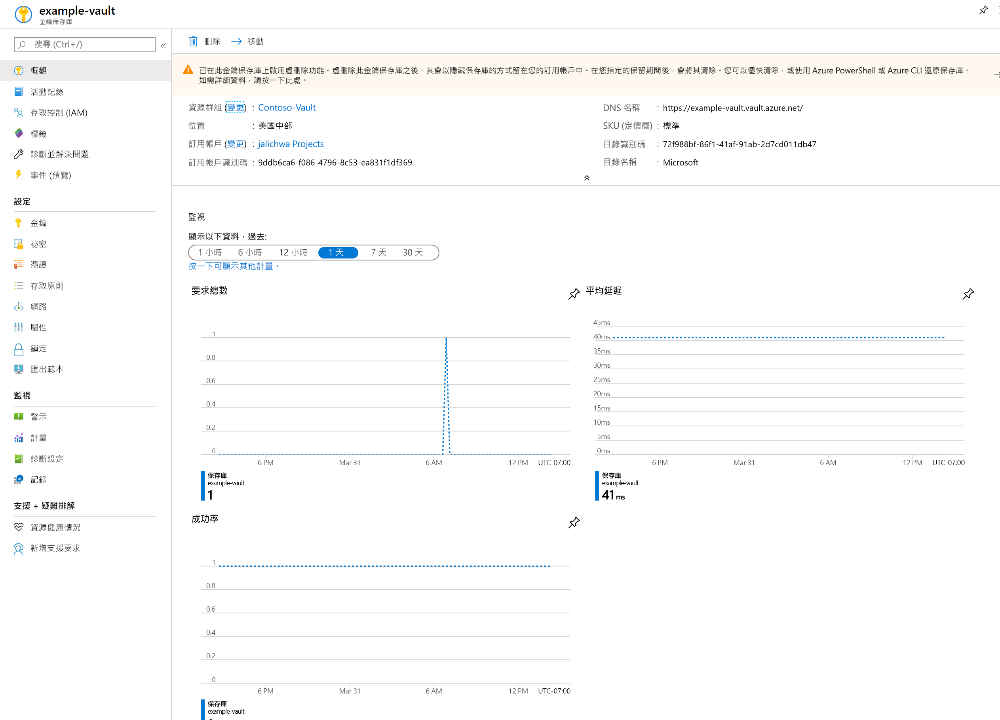
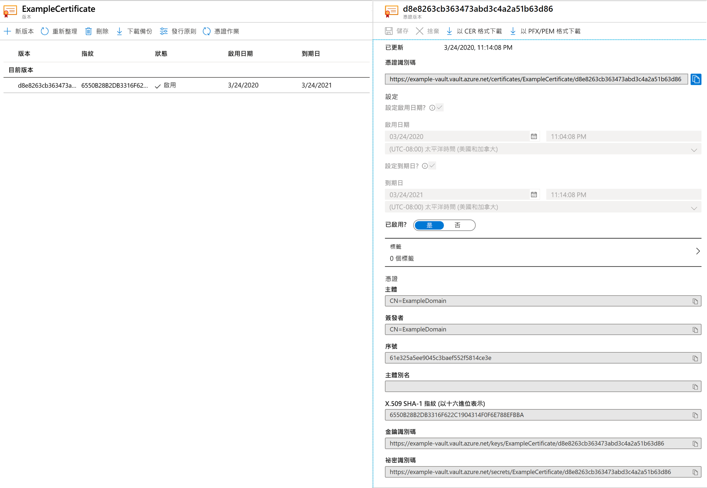
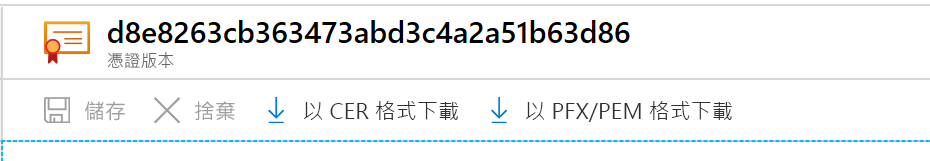

# 快速入門：使用 Azure 入口網站從 Azure Key Vault 設定及擷取憑證

Azure Key Vault 是一項雲端服務，可為祕密提供安全的存放區。 您也可以安全地儲存金鑰、密碼、憑證和其他祕密。 您可以透過 Azure 入口網站建立和管理 Azure 金鑰保存庫。 在本快速入門中，您會建立金鑰保存庫，並將其用來儲存憑證。 如需 Key Vault 的詳細資訊，您可以檢閱[概觀](../general/overview.md)。

如果您沒有 Azure 訂用帳戶，請在開始前建立[免費帳戶](https://azure.microsoft.com/free/?WT.mc_id=A261C142F)。

## 登入 Azure

在 https://portal.azure.com 登入 Azure 入口網站。

## 建立保存庫

1. 從 Azure 入口網站功能表或**首頁**，選取 [建立資源]。
2. 在 [搜尋] 方塊中輸入 **Key Vault**。
3. 從結果清單中，選擇 [Key Vault]。
4. 在 [金鑰保存庫] 區段上選擇 [建立]。
5. 在 [建立金鑰保存庫] 區段上提供下列資訊：
    - **Name**：唯一名稱是必要項。 在本快速入門中，我們會使用 **Example-Vault**。 
    - 訂用帳戶：選擇訂用帳戶。
    - 在 [資源群組] 底下，選擇 [新建]，然後輸入資源群組名稱。
    - 在 [位置] 下拉式功能表中選擇位置。
    - 將其他的選項保留預設值。
6. 提供上述資訊之後，請選取 [建立]。

請記下下列兩個屬性：

* **保存庫名稱**：在此範例中，這是 **Example-Vault**。 您將在其他步驟中使用此名稱。
* **保存庫 URI**：在此範例中是 https://example-vault.vault.azure.net/ 。 透過其 REST API 使用保存庫的應用程式必須使用此 URI。

此時，您的 Azure 帳戶是唯一獲得授權在此新保存庫上執行作業的帳戶。

## 在 Key Vault 中新增憑證

若要在保存庫中新增憑證，您只需要另外進行幾個步驟。 在本案例中，我們會新增可供應用程式使用的自我簽署憑證。 此憑證稱為 **ExampleCertificate**。

1. 在 Key Vault 屬性頁面上，選取 [憑證]。
2. 按一下 [產生/匯入]。
3. 在 [建立憑證] 畫面上，選擇下列值：
    - **憑證建立方法**：產生。
    - **憑證名稱**：ExampleCertificate。
    - **主體**：CN=ExampleDomain
    - 將其他的值保留預設值。 按一下 [建立]。

一旦收到已成功建立憑證的訊息，即可按一下清單上的憑證。 您可以接著看見某些屬性。 如果您按一下目前的版本，您可以看到您在上一個步驟中指定的值。

## 從 Key Vault 匯出憑證
按一下 [以 CER 格式下載] 或 [以 PFX/PEM 格式下載] 按鈕即可下載憑證。 

## 清除資源

其他 Key Vault 快速入門和教學課程會以本快速入門為基礎。 如果您打算繼續進行後續的快速入門和教學課程，您可以讓這些資源留在原處。
如果不再需要，請刪除資源群組，這會刪除 Key Vault 和相關資源。 若要透過入口網站刪除資源群組：

1. 在入口網站頂端的 [搜尋] 方塊中，輸入資源群組的名稱。 當您在搜尋結果中看到本快速入門中使用的資源群組時，請加以選取。
2. 選取 [刪除資源群組]。
3. 在 [輸入資源群組名稱:] 方塊中輸入資源群組的名稱，然後選取 [刪除]。

## 後續步驟

在本快速入門中，您已建立 Key Vault 並在其中儲存憑證。 若要深入了解 Key Vault 以及要如何將其與應用程式整合，請繼續閱讀下列文章。

- 閱讀 [Azure Key Vault 概觀](../general/overview.md)
- 參閱 [Azure Key Vault 開發人員指南](../general/developers-guide.md)
- 檢閱 [Azure Key Vault 最佳做法](../general/best-practices.md)
