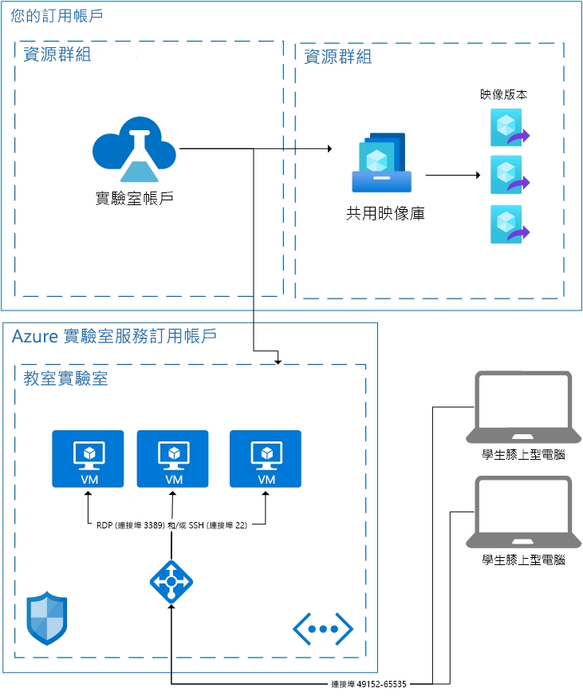

# Azure 實驗室服務中的架構基礎

Azure 實驗室服務是 SaaS (軟體即服務) 解決方案，這表示其會為您處理實驗室服務所需的資源。 本文將討論實驗室服務所使用的基本資源，以及實驗室的基本架構。  

Azure 實驗室服務提供了幾個區域，讓您將自己的資源與實驗室服務搭配使用。  如需在自己的網路上使用 VM 的詳細資訊，請參閱如何[讓虛擬網路對等互連](how-to-connect-peer-virtual-network.md)。  若要重複使用來自共用映像庫的映像，請參閱如何[連結共用映像庫](how-to-attach-detach-shared-image-gallery.md)。

以下是教室實驗室的基本架構。  實驗室帳戶裝載於您的訂用帳戶中。 學生 VM 以及為了支援 VM 所需的資源，都裝載於實驗室服務所擁有的訂用帳戶中。 讓我們更詳細地討論實驗室服務訂用帳戶所含的資源。

## 裝載的資源

為了執行教室實驗室所需的資源會裝載在 Microsoft 管理的其中一個 Azure 訂用帳戶中。  這些資源包括適用於講師的範本虛擬機器、適用於每位學生的虛擬機器，以及與網路相關項目 (例如負載平衡器、虛擬網路和網路安全性群組)。  系統會監視這些訂用帳戶中是否有可疑活動。  請務必注意，這項監視是透過 VM 擴充功能或網路模式監視，在虛擬機器外部進行。  如果啟用了[在中斷連線時關機](how-to-enable-shutdown-disconnect.md)的功能，則虛擬機器會啟用診斷擴充功能。 此擴充功能可讓實驗室服務收到遠端桌面通訊協定 (RDP) 工作階段中斷連線事件的通知。

## 虛擬網路

每個實驗室都會由自己的虛擬網路加以隔離。  如果實驗室具有[對等互連虛擬網路](how-to-connect-peer-virtual-network.md)，則每個實驗室會由自己的子網路加以隔離。  學生會透過負載平衡器連線到其虛擬機器。  沒有任何學生虛擬機器會有公用 IP 位址；其只會有私人 IP 位址。  學生的連接字串會是負載平衡器的公用 IP 位址，以及 49152 到 65535 之間的隨機連接埠。  視作業系統而定，負載平衡器上的輸入規則會將連線轉送到適當虛擬機器的連接埠 22 (SSH) 或連接埠 3389 (RDP)。 NSG 可防止任何其他連接埠上有外部流量。

## 虛擬機器的存取控制

實驗室服務會掌控學生執行動作的能力，例如在其虛擬機器上啟動和停止。  其也會控制對於其 VM 連線資訊的存取。

實驗室服務也會掌控學生向服務的註冊。 目前有兩個不同的存取設定：受限制和不受限。 如需詳細資訊，請參閱[管理實驗室使用者](how-to-configure-student-usage.md#send-invitations-to-users)一文。 受限制存取表示實驗室服務會先確認學生已新增為使用者才允許存取。 不受限則表示任何使用者只要擁有註冊連結，而且實驗室有容量，就可以註冊。 不受限對於駭客松活動很有用。

裝載於教室實驗室的學生 VM 會由實驗室建立者設定使用者名稱和密碼。  或者，實驗室建立者也可以讓已註冊的學生在第一次登入時選擇自己的密碼。  

## 後續步驟

若要深入了解實驗室服務中可用的功能，請參閱 [Azure 實驗室服務概念](classroom-labs-concepts.md)和 [Azure 實驗室服務概觀](classroom-labs-overview.md)。
