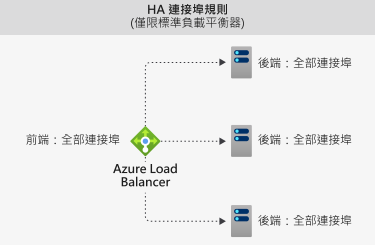

# Azure Load Balancer 元件

Azure Load Balancer 包含幾個主要元件。 您可以透過下列方式，在您的訂用帳戶中設定這些元件：

* Azure 入口網站
* Azure CLI
* Azure PowerShell
* Resource Manager 範本

## 前端 IP 設定 

Azure Load Balancer 的 IP 位址。 這是用戶端的連絡點。 這些 IP 位址可以是：

- **公用 IP 位址**
- **私人 IP 位址**

IP 位址的性質會決定所建立負載平衡器的 **類型**。 選取私人 IP 位址會建立內部負載平衡器。 選取公用 IP 位址會建立公用負載平衡器。

|  | 公用 Load Balancer  | 內部負載平衡器 |
| ---------- | ---------- | ---------- |
| **前端 IP 設定**| 公用 IP 位址 | 私人 IP 位址|
| **說明** | 公用負載平衡器會將傳入流量的公用 IP 和連接埠對應至 VM 的私人 IP 和連接埠。 對於來自 VM 的回應流量，負載平衡器會以相反的方式對應流量。 您可以套用負載平衡規則，以將特定類型的流量分散至多個 VM 或服務。 例如，您可以將 Web 要求的流量負載分散在多個 Web 伺服器。| 內部負載平衡器會將流量分散到虛擬網路內的資源。 Azure 會限制存取虛擬網路的負載平衡前端 IP 位址。 前端 IP 位址與虛擬網路絕不會直接公開至網際網路端點。 內部企業營運應用程式會在 Azure 中執行，並且可從 Azure 內或內部部署資源內存取。 |
| **支援的 SKU** | 基本和標準 | 基本和標準 |

負載平衡器可以有多個前端 IP。 深入瞭解 [多個前端](load-balancer-multivip-overview.md)。

## 後端集區

將會為傳入要求提供服務的一組虛擬機器或虛擬機器擴展集中的執行個體。 若要以符合成本效益的方式進行擴充，以滿足大量的傳入流量運算，計算指導方針通常會建議您在後端集區中新增更多執行個體。

當您擴大或縮小執行個體時，負載平衡器會立即透過自動重新設定功能來自行重新設定。 從後端集區新增或移除 VM 會重新設定負載平衡器，而不需要進行其他作業。 後端集區的範圍是虛擬網路中的任何虛擬機器。

在考量如何設計您的後端集區時，可以將最少量的個別後端集區資源作為設計原則，以最佳化執行管理作業所需的時間。 在資料平面的效能或規模方面沒有任何差異。

## 健康狀態探查

健康情況探查可用來判斷後端集區中執行個體的健全狀態。 在建立負載平衡器期間，設定負載平衡器使用的健康狀態探查。  此健康狀態探查會判斷執行個體是否狀況良好，並且可接收流量。

您可以為健康情況探查定義狀況不良臨界值。 當探查無法回應時，負載平衡器會停止傳送新的連線至狀況不良的執行個體。 探查失敗不會影響現有的連線。 連線會繼續進行，直到應用程式：

- 結束流程
- 發生閒置逾時
- VM 關機

負載平衡器會為以下端點提供不同的健康情況探查類型：TCP、HTTP 和 HTTPS。 [深入瞭解 Load Balancer 健康情況探查](load-balancer-custom-probe-overview.md)。

基本負載平衡器不支援 HTTPS 探查。 基本負載平衡器會關閉所有 TCP 連線 (包括已建立的連線)。

## 負載平衡規則

負載平衡器規則可用來定義要如何將傳入流量散發給後端集區內的 **所有** 執行個體。 負載平衡規則會將指定的前端 IP 組態和連接埠對應至多個後端 IP 位址和連接埠。

例如，使用連接埠 80 的負載平衡規則，會將來自前端 IP 的流量路由傳送至後端執行個體的連接埠 80。

:::image type="content" source="./media/load-balancer-components/lbrules.png" alt-text="負載平衡器規則參考圖表" border="false":::

*圖：負載平衡規則*

## 高可用性連接埠

以 **'protocol - all and port - 0'** 設定的負載平衡器規則。 

此規則會啟用單一規則，讓抵達內部 Standard Load Balancer 所有連接埠的所有 TCP 和 UDP 流量進行負載平衡。 

每次都會針對流量進行負載平衡決策。 此動作是以下列的五元組連線為基礎： 

1. 來源 IP 位址
2. 來源連接埠
3. 目的地 IP 位址
4. 目的地連接埠
5. protocol

HA 連接埠負載平衡規則可協助您處理重要的使用案例，例如虛擬網路中網路虛擬裝置 (NVA) 的高可用性和規模調整。 此功能可以在必須對大量連接埠進行負載平衡時提供協助。

  

*圖：HA 連接埠規則*

深入了解 [HA 連接埠](load-balancer-ha-ports-overview.md)。

## 傳入的 NAT 規則

輸入 NAT 規則會轉寄傳送到前端 IP 位址與連接埠組合的連入流量。 流量會傳送至後端集區中的 **特定** 虛擬機器或執行個體。 連接埠轉送作業會使用與負載平衡相同的雜湊式分送來完成。

:::image type="content" source="./media/load-balancer-components/inboundnatrules.png" alt-text="輸入 NAT 規則參考圖表" border="false":::

*圖：輸入 NAT 規則*

虛擬機器擴展集內容中的輸入 NAT 規則是輸入 NAT 集區。 深入了解 [Load Balancer 元件和虛擬機器擴展集](../virtual-machine-scale-sets/virtual-machine-scale-sets-networking.md#azure-virtual-machine-scale-sets-with-azure-load-balancer)。

## 輸出規則

輸出規則會針對後端集區所識別的所有虛擬機器或執行個體設定輸出網路位址轉譯 (NAT)。 此規則可讓後端中的執行個體與網際網路或其他端點通訊 (輸出)。

深入瞭解 [輸出連線和規則](load-balancer-outbound-connections.md)。

基本負載平衡器不支援輸出規則。

:::image type="content" source="./media/load-balancer-components/outbound-rules.png" alt-text="輸出規則參考圖表" border="false":::

*圖：輸出規則*

## 限制

- 了解負載平衡器[限制](../azure-resource-manager/management/azure-subscription-service-limits.md) 
- 負載平衡器提供針對特定 TCP 或 UDP 通訊協定進行負載平衡和連接埠轉送的功能。 負載平衡規則和輸入 NAT 規則支援 TCP 和 UDP，但不支援其他 IP 通訊協定，包括 ICMP。
- 從後端 VM 至內部負載平衡器前端的輸出流程將會失敗。
- 負載平衡器規則無法跨越兩個虛擬網路。  前端和其後端執行個體必須位於相同的虛擬網路。  
- 負載平衡規則不支援轉送 IP 片段。 負載平衡規則不支援 UDP 和 TCP 封包的 IP 分散。 HA 連接埠負載平衡規則可用來轉送現有的 IP 片段。 如需詳細資訊，請參閱[高可用性連接埠概觀](load-balancer-ha-ports-overview.md)。

## 後續步驟

- 請參閱 [建立公用 Standard Load Balancer](quickstart-load-balancer-standard-public-portal.md) 以開始使用 Load Balancer。
- 深入了解 [Azure Load Balancer](load-balancer-overview.md)。
- 了解[公用 IP 位址](../virtual-network/virtual-network-public-ip-address.md)
- 了解[私戈 IP 位址](../virtual-network/private-ip-addresses.md)
- 了解如何使用[Standard Load Balancer 和可用性區域](load-balancer-standard-availability-zones.md)。
- 了解[Standard Load Balancer 診斷](load-balancer-standard-diagnostics.md)。
- 深入了解[閒置時重設 TCP](load-balancer-tcp-reset.md)。
- 了解[具有 HA 連接埠負載平衡規則的Standard Load Balancer](load-balancer-ha-ports-overview.md)。
- 深入了解[網路安全性群組](../virtual-network/network-security-groups-overview.md)。
- 深入了解[負載平衡器限制](../azure-resource-manager/management/azure-subscription-service-limits.md#load-balancer)。
- 了解如何使用[連接埠轉送](./tutorial-load-balancer-port-forwarding-portal.md)。