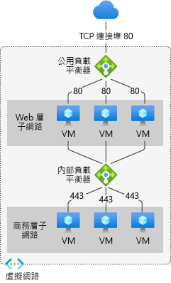

# Azure Load Balancer 元件

Azure Load Balancer 包含數個用於運作的主要元件。 您可以透過 Azure 入口網站、Azure CLI、Azure PowerShell 或範本，在您的訂用帳戶中設定這些元件。

## 前端 IP 組態

負載平衡器的 IP 位址。 這是用戶端的連絡點。 這些位址可以是：

- **公用 IP 位址**
- **私人 IP 位址**

選取 IP 位址會決定所建立之負載平衡器的**類型**。 選取私人 IP 位址會建立內部負載平衡器。 選取公用 IP 位址會建立公用負載平衡器。

|  | 公用 Load Balancer  | 內部負載平衡器 |
| ---------- | ---------- | ---------- |
| 前端 IP 組態| 公用 IP 位址 | 私人 IP 位址|
| 描述 | 公用負載平衡器會將傳入流量的公用 IP 和連接埠對應至 VM 的私人 IP 和連接埠。 對於來自 VM 的回應流量，負載平衡器會以相反的方式對應流量。 您可以套用負載平衡規則，以將特定類型的流量分散至多個 VM 或服務。 例如，您可以將 Web 要求的流量負載分散在多個 Web 伺服器。| 內部負載平衡器會將流量分散到虛擬網路內的資源。 Azure 會限制存取虛擬網路的負載平衡前端 IP 位址。 前端 IP 位址與虛擬網路絕不會直接公開至網際網路端點。 內部企業營運應用程式會在 Azure 中執行，並且可從 Azure 內或內部部署資源內存取。 |
| 支援的 SKU | 基本和標準 | 基本和標準 |

## 後端集區

將會為傳入要求提供服務的一組虛擬機器或虛擬機器擴展集中的執行個體。 若要以符合成本效益的方式進行擴充，以滿足大量的傳入流量運算，計算指導方針通常會建議您在後端集區中新增更多執行個體。 

當您擴大或縮小執行個體時，負載平衡器會立即透過自動重新設定功能來自行重新設定。 從後端集區新增或移除 VM 會重新設定負載平衡器，而不需要進行其他作業。 後端集區的範圍是虛擬網路中的任何虛擬機器。 

在考量如何設計您的後端集區時，可以將最少量的個別後端集區資源作為設計原則，以最佳化執行管理作業所需的時間。 在資料平面的效能或規模方面沒有任何差異。

## 健康狀態探查

健康情況探查可用來判斷後端集區中執行個體的健康情況。 您可以為健康情況探查定義狀況不良臨界值。 當探查無法回應時，負載平衡器會停止傳送新的連線至狀況不良的執行個體。 探查失敗不會影響現有的連線。 連線會繼續進行，直到應用程式：

- 結束流程
- 發生閒置逾時
- VM 關機

Load Balancer 會為以下端點提供不同的健康情況探查類型：

- TCP
- HTTP
- HTTPS

基本負載平衡器不支援 HTTPS 探查。 基本負載平衡器會關閉所有 TCP 連線 (包括已建立的連線)。

## 負載平衡規則

負載平衡器會根據負載平衡規則了解該怎麼做。 負載平衡規則會將指定的前端 IP 組態和連接埠對應至多個後端 IP 位址和連接埠。

## 傳入的 NAT 規則

輸入 NAT 規則會將來自前端 IP 位址的流量轉送到虛擬網路內的後端執行個體。 連接埠轉送作業會使用與負載平衡相同的雜湊式分送來完成。 

使用的範例是遠端桌面通訊協定 (RDP) 或安全殼層 (SSH) 工作階段，以將虛擬網路中的 VM 執行個體分開。 您可以將多個內部端點對應至相同前端 IP 位址的連接埠。 前端 IP 位址可以從遠端管理 VM，而不需要額外的 jumpbox。

## 輸出規則

輸出規則會針對後端集區所識別的所有虛擬機器或執行個體設定輸出網路位址轉譯 (NAT)。

基本負載平衡器不支援輸出規則。

## 後續步驟

- 請參閱 [建立公用 Standard Load Balancer](quickstart-load-balancer-standard-public-portal.md) 以開始使用 Load Balancer。
- 深入了解 [Azure Load Balancer](load-balancer-overview.md)。
- 了解[公用 IP 位址](https://docs.microsoft.com/azure/virtual-network/virtual-network-public-ip-address)
- 了解[私戈 IP 位址](https://docs.microsoft.com/azure/virtual-network/virtual-network-ip-addresses-overview-arm#private-ip-addresses)
- 了解如何使用[標準 Load Balancer 和可用性區域](load-balancer-standard-availability-zones.md)。
- 了解[標準 Load Balancer 診斷](load-balancer-standard-diagnostics.md)。
- 深入了解[閒置時重設 TCP](load-balancer-tcp-reset.md)。
- 了解[具有 HA 連接埠負載平衡規則的標準 Load Balancer](load-balancer-ha-ports-overview.md)。
- 了解如何搭配使用 [Load Balancer 與多個前端](load-balancer-multivip-overview.md)。
- 深入了解[網路安全性群組](../virtual-network/security-overview.md)。
- 了解[探查類型](load-balancer-custom-probe-overview.md#types)。
- 深入了解[負載平衡器限制](https://docs.microsoft.com/azure/azure-resource-manager/management/azure-subscription-service-limits#load-balancer)。
- 了解如何使用[連接埠轉送](https://docs.microsoft.com/azure/load-balancer/tutorial-load-balancer-port-forwarding-portal)。
- 深入了解[負載平衡器輸出規則](https://docs.microsoft.com/azure/load-balancer/load-balancer-outbound-rules-overview)。
