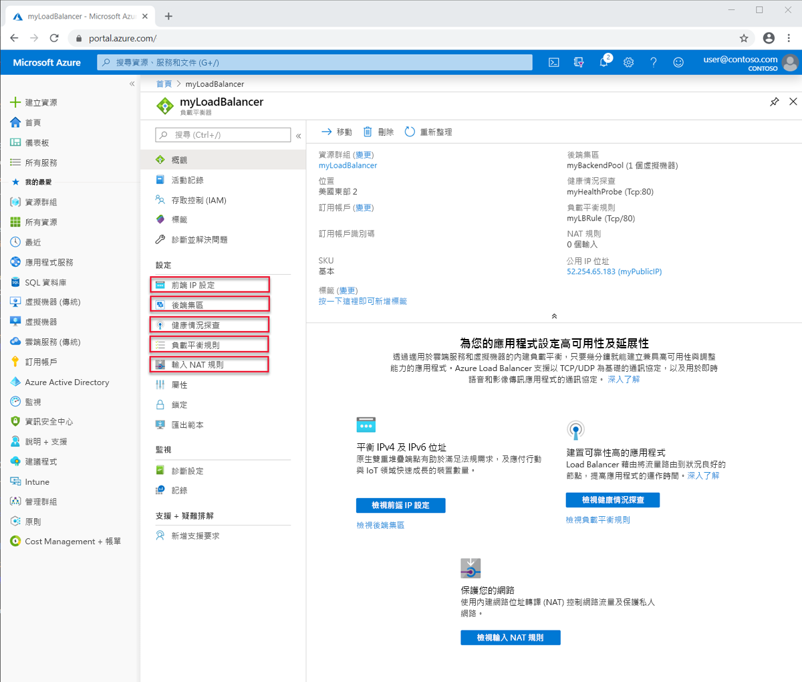
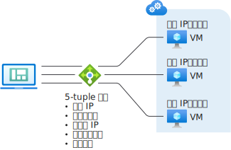
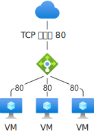

# Load Balancer 的元件與限制
Azure Load Balancer 包含數個用於運作的主要元件。  您可以透過 Azure 入口網站、Azure CLI 或 Azure PowerShell，在您的訂用帳戶中設定這些元件。  

## Load Balancer 元件

* **前端 IP 設定**：負載平衡器的 IP 位址。 這是用戶端的連絡點。 這些位址可以是： 

    - **[公用 IP 位址](https://docs.microsoft.com/azure/virtual-network/virtual-network-public-ip-address)**
    - **[私人 IP 位址](https://docs.microsoft.com/azure/virtual-network/virtual-network-ip-addresses-overview-arm#private-ip-addresses)**

* **後端集區**：將會為傳入要求提供服務的一組虛擬機器或虛擬機器擴展集中的執行個體。 若要以符合成本效益的方式進行擴充，以滿足大量的傳入流量運算，計算指導方針通常會建議您在後端集區中新增更多執行個體。 當您相應增加或減少執行個體時，Load Balancer 會立即透過自動重新設定功能來自行重新設定。 從後端集區新增或移除 VM 會重新設定 Load Balancer，而不需要進行其他作業。 後端集區的範圍是虛擬網路中的任何虛擬機器。 後端集區最多可以有 1000 個後端執行個體或 IP 組態。
範圍有限的基本 Load Balancer (可用性設定組) 只能相應增加到300 個 IP 組態。 如需限制詳細資訊，請參閱[負載平衡器限制](https://docs.microsoft.com/azure/azure-resource-manager/management/azure-subscription-service-limits#load-balancer)。 在考量如何設計您的後端集區時，您可以將最少量的個別後端集區資源作為設計原則，以進一步最佳化執行管理作業所需的時間。 在資料平面的效能或規模方面沒有任何差異。
* **健康情況探查**： **[健康情況探查](https://docs.microsoft.com/azure/load-balancer/load-balancer-custom-probe-overview)** 可用來判斷後端集區中執行個體的健康情況。 您可以為健康情況探查定義狀況不良臨界值。 當探查無法回應時，Load Balancer 會停止傳送新的連線至狀況不良的執行個體。 探查失敗不會影響現有的連線。 
    
    連線會繼續進行，直到應用程式： 
    - 結束流程
    - 發生閒置逾時
    - VM 關機

    Load Balancer 會為以下端點提供不同的健康情況探查類型：
    - TCP
    - HTTP
    - HTTPS (使用傳輸層安全性 (TLS) 包裝函式的 HTTP 探查)
     
     基本 Load Balancer 不支援 HTTPS 探查。 此外，基本 Load Balancer 將會終止所有 TCP 連線 (包括已建立的連線)。 
    如需詳細資訊，請參閱[探查類型](load-balancer-custom-probe-overview.md#types)。

* **負載平衡規則**：負載平衡規則會告訴 Load Balancer 必須在何時完成什麼工作。 
* **輸入 NAT 規則**：輸入 NAT 規則會將來自特定前端 IP 位址的特定連接埠的流量，轉送至虛擬網路內特定後端執行個體的特定連接埠。 **[連接埠轉送作業](https://docs.microsoft.com/azure/load-balancer/tutorial-load-balancer-port-forwarding-portal)** 會使用與負載平衡相同的雜湊式分送來完成。 此功能的常見案例是透過遠端桌面通訊協定 (RDP) 或安全殼層 (SSH) 工作階段連線至 Azure 虛擬網路內的個別 VM 執行個體。 您可以將多個內部端點對應至相同前端 IP 位址的連接埠。 您可以使用前端 IP 位址從遠端管理 VM，而不需要額外的跳躍箱。
* **輸出規則**： **[輸出規則](https://docs.microsoft.com/azure/load-balancer/load-balancer-outbound-rules-overview)** 會設定輸出網路位址轉譯 (NAT)，以便讓標準 Load Balancer 的後端集區所識別的所有虛擬機器或執行個體轉譯至前端。
基本 Load Balancer 不支援輸出規則。

## Load Balancer 概念

Load Balancer 為 TCP 和 UDP 應用程式提供下列基本功能：

* **負載平衡演算法**：有了 Azure Load Balancer，您就能建立負載平衡規則，將抵達前端的流量分送給各個後端集區執行個體。 Load Balancer 會使用雜湊演算法來分送輸入流程 (而非位元組)，並重寫流向後端集區執行個體的流程標頭。 當健康情況探查表示後端端點狀況良好時，伺服器便可以接收新的流程。
根據預設，Load Balancer 會使用 5 個元組的雜湊。 

   雜湊包含： 

   - **來源 IP 位址**
   - **來源連接埠**
   - **目的地 IP 位址**
   - **目的地連接埠**
   - **將流量對應至可用伺服器的 IP 通訊協定編號** 

您可以將 2 或 3 個元組的雜湊用於指定的規則，以建立來源 IP 位址的親和性。 相同封包流程的所有封包會抵達相同執行個體，執行個體位於已負載平衡的前端之後。 當用戶端從相同的來源 IP 起始新的流程時，來源連接埠將會變更。 因此，5 個元組的雜湊可能會使流量送往不同的後端端點。
如需詳細資訊，請參閱[設定 Azure Load Balancer 的分送模式](./load-balancer-distribution-mode.md)。 

下列影像顯示雜湊型分送：

  

  *圖：雜湊型分散*

* **應用程式獨立性和透明度**：Load Balancer 不會直接與 TCP 或 UDP 或應用程式層互動。 任何 TCP 或 UDP 應用程式案例均受支援。 Load Balancer 不會終止或產生流程、與流程的承載互動，或提供任何應用層閘道功能。 通訊協定交握一律會在用戶端與後端集區執行個體之間直接執行。 輸入流程的回應一律是來自虛擬機器的回應。 當流程到達虛擬機器時，也會保留原始的來源 IP 位址。
  * 每個端點只會由 VM 回應。 例如，TCP 交握一律是在用戶端和選取的後端 VM 之間發生。 前端要求的回應是由後端 VM 所產生的回應。 當您已順利驗證前端連線時，您至少要驗證一個後端虛擬機器的端對端連線。
  * 對 Load Balancer 而言，應用程式承載是透明可見的。 任何 UDP 或 TCP 應用程式均受支援。
  * 由於 Load Balancer 不會與 TCP 裝載互動及提供 TLS 卸載，您可以建置端對端加密的案例。 使用 Load Balancer，可藉由終止 VM 本身的 TLS 連線，讓 TLS 應用程式進行大規模的向外延展。 舉例而言，您的 TLS 工作階段金鑰處理容量只會受限於您新增至後端集區的 VM 類型和數量。

* **輸出連線**：所有從虛擬網路內私人 IP 位址送往網際網路上公用 IP 位址的輸出流程，皆可以轉譯為 Load Balancer 的前端 IP 位址。 當公用前端透過負載平衡規則繫結至後端 VM 時，Azure 會將輸出連線轉譯為公用前端 IP 位址。 此組態有下列優點：
  * 能夠輕鬆進行服務的升級及災害復原，因為前端可以動態對應到服務的另一個執行個體。
  * 讓存取控制清單 (ACL) 管理變得更容易。 當服務相應增加、相應減少或重新部署時，以前端 IP 表示的 ACL 不會變更。 將輸出連線轉譯成數量比機器更少的 IP 位址，可以減輕實作安全收件者清單的負擔。

  標準 Load Balancer 利用[強大、可擴充且可預測的 SNAT 演算法](load-balancer-outbound-connections.md#snat)。使用 Standard Load Balancer 時須注意的重要原則如下：

    - 負載平衡規則會推斷 SNAT 的程式設計方式。 負載平衡規則會隨通訊協定而不同。 SNAT 會隨通訊協定而不同，且設定應反映這一點，而非產生負面影響。

    - **多個前端** 有多個可用的前端時，將會使用所有前端，而每個前端分別會使可用的 SNAT 連接埠數目隨之增加。 如果您因為預期會有或已面臨大量輸出連線需求而需要更多 SNAT 連接埠，您也可以藉由對相同的虛擬機器資源設定額外的前端、規則和後端集區，來加入增量的 SNAT 連接埠數量。

    - **控制用於輸出的前端** 您可以選擇及控制是否不要讓特定前端用於輸出連線。 如果您想要將輸出連線限定為僅來自特定的前端 IP 位址，您可以選擇性地在表示輸出對應的規則中停用輸出 SNAT。

    - **控制輸出連線** 輸出案例是明確的，且必須經由指定才會有輸出連線存在。 標準 Load Balancer 存在於虛擬網路的內容中。  虛擬網路是隔離的私人網路。  若未與公用 IP 位址有所關聯，就不會允許公用連線。  您可以存取 [VNet 服務端點](../virtual-network/virtual-network-service-endpoints-overview.md)，因為它們位於您虛擬網路內部的本機位置。  如果您想要對您虛擬網路外部的目的地建立輸出連線，您有兩個選項：
        - 將標準 SKU 公用 IP 位址作為執行個體層級的公用 IP 位址，指派給虛擬機器資源，或
        - 將虛擬機器資源放在公用標準 Load Balancer 的後端集區中。

        這兩種方式都允許從虛擬網路到虛擬網路外部的輸出連線。 

        如果您_只有_內部標準 Load Balancer 與您虛擬機器資源所在的後端集區相關聯，則您的虛擬機器將只能存取虛擬網路資源和 [VNet 服務端點](../virtual-network/virtual-network-service-endpoints-overview.md)。  您可以依照上一段說明的步驟來建立輸出連線。

        與標準 SKU 無關聯之虛擬機器資源的輸出連線會維持原狀。

        請檢閱[輸出連線的詳細討論](load-balancer-outbound-connections.md)。

* **可用性區域**：標準 Load Balancer 在可使用「可用性區域」的區域中可支援較多功能。 這些功能會累加於所有標準 Standard Load Balancer 所提供的功能之上。  公用和內部標準 Load Balancer 兩種類型皆可進行可用性區域設定。
 區域備援前端不受區域失敗的影響，且所有區域中的專用基礎結構會同時為其提供服務。 
此外，您可以確保前端可用於特定區域。 區域性前端與個別的區域會有共同的結果，且只有單一區域中的專用基礎結構會為其提供服務。
跨區域負載平衡適用於後端集區，虛擬網路中的任何虛擬機器資源都可以是後端集區的一部分。
基本 Load Balancer 不支援區域。
如需詳細資訊，請檢閱[可用性區域相關功能的詳細討論](load-balancer-standard-availability-zones.md)和[可用性區域概觀](../availability-zones/az-overview.md)。

* **HA 連接埠**︰您可以設定負載平衡規則，讓應用程式延展並變得高度可靠。 當您使用 HA 連接埠負載平衡規則時，標準 Load Balancer 將會在內部標準 Load Balancer 之前端 IP 位址的每個暫時連接埠上提供以流量為準的負載平衡。  對於那些指定個別連接埠並不實際或不符合需求的其他案例來說，此功能相當實用。 HA 連接埠負載平衡規則可讓您為網路虛擬設備和任何需要大範圍輸入連接埠的應用程式，建立主動-被動或主動-主動 n + 1 的案例。  健康情況探查可用來判斷哪個後端應接收新的流量。  您可以使用網路安全性群組來模擬連接埠範圍案例。 基本 Load Balancer 不支援 HA 連接埠。
請檢閱 [HA 連接埠的詳細討論](load-balancer-ha-ports-overview.md)
>[!IMPORTANT]
> 如果您打算使用網路虛擬設備，請要求廠商提供相關指引以了解是否其產品是否經過 HA 連接埠的測試，並遵循其指引進行實作。 

* **多個前端**：Load Balancer 支援為多個前端使用多項規則。  標準 Load Balancer 可將此支援擴及至輸出案例。  輸出案例基本上就是與輸入負載平衡規則相反的情形。  輸入負載平衡規則也會建立輸出連線的關聯性。 標準 Load Balancer 會透過負載平衡規則使用所有與虛擬機器資源相關聯的前端。  此外，您可以透過負載平衡規則的參數來抑制輸出連線用途的負載平衡規則，而使特定前端的可用選項變成空的。

相對地，基本 Load Balancer 會隨機選取單一前端，且無法控制能夠選取哪一個。
## Load Balancer 類型

### 公用 Load Balancer

公用 Load Balancer 會將傳入流量的公用 IP 位址和連接埠對應至 VM 的私人 IP 位址和連接埠。 對於來自 VM 的回應流量，Load Balancer 會以相反的方式對應流量。 您可以套用負載平衡規則，以將特定類型的流量分散至多個 VM 或服務。 例如，您可以將 Web 要求的流量負載分散在多個 Web 伺服器。

>[!NOTE]
>對於每個可用性設定組，您只能執行一個公用 Load Balancer 和一個內部 Load Balancer。

下圖顯示在三個 VM 間共用，且公用和 TCP 連接埠均為 80 的 Web 流量負載平衡端點。 這三部 VM 均位在負載平衡集中。

  

圖：  使用公用負載平衡器來平衡 Web 流量負載

網際網路用戶端會在 TCP 連接埠 80 上，將網頁要求傳送至 Web 應用程式的公用 IP 位址。 Azure Load Balancer 會將要求分散到負載平衡集內的三個 VM。 如需 Load Balancer 演算法的詳細資訊，請參閱 [Load Balancer 概念](concepts-limitations.md#load-balancer-concepts)。

根據預設，Azure Load Balancer 會在多個 VM 執行個體之間均分網路流量。 您也可以設定工作階段親和性。 如需詳細資訊，請參閱[設定 Azure Load Balancer 的分送模式](load-balancer-distribution-mode.md)。

### 內部 Load Balancer

相對於公用負載平衡器，內部負載平衡器只會將流量導向至位於虛擬網路內的資源，或導向至使用 VPN 存取 Azure 基礎結構的資源。 Azure 基礎結構會限制存取虛擬網路的負載平衡前端 IP 位址。 前端 IP 位址與虛擬網路絕不會直接公開至網際網路端點。 內部企業營運應用程式會在 Azure 中執行，並且可從 Azure 內或內部部署資源內存取。

內部 Load Balancer 可提供下列幾種類型的負載平衡：

* **虛擬網路內**：從虛擬網路中的 VM 負載平衡至一組位於相同虛擬網路中的 VM。
* **在跨單位虛擬網路中**：從內部部署電腦負載平衡至一組位於相同虛擬網路中的 VM。
* **多層式應用程式**：對後端層並非網際網路對向的網際網路對向多層式應用程式進行負載平衡。 後端層需要來自網際網路對向層的流量負載平衡。 請參閱下圖。
* **針對企業營運應用程式**：在 Azure 中代管的企業營運應用程式的負載平衡，而不需要額外的負載平衡器硬體或軟體。 此案例包括流量已進行負載平衡的電腦集所包含的內部部署伺服器。

  

*圖：使用公用和內部 Load Balancer 進行多層式應用程式的平衡*

## Load Balancer SKU 的比較

負載平衡器支援基本和標準 SKU。 這些 SKU 的案例規模、功能、價格各不相同。 任何可在基本 Load Balancer 建立的案例，都可以使用 Standard Load Balancer 來建立。 這兩個 SKU 的 API 類似，均透過指定 SKU 來叫用。 從 `2017-08-01` API 開始，所提供的 API 已可支援負載平衡器和公用 IP 的 SKU。 這兩個 SKU 共用相同的一般 API 和結構。

但完整的案例組態可能稍有不同，視 SKU 而定。 當文章僅適用於特定 SKU 時，負載平衡器文件才會加以標注。 若要比較並了解其中的差異，請參閱下表。 如需詳細資訊，請參閱 [Azure Standard Load Balancer 概觀](load-balancer-standard-overview.md)。

>[!NOTE]
> Microsoft 建議使用 Standard Load Balancer。
獨立 VM、可用性設定組和虛擬機器擴展集都只能和一個 SKU 連線，永遠不能和兩者同時連線。 與公用 IP 位址搭配使用時，Load Balancer 和公用 IP 位址的 SKU 必須相符。 Load Balancer 和公用 IP 的 SKU 不可變動。

[!INCLUDE [comparison table](../../includes/load-balancer-comparison-table.md)]

如需詳細資訊，請參閱[負載平衡器限制](https://docs.microsoft.com/azure/azure-resource-manager/management/azure-subscription-service-limits#load-balancer)。 如需標準 Load Balancer 詳細資料，請參閱[概觀](load-balancer-standard-overview.md)、[定價](https://aka.ms/lbpricing)及 [SLA](https://aka.ms/lbsla)。

## 限制

- SKU 是不可變動的。 您無法變更現有資源的 SKU。
- 獨立虛擬機器資源、可用性設定組資源或虛擬機器擴展集資源都只能參考一個 SKU，絕不會同時參考兩者。
- Load Balancer 規則無法跨越兩個虛擬網路。  前端和其相關的後端執行個體必須位於相同的虛擬網路。  
- 標準 LB 與公用 IP 資源不支援[移動訂用帳戶作業](../azure-resource-manager/management/move-resource-group-and-subscription.md)。
- 您可以從僅在一個內部標準 Load Balancer 後面的執行個體，存取沒有 VNet 和其他 Microsoft 平台服務的 Web 背景工作角色。 請勿以此作為個別服務本身，否則基礎平台可能會在不經通知的情況下變更。 如果在只使用內部標準 Load Balancer 時有需要，請一律假設您需要明確建立[輸出連線](load-balancer-outbound-connections.md)。

- Load Balancer 提供針對特定 TCP 或 UDP 通訊協定進行負載平衡和連接埠轉送的功能。 負載平衡規則和輸入 NAT 規則支援 TCP 和 UDP，但不支援其他 IP 通訊協定，包括 ICMP。

  Load Balancer 並不會終止、回應或與 UDP 或 TCP 流程的承載互動。 它並非 Proxy。 對前端的連線必須在負載平衡或是 NAT 傳入規則所使用的相同通訊協定中，成功進行頻內驗證。 至少必須有一個虛擬機器為用戶端產生回應，才能看到來自前端的回應。

  若未從 Load Balancer 前端接收到頻內回應，表示沒有任何虛擬機器能夠回應。 在虛擬機器皆無法回應的情況下，無法與 Load Balancer 前端進行任何互動。 這項準則也適用於連接埠偽裝 SNAT 僅支援 TCP 和 UDP 的輸出連線。 包括 ICMP 在內的任何其他 IP 通訊協定都會失敗。 指派執行個體層級的公用 IP 可緩解此問題。 如需詳細資訊，請參閱[了解 SNAT 和 PAT](load-balancer-outbound-connections.md#snat)。

- 內部 Load Balancer 不會將輸出起始連線轉譯為內部 Load Balancer 的前端，因為這兩者都位於私人 IP 位址空間中。 公用 Load Balancer 提供從虛擬網路內的私人 IP 位址到公用 IP 位址的[輸出連線](load-balancer-outbound-connections.md)。 對於內部 Load Balancer，此方法可避免在無需轉譯的專屬內部 IP 位址空間中將 SNAT 連接埠耗盡。

  其副作用是，如果後端集區 VM 的輸出流程嘗試將流量流程至其集區中的內部 Load Balancer 前端，並且  對應回本身，則這兩個流程互不相符。 由於兩者不相符，流程將會失敗。 如果流程未對應回後端集區中建立前端流程的相同 VM，流程就會成功。

  當流程對應回本身時，傳出流程似乎是來自 VM 而傳至前端，而對應的傳入流程似乎來自 VM 至而傳至本身。 以客體作業系統來看，相同流程的傳入和傳出部分在虛擬機器內部不相符。 TCP 堆疊無法將其中半數的流程視為相同流程的一部分。 來源與目的地不相符。 當流程對應至後端集區中的任何其他 VM 時，半數流程將會相符，而 VM 就能回應流程。

  此案例的徵兆是當流量回到其源自的相同後端時，發生間歇性連線逾時。 常見的因應措施包括在內部 Load Balancer 後方插入 Proxy 層，以及使用伺服器直接回傳 (DSR) 樣式規則。 如需詳細資訊，請參閱[多個 Azure Load Balancer 前端](load-balancer-multivip-overview.md)。

  您可以結合內部 Load Balancer 與任何第三方 Proxy，或將內部[應用程式閘道](../application-gateway/application-gateway-introduction.md)用於使用 HTTP/HTTPS 的 Proxy 案例。 儘管可以使用公用 Load Balancer 來緩解此問題，但產生的案例容易造成 [SNAT 耗盡](load-balancer-outbound-connections.md#snat)。 除非謹慎管理，否則請避免使用此替代方法。

- 一般而言，負載平衡規則不支援轉送 IP 片段。 負載平衡規則不支援 UDP 和 TCP 封包的 IP 分散。 高可用性連接埠負載平衡規則可用來轉送現有的 IP 片段。 如需詳細資訊，請參閱[高可用性連接埠概觀](load-balancer-ha-ports-overview.md)。

## 後續步驟

- 請參閱[建立公用 Standard Load Balancer](quickstart-load-balancer-standard-public-portal.md)，以開始使用 Load Balancer：先建立 Load Balancer，再建立安裝好自訂 IIS 擴充功能的 VM，並對 VM 之間的 Web 應用程式進行負載平衡。
- 深入了解 [Azure Load Balancer](load-balancer-overview.md)。
- 了解如何使用[標準 Load Balancer 和可用性區域](load-balancer-standard-availability-zones.md)。
- 深入了解[健康情況探查](load-balancer-custom-probe-overview.md)。
- 了解[標準 Load Balancer 診斷](load-balancer-standard-diagnostics.md)。
- 了解如何使用 [Load Balancer 來進行輸出連線](load-balancer-outbound-connections.md)。
- 深入了解[輸出規則](load-balancer-outbound-rules-overview.md)。
- 深入了解[閒置時重設 TCP](load-balancer-tcp-reset.md)。
- 了解[具有 HA 連接埠負載平衡規則的標準 Load Balancer](load-balancer-ha-ports-overview.md)。
- 了解如何搭配使用 [Load Balancer 與多個前端](load-balancer-multivip-overview.md)。
- 深入了解[網路安全性群組](../virtual-network/security-overview.md)。
