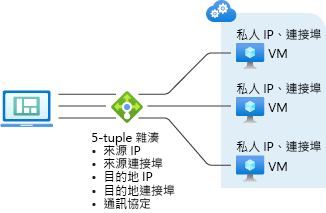

# Azure Load Balancer 演算法

負載平衡器為 UDP 和 TCP 應用程式提供數種功能。

## 負載平衡演算法

您可以建立負載平衡規則，將來自前端的流量分散到後端集區。 Azure Load Balancer 使用雜湊演算法來散發輸入流量 (不是位元組)。 負載平衡器會將流程的標題重寫到後端集區執行個體。 當健康情況探查表示後端端點狀況良好時，伺服器便可以接收新的流程。

根據預設，負載平衡器會使用 5 個元組的雜湊。

雜湊包含：

- **來源 IP 位址**
- **來源連接埠**
- **目的地 IP 位址**
- **目的地連接埠**
- **將流量對應至可用伺服器的 IP 通訊協定編號**

使用兩個或三個元組雜湊來建立來源 IP 位址的親和性。 相同流程的封包會抵達相同執行個體，執行個體位於已負載平衡的前端之後。

當用戶端從相同來源 IP 起始新的流程時，來源連接埠將會變更。 因此，五個元組的雜湊可能會使流量送往不同的後端端點。
如需詳細資訊，請參閱[設定 Azure Load Balancer 的分送模式](./load-balancer-distribution-mode.md)。

下列影像顯示雜湊型分送：

*圖：雜湊型分散*

## 應用程式獨立性和透明度

負載平衡器不會直接與 TCP 或 UDP 或應用程式層互動。 任何 TCP 或 UDP 應用程式案例均受支援。 負載平衡器不會關閉或產生流程，也不會與流程的承載互動。 負載平衡器不會提供應用程式層閘道功能。 通訊協定交握一律會在用戶端與後端集區執行個體之間直接執行。 輸入流程的回應一律是來自虛擬機器的回應。 當流程到達虛擬機器時，也會保留原始的來源 IP 位址。

- 每個端點只會由一個 VM 回應。 例如，TCP 交握是在用戶端和選取的後端 VM 之間發生。 前端要求的回應是由後端 VM 所產生的回應。 當您已順利驗證前端連線時，您至少要驗證一個後端虛擬機器的連線。
- 對負載平衡器而言，應用程式承載是透明可見的。 任何 UDP 或 TCP 應用程式均受支援。
- 由於負載平衡器不會與 TCP 裝載互動及提供 TLS 卸載，您可以建置全面加密的案例。 使用負載平衡器，可藉由終止 VM 本身的 TLS 連線，讓 TLS 應用程式進行大規模的向外延展。 舉例而言，您的 TLS 工作階段金鑰處理容量只會受限於您新增至後端集區的 VM 類型和數量。

## 限制

- 負載平衡器規則無法跨越兩個虛擬網路。  前端和其後端執行個體必須位於相同的虛擬網路。  

- 負載平衡器提供針對特定 TCP 或 UDP 通訊協定進行負載平衡和連接埠轉送的功能。 負載平衡規則和輸入 NAT 規則支援 TCP 和 UDP，但不支援其他 IP 通訊協定，包括 ICMP。

- 從後端 VM 至內部負載平衡器前端的輸出流程將會失敗。

- 負載平衡規則不支援轉送 IP 片段。 負載平衡規則不支援 UDP 和 TCP 封包的 IP 分散。 HA 連接埠負載平衡規則可用來轉送現有的 IP 片段。 如需詳細資訊，請參閱[高可用性連接埠概觀](load-balancer-ha-ports-overview.md)。

## 後續步驟

- 請參閱[建立公用 Standard Load Balancer](quickstart-load-balancer-standard-public-portal.md)，以開始使用 Load Balancer：先建立 Load Balancer，再建立安裝好自訂 IIS 擴充功能的 VM，並對 VM 之間的 Web 應用程式進行負載平衡。
- 深入了解 [Azure Load Balancer 輸出連線](load-balancer-outbound-connections.md)。
- 深入了解 [Azure Load Balancer](load-balancer-overview.md)。
- 深入了解[健康情況探查](load-balancer-custom-probe-overview.md)。
- 了解[標準 Load Balancer 診斷](load-balancer-standard-diagnostics.md)。
- 深入了解[網路安全性群組](../virtual-network/security-overview.md)。
