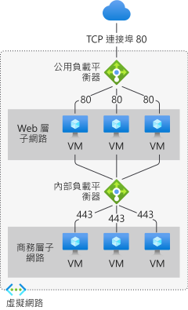

# 什麼是 Azure Load Balancer？

「負載平衡」  是指將負載 (傳入的網路流量) 平均地分散到一組後端資源或伺服器。 

Azure Load Balancer 會在開放系統互相連線 (OSI) 模型的第四層運作。 這是用戶端的單一連絡點。 負載平衡器會將抵達負載平衡器前端的輸入流量分送給後端集區執行個體。 這些流量遵循已設定的負載平衡規則和健康情況探查。 後端集區執行個體可以是 Azure 虛擬機器，也可以是虛擬機器擴展集中的執行個體。

**[公用負載平衡器](./concepts-limitations.md#publicloadbalancer)** 會為虛擬網路內的虛擬機器 (VM) 提供輸出連線。 這些連線會透過將其私人 IP 位址轉譯為公用 IP 位址來完成。 公用負載平衡器可用來對進入 VM 的網際網路流量進行負載平衡。

只有在前端需要私人 IP 時，才會使用 **[內部 (或私人) 負載平衡器](./concepts-limitations.md#internalloadbalancer)** 。 內部負載平衡器可用來對虛擬網路內的流量進行負載平衡。 在混合案例中，您也可以從內部部署網路存取負載平衡器前端。

  

*圖：使用公用和內部 Load Balancer 進行多層式應用程式的平衡*

如需個別負載平衡器元件的詳細資訊，請參閱 [Azure Load Balancer 元件和限制](./concepts-limitations.md)

>[!NOTE]
> Azure 會為您的案例提供一套完整受控的負載平衡解決方案。 如果您需要高效能、低延遲、Layer 4 負載平衡，請參閱[什麼是 Azure 應用程式閘道？](../application-gateway/overview.md) 如果您要尋找全域 DNS 負載平衡，請參閱[什麼是流量管理員？](../traffic-manager/traffic-manager-overview.md) 結合這些解決方案，可能有益於您的端對端案例。
>
> 如需 Azure 負載平衡選項的比較，請參閱 [Azure 中的負載平衡選項概觀](https://docs.microsoft.com/azure/architecture/guide/technology-choices/load-balancing-overview)。

## 為什麼使用 Azure Load Balancer？
您可以使用 Standard Load Balancer 調整您的應用程式，並建立具備高可用性的服務。 負載平衡器支援輸入和輸出案例。 對於所有 TCP 和 UDP 應用程式，負載平衡器可提供低延遲和高輸送量，且最多可相應增加為數百萬個流程。

您可以使用 Standard Load Balancer 完成的主要案例包括：

- 將 **[內部](https://docs.microsoft.com/azure/load-balancer/tutorial-load-balancer-standard-manage-portal)** 和 **[外部](https://docs.microsoft.com/azure/load-balancer/tutorial-load-balancer-standard-internal-portal)** 流量負載平衡至 Azure 虛擬機器。

- 藉由 **[在區域內](https://docs.microsoft.com/azure/load-balancer/tutorial-load-balancer-standard-public-zonal-portal)** 及 **[跨區域](https://docs.microsoft.com/azure/load-balancer/tutorial-load-balancer-standard-public-zone-redundant-portal)** 分配資源來提高可用性。

- 為 Azure 虛擬機器設定 **[輸出連線](https://docs.microsoft.com/azure/load-balancer/load-balancer-outbound-connections)** 。

- 使用 **[健康情況探查](https://docs.microsoft.com/azure/load-balancer/load-balancer-custom-probe-overview)** 來監視已進行負載平衡的資源。

- 使用 **[連接埠轉送](https://docs.microsoft.com/azure/load-balancer/tutorial-load-balancer-port-forwarding-portal)** ，透過公用 IP 位址和連接埠存取虛擬網路中的虛擬機器。

- 啟用 **[IPv6](https://docs.microsoft.com/azure/virtual-network/ipv6-overview)** 的 **[負載平衡](https://docs.microsoft.com/azure/virtual-network/virtual-network-ipv4-ipv6-dual-stack-standard-load-balancer-powershell)** 支援。

- Standard Load Balancer 可透過 [Azure 監視器](https://docs.microsoft.com/azure/azure-monitor/overview)提供多維度計量。  您可針對指定維度篩選、分組及劃分這些計量，  且您可深入檢視服務目前和過去的效能和健康情況。  此外也支援資源健康情況。 如需詳細資訊，請參閱 **[Standard Load Balancer 診斷](load-balancer-standard-diagnostics.md)** 。

- 平衡 **[多個連接埠、多個 IP 位址或這兩者](https://docs.microsoft.com/azure/load-balancer/load-balancer-multivip-overview)** 上的服務負載。

- 在 Azure 區域之間移動 **[內部](https://docs.microsoft.com/azure/load-balancer/move-across-regions-internal-load-balancer-portal)** 和 **[外部](https://docs.microsoft.com/azure/load-balancer/move-across-regions-external-load-balancer-portal)** 的負載平衡器資源。

- 使用 **[HA 連接埠](https://docs.microsoft.com/azure/load-balancer/load-balancer-ha-ports-overview)** ，同時對所有連接埠上的 TCP 和 UDP 流量進行負載平衡。

### 預設保護

Standard Load Balancer 在本質上建置於零信任網路安全性模型上。 Standard Load Balancer 受到預設的保護，而且是虛擬網路的一部分。 虛擬網路是私人的隔離式網路。  這表示對於輸入流量會關閉 Standard Load Balancer 和標準公用 IP 位址，除非網路安全性群組加以開啟。 NSG 可用來明確准許允許的流量。  如果您沒有子網路的 NSG 或虛擬機器資源的 NIC，系統不會允許流量存取此資源。 若要深入了解 NSG 及如何將其套用至您的案例，請參閱[網路安全性群組](../virtual-network/security-overview.md)。
依預設會對網際網路開放基本負載平衡器。

## 價格和 SLA

如需 Standard Load Balancer 的定價資訊，請參閱 [Load Balancer 定價](https://azure.microsoft.com/pricing/details/load-balancer/)。
基本 Load Balancer 則是免費提供。
請參閱[負載平衡器的 SLA](https://aka.ms/lbsla)。 基本負載平衡器沒有 SLA。

## 後續步驟

請參閱 [建立公用 Standard Load Balancer](quickstart-load-balancer-standard-public-portal.md) 以開始使用 Load Balancer。

如需 Azure Load Balancer 限制和元件的詳細資訊，請參閱 [Azure Load Balancer 概念和限制](./concepts-limitations.md)
