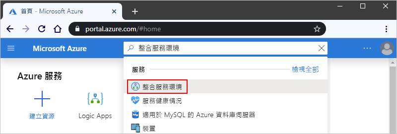
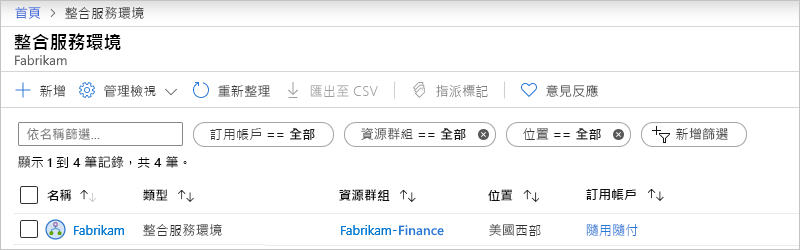
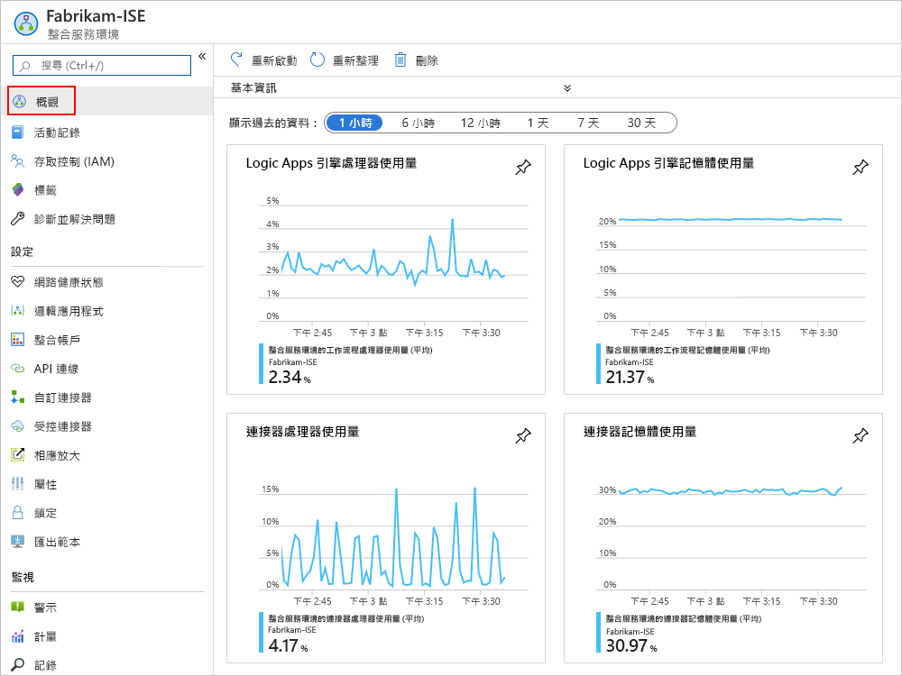
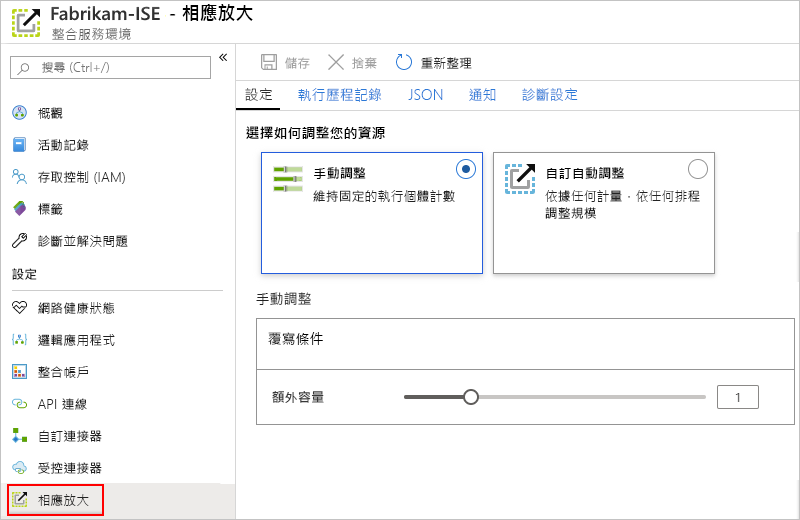
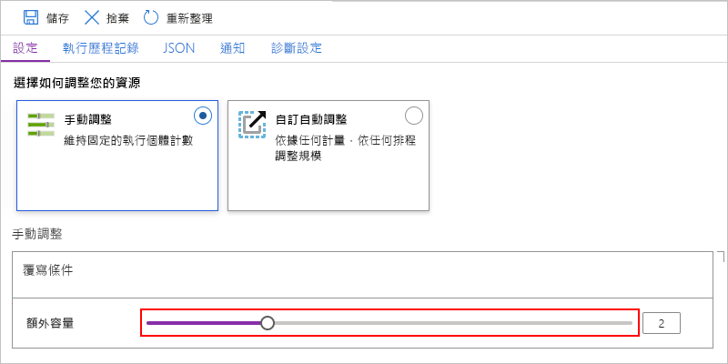
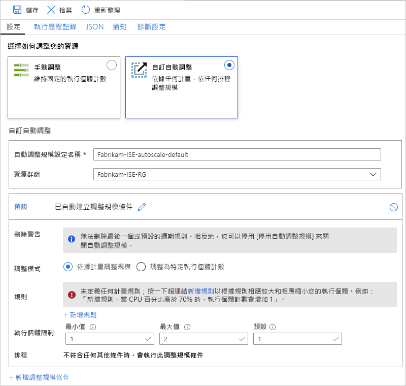

# 在 Azure 邏輯應用中管理整合服務環境 （ISE）

本文演示如何為[整合服務環境 （ISE）](../logic-apps/connect-virtual-network-vnet-isolated-environment-overview.md)執行管理工作，例如：

* 管理 ISE 中的邏輯應用、連接、集成帳戶和連接器等資源。
* 檢查 ISE 的網路運行狀況。
* 添加容量、重新開機 ISE 或刪除 ISE，請按照本主題中的步驟操作。 要將這些專案添加到 ISE，請參閱[向整合服務環境添加工件](../logic-apps/add-artifacts-integration-service-environment-ise.md)。

## 查看您的 ISE

1. 登錄到 Azure[門戶](https://portal.azure.com)。

1. 在門戶的搜索框中，輸入"整合服務環境"，然後選擇**整合服務環境**。

   

1. 從結果清單中選擇整合服務環境。

   

1. 繼續下一節，在 ISE 中查找邏輯應用、連接、連接器或集成帳戶。

## 檢查網路運行狀況

在 ISE 功能表上，**在"設置"** 下，選擇 **"網路運行狀況**"。 此窗格顯示子網的運行狀況和其他服務的出站依賴項。

## 管理邏輯應用

您可以查看和管理 ISE 中的邏輯應用。

1. 在 ISE 功能表上，**在"設置"** 下，選擇 **"邏輯應用**"。

   

1. 要刪除 ISE 中不再需要的邏輯應用，請選擇這些邏輯應用，然後選擇 **"刪除**"。 要確認要刪除，請選擇"**是**"。

## 管理 API 連接

您可以查看和管理由 ISE 中運行的邏輯應用創建的連接。

1. 在 ISE 功能表上，**在"設置"** 下，選擇**API 連接**。

   

1. 要刪除 ISE 中不再需要的連接，請選擇這些連接，然後選擇 **"刪除**"。 要確認要刪除，請選擇"**是**"。

## 管理 ISE 連接器

您可以查看和管理部署到 ISE 的 API 連接器。

1. 在 ISE 功能表上，**在"設置"** 下，選擇 **"託管連接器**"。

   

1. 要刪除 ISE 中不希望可用的連接器，請選擇這些連接器，然後選擇 **"刪除**"。 要確認要刪除，請選擇"**是**"。

## 管理自訂連接器

您可以查看和管理部署到 ISE 的自訂連接器。

1. 在 ISE 功能表上，**在"設置"** 下，選擇 **"自訂連接器**"。

   

1. 要刪除 ISE 中不再需要的自訂連接器，請選擇這些連接器，然後選擇 **"刪除**"。 要確認要刪除，請選擇"**是**"。

## 管理整合帳戶

1. 在 ISE 功能表上，**在"設置"** 下，選擇 **"集成帳戶**"。

   

1. 要在不再需要時從 ISE 中刪除集成帳戶，請選擇這些集成帳戶，然後選擇 **"刪除**"。

## 新增 ISE 容量

高級 ISE 基本單位具有固定容量，因此，如果您需要更多輸送量，可以在創建期間或之後添加更多縮放單位。 開發人員 SKU 不包括添加縮放單位的功能。

1. 在[Azure 門戶](https://portal.azure.com)中，轉到 ISE。

1. 要查看 ISE 的使用方式和性能指標，請在 ISE 功能表上選擇 **"概述**"。

   

1. 在 **"設置"** 下，選擇 **"橫向縮小**"。在 **"配置"** 窗格中，從以下選項中進行選擇：

   * [**手動縮放**](#manual-scale)：根據要使用的處理單位數進行縮放。
   * [**自訂自動縮放**](#custom-autoscale)：通過從各種條件中選擇並指定滿足該條件的閾值條件，根據性能指標進行縮放。

   

### 手動調整

1. 選擇 **"手動縮放**"後，選擇 **"額外容量**"，選擇要使用的縮放單位數。

   

1. 完成時，選取 [儲存]****。

### 自訂自動縮放

1. 選擇 **"自訂自動縮放**"後，自動**縮放設置名稱**為 "為設置提供名稱"，並可以選擇選擇該設置所屬的 Azure 資源組。

   

1. 對於 **"預設條件**"，選擇 **"基於指標縮放"** 或 **"縮放"到特定實例計數**。

   * 如果選擇基於實例，請輸入處理單位的數位，該數位的值為 0 到 10。

   * 如果選擇基於指標，請按照以下步驟操作：

     1. 在 **"規則"** 部分中，選擇 **"添加規則**"。

     1. 在 **"縮放規則"** 窗格中，設置規則引發時要執行的操作。

     1. 對於**實例限制**，請指定以下值：

        * **最小**：要使用的最小處理單元數
        * **最大值**： 要使用的處理單元的最大數量
        * **預設值**：如果在讀取資源指標時發生任何問題，並且當前容量低於預設容量，則自動縮放將擴展到預設的處理單位數。 但是，如果當前容量超過預設容量，自動縮放不會擴展。

1. 要添加其他條件，請選擇 **"添加縮放條件**"。

1. 完成自動縮放設置後，請保存更改。

## 重新開機 ISE

如果更改 DNS 伺服器或 DNS 伺服器設置，必須重新開機 ISE，以便 ISE 可以選取這些更改。 重新開機高級 SKU ISE 不會由於冗余和元件在回收期間一次重新開機一個而導致停機。 但是，開發人員 SKU ISE 會因為不存在冗余而遇到停機。 有關詳細資訊，請參閱[ISE SKU](../logic-apps/connect-virtual-network-vnet-isolated-environment-overview.md#ise-level)。

1. 在[Azure 門戶](https://portal.azure.com)中，轉到 ISE。

1. 在 ISE 功能表上，選擇 **"概述**"。 在"概述"工具列上，**重新開機**。

   

## 刪除 ISE

在刪除不再需要的 ISE 或包含 ISE 的 Azure 資源組之前，請檢查 Azure 資源組或 Azure 虛擬網路上的策略或鎖是否沒有，因為這些專案可以阻止刪除。

刪除 ISE 後，可能需要等待長達 9 小時才能嘗試刪除 Azure 虛擬網路或子網。

## 後續步驟

* [向整合服務環境添加資源](../logic-apps/add-artifacts-integration-service-environment-ise.md)