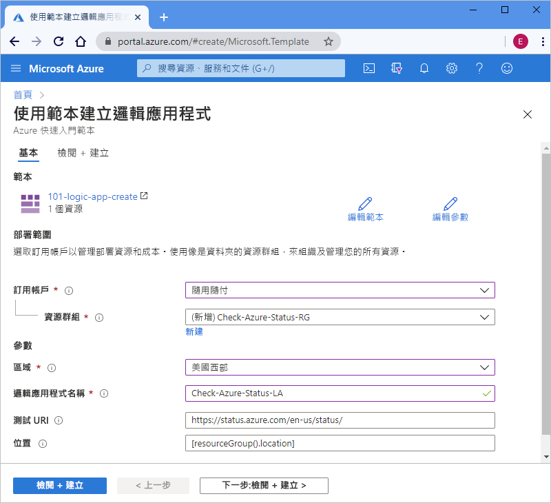

# <a name="quickstart-create-and-deploy-a-logic-app-workflow-by-using-an-arm-template"></a>快速入門：使用 ARM 範本建立和部署邏輯應用程式工作流程

[Azure Logic Apps](../logic-apps/logic-apps-overview.md) 是一項雲端服務，可協助您從[數百個連接器](/connectors/connector-reference/connector-reference-logicapps-connectors)當中選取，以建立和執行自動化工作流程，以整合資料、應用程式、雲端式服務和內部部署系統。 本快速入門著重於部署 Azure Resource Manager 範本 (ARM 範本) 的程序，建立基本邏輯應用程式，以每小時的排程來檢查 Azure 的狀態。 

[!INCLUDE [About Azure Resource Manager](../../includes/resource-manager-quickstart-introduction.md)]

如果您的環境符合必要條件，而且您很熟悉 ARM 範本，請選取 [部署至 Azure] 按鈕。 範本會在 Azure 入口網站中開啟。

[](https://portal.azure.com/#create/Microsoft.Template/uri/https%3a%2f%2fraw.githubusercontent.com%2fAzure%2fazure-quickstart-templates%2fmaster%2f101-logic-app-create%2fazuredeploy.json)

## <a name="prerequisites"></a>必要條件

如果您沒有 Azure 訂用帳戶，請在開始之前建立[免費 Azure 帳戶](https://azure.microsoft.com/free/?WT.mc_id=A261C142F)。

## <a name="review-the-template"></a>檢閱範本

本快速入門會使用 [**建立邏輯應用程式**](https://azure.microsoft.com/resources/templates/101-logic-app-create/)範本，您可以在 [Azure 快速入門範本資源庫](https://azure.microsoft.com/resources/templates)中找到，但是太長而無法在這裡顯示。 相反地，您可以在範本資源庫中檢閱快速入門範本的[「azuredeploy.json 檔案」](https://github.com/Azure/azure-quickstart-templates/blob/master/101-logic-app-create/azuredeploy.json)。

快速入門範本會建立邏輯應用程式工作流程，該工作流程使用「定期」觸發程序 (設定為每小時執行)，以及建立 HTTP [內建動作](../connectors/apis-list.md#connector-types)，其會呼叫可傳回 Azure 狀態的 URL。 內建動作是 Azure Logic Apps 平台的原生動作。

此範本會建立下列 Azure 資源：

* [**Microsoft.Logic/workflows**](/azure/templates/microsoft.logic/workflows)，該資源會建立邏輯應用程式的工作流程。

若要尋找 Azure Logic Apps 的更多快速入門範本，請參閱資源庫中的 [Microsoft.Logic](https://azure.microsoft.com/resources/templates/?resourceType=Microsoft.Logic) 範本。

<a name="deploy-template"></a>

## <a name="deploy-the-template"></a>部署範本

遵循您想要用來部署快速入門範本的選項：

| 選項 | 描述 |
|--------|-------------|
| [Azure 入口網站](../logic-apps/quickstart-create-deploy-azure-resource-manager-template.md?tabs=azure-portal#deploy-template) | 如果您的 Azure 環境符合必要條件，而且您已熟悉使用 ARM 範本，這些步驟可協助您直接登入 Azure，並且在 Azure 入口網站中開啟快速入門範本。 如需詳細資訊，請參閱[使用 ARM 範本與 Azure 入口網站來部署資源](../azure-resource-manager/templates/deploy-portal.md)。 |
| [Azure CLI](../logic-apps/quickstart-create-deploy-azure-resource-manager-template.md?tabs=azure-cli#deploy-template) | Azure 命令列介面 (Azure CLI) 是用來建立和管理 Azure 資源的一組命令。 若要執行這些命令，您需要 Azure CLI 2.6 版或更新版本。 若要檢查 CLI 版本，請輸入 `az --version`。 如需詳細資訊，請參閱下列主題： <p><p>- [什麼是 Azure CLI](/cli/azure/what-is-azure-cli?view=azure-cli-latest) <br>- [開始使用 Azure CLI](/cli/azure/get-started-with-azure-cli?view=azure-cli-latest) |
| [Azure PowerShell](../logic-apps/quickstart-create-deploy-azure-resource-manager-template.md?tabs=azure-powershell#deploy-template) | Azure PowerShell 提供了一組 Cmdlet，其會使用 Azure Resource Manager 模型來管理 Azure 資源。 如需詳細資訊，請參閱下列主題： <p><p>- [Azure PowerShell 概觀](/powershell/azure/azurerm/overview) <br>- [Azure PowerShell Az 模組簡介](/powershell/azure/new-azureps-module-az) <br>- [開始使用 Azure PowerShell](/powershell/azure/get-started-azureps) |
| [Azure 資源管理 REST API](../logic-apps/quickstart-create-deploy-azure-resource-manager-template.md?tabs=rest-api#deploy-template) | Azure 提供具象狀態傳輸 (REST) API，這是支援 HTTP 作業 (方法) 的服務端點，您可以用來建立、擷取、更新或刪除服務資源的存取權。 如需詳細資訊，請參閱[開始使用 Azure REST API](/rest/api/azure/)。 |
|||

<a name="deploy-azure-portal"></a>

#### <a name="portal"></a>[入口網站](#tab/azure-portal)

1. 選取下列影像，在 Azure 入口網站中使用您的 Azure 帳戶進行登入，並且開啟快速入門範本：

   [](https://portal.azure.com/#create/Microsoft.Template/uri/https%3a%2f%2fraw.githubusercontent.com%2fAzure%2fazure-quickstart-templates%2fmaster%2f101-logic-app-create%2fazuredeploy.json)

1. 在入口網站的 [使用範本建立邏輯應用程式] 頁面上，輸入或選取下列值：

   | 屬性 | 值 | 描述 |
   |----------|-------|-------------|
   | **訂用帳戶** | <*Azure-subscription-name*> | 要使用的 Azure 訂用帳戶的名稱 |
   | **資源群組** | <*Azure-resource-group-name*> | 新的或現有 Azure 資源群組的名稱。 此範例會使用 `Check-Azure-Status-RG`。 |
   | **區域** | <*Azure-region*> | 要使用邏輯應用程式的 Azure 資料中心區域。 此範例會使用 `West US`。 |
   | **邏輯應用程式名稱** | <*logic-app-name*> | 用於邏輯應用程式的名稱。 此範例會使用 `Check-Azure-Status-LA`。 |
   | **測試 URI** | <*test-URI*> | 根據特定排程呼叫的服務 URI。 此範例使用 `https://status.azure.com/en-us/status/`，這是 Azure 狀態頁面。 |
   | **位置** |  <*Azure-region-for-all-resources*> | 要用於所有資源的 Azure 區域 (如果與預設值不同的話)。 此範例會使用預設值 `[resourceGroup().location]`，這是資源群組位置。 |
   ||||

   以下是具有此範例中所使用值的頁面外觀：

   

1. 當您完成時，選取 [檢閱 + 建立]。

1. 繼續進行[檢閱已部署資源](#review-deployed-resources)中的步驟。

#### <a name="cli"></a>[CLI](#tab/azure-cli)

```azurecli-interactive
read -p "Enter a project name name to use for generating resource names:" projectName &&
read -p "Enter the location, such as 'westus':" location &&
templateUri="https://raw.githubusercontent.com/Azure/azure-quickstart-templates/master/101-logic-app-create/azuredeploy.json" &&
resourceGroupName="${projectName}rg" &&
az group create --name $resourceGroupName --location "$location" &&
az deployment group create --resource-group $resourceGroupName --template-uri  $templateUri &&
echo "Press [ENTER] to continue ..." &&
read
```

如需詳細資訊，請參閱下列主題：

* [Azure CLI：az deployment group](/cli/azure/deployment/group)
* [使用 ARM 範本與 Azure CLI 來部署資源](../azure-resource-manager/templates/deploy-cli.md)

#### <a name="powershell"></a>[PowerShell](#tab/azure-powershell)

```azurepowershell-interactive
$projectName = Read-Host -Prompt "Enter a project name to use for generating resource names"
$location = Read-Host -Prompt "Enter the location, such as 'westus'"
$templateUri = "https://raw.githubusercontent.com/Azure/azure-quickstart-templates/master/101-logic-app-create/azuredeploy.json"

$resourceGroupName = "${projectName}rg"

New-AzResourceGroup -Name $resourceGroupName -Location "$location"
New-AzResourceGroupDeployment -ResourceGroupName $resourceGroupName -TemplateUri $templateUri

Read-Host -Prompt "Press [ENTER] to continue ..."
```

如需詳細資訊，請參閱下列主題：

* [Azure PowerShell：New-AzResourceGroup](/powershell/module/az.resources/new-azresourcegroup)
* [Azure PowerShell：New-AzResourceGroupDeployment](/powershell/module/az.resources/new-azresourcegroupdeployment)
* [使用 ARM 範本與 Azure PowerShell 來部署資源](../azure-resource-manager/templates/deploy-powershell.md)

#### <a name="rest-api"></a>[REST API](#tab/rest-api)

1. 如果您不想要使用現有的 Azure 資源群組，請針對您傳送至資源管理 REST API 的要求遵循此語法，來建立新的資源群組：

   ```http
   PUT https://management.azure.com/subscriptions/{subscriptionId}/resourcegroups/{resourceGroupName}?api-version=2019-10-01
   ```

   | 值 | 描述 |
   |-------|-------------|
   | `subscriptionId`| 您要使用的 Azure 訂用帳戶的 GUID |
   | `resourceGroupName` | 要建立的 Azure 資源群組名稱。 此範例會使用 `Check-Azure-Status-RG`。 |
   |||

   例如：

   ```http
   PUT https://management.azure.com/subscriptions/xxxxXXXXxxxxXXXXX/resourcegroups/Check-Azure-Status-RG?api-version=2019-10-01
   ```

   如需詳細資訊，請參閱下列主題：

   * [Azure REST API 參考 - 如何呼叫 Azure REST API](/rest/api/azure/)
   * [資源管理 REST API：資源群組 - 建立或更新](/rest/api/resources/resourcegroups/createorupdate)。

1. 若要將快速入門範本部署到您的資源群組，請針對您傳送至資源管理 REST API 的要求遵循此語法：

   ```http
   PUT https://management.azure.com/subscriptions/{subscriptionId}/resourcegroups/{resourceGroupName}/providers/Microsoft.Resources/deployments/{deploymentName}?api-version=2019-10-01
   ```

   | 值 | 描述 |
   |-------|-------------|
   | `subscriptionId`| 您要使用的 Azure 訂用帳戶的 GUID |
   | `resourceGroupName` | 要使用的 Azure 資源群組名稱。 此範例會使用 `Check-Azure-Status-RG`。 |
   | `deploymentName` | 用於部署的名稱。 此範例會使用 `Check-Azure-Status-LA`。 |
   |||

   例如：

   ```http
   PUT https://management.azure.com/subscriptions/xxxxXXXXxxxxXXXXX/resourcegroups/Check-Azure-Status-RG/providers/Microsoft.Resources/deployments/Check-Azure-Status-LA?api-version=2019-10-01
   ```

   如需詳細資訊，請參閱[資源管理 REST API：部署 - 建立或更新](/rest/api/resources/deployments/createorupdate)。

1. 若要提供用於部署 (例如 Azure 區域) 的值和快速入門範本的連結，以及[參數檔案](../azure-resource-manager/templates/template-parameters.md) (其中包含要在部署中使用的快速入門範本值)，請針對您傳送至資源管理 REST API 的要求本文，遵循此語法：

   ```json
   {
      "location": "{Azure-region}",
      "properties": {
         "templateLink": {
            "uri": "{quickstart-template-URL}",
            "contentVersion": "1.0.0.0"
         },
         "parametersLink": {
            "uri": "{quickstart-template-parameter-file-URL}",
            "contentVersion": "1.0.0.0"
         },
         "mode": "Incremental"
      }
   }
   ```

   | 屬性 | 值 | 描述 |
   |----------|-------|-------------|
   | `location`| <*Azure-region*> | 用於部署的 Azure 區域。 此範例會使用 `West US`。 |
   | `templateLink` : `uri` | <*quickstart-template-URL*> | 用於部署的快速入門範本 URL 位置： <p><p>第 1 課：建立 Windows Azure 儲存體物件`https://raw.githubusercontent.com/Azure/azure-quickstart-templates/master/101-logic-app-create/azuredeploy.json`。 |
   | `parametersLink` : `uri` | <*quickstart-template-parameter-file-URL*> | 用於部署的快速入門範本參數檔案 URL 位置： <p><p>`https://raw.githubusercontent.com/Azure/azure-quickstart-templates/master/101-logic-app-create/azuredeploy.parameters.json` <p><p>如需 Resource Manager 參數檔案的詳細資訊，請參閱下列主題： <p><p>- [建立 Resource Manager 參數檔案](../azure-resource-manager/templates/parameter-files.md) <br>- [教學課程：使用參數檔案部署您的 ARM 範本](../azure-resource-manager/templates/template-tutorial-use-parameter-file.md) |
   | `mode` | <*deployment-mode*> | 執行累加式更新或完整更新。 此範例使用 `Incremental`，這是預設值。 如需詳細資訊，請參閱 [Azure Resource Manager 部署模式](../azure-resource-manager/templates/deployment-modes.md)。 |
   |||

   例如：

   ```json
   {
      "location": "West US",
      "properties": {
         "templateLink": {
            "uri": "https://raw.githubusercontent.com/Azure/azure-quickstart-templates/master/101-logic-app-create/azuredeploy.json",
            "contentVersion": "1.0.0.0"
         },
         "parametersLink": {
            "uri": "https://raw.githubusercontent.com/Azure/azure-quickstart-templates/master/101-logic-app-create/azuredeploy.parameters.json",
            "contentVersion": "1.0.0.0"
         },
         "mode": "Incremental"
      }
   }
   ```

如需詳細資訊，請參閱下列主題：

* [資源管理 REST API](/rest/api/resources/)
* [使用 ARM 範本和 Resource Manager REST API 部署資源](../azure-resource-manager/templates/deploy-rest.md)

---

<a name="review-deployed-resources"></a>

## <a name="review-deployed-resources"></a>檢閱已部署的資源

若要檢視邏輯應用程式，您可以使用 Azure 入口網站、執行您使用 Azure CLI 或 Azure PowerShell 所建立的指令碼，或使用邏輯應用程式 REST API。

### <a name="portal"></a>[入口網站](#tab/azure-portal)

1. 在 Azure 入口網站搜尋方塊中，輸入邏輯應用程式的名稱，在此範例中為 `Check-Azure-Status-LA`。 從結果清單中，選取您的邏輯應用程式。

1. 在 Azure 入口網站中，尋找並選取邏輯應用程式，在此範例中為 `Check-Azure-Status-RG`。

1. 當邏輯應用程式設計工具開啟時，請檢閱快速入門範本所建立的邏輯應用程式。

1. 若要測試邏輯應用程式，請在設計工具的工具列上選取 [執行]。

### <a name="cli"></a>[CLI](#tab/azure-cli)

```azurecli-interactive
echo "Enter your logic app name:" &&
read logicAppName &&
az logic workflow show --name $logicAppName &&
echo "Press [ENTER] to continue ..."
```

如需詳細資訊，請參閱 [Azure CLI：az logic workflow show](/cli/azure/ext/logic/logic/workflow?view=azure-cli-latest#ext-logic-az-logic-workflow-show)。

### <a name="powershell"></a>[PowerShell](#tab/azure-powershell)

```azurepowershell-interactive
$logicAppName = Read-Host -Prompt "Enter your logic app name"
Get-AzLogicApp -Name $logicAppName
Write-Host "Press [ENTER] to continue..."
```

如需詳細資訊，請參閱 [Azure PowerShell：Get-AzLogicApp](/powershell/module/az.logicapp/get-azlogicapp)。

### <a name="rest-api"></a>[REST API](#tab/rest-api)

```http
GET https://management.azure.com/subscriptions/{subscriptionId}/resourceGroups/{resourceGroupName}/providers/Microsoft.Logic/workflows/{workflowName}?api-version=2016-06-01
```

| 值 | 描述 |
|-------|-------------|
| `subscriptionId`| 您部署快速入門範本所在的 Azure 訂用帳戶 GUID。 |
| `resourceGroupName` | 您部署快速入門範本所在的 Azure 資源群組名稱。 此範例會使用 `Check-Azure-Status-RG`。 |
| `workflowName` | 您部署的邏輯應用程式名稱。 此範例會使用 `Check-Azure-Status-LA`。 |
|||

例如：

```http
GET https://management.azure.com/subscriptions/xxxxXXXXxxxxXXXXX/resourceGroups/Check-Azure-Status-RG/providers/Microsoft.Logic/workflows/Check-Azure-Status-LA?api-version=2016-06-01
```

如需詳細資訊，請參閱 [Logic Apps REST API：Workflows - Get](/rest/api/logic/workflows/get)。

---

## <a name="clean-up-resources"></a>清除資源

如果您打算繼續進行後續的快速入門和教學課程，您可以保留這些資源。 當您不再需要邏輯應用程式時，請藉由使用 Azure 入口網站、Azure CLI、Azure PowerShell 或資源管理 REST API，來刪除資源群組。

### <a name="portal"></a>[入口網站](#tab/azure-portal)

1. 在 Azure 入口網站中，尋找並選取您想要刪除的資源群組，在此範例中為 `Check-Azure-Status-RG`。

1. 在資源群組功能表上，選取 [概觀] (如果尚未選取)。 在 [概觀] 頁面上，選取 [刪除資源群組]。

1. 若要確認，請輸入資源群組的名稱。

如需詳細資訊，請參閱[刪除資源群組](../azure-resource-manager/management/delete-resource-group.md?tabs=azure-portal#delete-resource-group)。

### <a name="cli"></a>[CLI](#tab/azure-cli)

```azurecli-interactive
echo "Enter your resource group name:" &&
read resourceGroupName &&
az group delete --name $resourceGroupName &&
echo "Press [ENTER] to continue ..."
```

如需詳細資訊，請參閱 [Azure CLI：az group delete](/cli/azure/group?view=azure-cli-latest#az-group-delete)。

### <a name="powershell"></a>[PowerShell](#tab/azure-powershell)

```azurepowershell-interactive
$resourceGroupName = Read-Host -Prompt "Enter the resource group name"
Remove-AzResourceGroup -Name $resourceGroupName
Write-Host "Press [ENTER] to continue..."
```

如需詳細資訊，請參閱 [Azure PowerShell：Remove-AzResourceGroup](/powershell/module/azurerm.resources/remove-azurermresourcegroup)。

### <a name="rest-api"></a>[REST API](#tab/rest-api)

```http
DELETE https://management.azure.com/subscriptions/{subscriptionId}/resourcegroups/{resourceGroupName}?api-version=2019-10-01
```

| 值 | 描述 |
|-------|-------------|
| `subscriptionId`| 您部署快速入門範本所在的 Azure 訂用帳戶 GUID。 |
| `resourceGroupName` | 您部署快速入門範本所在的 Azure 資源群組名稱。 此範例會使用 `Check-Azure-Status-RG`。 |
|||

例如：

```http
GET https://management.azure.com/subscriptions/xxxxXXXXxxxxXXXXX/resourceGroups/Check-Azure-Status-RG?api-version=2019-10-01
```

如需詳細資訊，請參閱[資源管理 REST API：Resource Groups - Delete](/rest/api/resources/resourcegroups/delete)。

---

## <a name="next-steps"></a>後續步驟

> [!div class="nextstepaction"]
> [教學課程：建立及部署您的第一個 ARM 範本](../azure-resource-manager/templates/template-tutorial-create-first-template.md)
