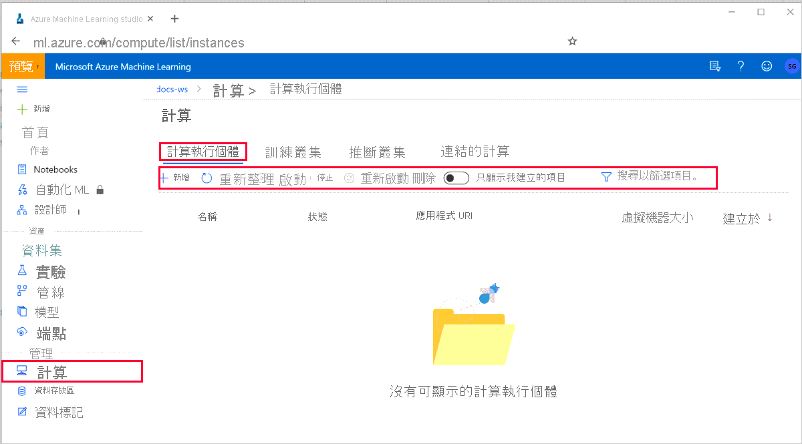

# 什麼是 Azure Machine Learning 計算執行個體？

Azure Machine Learning 計算實例是適用于資料科學家的受控雲端式工作站。

計算執行個體可讓您輕鬆地開始使用 Azure Machine Learning 開發，以及為 IT 系統管理員提供管理和企業就緒功能。  

使用計算實例作為機器學習服務在雲端中已完全設定和受控的開發環境。 它們也可以做為用於開發和測試目的之定型和推斷的計算目標。  

針對生產等級模型訓練，使用具有多節點調整功能的[Azure Machine Learning 計算](how-to-set-up-training-targets.md#amlcompute)叢集。 針對生產等級模型部署，請使用[Azure Kubernetes Service](how-to-deploy-azure-kubernetes-service.md)叢集。

## 為何要使用計算執行個體？

計算執行個體是完全受控的雲端式工作站，並已針對機器學習開發環境予以最佳化。 其提供下列優點：

|主要權益|描述|
|----|----|
|生產力|您可以在 Azure Machine Learning studio 中使用整合式筆記本和下列工具來建立和部署模型： -  Jupyter -  JupyterLab -RStudio （預覽） 計算實例已與 Azure Machine Learning 工作區和 studio 完全整合。 您可以與工作區中的其他資料科學家共用筆記本和資料。 您也可以使用[SSH](how-to-set-up-vs-code-remote.md)來設定 VS Code 遠端開發 |
|受控且安全|降低您的安全性磁碟使用量，並提升與企業安全性需求的合規性。 計算執行個體會提供健全的管理原則和安全的網路設定，例如：  - 從 Resource Manager 範本或 Azure Machine Learning SDK 自動佈建 - [角色型存取控制 (RBAC)](/azure/role-based-access-control/overview) - [虛擬網路支援](how-to-enable-virtual-network.md#compute-instance) - 用以啟用/停用 SSH 存取的 SSH 原則 已啟用 TLS 1。2 |
|預先設定 &nbsp; 的 &nbsp; ML|使用已預先設定好的最新 ML 套件、深度學習架構、GPU 驅動程式，節省設定工作的時間。|
|可完全自訂|廣泛支援各種 Azure VM 類型 (包括 GPU) 和持續性的低層級自訂，例如安裝套件和驅動程式可讓您輕鬆地建置進階案例。 |

## 工具和環境

> [!IMPORTANT]
> 下列已標記的工具（預覽）目前為公開預覽狀態。
> 預覽版本是在沒有服務等級協定的情況下提供，不建議用於生產工作負載。 可能不支援特定功能，或可能已經限制功能。 如需詳細資訊，請參閱 [Microsoft Azure 預覽版增補使用條款](https://azure.microsoft.com/support/legal/preview-supplemental-terms/)。

Azure Machine Learning 計算執行個體可讓您在工作區中以完全整合的筆記本體驗來撰寫、定型和部署模型。

下列工具和環境會安裝在計算執行個體上： 

|一般工具和環境|詳細資料|
|----|:----:|
|驅動程式|`CUDA` `cuDNN` `NVIDIA` `Blob FUSE` |
|Intel MPI Library||
|Azure CLI ||
|Azure Machine Learning 範例 ||
|Docker||
|Nginx||
|NCCL 2.0 ||
|Protobuf|| 

|**R** 工具和環境|詳細資料|
|----|:----:|
|RStudio 伺服器開放原始碼版本（預覽）||
|R 核心||
|適用於 R 的 Azure Machine Learning SDK|[azuremlsdk](https://azure.github.io/azureml-sdk-for-r/reference/index.html) SDK 範例|

|**PYTHON** 工具和環境|詳細資料|
|----|----|
|Anaconda Python||
|Jupyter 和擴充功能||
|Jupyterlab 和擴充功能||
[Azure Machine Learning SDK for Python](https://docs.microsoft.com/python/api/overview/azure/ml/intro?view=azure-ml-py) 從 PyPI|包含大部分的 azureml 額外套件。  若要查看完整清單，請[在計算執行個體上開啟終端機視窗](how-to-run-jupyter-notebooks.md#terminal)並執行   `conda list -n azureml_py36 azureml*` |
|其他 PyPI 套件|`jupytext` `tensorboard` `nbconvert` `notebook` `Pillow`|
|Conda 套件|`cython` `numpy` `ipykernel` `scikit-learn` `matplotlib` `tqdm` `joblib` `nodejs` `nb_conda_kernels`|
|深度學習套件|`PyTorch` `TensorFlow` `Keras` `Horovod` `MLFlow` `pandas-ml` `scrapbook`|
|ONNX 套件|`keras2onnx` `onnx` `onnxconverter-common` `skl2onnx` `onnxmltools`|
|Azure Machine Learning Python和 R SDK 範例||

Python 套件全都安裝在 **Python 3.6 - AzureML** 環境中。  

### 安裝套件

您可以直接在 Jupyter 筆記本或 Rstudio 中安裝套件：

* RStudio：使用右下角的 [套件] 索引標籤，或左上角的 [主控台] 索引標籤。  
* Python：在 Jupyter 筆記本資料格中新增安裝程式碼並執行。

或者，您也可以使用下列任何一種方式來存取終端機視窗：

* RStudio：選取左上角的 [終端機] 索引標籤。
* Jupyter Lab：在 [啟動器] 索引標籤中的 [其他] 標題下，選取 [終端機] 圖格。
* Jupyter：在 [檔案] 索引標籤的右上角選取 [新增] > [終端機]。
* 透過 SSH 連線到電腦。  然後將 Python 套件安裝到 **Python 3.6 - AzureML** 環境中。  將 R 套件安裝到 **R** 環境中。

## 存取檔案

筆記本和 R 指令碼會儲存在 Azure 檔案共用中您工作區的預設儲存體帳戶內。  這些檔案位於您的「使用者檔案」目錄底下。 此儲存體可讓您輕鬆地在計算執行個體之間共用筆記本。 當您停止或刪除計算執行個體時，儲存體帳戶也會讓您的筆記本安全地保留下來。

您工作區的 Azure 檔案共用帳戶會掛接為計算執行個體上的磁碟機。 此磁碟機是 Jupyter、Jupyter Labs 和 RStudio 的預設工作目錄。 這表示您在 Jupyter、JupyterLab 或 RStudio 中所建立的筆記本和其他檔案，會自動儲存在檔案共用上，而且也可在其他計算實例中使用。

檔案共用中的檔案可從相同工作區中的所有計算執行個體來存取。 在計算執行個體上對這些檔案所做的任何變更，將會可靠地反向保存到檔案共用。

您也可以將最新的 Azure Machine Learning 範例複製到工作區檔案共用中「使用者檔案」目錄下的資料夾。

在網路磁碟機機上寫入小型檔案可能會比寫入計算實例本機磁片的速度慢很多。  如果您要撰寫許多小型檔案，請嘗試直接在計算執行個體上使用目錄，例如 `/tmp` 目錄。 請注意，這些檔案將無法從其他計算實例存取。 

您可以 `/tmp` 針對暫存資料，使用計算實例上的目錄。  不過，請勿在計算實例的 OS 磁片上寫入大型的資料檔案。  請改用[資料存放區](concept-azure-machine-learning-architecture.md#datasets-and-datastores)。 如果您已安裝 JupyterLab git 擴充功能，也可能會導致計算實例效能變慢。

## 管理計算執行個體

在 Azure Machine Learning Studio 的工作區中選取 [計算]，然後選取頂端的 [計算執行個體]。

您可以執行下列動作：

* [建立計算實例](#create)。 
* 重新整理 [計算實例] 索引標籤。
* 啟動、停止和重新啟動計算執行個體。  每次執行時，您都必須支付實例的費用。 當您未使用計算實例來降低成本時，請將它停止。 停止計算實例會將它取消配置。 然後再於需要時加以啟動。 
* 刪除計算實例。
* 將計算實例清單篩選為您所建立的實例。  這些是您可以存取的計算實例。

針對您可存取的工作區中的每個計算實例，您可以：

* 存取計算執行個體上的 Jupyter、JupyterLab、RStudio
* 透過 SSH 連線到計算執行個體。 預設會停用 SSH 存取，但可在建立計算執行個體時加以啟用。 SSH 存取是透過公開/私密金鑰機制來加以控制的。 此索引標籤會提供 SSH 連線的詳細資料，例如 IP 位址、使用者名稱和連接埠號碼。
* 取得特定計算執行個體的詳細資料，例如 IP 位址和區域。

[RBAC](/azure/role-based-access-control/overview) 可讓您控制工作區中的哪些使用者可以建立、刪除、啟動、停止、重新啟動計算執行個體。 工作區參與者和擁有者角色中的所有使用者都可以在工作區中建立、刪除、啟動、停止和重新啟動計算執行個體。 不過，只有特定計算執行個體的建立者可以存取該計算執行個體上的 Jupyter、JupyterLab 和 RStudio。 計算實例的建立者具有專屬的計算實例、具有根存取權，而且可以透過 Jupyter/JupyterLab/RStudio 進行終端機。 計算執行個體只會有一個建立者使用者登入，而且所有動作都會使用該使用者的身分識別來獲得實驗回合的 RBAC 和屬性。 SSH 存取是透過公開/私密金鑰機制來加以控制的。

這些動作可以由 RBAC 控制：
* *Microsoft.MachineLearningServices/workspaces/computes/read*
* *Microsoft.MachineLearningServices/workspaces/computes/write*
* *Microsoft.MachineLearningServices/workspaces/computes/delete*
* *Microsoft.machinelearningservices/工作區/計算/開始/動作*
* *Microsoft.machinelearningservices/工作區/計算/停止/動作*
* *Microsoft.machinelearningservices/工作區/計算/重新開機/動作*

### 建立計算實例

在 Azure Machine Learning studio 的工作區中，當您準備好要執行其中一個筆記本時，請從 [**計算**] 區段或在 [**筆記本**] 區段中建立新的計算實例。

:::image type="content" source="media/concept-compute-instance/create-compute-instance.png" alt-text="建立新的計算實例":::

|欄位  |描述  |
|---------|---------|
|計算名稱     |  <li>名稱是必要的，且長度必須介於3到24個字元之間。</li><li>有效字元是大寫和小寫字母、數位和 **-** 字元。</li><li>名稱必須以字母開頭</li><li>在 Azure 區域內的所有現有計算中，名稱必須是唯一的。 如果您選擇的名稱不是唯一的，您將會看到警示</li><li>如果 **-** 使用了字元，則名稱後面必須加上至少一個字母</li>     |
|虛擬機器類型 |  選擇 [CPU] 或 [GPU]。 建立之後，就無法變更此類型     |
|虛擬機器大小     |  您的區域可能會限制支援的虛擬機器大小。 檢查[可用性清單](https://azure.microsoft.com/global-infrastructure/services/?products=virtual-machines)     |
|啟用/停用 SSH 存取     |   預設會停用 SSH 存取。  SSH 存取不能是。 建立後變更。 如果您打算以互動方式使用[VS Code 遠端](how-to-set-up-vs-code-remote.md)進行調試，請務必啟用存取   |
|進階設定     |  選擇性。 設定虛擬網路。 指定**資源群組**、**虛擬網路**和**子網**，以在 Azure 虛擬網路（vnet）內建立計算實例。 如需詳細資訊，請參閱 vnet 的這些[網路需求](how-to-enable-virtual-network.md#compute-instance)。        |

您也可以透過下列方式建立執行個體：
* 直接從[整合式筆記本體驗](tutorial-1st-experiment-sdk-setup.md#azure)
* Azure 入口網站
* 從 Azure Resource Manager 範本
* 使用[AZURE MACHINE LEARNING SDK](https://github.com/Azure/MachineLearningNotebooks/blob/master/how-to-use-azureml/training/train-on-computeinstance/train-on-computeinstance.ipynb)
* 從[適用于 Azure Machine Learning 的 CLI 擴充](reference-azure-machine-learning-cli.md#computeinstance)功能

每個區域每個 VM 家族配額和總區域配額的專用核心，適用于計算實例的建立。 與 Azure Machine Learning 訓練計算叢集配額一致並共用。 停止計算實例並不會釋放配額，以確保您將能夠重新開機計算實例。

## 計算目標

計算執行個體可用來作為[定型計算目標](concept-compute-target.md#train)，情況與 Azure Machine Learning 計算定型叢集類似。 

計算實例：
* 具有作業佇列。
* 在虛擬網路環境中安全地執行工作，而不需要企業開啟 SSH 埠。 作業會在容器化環境中執行，並將您的模型相依性封裝在 Docker 容器中。
* 可以平行執行多個小型作業（預覽）。  每個核心的兩個作業可以平行執行，而其餘的作業則會排入佇列。

您可以使用計算實例作為測試/偵錯工具案例的本機推斷部署目標。

> [!NOTE]
> 計算實例不支援分散式定型作業。  針對分散式訓練，請使用（計算叢集] （作法-設定-訓練-目標 md # amlcompute）。

如需詳細資訊，請參閱[computeinstance 上](https://github.com/Azure/MachineLearningNotebooks/blob/master/how-to-use-azureml/training/train-on-computeinstance/train-on-computeinstance.ipynb)的筆記本訓練。 此筆記本也適用于*computeinstance 訓練/訓練*中的 studio **Samples**資料夾。

## Notebook VM 怎麼了？

計算執行個體將會取代 Notebook VM。  

儲存在工作區檔案共用中的任何筆記本檔案以及工作區資料存放區中的資料，都可從計算執行個體來存取。 不過，先前安裝在 Notebook VM 上的任何自訂套件，都必須重新安裝到計算執行個體上。 適用於計算叢集建立的配額限制也適用於計算執行個體建立。

您無法建立新的 Notebook VM。 不過，仍可存取和使用已建立的 Notebook VM，且功能完整。 計算執行個體可以建立在與現有 Notebook VM 相同的工作區中。

## 後續步驟

 * [教學課程：進行第一個 ML 模型的定型](tutorial-1st-experiment-sdk-train.md)會示範如何搭配使用計算執行個體與整合式筆記本。
