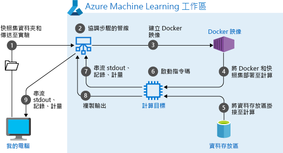
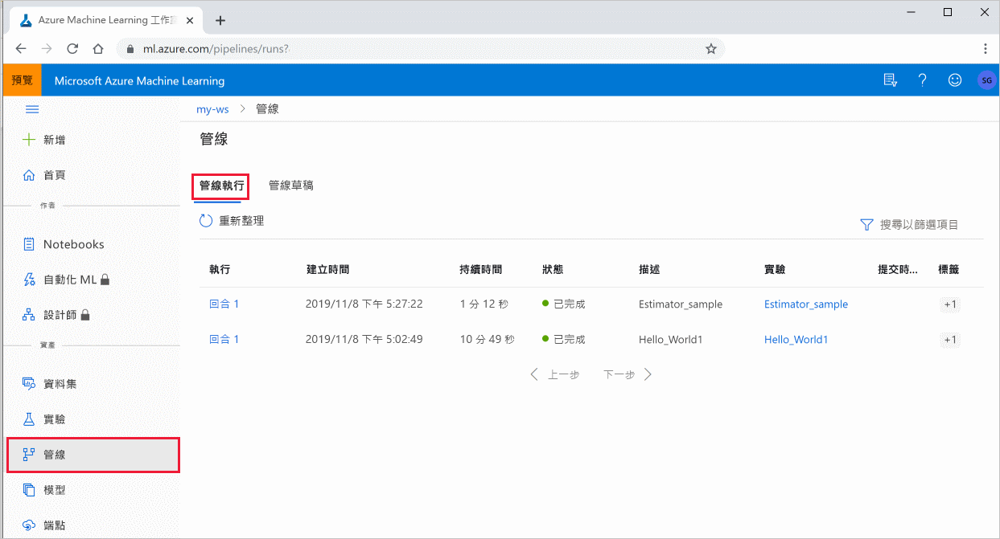

# <a name="create-and-run-machine-learning-pipelines-with-azure-machine-learning-sdk"></a>使用 Azure Machine Learning SDK 來建立及執行機器學習管線

[!INCLUDE [applies-to-skus](../../includes/aml-applies-to-basic-enterprise-sku.md)]

在本文中，您將瞭解如何使用[AZURE MACHINE LEARNING SDK](https://docs.microsoft.com/python/api/overview/azure/ml/intro?view=azure-ml-py)來建立及執行[機器學習管線](concept-ml-pipelines.md)。 使用 **ML 管線** 來建立可將各種 ML 階段將在一起的工作流程。 然後發佈該管線以供稍後存取，或與其他人共用。 追蹤 ML 管線以查看您的模型在真實世界中的執行方式，以及偵測資料漂移。 ML 管線適用于批次評分案例，使用各種計算，重複使用步驟而不是重新執行步驟，以及與其他人共用 ML 工作流程。

雖然您可以使用不同種類的管線（稱為 [Azure 管線](https://docs.microsoft.com/azure/devops/pipelines/targets/azure-machine-learning?context=azure%2Fmachine-learning%2Fservice%2Fcontext%2Fml-context&view=azure-devops&tabs=yaml) ）來進行 ML 工作的 CI/CD 自動化，但該類型的管線不會儲存在您的工作區中。 [比較這些不同的管線](concept-ml-pipelines.md#which-azure-pipeline-technology-should-i-use)。

您 Azure Machine Learning [工作區](how-to-manage-workspace.md)的成員可以看到您所建立的 ML 管線。 

ML 管線是在計算目標上執行 (查看 [Azure Machine Learning) 中的計算目標](https://docs.microsoft.com/azure/machine-learning/concept-compute-target) 。 管線可以對支援的 [Azure 儲存體](https://docs.microsoft.com/azure/storage/)位置讀取和寫入資料。

如果您沒有 Azure 訂用帳戶，請在開始前先建立免費帳戶。 試用[免費或付費版本的 Azure Machine Learning](https://aka.ms/AMLFree)。

## <a name="prerequisites"></a>必要條件

* 建立 [Azure Machine Learning 工作區](how-to-manage-workspace.md)以保存您的所有管線資源。

* [設定您的開發環境](how-to-configure-environment.md) 以安裝 Azure Machine Learning sdk，或使用已安裝 sdk 的 [Azure Machine Learning 計算實例](concept-compute-instance.md) 。

從附加工作區開始：

```Python
import azureml.core
from azureml.core import Workspace, Datastore

ws = Workspace.from_config()
```

## <a name="set-up-machine-learning-resources"></a>設定機器學習資源

建立執行 ML 管線所需的資源：

* 設定用來存取管線步驟中所需資料的資料存放區。

* 將物件設定為指向存在於資料存放區 `Dataset` 中或可在資料存放區中存取的持續性資料。 `PipelineData`針對管線步驟之間傳遞的暫存資料設定物件。 

    > [!TIP]
    > 公開預覽版類別提供在管線步驟之間傳遞暫存資料的改良體驗  `OutputFileDatasetConfig` 。  此類別是實驗性預覽功能，隨時可能會變更。
    > 
    >如需實驗性功能的詳細資訊，請參閱 https://aka.ms/azuremlexperimental 。
    
* 設定將作為您管線步驟執行位置的[計算目標](concept-azure-machine-learning-architecture.md#compute-targets)。

### <a name="set-up-a-datastore"></a>設定資料存放區

資料存放區會儲存可供管線存取的資料。 每個工作區都有一個預設的資料存放區。 您可以註冊額外的資料存放區。 

當您建立工作區時， [Azure 檔案儲存體](https://docs.microsoft.com/azure/storage/files/storage-files-introduction) 和 [Azure Blob 儲存體](https://docs.microsoft.com/azure/storage/blobs/storage-blobs-introduction) 會附加至工作區。 已註冊預設資料存放區，以連接到 Azure Blob 儲存體。 若要深入了解，請參閱[決定何時使用 Azure 檔案、Azure Blob 或 Azure 磁碟](https://docs.microsoft.com/azure/storage/common/storage-decide-blobs-files-disks)。 

```python
# Default datastore 
def_data_store = ws.get_default_datastore()

# Get the blob storage associated with the workspace
def_blob_store = Datastore(ws, "workspaceblobstore")

# Get file storage associated with the workspace
def_file_store = Datastore(ws, "workspacefilestore")

```

步驟通常會使用資料並產生輸出資料。 步驟可以建立資料 (例如模型)、含有模型和相依檔案的目錄，或是暫存資料。 此資料接著便可供管線中稍後的其他步驟使用。 若要深入瞭解如何將管線連接到您的資料，請參閱文章 [如何存取資料](how-to-access-data.md) 和 [如何註冊資料集](how-to-create-register-datasets.md)。 

### <a name="configure-data-with-dataset-and-pipelinedata-objects"></a>使用 `Dataset` 和物件設定 `PipelineData` 資料

將資料提供給管線的慣用方式是 [Dataset](https://docs.microsoft.com/python/api/azureml-core/azureml.core.dataset.Dataset) 物件。 `Dataset`物件會指向位於或可從資料存放區或 WEB URL 存取的資料。 此 `Dataset` 類別是抽象的，因此您將會建立一個或多個檔案的 (實例，其中包含 `FileDataset` 一個或多個檔案) 或 `TabularDataset` 從一個或多個具有分隔資料行的檔案建立的。


您可以 `Dataset` 使用 [from_files](https://docs.microsoft.com/python/api/azureml-core/azureml.data.dataset_factory.filedatasetfactory?view=azure-ml-py#from-files-path--validate-true-) 或 [from_delimited_files](https://docs.microsoft.com/python/api/azureml-core/azureml.data.dataset_factory.tabulardatasetfactory?view=azure-ml-py#from-delimited-files-path--validate-true--include-path-false--infer-column-types-true--set-column-types-none--separator------header-true--partition-format-none--support-multi-line-false-)之類的方法來建立。

```python
from azureml.core import Dataset

my_dataset = Dataset.File.from_files([(def_blob_store, 'train-images/')])
```
中繼資料 (或步驟的輸出) 會由 [PipelineData](https://docs.microsoft.com/python/api/azureml-pipeline-core/azureml.pipeline.core.pipelinedata?view=azure-ml-py) 物件代表。 `output_data1` 會產生為步驟的輸出，並用來作為一或多個未來步驟的輸入。 `PipelineData` 會在步驟之間導入資料相依性，並在管線中建立隱含的執行順序。 稍後建立管線步驟時，將會使用這個物件。

```python
from azureml.pipeline.core import PipelineData

output_data1 = PipelineData(
    "output_data1",
    datastore=def_blob_store,
    output_name="output_data1")

```

> [!TIP]
> 您也可以使用公開預覽類別，在管線步驟之間保存中繼資料 `OutputFileDatasetConfig` 。 深入瞭解 `OutputFileDatasetConfig` [SDK 參考檔中的](https://docs.microsoft.com/python/api/azureml-core/azureml.data.outputfiledatasetconfig?view=azure-ml-py)設計模式和方法。

## <a name="set-up-a-compute-target"></a>設定計算目標


在 Azure Machine Learning 中，__計算__一詞 (或__計算目標__) 係指會在您機器學習管線中執行計算步驟的機器或叢集。   如需計算目標的完整清單，請參閱 [模型定型的計算目標](concept-compute-target.md#train) ，以及建立如何建立和附加至工作區的 [計算目標](how-to-create-attach-compute-sdk.md) 。   無論您是定型模型或執行管線步驟，建立和或附加計算目標的程式都相同。 在您建立並連結計算目標之後，請在您的[管線步驟](#steps)中使用 `ComputeTarget` 物件。

> [!IMPORTANT]
> 不支援從遠端作業內部對計算目標執行管理作業。 由於機器學習管線會作為遠端作業提交，因此請勿從管線內對計算目標使用管理作業。

### <a name="azure-machine-learning-compute"></a>Azure Machine Learning Compute

您可以建立用來執行步驟的 Azure Machine Learning Compute。 其他計算目標的程式碼非常類似，其參數稍微不同，視類型而定。 

```python
from azureml.core.compute import ComputeTarget, AmlCompute

compute_name = "aml-compute"
vm_size = "STANDARD_NC6"
if compute_name in ws.compute_targets:
    compute_target = ws.compute_targets[compute_name]
    if compute_target and type(compute_target) is AmlCompute:
        print('Found compute target: ' + compute_name)
else:
    print('Creating a new compute target...')
    provisioning_config = AmlCompute.provisioning_configuration(vm_size=vm_size,  # STANDARD_NC6 is GPU-enabled
                                                                min_nodes=0,
                                                                max_nodes=4)
    # create the compute target
    compute_target = ComputeTarget.create(
        ws, compute_name, provisioning_config)

    # Can poll for a minimum number of nodes and for a specific timeout.
    # If no min node count is provided it will use the scale settings for the cluster
    compute_target.wait_for_completion(
        show_output=True, min_node_count=None, timeout_in_minutes=20)

    # For a more detailed view of current cluster status, use the 'status' property
    print(compute_target.status.serialize())
```

## <a name="configure-the-training-runs-environment"></a>設定定型回合的環境

下一步是確定遠端定型執行具有訓練步驟所需的所有相依性。 您可以藉由建立和設定物件來設定相依性和執行時間內容 `RunConfiguration` 。 

```python
from azureml.core.runconfig import RunConfiguration
from azureml.core.conda_dependencies import CondaDependencies
from azureml.core import Environment 

aml_run_config = RunConfiguration()
# `compute_target` as defined in "Azure Machine Learning compute" section above
aml_run_config.target = compute_target

USE_CURATED_ENV = True
if USE_CURATED_ENV :
    curated_environment = Environment.get(workspace=ws, name="AzureML-Tutorial")
    aml_run_config.environment = curated_environment
else:
    aml_run_config.environment.python.user_managed_dependencies = False
    
    # Add some packages relied on by data prep step
    aml_run_config.environment.python.conda_dependencies = CondaDependencies.create(
        conda_packages=['pandas','scikit-learn'], 
        pip_packages=['azureml-sdk', 'azureml-dataprep[fuse,pandas]'], 
        pin_sdk_version=False)
```

上述程式碼顯示兩個處理相依性的選項。 如所示， `USE_CURATED_ENV = True` 在中，設定是以策劃環境為基礎。 策劃環境是「prebaked」，具有常見的相互相依程式庫，而且在線上時可能會大幅加快。 策劃環境已在 [Microsoft Container Registry](https://hub.docker.com/publishers/microsoftowner)中預先建立 Docker 映射。 如需詳細資訊，請參閱 [Azure Machine Learning 策劃環境](resource-curated-environments.md)。

當您變更 `USE_CURATED_ENV` 以 `False` 顯示明確設定相依性的模式時，所採用的路徑。 在該案例中，將會在資源群組內的 Azure Container Registry 中建立並註冊新的自訂 Docker 映射 (請參閱 [Azure) 中的私人 Docker 容器登錄簡介](https://docs.microsoft.com/azure/container-registry/container-registry-intro) 。 建立和註冊此映射可能需要幾分鐘的時間。

## <a name="construct-your-pipeline-steps"></a><a id="steps"></a>建構您的管線步驟

建立計算資源和環境之後，您就可以開始定義管線的步驟。 您可以透過 Azure Machine Learning SDK 使用許多內建步驟，如您在 [ `azureml.pipeline.steps` 封裝的參考檔](https://docs.microsoft.com/python/api/azureml-pipeline-steps/azureml.pipeline.steps?view=azure-ml-py)中所見。 最具彈性的類別是 [PythonScriptStep](https://docs.microsoft.com/python/api/azureml-pipeline-steps/azureml.pipeline.steps.python_script_step.pythonscriptstep?view=azure-ml-py)，它會執行 Python 腳本。

```python
from azureml.pipeline.steps import PythonScriptStep
dataprep_source_dir = "./dataprep_src"
entry_point = "prepare.py"
# `my_dataset` as defined above
ds_input = my_dataset.as_named_input('input1')

# `output_data1`, `compute_target`, `aml_run_config` as defined above
data_prep_step = PythonScriptStep(
    script_name=entry_point,
    source_directory=dataprep_source_dir,
    arguments=["--input", ds_input.as_download(), "--output", output_data1],
    inputs=[ds_input],
    outputs=[output_data1],
    compute_target=compute_target,
    runconfig=aml_run_config,
    allow_reuse=True
)
```

上述程式碼顯示典型的初始管線步驟。 您的資料準備程式碼位於子目錄中， (在此範例中 `"prepare.py"` 的目錄 `"./dataprep.src"`) 。 在管線建立過程中，此目錄會壓縮並上傳至， `compute_target` 且步驟會執行指定為之值的腳本 `script_name` 。

`arguments`、 `inputs` 和值會 `outputs` 指定步驟的輸入和輸出。 在上述範例中，基準資料是 `my_dataset` 資料集。 對應的資料將會下載到計算資源，因為程式碼會將它指定為 `as_download()` 。 腳本 `prepare.py` 會執行任何適用于手邊工作的資料轉換工作，並將資料輸出至 `output_data1` 類型 `PipelineData` 。 如需詳細資訊，請參閱將 [資料移入和移出 ML 管線步驟 (Python) ](how-to-move-data-in-out-of-pipelines.md)。 

此步驟會在使用設定的電腦上執行 `compute_target` `aml_run_config` 。 

在共同作業 `allow_reuse` 環境中使用管線時，重複使用先前的結果 () 是關鍵，因為消除不必要的重新建立可提供靈活性。 當步驟的 script_name、輸入和參數保持不變時，重複使用是預設行為。 允許重複使用時，會立即將先前執行的結果傳送至下一個步驟。 如果 `allow_reuse` 設定為 `False` ，則在管線執行期間，一律會為此步驟產生新的執行。

您可以使用單一步驟建立管線，但幾乎一律會選擇將整體程式分成數個步驟。 例如，您可能會有資料準備、定型、模型比較和部署的步驟。 例如，您可能會認為在 `data_prep_step` 上述指定的之後，下一個步驟可能是定型：

```python
train_source_dir = "./train_src"
train_entry_point = "train.py"

training_results = PipelineData(name = "training_results", 
                                datastore=def_blob_store,
                                output_name="training_results")

    
train_step = PythonScriptStep(
    script_name=train_entry_point,
    source_directory=train_source_dir,
    arguments=["--prepped_data", output_data1.as_input(), "--training_results", training_results],
    compute_target=compute_target,
    runconfig=aml_run_config,
    allow_reuse=True
)
```

上述程式碼與資料準備步驟的程式碼非常類似。 定型程式碼位於與資料準備程式碼不同的目錄中。 `PipelineData`資料準備步驟的輸出 `output_data1` 會用來做為定型步驟的_輸入_。 建立新的 `PipelineData` 物件， `training_results` 以保存後續比較或部署步驟的結果。 


> [!TIP]
> 為了獲得更佳的體驗，以及在管線執行結束時將中繼資料寫回資料存放區的能力，請使用公開預覽類別 `OutputFileDatasetConfig` 。 深入瞭解 `OutputFileDatasetConfig` [SDK 參考檔中的](https://docs.microsoft.com/python/api/azureml-core/azureml.data.outputfiledatasetconfig?view=azure-ml-py)設計模式和方法。

定義步驟之後，您必須使用這些步驟中的部分或全部步驟來建置管線。

> [!NOTE]
> 當您定義步驟或建立管線時，不會將任何檔案或資料上傳至 Azure Machine Learning。 當您呼叫實驗時，會上傳這些檔案 [。提交 ( # B1 ](https://docs.microsoft.com/python/api/azureml-core/azureml.core.experiment.experiment?view=azure-ml-py#submit-config--tags-none----kwargs-)。

```python
# list of steps to run (`compare_step` definition not shown)
compare_models = [data_prep_step, train_step, compare_step]

from azureml.pipeline.core import Pipeline

# Build the pipeline
pipeline1 = Pipeline(workspace=ws, steps=[compare_models])
```

### <a name="use-a-dataset"></a>使用資料集 

從 Azure Blob 儲存體、Azure 檔案儲存體、Azure Data Lake Storage Gen1、Azure Data Lake Storage Gen2、Azure SQL Database 和適用於 PostgreSQL 的 Azure 資料庫建立的資料集會可用來作為任何管線步驟的輸入。 您可以將輸出寫入至 [DataTransferStep](https://docs.microsoft.com/python/api/azureml-pipeline-steps/azureml.pipeline.steps.datatransferstep?view=azure-ml-py)、 [DatabricksStep](https://docs.microsoft.com/python/api/azureml-pipeline-steps/azureml.pipeline.steps.databricks_step.databricksstep?view=azure-ml-py)，或者，如果您想要將資料寫入至特定資料存放區，請使用 [PipelineData](https://docs.microsoft.com/python/api/azureml-pipeline-core/azureml.pipeline.core.pipelinedata?view=azure-ml-py)。 

> [!IMPORTANT]
> 只有 Azure Blob 和 Azure 檔案共用資料存放區支援將輸出資料寫入至使用 PipelineData 的資料存放區。 
>
> 若要將輸出資料寫回 Azure Blob、Azure 檔案共用、ADLS Gen 1 和 ADLS Gen 2 資料存放區，請使用公開預覽類別 [`OutputFileDatasetConfig`](https://docs.microsoft.com/python/api/azureml-core/azureml.data.output_dataset_config.outputfiledatasetconfig?view=azure-ml-py) 。

```python
dataset_consuming_step = PythonScriptStep(
    script_name="iris_train.py",
    inputs=[iris_tabular_dataset.as_named_input("iris_data")],
    compute_target=compute_target,
    source_directory=project_folder
)
```

然後，您可以使用 [Run.input_datasets](https://docs.microsoft.com/python/api/azureml-core/azureml.core.run.run?view=azure-ml-py#input-datasets) 字典來取得管線中的資料集。

```python
# iris_train.py
from azureml.core import Run, Dataset

run_context = Run.get_context()
iris_dataset = run_context.input_datasets['iris_data']
dataframe = iris_dataset.to_pandas_dataframe()
```

這一行 `Run.get_context()` 值得您強調。 此函式會抓取， `Run` 表示目前的實驗性執行。 在上述範例中，我們使用它來取出已註冊的資料集。 物件的另一種常見用法 `Run` 是同時取出實驗本身以及實驗所在的工作區： 

```python
# Within a PythonScriptStep

ws = Run.get_context().experiment.workspace
```

如需更多詳細資料，包括傳遞和存取資料的替代方式，請參閱將 [資料移入和移出 ML 管線步驟 (Python) ](how-to-move-data-in-out-of-pipelines.md)。

## <a name="caching--reuse"></a>快取 & 重複使用  

為了優化和自訂管線的行為，您可以在快取和重複使用方面做一些事。 例如，您可以選擇：
+ 藉由在步驟定義期間設定，關閉**步驟執行輸出的預設重複使用** `allow_reuse=False` 。 [step definition](https://docs.microsoft.com/python/api/azureml-pipeline-steps/?view=azure-ml-py) 在共同作業環境中使用管線時，重複使用是關鍵，因為消除不必要的執行可提供靈活性。 不過，您可以選擇不重複使用。
+ **執行中所有步驟的強制輸出** 重新產生 `pipeline_run = exp.submit(pipeline, regenerate_outputs=False)`

依預設， `allow_reuse` 會啟用，並且會 `source_directory` 雜湊步驟定義中指定的。 因此，如果指定步驟的腳本維持相同的 (`script_name` 、輸入和參數) ，而中沒有任何其他專案已 ` source_directory` 變更，則會重複使用上一個步驟執行的輸出，作業不會提交至計算，而從上一次執行的結果則會立即提供給下一個步驟。

```python
step = PythonScriptStep(name="Hello World",
                        script_name="hello_world.py",
                        compute_target=aml_compute,
                        source_directory=source_directory,
                        allow_reuse=False,
                        hash_paths=['hello_world.ipynb'])
```

## <a name="submit-the-pipeline"></a>提交管線

當您提交管線時，Azure Machine Learning 會檢查每個步驟的相依性，並上傳您所指定之來原始目錄的快照集。 如果未指定來源目錄，則會上傳目前的本機目錄。 快照集也會另存為您工作區實驗的一部分。

> [!IMPORTANT]
> [!INCLUDE [amlinclude-info](../../includes/machine-learning-amlignore-gitignore.md)]
>
> 如需詳細資訊，請參閱[快照集](concept-azure-machine-learning-architecture.md#snapshots)。

```python
from azureml.core import Experiment

# Submit the pipeline to be run
pipeline_run1 = Experiment(ws, 'Compare_Models_Exp').submit(pipeline1)
pipeline_run1.wait_for_completion()
```

當您第一次執行管線時，Azure Machine Learning 會：

* 從與工作區相關的 Blob 儲存體，將專案快照集下載到計算目標。
* 建置與管線中的每個步驟相對應的 Docker 映像。
* 從容器登錄將每個步驟的 Docker 映射下載到計算目標。
* 設定和物件的存取權 `Dataset` `PipelineData` 。 針對 as `as_mount()` 存取模式，會使用保險絲來提供虛擬存取。 如果不支援裝載，或使用者指定了存取權 `as_download()` ，則會改為將資料複製到計算目標。

* 在步驟定義中指定的計算目標內執行步驟。 
* 建立步驟所指定的成品，例如記錄、stdout 和 stderr、計量及輸出。 這些成品會接著上傳並保留在使用者的預設資料存放區中。



如需詳細資訊，請參閱 [實驗類別](https://docs.microsoft.com/python/api/azureml-core/azureml.core.experiment.experiment?view=azure-ml-py) 參考。

## <a name="view-results-of-a-pipeline"></a>查看管線的結果

查看您所有管線的清單，以及其在 studio 中的執行詳細資料：

1. 登入 [Azure Machine Learning Studio](https://ml.azure.com)。

1. [查看您的工作區](how-to-manage-workspace.md#view)。

1. 選取左側的 [ **管線** ] 以查看您的所有管線執行。
 
 
1. 選取特定管線以查看執行結果。

### <a name="git-tracking-and-integration"></a>Git 追蹤與整合

當您啟動來源目錄是本機 Git 存放庫的定型回合時，該存放庫的相關資訊會儲存在回合歷程記錄中。 如需詳細資訊，請參閱 [Azure Machine Learning 的 Git 整合](concept-train-model-git-integration.md)。

## <a name="next-steps"></a>接下來的步驟

- 若要與同事或客戶共用您的管線，請參閱 [發佈機器學習管線](how-to-deploy-pipelines.md)
- [在 GitHub 上使用這些 Jupyter 筆記本](https://aka.ms/aml-pipeline-readme)進一步探索機器學習管線
- 請參閱適用于 [azureml-核心](https://docs.microsoft.com/python/api/azureml-pipeline-core/?view=azure-ml-py) 封裝和 [azureml-管線-步驟](https://docs.microsoft.com/python/api/azureml-pipeline-steps/?view=azure-ml-py) 套件的 SDK 參考說明
- 請參閱 [如何](how-to-debug-pipelines.md) 取得對管線進行偵錯工具和疑難排解的秘訣 =
- 了解如何依照[使用 Jupyter 筆記本來探索這項服務](samples-notebooks.md)一文來執行筆記本。
