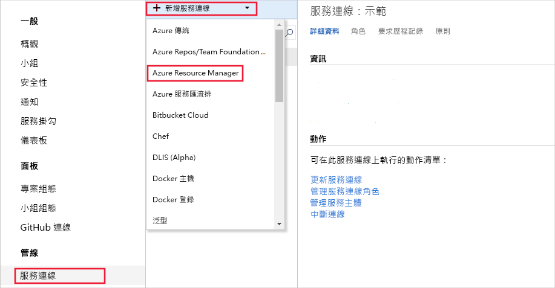
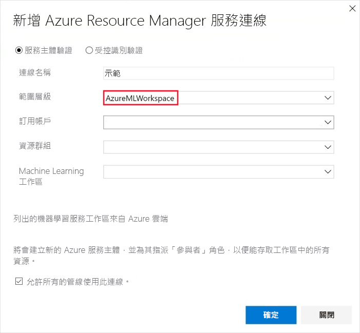
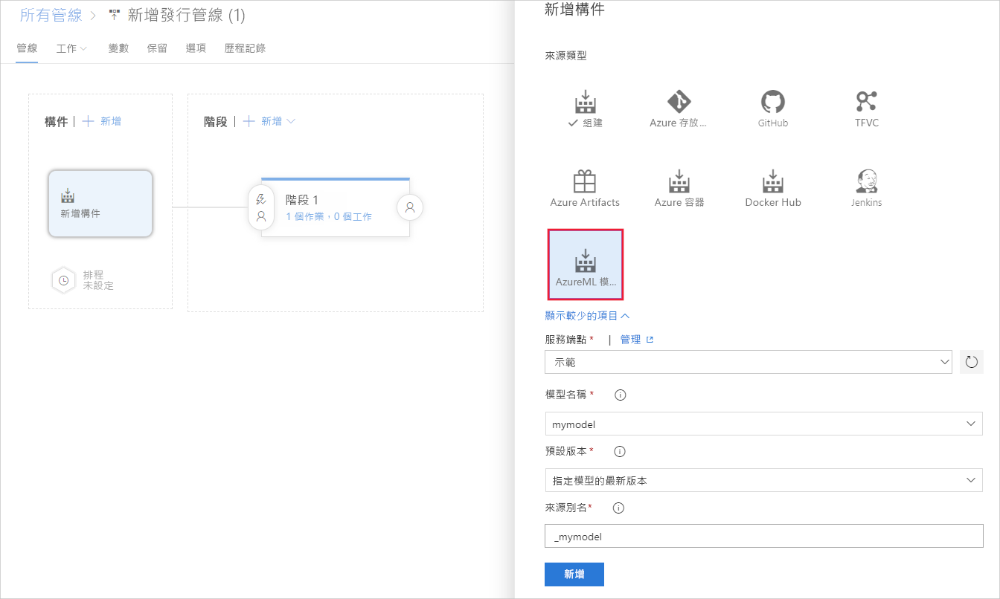
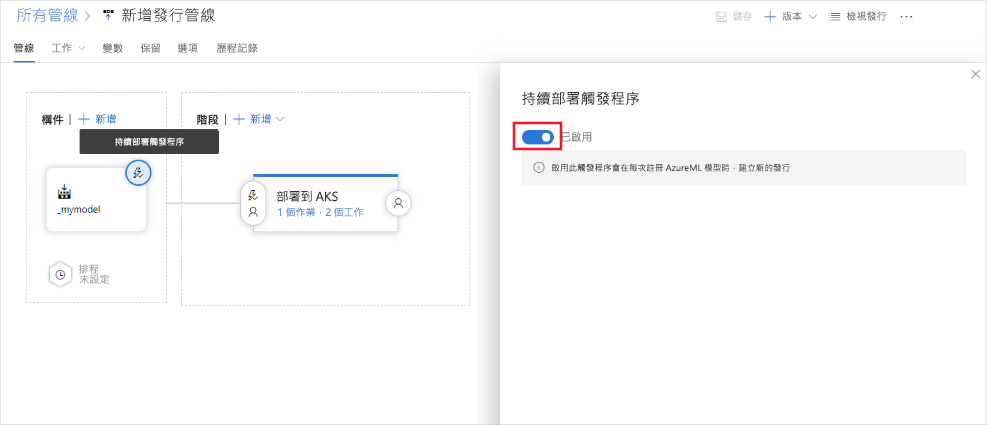

# <a name="deploy-models-with-azure-machine-learning"></a>使用 Azure Machine Learning 部署模型
[!INCLUDE [applies-to-skus](../../includes/aml-applies-to-basic-enterprise-sku.md)]

瞭解如何在 Azure 雲端或 Azure IoT 邊緣裝置中將機器學習模型作為 Web 服務進行部署。

無論您[在何處部署](#target)模型,工作流都是類似的:

1. 註冊模型。
1. 準備部署。 (指定資產、使用方式、計算目標。)
1. 將模型部署至計算目標。
1. 測試已部署的模型,也稱為 Web 服務。

有關部署工作流中涉及的概念的詳細資訊,請參閱[使用 Azure 機器學習管理、部署和監視模型](concept-model-management-and-deployment.md)。

## <a name="prerequisites"></a>Prerequisites

- Azure Machine Learning 工作區。 有關詳細資訊,請參閱創建[Azure 機器學習工作區](how-to-manage-workspace.md)。

- 模型。 如果沒有經過訓練的模型,則可以使用[本教程](https://aka.ms/azml-deploy-cloud)中提供的模型和依賴項檔。

- [機器學習服務的 Azure CLI 擴充](reference-azure-machine-learning-cli.md)、用於[Python 的 Azure 機器學習 SDK](https://docs.microsoft.com/python/api/overview/azure/ml/intro?view=azure-ml-py)或 Azure[機器學習視覺化工作室代碼延伸](tutorial-setup-vscode-extension.md)。

## <a name="connect-to-your-workspace"></a>連線到您的工作區

以下代碼展示如何使用快取到本地開發環境的資訊連接到 Azure 機器學習工作區:

+ **使用 SDK**

   ```python
   from azureml.core import Workspace
   ws = Workspace.from_config(path=".file-path/ws_config.json")
   ```

  有關使用 SDK 連接到工作區的詳細資訊,請參閱 Python 文件[的 Azure 機器學習 SDK。](https://docs.microsoft.com/python/api/overview/azure/ml/intro?view=azure-ml-py#workspace)

+ **使用 CLI**

   使用 CLI 時`-w``--workspace-name`,使用 或 參數為命令指定工作區。

+ **使用 Visual Studio Code**

   使用可視化工作室代碼時,可以使用圖形介面選擇工作區。 有關詳細資訊,請參閱在可視化工作室代碼擴展文件中[部署和管理模型](tutorial-train-deploy-image-classification-model-vscode.md#deploy-the-model)。

## <a name="register-your-model"></a><a id="registermodel"></a>註冊您的模型

已註冊的模型是構成模型的一個或多個文件的邏輯容器。 例如,如果模型存儲在多個檔中,則可以將它們註冊為工作區中的單個模型。 註冊檔后,可以下載或部署已註冊的模型,並接收您註冊的所有檔。

> [!TIP]
> 註冊模型時,提供雲位置(從定型運行)或本地目錄的路徑。 此路徑只是為了查找作為註冊過程的一部分上傳的檔。 它不需要與條目腳本中使用的路徑匹配。 有關詳細資訊,請參閱[在輸入文稿中尋找模型檔](#load-model-files-in-your-entry-script)。

機器學習模型在 Azure 機器學習工作區中註冊。 模型可能來自 Azure 機器學習,也可以來自其他位置。 註冊模型時,可以選擇提供有關模型的元數據。 然後`tags`,`properties`可用於篩選模型的和字典。

以下示例演示如何註冊模型。

### <a name="register-a-model-from-an-experiment-run"></a>從實驗執行中註冊模型

本節中的程式碼段演示如何從訓練運行中註冊模型:

> [!IMPORTANT]
> 要使用這些代碼段,您需要以前執行過訓練運行,並且需要有權存`Run`取 物件(SDK 範例)或運行 ID 值(CLI 範例)。 有關培訓模型的詳細資訊,請參閱[設定模型培訓的計算目標](how-to-set-up-training-targets.md)。

+ **使用 SDK**

  使用 SDK 訓練模型時,可以接收[Run](https://docs.microsoft.com/python/api/azureml-core/azureml.core.run.run?view=azure-ml-py)物件或[AutoMLRun](/python/api/azureml-train-automl-client/azureml.train.automl.run.automlrun)物件,具體取決於訓練模型的方式。 每個物件可用於註冊由實驗運行創建的模型。

  + 從`azureml.core.Run`物件註冊模型:
 
    ```python
    model = run.register_model(model_name='sklearn_mnist',
                               tags={'area': 'mnist'},
                               model_path='outputs/sklearn_mnist_model.pkl')
    print(model.name, model.id, model.version, sep='\t')
    ```

    參數`model_path`引用模型的雲位置。 在此範例中,使用單個檔的路徑。 要在模型註冊中包含多個檔,請`model_path`設置為包含檔的資料夾的路徑。 有關詳細資訊,請參閱[Run.register_model](https://docs.microsoft.com/python/api/azureml-core/azureml.core.run.run?view=azure-ml-py#register-model-model-name--model-path-none--tags-none--properties-none--model-framework-none--model-framework-version-none--description-none--datasets-none--sample-input-dataset-none--sample-output-dataset-none--resource-configuration-none----kwargs-)文檔。

  + 從`azureml.train.automl.run.AutoMLRun`物件註冊模型:

    ```python
        description = 'My AutoML Model'
        model = run.register_model(description = description,
                                   tags={'area': 'mnist'})

        print(run.model_id)
    ```

    在此示例中,未指定`metric``iteration`和參數,因此將註冊具有最佳主指標的反覆運算。 使用`model_id`從運行返回的值而不是模型名稱。

    有關詳細資訊,請參閱[AutoMLRun.register_model](/python/api/azureml-train-automl-client/azureml.train.automl.run.automlrun#register-model-model-name-none--description-none--tags-none--iteration-none--metric-none-)文檔。

+ **使用 CLI**

  ```azurecli-interactive
  az ml model register -n sklearn_mnist  --asset-path outputs/sklearn_mnist_model.pkl  --experiment-name myexperiment --run-id myrunid --tag area=mnist
  ```

  [!INCLUDE [install extension](../../includes/machine-learning-service-install-extension.md)]

  參數`--asset-path`引用模型的雲位置。 在此範例中,使用單個檔的路徑。 要在模型註冊中包含多個檔,請`--asset-path`設置為包含檔的資料夾的路徑。

+ **使用 Visual Studio Code**

  使用[Visual Studio 代碼](tutorial-train-deploy-image-classification-model-vscode.md#deploy-the-model)擴展名使用任何模型檔或資料夾註冊模型。

### <a name="register-a-model-from-a-local-file"></a>從本地端檔案註冊模型

您可以通過提供模型的本地路徑來註冊模型。 您可以提供資料夾或單個檔的路徑。 可以使用此方法註冊使用 Azure 機器學習訓練的模型,然後下載。 您還可以使用此方法註冊在 Azure 機器學習之外訓練的模型。

[!INCLUDE [trusted models](../../includes/machine-learning-service-trusted-model.md)]

+ **使用 SDK 與 ONNX**

    ```python
    import os
    import urllib.request
    from azureml.core.model import Model
    # Download model
    onnx_model_url = "https://www.cntk.ai/OnnxModels/mnist/opset_7/mnist.tar.gz"
    urllib.request.urlretrieve(onnx_model_url, filename="mnist.tar.gz")
    os.system('tar xvzf mnist.tar.gz')
    # Register model
    model = Model.register(workspace = ws,
                            model_path ="mnist/model.onnx",
                            model_name = "onnx_mnist",
                            tags = {"onnx": "demo"},
                            description = "MNIST image classification CNN from ONNX Model Zoo",)
    ```

  要在模型註冊中包含多個檔,請`model_path`設置為包含檔的資料夾的路徑。

+ **使用 CLI**

  ```azurecli-interactive
  az ml model register -n onnx_mnist -p mnist/model.onnx
  ```

  要在模型註冊中包含多個檔,請`-p`設置為包含檔的資料夾的路徑。

**時間估計**:大約10秒。

有關詳細資訊,請參閱[模型類](https://docs.microsoft.com/python/api/azureml-core/azureml.core.model.model?view=azure-ml-py)的文檔。

有關使用在 Azure 機器學習之外訓練的模型的詳細資訊,請參閱[如何部署現有模型](how-to-deploy-existing-model.md)。

<a name="target"></a>

## <a name="single-versus-multi-model-endpoints"></a>單模型與多模型端點
Azure ML 支援在單個終結點後面部署單個或多個模型。

多模型終結點使用共用容器承載多個模型。 這有助於降低間接費用,提高利用率,並使您能夠將模組連結到一起到集合中。 在部署文稿中指定的模型將載入並在服務容器的磁碟上可用 - 您可以按需將它們載入到記憶體中,並根據評分時請求的特定模型進行評分。

有關 E2E 範例(該範例示範如何在單個容器化終結點後面使用多個模型),請參閱[此範例](https://github.com/Azure/MachineLearningNotebooks/tree/master/how-to-use-azureml/deployment/deploy-multi-model)

## <a name="prepare-to-deploy"></a>準備部署

要將模型部署為服務,您需要以下元件:

* **定義推理環境**。 此環境封裝運行模型進行推理所需的依賴項。
* **定義計分代碼**。 此腳本接受請求,使用模型對請求進行評分,並返回結果。
* **定義推理設定**。 推理設定指定將模型作為服務運行所需的環境配置、條目腳本和其他元件。

獲得必要的元件後,可以分析部署模型以瞭解其 CPU 和記憶體要求後將創建的服務。

### <a name="1-define-inference-environment"></a>1. 定義推理環境

推理設定描述如何設置包含模型的 Web 服務。 稍後部署模型時,將使用它。

推理配置使用 Azure 機器學習環境來定義部署所需的軟體依賴項。 環境允許您創建、管理和重用培訓和部署所需的軟體依賴項。 可以從自定義依賴項文件創建環境,或使用精心策劃的 Azure 機器學習環境之一。 以下 YAML 是用於推理的 Conda 依賴項檔的範例。 請注意,必須指示 azureml 預設值,其中 veriver >= 1.0.45 作為點依賴項,因為它包含將模型託管為 Web 服務所需的功能。 如果要使用自動架構生成,則輸入腳本還必須導入`inference-schema`包。

```YAML
name: project_environment
dependencies:
  - python=3.6.2
  - scikit-learn=0.20.0
  - pip:
      # You must list azureml-defaults as a pip dependency
    - azureml-defaults>=1.0.45
    - inference-schema[numpy-support]
```

> [!IMPORTANT]
> 如果您的依賴項可透過 Conda 和 pip(來自 PyPi)獲得,Microsoft 建議使用 Conda 版本,因為 Conda 套件通常附帶預建構的二進位檔案,使安裝更可靠。
>
> 有關詳細資訊,請參閱[瞭解康達和點皮](https://www.anaconda.com/understanding-conda-and-pip/)。
>
> 要檢查依賴項是否可透過 Conda 可用,`conda search <package-name>`請使用命令,或[https://anaconda.org/anaconda/repo](https://anaconda.org/anaconda/repo)[https://anaconda.org/conda-forge/repo](https://anaconda.org/conda-forge/repo)使用和上的包索引。

您可以使用相依檔案建立環境物件並將儲存到工作區以供將來使用:

```python
from azureml.core.environment import Environment
myenv = Environment.from_conda_specification(name = 'myenv',
                                             file_path = 'path-to-conda-specification-file'
myenv.register(workspace=ws)
```

### <a name="2-define-scoring-code"></a><a id="script"></a>2. 定義計分代碼

輸入指令碼會接收提交給已部署 Web 服務的資料，並將其傳遞給模型。 然後，它會採用模型傳回的回應，並將該回應傳回至用戶端。 *這個文稿指定於您的模型*。 它必須瞭解模型期望和返回的數據。

指令碼包含載入和執行模型的兩個函式：

* `init()`通常,此函數將模型載入到全域物件中。 當 Web 服務的 Docker 容器啟動時,此功能僅運行一次。

* `run(input_data)`: 此函數使用模型預測基於輸入資料的值。 執行的輸入和輸出通常使用 JSON 進行序列化和還原序列化。 您也可以使用原始的二進位資料。 您可以先轉換資料，再將資料傳送給模型或傳回用戶端。

#### <a name="load-model-files-in-your-entry-script"></a>在輸入文稿中載入模型檔案

在輸入文稿中尋找模型的方法有兩種:
* `AZUREML_MODEL_DIR`:包含到模型位置的路徑的環境變數。
* `Model.get_model_path`:使用已註冊的模型名稱將路徑返回到模型檔的 API。

##### <a name="azureml_model_dir"></a>AZUREML_MODEL_DIR

AZUREML_MODEL_DIR是在服務部署期間創建的環境變數。 您可以使用此環境變數查找已部署模型的位置。

下表根據部署的模型數量描述AZUREML_MODEL_DIR的值:

| 部署 | 環境變數值 |
| ----- | ----- |
| 單一模型 | 包含模型的資料夾的路徑。 |
| 多個型號 | 包含所有模型的資料夾的路徑。 模型依名稱與版本位於此資料夾中`$MODEL_NAME/$VERSION`( ) |

在模型註冊和部署期間,模型被放置在AZUREML_MODEL_DIR路徑中,並保留其原始檔名。

要獲取項目文本中模型檔的路徑,請將環境變數與要查找的檔案路徑合併。

**單模型範例**
```python
# Example when the model is a file
model_path = os.path.join(os.getenv('AZUREML_MODEL_DIR'), 'sklearn_regression_model.pkl')

# Example when the model is a folder containing a file
file_path = os.path.join(os.getenv('AZUREML_MODEL_DIR'), 'my_model_folder', 'sklearn_regression_model.pkl')
```

**多個模型範例**
```python
# Example when the model is a file, and the deployment contains multiple models
model_path = os.path.join(os.getenv('AZUREML_MODEL_DIR'), 'sklearn_model', '1', 'sklearn_regression_model.pkl')
```

##### <a name="get_model_path"></a>get_model_path

註冊模型時,會提供用於在註冊表中管理模型的模型名稱。 使用此名稱與[Model.get_model_path()](https://docs.microsoft.com/python/api/azureml-core/azureml.core.model.model?view=azure-ml-py#get-model-path-model-name--version-none---workspace-none-)方法一起檢索本地文件系統上的模型檔或檔的路徑。 如果註冊資料夾或檔集合,此 API 將傳回包含這些檔的目錄的路徑。

註冊模型時,請為模型指定一個名稱。 該名稱對應於模型在本地或服務部署期間的位置。

#### <a name="optional-define-model-web-service-schema"></a>( 選擇性的 )定義模型 Web 服務架構

要自動生成 Web 服務的架構,請為其中一個已定義的類型物件提供構造函數中的輸入和 /或輸出範例。 類型和示例用於自動創建架構。 然後,Azure 機器學習會在部署期間為 Web 服務創建[OpenAPI](https://swagger.io/docs/specification/about/) (Swagger) 規範。

目前支援這些類型的:

* `pandas`
* `numpy`
* `pyspark`
* 標準 Python 物件

要使用架構生成,請在依賴項檔中包括`inference-schema`開源包。 有關此包的詳細資訊,請參閱[https://github.com/Azure/InferenceSchema](https://github.com/Azure/InferenceSchema)。 定義`input_sample`和`output_sample`變數中的輸入和輸出範例格式,這些格式表示 Web 服務的請求和回應格式。 在`run()`函數上的輸入和輸出函數修飾器中使用這些範例。 以下 scikit 學習示例使用架構生成。

##### <a name="example-entry-script"></a>項目文稿範例

以下範例簡報如何接受和傳回 JSON 資料:

```python
#Example: scikit-learn and Swagger
import json
import numpy as np
import os
from sklearn.externals import joblib
from sklearn.linear_model import Ridge

from inference_schema.schema_decorators import input_schema, output_schema
from inference_schema.parameter_types.numpy_parameter_type import NumpyParameterType


def init():
    global model
    # AZUREML_MODEL_DIR is an environment variable created during deployment. Join this path with the filename of the model file.
    # It holds the path to the directory that contains the deployed model (./azureml-models/$MODEL_NAME/$VERSION).
    # If there are multiple models, this value is the path to the directory containing all deployed models (./azureml-models).
    # Alternatively: model_path = Model.get_model_path('sklearn_mnist')
    model_path = os.path.join(os.getenv('AZUREML_MODEL_DIR'), 'sklearn_mnist_model.pkl')
    # Deserialize the model file back into a sklearn model
    model = joblib.load(model_path)


input_sample = np.array([[10, 9, 8, 7, 6, 5, 4, 3, 2, 1]])
output_sample = np.array([3726.995])


@input_schema('data', NumpyParameterType(input_sample))
@output_schema(NumpyParameterType(output_sample))
def run(data):
    try:
        result = model.predict(data)
        # You can return any data type, as long as it is JSON serializable.
        return result.tolist()
    except Exception as e:
        error = str(e)
        return error
```

下面的範例展示如何使用DataFrame將輸入數據定義為`<key: value>`字典。 此方法支援使用 Power BI 部署的 Web 服務。 ([詳細瞭解如何從 Power BI 使用 Web 服務](https://docs.microsoft.com/power-bi/service-machine-learning-integration)。

```python
import json
import pickle
import numpy as np
import pandas as pd
import azureml.train.automl
from sklearn.externals import joblib
from azureml.core.model import Model

from inference_schema.schema_decorators import input_schema, output_schema
from inference_schema.parameter_types.numpy_parameter_type import NumpyParameterType
from inference_schema.parameter_types.pandas_parameter_type import PandasParameterType


def init():
    global model
    # Replace filename if needed.
    model_path = os.path.join(os.getenv('AZUREML_MODEL_DIR'), 'model_file.pkl')
    # Deserialize the model file back into a sklearn model.
    model = joblib.load(model_path)


input_sample = pd.DataFrame(data=[{
    # This is a decimal type sample. Use the data type that reflects this column in your data.
    "input_name_1": 5.1,
    # This is a string type sample. Use the data type that reflects this column in your data.
    "input_name_2": "value2",
    # This is an integer type sample. Use the data type that reflects this column in your data.
    "input_name_3": 3
}])

# This is an integer type sample. Use the data type that reflects the expected result.
output_sample = np.array([0])


@input_schema('data', PandasParameterType(input_sample))
@output_schema(NumpyParameterType(output_sample))
def run(data):
    try:
        result = model.predict(data)
        # You can return any data type, as long as it is JSON serializable.
        return result.tolist()
    except Exception as e:
        error = str(e)
        return error
```

有關更多示例,請參閱以下腳本:

* [PyTorch](https://github.com/Azure/MachineLearningNotebooks/tree/master/how-to-use-azureml/ml-frameworks/pytorch)
* [TensorFlow](https://github.com/Azure/MachineLearningNotebooks/tree/master/how-to-use-azureml/ml-frameworks/tensorflow)
* [Keras](https://github.com/Azure/MachineLearningNotebooks/tree/master/how-to-use-azureml/training-with-deep-learning/train-hyperparameter-tune-deploy-with-keras)
* [AutoML](https://github.com/Azure/MachineLearningNotebooks/tree/master/how-to-use-azureml/automated-machine-learning/classification-bank-marketing-all-features)
* [ONNX](https://github.com/Azure/MachineLearningNotebooks/blob/master/how-to-use-azureml/deployment/onnx/)
* [二進位資料](#binary)
* [CORS](#cors)

### <a name="3-define-inference-configuration"></a><a id="script"></a>3. 定義推理設定
    
下面的範例展示從工作區載入環境,然後將它與推理設定一起使用:

```python
from azureml.core.environment import Environment
from azureml.core.model import InferenceConfig


myenv = Environment.get(workspace=ws, name='myenv', version='1')
inference_config = InferenceConfig(entry_script='path-to-score.py',
                                   environment=myenv)
```

有關環境的詳細資訊,請參閱[建立和管理用於培訓和部署的環境](how-to-use-environments.md)。

有關推理配置的詳細資訊,請參閱[推理配置](https://docs.microsoft.com/python/api/azureml-core/azureml.core.model.inferenceconfig?view=azure-ml-py)類文檔。

有關使用具有推理設定的自訂 Docker 映像的資訊,請參考[如何使用自訂 Docker 映像部署模型](how-to-deploy-custom-docker-image.md)。

#### <a name="cli-example-of-inferenceconfig"></a>推理設定的 CLI 範例

[!INCLUDE [inference config](../../includes/machine-learning-service-inference-config.md)]

以下指令展示如何使用 CLI 部署模型:

```azurecli-interactive
az ml model deploy -n myservice -m mymodel:1 --ic inferenceconfig.json
```

這個範例中,設定指定以下設定:

* 模型需要 Python。
* [項目文稿](#script),用於處理發送到已部署服務的 Web 請求。
* 描述推理所需的 Python 套件的 Conda 檔案。

有關使用具有推理設定的自訂 Docker 映像的資訊,請參考[如何使用自訂 Docker 映像部署模型](how-to-deploy-custom-docker-image.md)。

### <a name="4-optional-profile-your-model-to-determine-resource-utilization"></a><a id="profilemodel"></a>4. (選擇性的) 分析模型以確定資源利用率

註冊模型並準備了部署模型所需的其他元件后,可以確定部署的服務所需的 CPU 和記憶體。 分析測試運行模型的服務,並返回 CPU 使用率、記憶體使用方式和回應延遲等資訊。 它還根據資源使用方式為 CPU 和記憶體提供建議。

為了分析您的模型,您需要:
* 已註冊的模型。
* 基於項目腳稿和推理環境定義的推理配置。
* 單清單格數據集,其中每行包含一個表示範例請求數據的字串。

> [!IMPORTANT]
> 此時,我們僅支援分析預期其請求數據為字串的服務,例如:字串序列化 json、文本、字串序列化映射等。數據集的每一行(字串)的內容將放入 HTTP 請求的正文中,併發送到封裝模型以進行評分的服務。

下面是如何建構輸入數據集來分析期望其傳入請求數據包含序列化 json 的服務的範例。 在這種情況下,我們創建了一個基於相同請求數據內容的一百個實例的數據集。 在現實世界中,我們建議您使用包含各種輸入的較大數據集,尤其是在模型資源使用方式/行為與輸入相關的情況下。

```python
import json
from azureml.core import Datastore
from azureml.core.dataset import Dataset
from azureml.data import dataset_type_definitions

input_json = {'data': [[1, 2, 3, 4, 5, 6, 7, 8, 9, 10],
                       [10, 9, 8, 7, 6, 5, 4, 3, 2, 1]]}
# create a string that can be utf-8 encoded and
# put in the body of the request
serialized_input_json = json.dumps(input_json)
dataset_content = []
for i in range(100):
    dataset_content.append(serialized_input_json)
dataset_content = '\n'.join(dataset_content)
file_name = 'sample_request_data.txt'
f = open(file_name, 'w')
f.write(dataset_content)
f.close()

# upload the txt file created above to the Datastore and create a dataset from it
data_store = Datastore.get_default(ws)
data_store.upload_files(['./' + file_name], target_path='sample_request_data')
datastore_path = [(data_store, 'sample_request_data' +'/' + file_name)]
sample_request_data = Dataset.Tabular.from_delimited_files(
    datastore_path, separator='\n',
    infer_column_types=True,
    header=dataset_type_definitions.PromoteHeadersBehavior.NO_HEADERS)
sample_request_data = sample_request_data.register(workspace=ws,
                                                   name='sample_request_data',
                                                   create_new_version=True)
```

準備好包含範例請求數據的數據集後,創建推理配置。 推理配置基於score.py和環境定義。 以下範例展示如何建立推理設定和執行分析:

```python
from azureml.core.model import InferenceConfig, Model
from azureml.core.dataset import Dataset


model = Model(ws, id=model_id)
inference_config = InferenceConfig(entry_script='path-to-score.py',
                                   environment=myenv)
input_dataset = Dataset.get_by_name(workspace=ws, name='sample_request_data')
profile = Model.profile(ws,
            'unique_name',
            [model],
            inference_config,
            input_dataset=input_dataset)

profile.wait_for_completion(True)

# see the result
details = profile.get_details()
```

以下指令展示如何使用 CLI 分析模型:

```azurecli-interactive
az ml model profile -g <resource-group-name> -w <workspace-name> --inference-config-file <path-to-inf-config.json> -m <model-id> --idi <input-dataset-id> -n <unique-name>
```

> [!TIP]
> 要保留通過分析返回的資訊,請使用模型的標記或屬性。 使用標記或屬性在模型註冊表中存儲與模型的數據。 以下範例展示到`requestedCpu`與`requestedMemoryInGb`資訊的新標記:
>
> ```python
> model.add_tags({'requestedCpu': details['requestedCpu'],
>                 'requestedMemoryInGb': details['requestedMemoryInGb']})
> ```
>
> ```azurecli-interactive
> az ml model profile -g <resource-group-name> -w <workspace-name> --i <model-id> --add-tag requestedCpu=1 --add-tag requestedMemoryInGb=0.5
> ```

## <a name="deploy-to-target"></a>部署到目標

部署使用推理配置部署配置來部署模型。 無論計算目標如何,部署過程都類似。 部署到 AKS 略有不同,因為必須提供對 AKS 群集的引用。

### <a name="choose-a-compute-target"></a>選擇計算目標

您可以使用以下計算目標或計算資源來託管 Web 服務部署:

[!INCLUDE [aml-compute-target-deploy](../../includes/aml-compute-target-deploy.md)]

### <a name="define-your-deployment-configuration"></a>定義部署設定

在部署模型之前,必須定義部署配置。 *部署配置特定於將承載 Web 服務的計算目標。* 例如,在本地部署模型時,必須指定服務接受請求的埠。 部署配置不是輸入文稿的一部分。 它用於定義將承載模型和條目腳本的計算目標的特徵。

例如,如果尚未具有與工作區關聯的 Azure 庫伯奈服務 (AKS) 實例,則可能需要創建計算資源。

下表提供每個計算目標建立部署設定的範例:

| 計算目標 | 部署設定範例 |
| ----- | ----- |
| 本機 | `deployment_config = LocalWebservice.deploy_configuration(port=8890)` |
| Azure Container Instances | `deployment_config = AciWebservice.deploy_configuration(cpu_cores = 1, memory_gb = 1)` |
| Azure Kubernetes Service | `deployment_config = AksWebservice.deploy_configuration(cpu_cores = 1, memory_gb = 1)` |

本地、Azure 容器實體與 AKS Web 服務的類別可以`azureml.core.webservice`從匯入 :

```python
from azureml.core.webservice import AciWebservice, AksWebservice, LocalWebservice
```

### <a name="securing-deployments-with-tls"></a>使用 TLS 保護部署

有關如何保護 Web 服務部署的詳細資訊,請參閱[啟用 TLS 和部署](how-to-secure-web-service.md#enable)。

### <a name="local-deployment"></a><a id="local"></a>本地部署

要在本地部署模型,需要在本地電腦上安裝 Docker。

#### <a name="using-the-sdk"></a>使用 SDK

```python
from azureml.core.webservice import LocalWebservice, Webservice

deployment_config = LocalWebservice.deploy_configuration(port=8890)
service = Model.deploy(ws, "myservice", [model], inference_config, deployment_config)
service.wait_for_deployment(show_output = True)
print(service.state)
```

有關詳細資訊,請參閱[本地 Web 服務](https://docs.microsoft.com/python/api/azureml-core/azureml.core.webservice.local.localwebservice?view=azure-ml-py)、[模型.deploy()和](https://docs.microsoft.com/python/api/azureml-core/azureml.core.model.model?view=azure-ml-py#deploy-workspace--name--models--inference-config-none--deployment-config-none--deployment-target-none--overwrite-false-)Web[服務](https://docs.microsoft.com/python/api/azureml-core/azureml.core.webservice.webservice?view=azure-ml-py)的文檔。

#### <a name="using-the-cli"></a>使用 CLI

要使用 CLI 部署模型,請使用以下命令。 取代為`mymodel:1`已註冊模型的名稱和版本:

```azurecli-interactive
az ml model deploy -m mymodel:1 --ic inferenceconfig.json --dc deploymentconfig.json
```

[!INCLUDE [aml-local-deploy-config](../../includes/machine-learning-service-local-deploy-config.md)]

有關詳細資訊,請參閱 az [ml 模型部署](https://docs.microsoft.com/cli/azure/ext/azure-cli-ml/ml/model?view=azure-cli-latest#ext-azure-cli-ml-az-ml-model-deploy)文檔。

### <a name="understanding-service-state"></a>瞭解服務狀態

在模型部署期間,您可能會在服務狀態完全部署時看到更改。

下表描述了不同的服務狀態:

| Web 服務狀態 | 描述 | 最終狀態?
| ----- | ----- | ----- |
| 過渡 | 該服務正在部署中。 | 否 |
| 狀況不良 | 該服務已部署,但當前無法訪問。  | 否 |
| 不可舍爾 | 由於缺乏資源,此時無法部署該服務。 | 否 |
| 失敗 | 由於錯誤或崩潰,服務無法部署。 | 是 |
| Healthy | 該服務是正常運行的,並且終結點可用。 | 是 |

### <a name="compute-instance-web-service-devtest"></a><a id="notebookvm"></a>計算實例 Web 服務(開發/測試)

請參考[將模型部署到 Azure 機器學習計算實體 。](how-to-deploy-local-container-notebook-vm.md)

### <a name="azure-container-instances-devtest"></a><a id="aci"></a>Azure 容器實體(開發/測試)

請參考[部署 Azure 容器實體](how-to-deploy-azure-container-instance.md)。

### <a name="azure-kubernetes-service-devtest-and-production"></a><a id="aks"></a>Azure 庫伯奈斯服務(開發/測試和生產)

請參考[部署到 Azure 庫伯奈斯服務](how-to-deploy-azure-kubernetes-service.md)。

### <a name="ab-testing-controlled-rollout"></a>A/B 測試(受控推出)
有關詳細資訊[,請參閱 ML 模型的受控推出](how-to-deploy-azure-kubernetes-service.md#deploy-models-to-aks-using-controlled-rollout-preview)。

## <a name="consume-web-services"></a>取用 Web 服務

每個部署的 Web 服務都提供 REST 終結點,因此可以使用任何程式設計語言創建用戶端應用程式。
如果已為服務啟用基於密鑰的身份驗證,則需要在請求標頭中提供服務密鑰作為權杖。
如果已為服務啟用基於權杖的身份驗證,則需要在請求標頭中提供 Azure 機器學習 JSON Web 權杖 (JWT) 作為無記名權杖。 

主要區別是**密鑰是靜態的,可以手動重新生成**,並且**權杖需要在過期時刷新**。 Azure 容器實例和 Azure 庫伯奈斯服務部署了 Web 服務,支援基於密鑰的身份驗證,基於令牌的身份驗證**僅適用於**Azure Kubernetes 服務部署。 有關詳細資訊和特定代碼示例,請參閱身份驗證[的操作。](how-to-setup-authentication.md#web-service-authentication)

> [!TIP]
> 部署服務後,可以檢索架構 JSON 文檔。 使用已部署的 Web 服務`service.swagger_uri`(例如 )中的[swagger_uri屬性](https://docs.microsoft.com/python/api/azureml-core/azureml.core.webservice.local.localwebservice?view=azure-ml-py#swagger-uri)將 URI 獲取到本地 Web 服務的 Swagger 檔。

### <a name="request-response-consumption"></a>請求-回應消耗

下面是如何在 Python 中呼叫服務的範例:
```python
import requests
import json

headers = {'Content-Type': 'application/json'}

if service.auth_enabled:
    headers['Authorization'] = 'Bearer '+service.get_keys()[0]
elif service.token_auth_enabled:
    headers['Authorization'] = 'Bearer '+service.get_token()[0]

print(headers)

test_sample = json.dumps({'data': [
    [1, 2, 3, 4, 5, 6, 7, 8, 9, 10],
    [10, 9, 8, 7, 6, 5, 4, 3, 2, 1]
]})

response = requests.post(
    service.scoring_uri, data=test_sample, headers=headers)
print(response.status_code)
print(response.elapsed)
print(response.json())
```

有關詳細資訊,請參閱[建立用戶端應用程式以使用 Web 服務](how-to-consume-web-service.md)。

### <a name="web-service-schema-openapi-specification"></a>Web 服務架構(開放API規範)

如果在部署時使用自動架構生成,則可以使用[swagger_uri屬性](https://docs.microsoft.com/python/api/azureml-core/azureml.core.webservice.local.localwebservice?view=azure-ml-py#swagger-uri)獲取服務的 OpenAPI 規範的位址。 (例如.) `print(service.swagger_uri)`使用 GET 請求或在瀏覽器中打開 URI 以檢索規範。

以下 JSON 文件是為部署產生的架構(OpenAPI 規範)的範例:

```json
{
    "swagger": "2.0",
    "info": {
        "title": "myservice",
        "description": "API specification for Azure Machine Learning myservice",
        "version": "1.0"
    },
    "schemes": [
        "https"
    ],
    "consumes": [
        "application/json"
    ],
    "produces": [
        "application/json"
    ],
    "securityDefinitions": {
        "Bearer": {
            "type": "apiKey",
            "name": "Authorization",
            "in": "header",
            "description": "For example: Bearer abc123"
        }
    },
    "paths": {
        "/": {
            "get": {
                "operationId": "ServiceHealthCheck",
                "description": "Simple health check endpoint to ensure the service is up at any given point.",
                "responses": {
                    "200": {
                        "description": "If service is up and running, this response will be returned with the content 'Healthy'",
                        "schema": {
                            "type": "string"
                        },
                        "examples": {
                            "application/json": "Healthy"
                        }
                    },
                    "default": {
                        "description": "The service failed to execute due to an error.",
                        "schema": {
                            "$ref": "#/definitions/ErrorResponse"
                        }
                    }
                }
            }
        },
        "/score": {
            "post": {
                "operationId": "RunMLService",
                "description": "Run web service's model and get the prediction output",
                "security": [
                    {
                        "Bearer": []
                    }
                ],
                "parameters": [
                    {
                        "name": "serviceInputPayload",
                        "in": "body",
                        "description": "The input payload for executing the real-time machine learning service.",
                        "schema": {
                            "$ref": "#/definitions/ServiceInput"
                        }
                    }
                ],
                "responses": {
                    "200": {
                        "description": "The service processed the input correctly and provided a result prediction, if applicable.",
                        "schema": {
                            "$ref": "#/definitions/ServiceOutput"
                        }
                    },
                    "default": {
                        "description": "The service failed to execute due to an error.",
                        "schema": {
                            "$ref": "#/definitions/ErrorResponse"
                        }
                    }
                }
            }
        }
    },
    "definitions": {
        "ServiceInput": {
            "type": "object",
            "properties": {
                "data": {
                    "type": "array",
                    "items": {
                        "type": "array",
                        "items": {
                            "type": "integer",
                            "format": "int64"
                        }
                    }
                }
            },
            "example": {
                "data": [
                    [ 10, 9, 8, 7, 6, 5, 4, 3, 2, 1 ]
                ]
            }
        },
        "ServiceOutput": {
            "type": "array",
            "items": {
                "type": "number",
                "format": "double"
            },
            "example": [
                3726.995
            ]
        },
        "ErrorResponse": {
            "type": "object",
            "properties": {
                "status_code": {
                    "type": "integer",
                    "format": "int32"
                },
                "message": {
                    "type": "string"
                }
            }
        }
    }
}
```

有關詳細資訊,請參閱[OpenAPI 規範](https://swagger.io/specification/)。

對於可以從規範建立用戶端庫的實用程式,請參閱[大代碼](https://github.com/swagger-api/swagger-codegen)。

### <a name="batch-inference"></a><a id="azuremlcompute"></a>批次推理
Azure 機器學習計算目標由 Azure 機器學習創建和管理。 它們可用於 Azure 機器學習管道的批處理預測。

有關 Azure 機器學習計算的批次處理推理演練,請參閱[如何執行批次處理預測](tutorial-pipeline-batch-scoring-classification.md)。

### <a name="iot-edge-inference"></a><a id="iotedge"></a>IoT 邊緣推理
支援部署到邊緣是在預覽中。 有關詳細資訊,請參閱將[Azure 機器學習部署為 IoT 邊緣模組](https://docs.microsoft.com/azure/iot-edge/tutorial-deploy-machine-learning)。


## <a name="update-web-services"></a><a id="update"></a>更新 Web 服務

[!INCLUDE [aml-update-web-service](../../includes/machine-learning-update-web-service.md)]

## <a name="continuously-deploy-models"></a>持續部署模型

可以使用[Azure DevOps](https://azure.microsoft.com/services/devops/)的機器學習擴展來持續部署模型。 在 Azure 機器學習工作區中註冊新的機器學習模型時,可以使用 Azure DevOps 的機器學習擴展觸發部署管道。

1. 註冊[Azure 管道](https://docs.microsoft.com/azure/devops/pipelines/get-started/pipelines-sign-up?view=azure-devops),這使得應用程式能夠持續集成到任何平臺或雲中。 (請注意,Azure 管道與[機器學習管道](concept-ml-pipelines.md#compare)不同。

1. [創建 Azure DevOps 專案。](https://docs.microsoft.com/azure/devops/organizations/projects/create-project?view=azure-devops)

1. 安裝[Azure 管道的機器學習延伸](https://marketplace.visualstudio.com/items?itemName=ms-air-aiagility.vss-services-azureml&targetId=6756afbe-7032-4a36-9cb6-2771710cadc2&utm_source=vstsproduct&utm_medium=ExtHubManageList)。

1. 使用服務連接設置到 Azure 機器學習工作區的服務主體連接,以便可以訪問專案。 跳到項目設定,選擇**服務連線**,然後選擇**Azure 資源管理員**:

    [](media/how-to-deploy-and-where/view-service-connection-expanded.png)

1. 在 **「範圍等級**」清單中,選擇**AzureML 工作區**,然後輸入其餘值:

    

1. 要使用 Azure 管道持續部署機器學習模型,請在管道下選擇**發佈**。 新增新項目,然後選擇**AzureML 模型**專案以及您之前建立的服務連接。 選擇模型和版本以觸發部署:

    [](media/how-to-deploy-and-where/enable-modeltrigger-artifact-expanded.png)

1. 在模型工件上啟用模型觸發器。 打開觸發器時,每次在工作區中註冊該模型的指定版本(即最新版本)時,都會觸發 Azure DevOps 發佈管道。

    [](media/how-to-deploy-and-where/set-modeltrigger-expanded.png)

有關更多範例專案和範例,請參閱 GitHub 中的以下範例儲存函式庫:

* [微軟/MOP](https://github.com/Microsoft/MLOps)
* [微軟/MLOpsPython](https://github.com/microsoft/MLOpsPython)

## <a name="download-a-model"></a>下載模型
如果要下載模型以便在自己的執行環境中使用它,可以使用以下 SDK / CLI 命令執行此操作:

Sdk:
```python
model_path = Model(ws,'mymodel').download()
```

CLI：
```azurecli-interactive
az ml model download --model-id mymodel:1 --target-dir model_folder
```

## <a name="preview-no-code-model-deployment"></a>(預覽版)無程式碼模型部署

無程式碼模型部署目前處於預覽狀態,並支援以下機器學習框架:

### <a name="tensorflow-savedmodel-format"></a>Tensorflow 儲存模型格式
Tensorflow 模型需要以 **「已儲存模型」格式**註冊才能使用無代碼模型部署。

有關如何建立儲存模型的資訊,請參閱[此連結](https://www.tensorflow.org/guide/saved_model)。

```python
from azureml.core import Model

model = Model.register(workspace=ws,
                       model_name='flowers',                        # Name of the registered model in your workspace.
                       model_path='./flowers_model',                # Local Tensorflow SavedModel folder to upload and register as a model.
                       model_framework=Model.Framework.TENSORFLOW,  # Framework used to create the model.
                       model_framework_version='1.14.0',            # Version of Tensorflow used to create the model.
                       description='Flowers model')

service_name = 'tensorflow-flower-service'
service = Model.deploy(ws, service_name, [model])
```

### <a name="onnx-models"></a>ONNX 模型

任何 ONNX 推理圖都支援 ONNX 模型註冊和部署。 當前不支援預處理和後處理步驟。

下面是如何註冊和部署 MNIST ONNX 模型的範例:

```python
from azureml.core import Model

model = Model.register(workspace=ws,
                       model_name='mnist-sample',                  # Name of the registered model in your workspace.
                       model_path='mnist-model.onnx',              # Local ONNX model to upload and register as a model.
                       model_framework=Model.Framework.ONNX ,      # Framework used to create the model.
                       model_framework_version='1.3',              # Version of ONNX used to create the model.
                       description='Onnx MNIST model')

service_name = 'onnx-mnist-service'
service = Model.deploy(ws, service_name, [model])
```

如果您使用的是 Pytorch,[則將模型從 PyTorch 匯出到 ONNX](https://github.com/onnx/tutorials/blob/master/tutorials/PytorchOnnxExport.ipynb)時,有轉換和限制的詳細資訊。 

### <a name="scikit-learn-models"></a>Scikit-learn 模型

所有內置的 scikit 學習模型類型都不支援代碼模型部署。

下面是一個示例,瞭解如何註冊和部署沒有額外代碼的 sklearn 模型:

```python
from azureml.core import Model
from azureml.core.resource_configuration import ResourceConfiguration

model = Model.register(workspace=ws,
                       model_name='my-sklearn-model',                # Name of the registered model in your workspace.
                       model_path='./sklearn_regression_model.pkl',  # Local file to upload and register as a model.
                       model_framework=Model.Framework.SCIKITLEARN,  # Framework used to create the model.
                       model_framework_version='0.19.1',             # Version of scikit-learn used to create the model.
                       resource_configuration=ResourceConfiguration(cpu=1, memory_in_gb=0.5),
                       description='Ridge regression model to predict diabetes progression.',
                       tags={'area': 'diabetes', 'type': 'regression'})
                       
service_name = 'my-sklearn-service'
service = Model.deploy(ws, service_name, [model])
```

注: 預設情況下,支援predict_proba的模型將使用該方法。 要重寫此內容以使用預測,可以修改 POST 正文,如下所示:
```python
import json


input_payload = json.dumps({
    'data': [
        [ 0.03807591,  0.05068012,  0.06169621, 0.02187235, -0.0442235,
         -0.03482076, -0.04340085, -0.00259226, 0.01990842, -0.01764613]
    ],
    'method': 'predict'  # If you have a classification model, the default behavior is to run 'predict_proba'.
})

output = service.run(input_payload)

print(output)
```

註: 這些依賴項包含在預建構的 sk 學習推理容器中:

```yaml
    - azureml-defaults
    - inference-schema[numpy-support]
    - scikit-learn
    - numpy
```

## <a name="package-models"></a>包裝模型

在某些情況下,您可能希望在不部署模型的情況下創建 Docker 映射(例如,如果您計畫[部署到 Azure 應用服務](how-to-deploy-app-service.md))。 或者,您可能希望下載映射並在本地 Docker 安裝上運行它。 您甚至可能想要下載用於生成映射、檢查它們、修改它們和手動生成映射的檔。

模型打包使您能夠執行這些操作。 它將模型作為 Web 服務託管所需的所有資產打包,並允許您下載完全構建的 Docker 映射或建構映射所需的檔案。 使用模型打包有兩種方法:

**下載包裝的模型:** 下載包含模型和其他檔案作為 Web 服務託管所需的 Docker 映射。

**產生 Docker 檔案:** 下載編譯 Docker 映像所需的 Docker 檔案、模型、條目文本和其他資產。 然後,您可以在本地生成映射之前檢查檔或進行更改。

這兩個包都可用於獲取本地 Docker 映射。

> [!TIP]
> 創建包類似於部署模型。 您可以使用已註冊的模型和推理配置。

> [!IMPORTANT]
> 要下載完全生成的映射或在本地生成映射,需要在開發環境中安裝[Docker。](https://www.docker.com)

### <a name="download-a-packaged-model"></a>下載包裝的模型

下面的範例生成一個映射,該映射在工作區的 Azure 容器註冊表中註冊:

```python
package = Model.package(ws, [model], inference_config)
package.wait_for_creation(show_output=True)
```

建立包後,可以使用`package.pull()`將映射拉至本地 Docker 環境。 此命令的輸出將顯示圖像的名稱。 例如： 

`Status: Downloaded newer image for myworkspacef78fd10.azurecr.io/package:20190822181338`. 

下載模型後,使用`docker images`指令列出本地映像:

```text
REPOSITORY                               TAG                 IMAGE ID            CREATED             SIZE
myworkspacef78fd10.azurecr.io/package    20190822181338      7ff48015d5bd        4 minutes ago       1.43 GB
```

要基於此映射啟動本地容器,請使用以下命令從 shell 或命令列啟動命名容器。 將`<imageid>`值替換為`docker images`命令返回的圖像 ID。

```bash
docker run -p 6789:5001 --name mycontainer <imageid>
```

此命令啟動名為`myimage`的映像的最新版本。 它將本地埠 6789 映射到 Web 服務正在偵聽的容器中的連接埠 (5001)。 它還將名稱`mycontainer`分配給容器,這使得容器更易於停止。 啟動容器後,可以向`http://localhost:6789/score`提交請求。

### <a name="generate-a-dockerfile-and-dependencies"></a>產生 Docker 檔案與相依項

下面的範例展示如何下載本地生成映射所需的 Dockerfile、模型和其他資產。 參數`generate_dockerfile=True`指示您想要的檔案,而不是完全生成的映射。

```python
package = Model.package(ws, [model], inference_config, generate_dockerfile=True)
package.wait_for_creation(show_output=True)
# Download the package.
package.save("./imagefiles")
# Get the Azure container registry that the model/Dockerfile uses.
acr=package.get_container_registry()
print("Address:", acr.address)
print("Username:", acr.username)
print("Password:", acr.password)
```

此代碼下載將映射構建到`imagefiles`目錄所需的檔案。 保存檔案中包含的 Docker 檔案引用儲存在 Azure 容器註冊表中的基本映射。 在本地 Docker 安裝上生成映射時,需要使用位址、使用者名和密碼對註冊表進行身份驗證。 使用以下步驟使用本地 Docker 安裝產生映像:

1. 在 shell 或命令列作業階段中,使用以下命令對 Docker 進行 Azure 容器註冊表進行身份驗證。 用`<address>``<username>`索的`package.get_container_registry()`值`<password>`取代與 。

    ```bash
    docker login <address> -u <username> -p <password>
    ```

2. 要生成映射,請使用以下命令。 取代為`<imagefiles>``package.save()`儲存檔案的目錄的路徑。

    ```bash
    docker build --tag myimage <imagefiles>
    ```

    這個指令將映像名稱設定到`myimage`。

要驗證映像是否產生,請使用指令`docker images`。 您應該在`myimage`清單中看到影像:

```text
REPOSITORY      TAG                 IMAGE ID            CREATED             SIZE
<none>          <none>              2d5ee0bf3b3b        49 seconds ago      1.43 GB
myimage         latest              739f22498d64        3 minutes ago       1.43 GB
```

要使用此映像啟動新容器,請使用以下指令:

```bash
docker run -p 6789:5001 --name mycontainer myimage:latest
```

此命令啟動名為`myimage`的映像的最新版本。 它將本地埠 6789 映射到 Web 服務正在偵聽的容器中的連接埠 (5001)。 它還將名稱`mycontainer`分配給容器,這使得容器更易於停止。 啟動容器後,可以向`http://localhost:6789/score`提交請求。

### <a name="example-client-to-test-the-local-container"></a>測試本地容器的範例客戶端

以下代碼是可與容器一起使用的 Python 用戶端的範例:

```python
import requests
import json

# URL for the web service.
scoring_uri = 'http://localhost:6789/score'

# Two sets of data to score, so we get two results back.
data = {"data":
        [
            [ 1,2,3,4,5,6,7,8,9,10 ],
            [ 10,9,8,7,6,5,4,3,2,1 ]
        ]
        }
# Convert to JSON string.
input_data = json.dumps(data)

# Set the content type.
headers = {'Content-Type': 'application/json'}

# Make the request and display the response.
resp = requests.post(scoring_uri, input_data, headers=headers)
print(resp.text)
```

例如,在其他程式設計語言中的用戶端,請參閱[使用部署為 Web 服務的模型](how-to-consume-web-service.md)。

### <a name="stop-the-docker-container"></a>停止 Docker 容器

要停止容器,請使用其他 shell 或命令列中的以下指令:

```bash
docker kill mycontainer
```

## <a name="clean-up-resources"></a>清除資源

若要刪除已部署的 Web 服務，請使用 `service.delete()`。
若要刪除已註冊的模型，請使用 `model.delete()`。

有關詳細資訊,請參閱[WebService.delete()](https://docs.microsoft.com/python/api/azureml-core/azureml.core.webservice(class)?view=azure-ml-py#delete--)和[模型.delete() 的文件](https://docs.microsoft.com/python/api/azureml-core/azureml.core.model.model?view=azure-ml-py#delete--)。

<a id="advanced-entry-script"></a>
## <a name="advanced-entry-script-authoring"></a>進階項目文稿創作

<a id="binary"></a>

### <a name="binary-data"></a>二進位資料

如果模型接受二進位資料(如映射),則必須修改用於部署`score.py`的檔以接受原始 HTTP 請求。 要接受原始資料,請使用輸入`AMLRequest`文稿中的類並將`@rawhttp`修飾器添加到`run()`函數中。

下面是接受二進位資料的範例`score.py`:

```python
from azureml.contrib.services.aml_request import AMLRequest, rawhttp
from azureml.contrib.services.aml_response import AMLResponse


def init():
    print("This is init()")


@rawhttp
def run(request):
    print("This is run()")
    print("Request: [{0}]".format(request))
    if request.method == 'GET':
        # For this example, just return the URL for GETs.
        respBody = str.encode(request.full_path)
        return AMLResponse(respBody, 200)
    elif request.method == 'POST':
        reqBody = request.get_data(False)
        # For a real-world solution, you would load the data from reqBody
        # and send it to the model. Then return the response.

        # For demonstration purposes, this example just returns the posted data as the response.
        return AMLResponse(reqBody, 200)
    else:
        return AMLResponse("bad request", 500)
```

> [!IMPORTANT]
> `AMLRequest` 類別位於 `azureml.contrib` 命名空間中。 當我們努力改進服務時,此命名空間中的實體會頻繁更改。 此命名空間中的任何內容都應被視為 Microsoft 未完全支援的預覽。
>
> 如果需要在本地開發環境中測試此元件,可以使用以下命令安裝元件:
>
> ```shell
> pip install azureml-contrib-services
> ```

<a id="cors"></a>

### <a name="cross-origin-resource-sharing-cors"></a>跨源資源分享 (CORS)

跨源資源分享是允許從其他域請求網頁上的資源的一種方式。 CORS 透過客戶端請求一起發送的 HTTP 標頭工作,並隨服務回應一起返回。 有關 CORS 和有效標頭的詳細資訊,請參閱維基百科中的[跨源資源分享](https://en.wikipedia.org/wiki/Cross-origin_resource_sharing)。

要將模型部署配置為支援 CORS,請使用項目`AMLResponse`文本中的類。 此類允許您在回應物件上設置標頭。

以下範例設定項目文稿`Access-Control-Allow-Origin`回應的標頭:

```python
from azureml.contrib.services.aml_response import AMLResponse

def init():
    print("This is init()")

def run(request):
    print("This is run()")
    print("Request: [{0}]".format(request))
    if request.method == 'GET':
        # For this example, just return the URL for GETs.
        respBody = str.encode(request.full_path)
        return AMLResponse(respBody, 200)
    elif request.method == 'POST':
        reqBody = request.get_data(False)
        # For a real-world solution, you would load the data from reqBody
        # and send it to the model. Then return the response.

        # For demonstration purposes, this example
        # adds a header and returns the request body.
        resp = AMLResponse(reqBody, 200)
        resp.headers['Access-Control-Allow-Origin'] = "http://www.example.com"
        return resp
    else:
        return AMLResponse("bad request", 500)
```

> [!IMPORTANT]
> `AMLResponse` 類別位於 `azureml.contrib` 命名空間中。 當我們努力改進服務時,此命名空間中的實體會頻繁更改。 此命名空間中的任何內容都應被視為 Microsoft 未完全支援的預覽。
>
> 如果需要在本地開發環境中測試此元件,可以使用以下命令安裝元件:
>
> ```shell
> pip install azureml-contrib-services
> ```

## <a name="next-steps"></a>後續步驟

* [如何使用自訂 Docker 映像部署模型](how-to-deploy-custom-docker-image.md)
* [部署故障排除](how-to-troubleshoot-deployment.md)
* [使用 TLS 透過 Azure 機器學習保護 Web 服務](how-to-secure-web-service.md)
* [使用部署為 Web 服務的 Azure Machine Learning 模型](how-to-consume-web-service.md)
* [使用應用程式見解監視 Azure 機器學習模型](how-to-enable-app-insights.md)
* [在生產環境中收集模型資料](how-to-enable-data-collection.md)
* [為模型部署建立事件警報和觸發器](how-to-use-event-grid.md)

