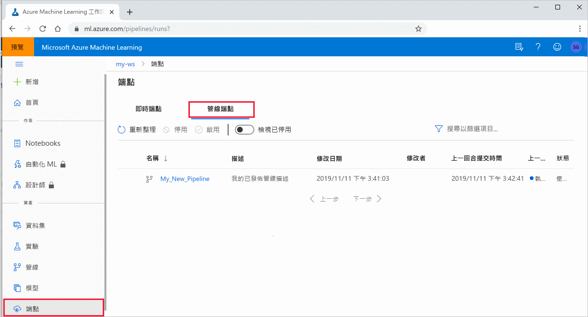

# <a name="publish-and-track-machine-learning-pipelines"></a>發佈和追蹤機器學習管線

[!INCLUDE [applies-to-skus](../../includes/aml-applies-to-basic-enterprise-sku.md)]

本文將說明如何與您的同事或客戶共用機器學習管線。

機器學習管線是機器學習工作的可重複使用工作流程。 管線的其中一個優點是會增加共同作業。 您也可以在使用新版本時，讓客戶使用目前的模型，來為管線進行版本處理。 

## <a name="prerequisites"></a>必要條件

* 建立 [Azure Machine Learning 工作區](how-to-manage-workspace.md) 以保存您的所有管線資源

* [設定您的開發環境](how-to-configure-environment.md)以安裝 Azure Machine Learning sdk，或使用已安裝 SDK 的[Azure Machine Learning 計算實例](concept-compute-instance.md)

* 建立並執行機器學習管線，例如依照下列教學課程 [：建立批次計分的 Azure Machine Learning 管線](tutorial-pipeline-batch-scoring-classification.md)。 如需其他選項，請參閱 [使用 AZURE MACHINE LEARNING SDK 來建立及執行機器學習管線](how-to-create-your-first-pipeline.md)

## <a name="publish-a-pipeline"></a>發佈管線

當管線啟動並執行之後，您就可以發佈管線，使其以不同的輸入執行。 針對已發佈之管線的 REST 端點接受參數，您必須設定管線以 `PipelineParameter` 針對將會改變的引數使用物件。

1. 若要建立管線參數，請使用 [PipelineParameter](https://docs.microsoft.com/python/api/azureml-pipeline-core/azureml.pipeline.core.graph.pipelineparameter?view=azure-ml-py) 物件搭配預設值。

   ```python
   from azureml.pipeline.core.graph import PipelineParameter
   
   pipeline_param = PipelineParameter(
     name="pipeline_arg",
     default_value=10)
   ```

2. 將這個 `PipelineParameter` 物件以參數形式新增至管線中的任何步驟，如下所示：

   ```python
   compareStep = PythonScriptStep(
     script_name="compare.py",
     arguments=["--comp_data1", comp_data1, "--comp_data2", comp_data2, "--output_data", out_data3, "--param1", pipeline_param],
     inputs=[ comp_data1, comp_data2],
     outputs=[out_data3],
     compute_target=compute_target,
     source_directory=project_folder)
   ```

3. 發佈這個將在被叫用時接受參數的管線。

   ```python
   published_pipeline1 = pipeline_run1.publish_pipeline(
        name="My_Published_Pipeline",
        description="My Published Pipeline Description",
        version="1.0")
   ```

## <a name="run-a-published-pipeline"></a>執行已發佈的管線

所有已發佈的管線都有 REST 端點。 使用管線端點時，您可以從任何外部系統（包括非 Python 用戶端）觸發管線的執行。 此端點可在批次評分和重新訓練案例中，提供「受控的可重複性」。

若要叫用上述管線的執行，您需要 Azure Active Directory authentication 標頭權杖。 取得這類權杖的說明位於 [>azurecliauthentication 類別](https://docs.microsoft.com/python/api/azureml-core/azureml.core.authentication.azurecliauthentication?view=azure-ml-py) 參考和 Azure Machine Learning 筆記本中的 [驗證](https://aka.ms/pl-restep-auth) 。

```python
from azureml.pipeline.core import PublishedPipeline
import requests

response = requests.post(published_pipeline1.endpoint,
                         headers=aad_token,
                         json={"ExperimentName": "My_Pipeline",
                               "ParameterAssignments": {"pipeline_arg": 20}})
```

## <a name="create-a-versioned-pipeline-endpoint"></a>建立已建立版本的管線端點

您可以建立管線端點，其中包含多個已發佈的管線。 當您逐一查看和更新 ML 管線時，這會提供您固定的 REST 端點。

```python
from azureml.pipeline.core import PipelineEndpoint

published_pipeline = PipelineEndpoint.get(workspace=ws, name="My_Published_Pipeline")
pipeline_endpoint = PipelineEndpoint.publish(workspace=ws, name="PipelineEndpointTest",
                                            pipeline=published_pipeline, description="Test description Notebook")
```

## <a name="submit-a-job-to-a-pipeline-endpoint"></a>將作業提交至管線端點

您可以將作業提交至管線端點的預設版本：

```python
pipeline_endpoint_by_name = PipelineEndpoint.get(workspace=ws, name="PipelineEndpointTest")
run_id = pipeline_endpoint_by_name.submit("PipelineEndpointExperiment")
print(run_id)
```

您也可以將作業提交至特定版本：

```python
run_id = pipeline_endpoint_by_name.submit("PipelineEndpointExperiment", pipeline_version="0")
print(run_id)
```

使用 REST API 可以完成相同動作：

```python
rest_endpoint = pipeline_endpoint_by_name.endpoint
response = requests.post(rest_endpoint, 
                         headers=aad_token, 
                         json={"ExperimentName": "PipelineEndpointExperiment",
                               "RunSource": "API",
                               "ParameterAssignments": {"1": "united", "2":"city"}})
```

## <a name="use-published-pipelines-in-the-studio"></a>在 studio 中使用已發佈的管線

您也可以從 studio 執行已發佈的管線：

1. 登入 [Azure Machine Learning Studio](https://ml.azure.com)。

1. [查看您的工作區](how-to-manage-workspace.md#view)。

1. 選取左側的 [ **端點**]。

1. 在頂端，選取 **管線端點**。
 

1. 選取特定管線以執行、取用或查看管線端點先前執行的結果。

## <a name="disable-a-published-pipeline"></a>停用已發佈的管線

若要從已發佈的管線清單中隱藏管線，請在 studio 或從 SDK 中停用管線：

```python
# Get the pipeline by using its ID from Azure Machine Learning studio
p = PublishedPipeline.get(ws, id="068f4885-7088-424b-8ce2-eeb9ba5381a6")
p.disable()
```

您可以使用重新啟用它 `p.enable()` 。 如需詳細資訊，請參閱 [PublishedPipeline 類別](https://docs.microsoft.com/python/api/azureml-pipeline-core/azureml.pipeline.core.publishedpipeline?view=azure-ml-py) 參考。

## <a name="next-steps"></a>後續步驟

- 使用 [GitHub 上的這些 Jupyter Notebook](https://aka.ms/aml-pipeline-readme) 來進一步探索機器學習管線。
- 請參閱 [azureml-管線-核心](https://docs.microsoft.com/python/api/azureml-pipeline-core/?view=azure-ml-py) 封裝和 [azureml-管線-步驟](https://docs.microsoft.com/python/api/azureml-pipeline-steps/?view=azure-ml-py) 套件的 SDK 參考說明。
- 請參閱 [如何](how-to-debug-pipelines.md) 取得對管線進行偵錯工具和疑難排解的秘訣。
