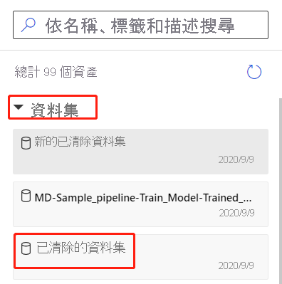

# 將資料匯入 Azure 機器學習設計器(預覽版)

在本文中,您將瞭解如何在設計器中導入自己的數據以創建自定義解決方案。 有兩種方法可以將資料匯入設計器: 

* **Azure 機器學習資料集**- 在 Azure 機器學習中註冊[數據集](concept-data.md#datasets),以啟用可説明您管理數據的進階功能。
* **匯入資料模組**- 使用[導入數據](algorithm-module-reference/import-data.md)模組直接從連線數據來源存取資料。

## 使用 Azure 機器學習資料集

我們建議您使用[資料集](concept-data.md#datasets)將數據導入設計器。 註冊資料集時,可以充分利用進階資料功能,如[版本控制、追蹤](how-to-version-track-datasets.md)和[資料監視](how-to-monitor-datasets.md)。

### 註冊資料集

您可以[透過 SDK 或](how-to-create-register-datasets.md#use-the-sdk)在 Azure[機器學習工作室直覺地](how-to-create-register-datasets.md#use-the-ui)註冊現有數據集。

您還可以將任何設計器模組的輸出註冊為數據集。

1. 選擇輸出要註冊數據的模組。

1. 在屬性窗格中,選擇 **「輸出** > **註冊」 資料集**。

    

### 使用資料集

可以在「**數據集** > **」我的數據集**「下,在模組調色板中找到已註冊的數據集。 要使用數據集,請將其拖放到管道畫布上。 然後,將數據集的輸出埠連接到調色板中的其他模組。

> [!NOTE]
> 設計器目前僅支援處理[表格資料集](how-to-create-register-datasets.md#dataset-types)。 如果要使用[檔案資料集](how-to-create-register-datasets.md#dataset-types),請使用適用於 Python 和 R 的 Azure 機器學習 SDK。

## 使用匯入資料模組匯入資料

雖然我們建議您使用數據集導入數據,但也可以使用[「導入數據」](algorithm-module-reference/import-data.md)模組。 導入資料模組跳過在 Azure 機器學習中註冊數據集,並直接從[資料存儲](concept-data.md#datastores)或 HTTP URL 導入數據。

有關如何使用匯入資料模組的詳細資訊,請參閱[匯入資料參考頁](algorithm-module-reference/import-data.md)。

> [!NOTE]
> 如果數據集的列太多,則可能會遇到以下錯誤:"由於大小限制,驗證失敗"。 為了避免這種情況,[請在資料集介面中註冊資料集](how-to-create-register-datasets.md#use-the-ui)。

## 支援的來源

本節列出設計器支援的數據源。 數據從資料存儲或[表格資料集](how-to-create-register-datasets.md#dataset-types)進入設計器。

### 資料儲存來源
有關受支援的資料儲存來源的清單,請參考[Azure 儲存服務中的存取資料](how-to-access-data.md#supported-data-storage-service-types)。

### 表格資料集來源

設計器支援從以下來源建立的表格資料集:
 * 符號分隔檔案
 * JSON 檔案
 * Parquet 檔案
 * SQL 查詢

## 資料類型

設計人員內部識別以下資料類型:

* String
* 整數 
* Decimal
* Boolean
* Date

設計器使用內部數據類型在模組之間傳遞數據。 您可以使用[「轉換為資料集」](algorithm-module-reference/convert-to-dataset.md)模組顯示式將資料轉換為資料表格式。 任何接受內部格式以外的格式的模組都將在將數據傳遞給下一個模組之前靜默轉換數據。

## 資料限制

設計器中的模組受計算目標大小的限制。 對於較大的數據集,應使用較大的 Azure 機器學習計算資源。 有關 Azure 機器學習計算的詳細資訊,請參閱[Azure 機器學習中的計算目標是什麼?](concept-compute-target.md#azure-machine-learning-compute-managed)

## 後續步驟

通過教程瞭解設計師的基礎知識[:與設計師一起預測汽車價格](tutorial-designer-automobile-price-train-score.md)。
