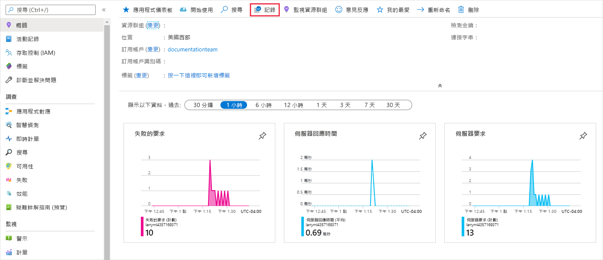

# <a name="monitor-and-collect-data-from-ml-web-service-endpoints"></a>監視和從 ML Web 服務終結點收集資料
[!INCLUDE [applies-to-skus](../../includes/aml-applies-to-basic-enterprise-sku.md)]

在本文中，您將瞭解如何通過通過啟用 Azure 應用程式見解，從 Azure Kubernetes 服務 （AKS） 或 Azure 容器實例 （ACI） 中部署到 Web 服務終結點的模型收集資料並監視模型 
* [Azure 機器學習 Python SDK](#python)
* [Azure 機器學習工作室](#studio)https://ml.azure.com

除了收集終結點的輸出資料和回應外，您還可以監視：

* 要求速率、回應時間和失敗率
* 相依性速率、回應時間和失敗率
* 例外狀況

[瞭解有關 Azure 應用程式見解 的更多詳細資訊](../azure-monitor/app/app-insights-overview.md)。 


## <a name="prerequisites"></a>Prerequisites

* 如果您沒有 Azure 訂用帳戶，請在開始前先建立免費帳戶。 立即試用[免費或付費版本的 Azure 機器學習](https://aka.ms/AMLFree)

* 已安裝 Azure Machine Learning 工作區、包含指令碼的本機目錄，以及適用於 Python 的 Azure Machine Learning SDK。 要瞭解如何獲取這些先決條件，請參閱[如何配置開發環境](how-to-configure-environment.md)

* 要部署至 Azure Kubernetes Service (AKS) 或 Azure Container 執行個體 (ACI) 的已訓練機器學習模型。 如果沒有，請參閱[訓練圖像分類模型](tutorial-train-models-with-aml.md)教程

## <a name="web-service-metadata-and-response-data"></a>Web 服務中繼資料和回應資料

>[!Important]
> Azure 應用程式見解僅記錄高達 64kb 的有效負載。 如果達到此限制，則僅記錄模型的最新輸出。 

與 Web 服務中繼資料和模型預測對應的服務的中繼資料和回應將記錄到消息`"model_data_collection"`下的 Azure 應用程式見解跟蹤。 您可以直接查詢 Azure 應用程式見解以訪問此資料，或設置[連續匯出](https://docs.microsoft.com/azure/azure-monitor/app/export-telemetry)到存儲帳戶，以便延長保留時間或進一步處理。 然後，模型資料可用於 Azure 機器學習，以設置標籤、再培訓、可解釋性、資料分析或其他用途。 

<a name="python"></a>

## <a name="use-python-sdk-to-configure"></a>使用 Python SDK 配置 

### <a name="update-a-deployed-service"></a>更新已部署的服務

1. 識別您工作區中的服務。 的值`ws`是工作區的名稱

    ```python
    from azureml.core.webservice import Webservice
    aks_service= Webservice(ws, "my-service-name")
    ```
2. 更新服務並啟用 Azure 應用程式見解

    ```python
    aks_service.update(enable_app_insights=True)
    ```

### <a name="log-custom-traces-in-your-service"></a>記錄您服務中的自訂追蹤

如果您想要記錄自訂追蹤，請依循[部署方式及位置](how-to-deploy-and-where.md)文件中的 AKS 或 ACI 標準部署程序。 然後使用下列步驟：

1. 通過添加列印語句更新評分檔
    
    ```python
    print ("model initialized" + time.strftime("%H:%M:%S"))
    ```

2. 更新服務配置
    
    ```python
    config = Webservice.deploy_configuration(enable_app_insights=True)
    ```

3. 建置映像並將其部署在 [AKS 或 ACI](how-to-deploy-and-where.md) 上。

### <a name="disable-tracking-in-python"></a>在 Python 中停用追蹤

要禁用 Azure 應用程式見解，請使用以下代碼：

```python 
## replace <service_name> with the name of the web service
<service_name>.update(enable_app_insights=False)
```

<a name="studio"></a>

## <a name="use-azure-machine-learning-studio-to-configure"></a>使用 Azure 機器學習工作室配置

當您準備好使用這些步驟部署模型時，還可以從 Azure 機器學習工作室啟用 Azure 應用程式見解。

1. 登錄到工作區，https://ml.azure.com/
1. 轉到 **"模型"** 並選擇要部署的模型
1. 選擇 **+部署**
1. 填充**部署模型**表單
1. 展開 **"高級"** 功能表

    
1. 選擇**啟用應用程式見解診斷和資料收集**

    
## <a name="evaluate-data"></a>評估資料
服務的資料存儲在 Azure 應用程式見解帳戶中，與 Azure 機器學習位於同一資源組中。
若要檢視：

1. 轉到[Azure 門戶](https://ms.portal.azure.com/)中的 Azure 機器學習工作區，然後按一下應用程式見解連結

    [](././media/how-to-enable-app-insights/AppInsightsLoc.png#lightbox)

1. 選擇 **"概述"** 選項卡可查看服務的基本指標集

   [](././media/how-to-enable-app-insights/overview.png#lightbox)

1. 要查看 Web 服務請求中繼資料和回應，請在 **"日誌（分析）"** 部分中選擇**請求**表，然後選擇 **"運行"** 以查看請求

   [](././media/how-to-enable-app-insights/model-data-trace.png#lightbox)


3. 要查看自訂跟蹤，請選擇 **"分析"**
4. 在 [結構描述] 區段中，選取 [追蹤]****。 然後選取 [執行]**** 來執行查詢。 資料應以表格式顯示，並應映射到評分檔中的自訂調用

   [](././media/how-to-enable-app-insights/logs.png#lightbox)

要瞭解有關如何使用 Azure 應用程式見解的更多內容，請參閱[什麼是應用程式見解？](../azure-monitor/app/app-insights-overview.md)

## <a name="export-data-for-further-processing-and-longer-retention"></a>匯出資料以進行進一步處理和延長保留時間

>[!Important]
> Azure 應用程式見解僅支援匯出到 blob 存儲。 此匯出功能的其他限制列在[應用見解的匯出遙測](https://docs.microsoft.com/azure/azure-monitor/app/export-telemetry#continuous-export-advanced-storage-configuration)中。

可以使用 Azure 應用程式見解的[連續匯出](https://docs.microsoft.com/azure/azure-monitor/app/export-telemetry)將消息發送到受支援的存儲帳戶，其中可以設置較長的保留期。 消息`"model_data_collection"`以 JSON 格式存儲，可以輕鬆分析以提取模型資料。 

Azure 資料工廠、Azure ML 管道或其他資料處理工具可用於根據需要轉換資料。 轉換資料後，可以將資料註冊到 Azure 機器學習工作區作為資料集。 為此，請參閱[如何創建和註冊資料集](how-to-create-register-datasets.md)。

   [](././media/how-to-enable-app-insights/continuous-export-setup.png)


## <a name="example-notebook"></a>範例筆記本

啟用[應用洞察在生產中服務.ipynb](https://github.com/Azure/MachineLearningNotebooks/blob/master/how-to-use-azureml/deployment/enable-app-insights-in-production-service/enable-app-insights-in-production-service.ipynb)筆記本演示了本文中的概念。 
 
[!INCLUDE [aml-clone-in-azure-notebook](../../includes/aml-clone-for-examples.md)]

## <a name="next-steps"></a>後續步驟

* 瞭解如何[將模型部署到 Azure Kubernetes 服務群集](https://docs.microsoft.com/azure/machine-learning/how-to-deploy-azure-kubernetes-service)，或者[如何將模型部署到 Azure 容器實例](https://docs.microsoft.com/azure/machine-learning/how-to-deploy-azure-container-instance)以將模型部署到 Web 服務終結點，以及啟用 Azure 應用程式見解以利用資料收集和終結點監視
* 請參閱[MOPS：使用 Azure 機器學習管理、部署和監視模型](https://docs.microsoft.com/azure/machine-learning/concept-model-management-and-deployment)，瞭解有關利用從生產中模型收集的資料詳細資訊。 此類資料有助於持續改進機器學習流程
