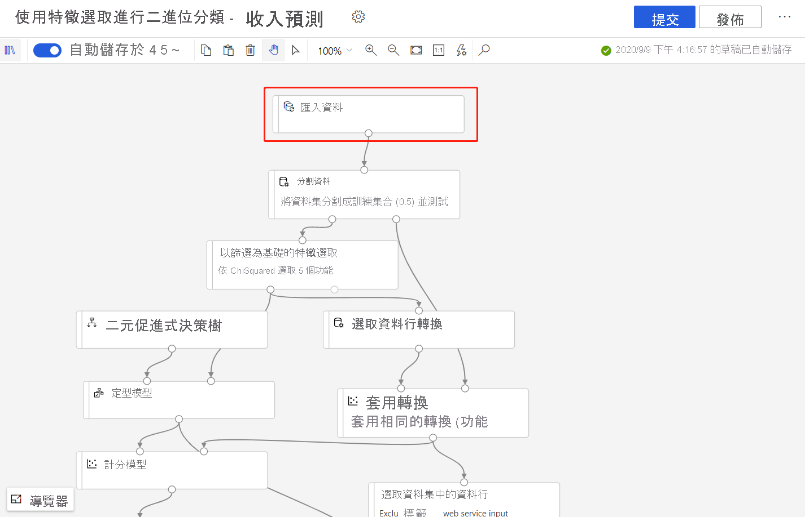

# 使用 Azure Machine Learning 設計工具重新定型模型

在此操作說明文章中，您將了解如何使用 Azure Machine Learning 設計工具來重新定型機器學習模型。 您將會使用已發佈的管線將工作流程自動化，並設定以新資料定型模型的參數。 

在本文中，您將學會如何：

> [!div class="checklist"]
> * 將機器學習模型定型。
> * 建立管線參數。
> * 發佈您的定型管線。
> * 使用新參數重新定型您的模型。

## Prerequisites

* Azure Machine Learning 工作區
* 完成此操作說明系列的第1部分， [在設計工具中轉換資料](how-to-designer-transform-data.md)

[!INCLUDE [machine-learning-missing-ui](../../includes/machine-learning-missing-ui.md)]

本文也假設您已瞭解如何在設計工具中建立管線。 如需導引簡介，請完成[教學課程](tutorial-designer-automobile-price-train-score.md)。 

### 範例管線

本文中使用的管線是在設計工具首頁中變更的範例管線 [收入預測](samples-designer.md#classification) 版本。 此管線會使用[匯入資料](algorithm-module-reference/import-data.md)模組 (而不是範例資料集) 來說明如何使用您自己的資料定型模型。

## 建立管線參數

建立管線參數，以在執行階段動態設定變數。 在此範例中，您會將定型資料路徑從固定值變更為參數，以便使用不同的資料重新定型模型。

1. 選取**匯入資料**模組。

    > [!NOTE]
    > 此範例會使用「匯入資料」模組來存取已註冊資料存放區中的資料。 不過，如果您使用替代的資料存取模式，則可以依照類似的步驟操作。

1. 在 [模組詳細資料] 窗格中，選取畫布右側的資料來源。

1. 輸入資料的路徑。 您也可以選取 [瀏覽路徑] 以瀏覽您的檔案樹狀結構。 

1. 將滑鼠放在 [路徑] 欄位上方，然後選取出現在 [路徑] 欄位上方的省略符號。

    

1. 選取 [新增至管線參數]。

1. 提供參數名稱和預設值。

   > [!NOTE]
   > 您可以選取管線草稿標題旁的 [設定] 齒輪圖示，以檢查和編輯管線參數。 

1. 選取 [儲存]。

1. 提交管線執行。

## 尋找定型的模型

設計工具會將所有管線輸出 (包括已定型的模型) 儲存至預設的工作區儲存體帳戶。 您也可以直接在設計工具中存取已定型的模型：

1. 等候管線執行完成。
1. 選取 **訓練模型** 模組。
1. 在畫布右側的 [模組詳細資料] 窗格中，選取 [輸出 + 記錄]。
1. 您可以在 [其他輸出] 中找到您的模型以及執行記錄。
1. 或者，選取 [檢視輸出] 圖示。 在此處，您可以依照對話方塊中的指示直接瀏覽至資料存放區。 

> [!div class="mx-imgBorder"]
> 

## 發佈定型管線

將管線發佈至管線端點，以便後續輕鬆地重複使用您的管線。 管線端點會建立後續可用來叫用管線的 REST 端點。 在此範例中，您的管線端點可讓您重複使用管線，以使用不同的資料重新定型模型。

1. 選取設計工具畫布上方的 [發佈]。
1. 選取或建立管線端點。

   > [!NOTE]
   > 您可以將多個管線發佈至單一端點。 指定端點中的每個管線都會獲得版本號碼，而您可以在呼叫管線端點時指定此號碼。

1. 選取 [發佈] 。

## 重新定型您的模型

現在您已有已發佈的定型管線，接下來可使用此管線以新資料重新定型模型。 您可以透過 Studio 工作區或程式設計方式，從管線端點提交執行。

### 使用 studio 入口網站提交執行

使用下列步驟來提交從 studio 入口網站執行的參數化管線端點：

1. 移至 Studio 工作區中的 [端點] 頁面。
1. 選取 [管線端點] 索引標籤。然後，選取您的管線端點。
1. 選取 [已發佈的管線] 索引標籤。然後，選取您要執行的管線版本。
1. 選取 [提交]。
1. 在 [設定] 對話方塊中，您可以指定執行的參數值。 在此範例中，請使用非美國資料集更新資料路徑，將您的模型定型。

### 使用程式碼提交執行

您可以在 [概觀] 面板中找到已發佈管線的 REST 端點。 藉由呼叫端點，可以重新定型已發佈的管線。

若要進行 REST 呼叫，您需要 OAuth 2.0 Bearer-type 驗證標頭。 如需設定工作區驗證及進行參數化 REST 呼叫的詳細資訊，請參閱[建置 Azure Machine Learning 管線進行批次評分](tutorial-pipeline-batch-scoring-classification.md#publish-and-run-from-a-rest-endpoint)。

## 後續步驟

在本文中，您已了解如何使用設計工具建立參數化定型管線端點。

如需如何部署模型以進行預測的完整逐步解說，請參閱[設計工具教學課程](tutorial-designer-automobile-price-train-score.md)以定型和部署迴歸模型。
