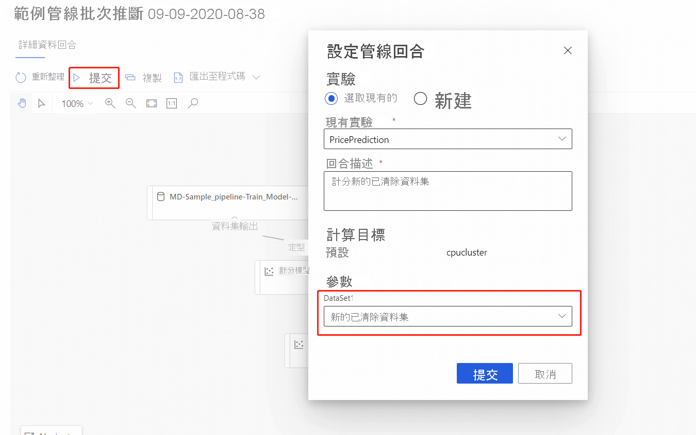

# 使用 Azure Machine Learning 設計工具執行批次預測 (預覽)
[!INCLUDE [applies-to-skus](../../includes/aml-applies-to-enterprise-sku.md)]

在本文中，您將了解如何使用設計工具來建立批次預測管線。 批次預測可讓您依據需求，使用可從任何 HTTP 程式庫觸發的 Web 服務來持續對大型資料集進行評分。

在此操作說明中，您將了解下列工作：

> [!div class="checklist"]
> * 建立和發佈批次推斷管線
> * 使用管線端點
> * 管理端點版本

若要了解如何使用 SDK 來設定批次評分服務，請參閱隨附的[操作說明](how-to-run-batch-predictions.md)。

## Prerequisites

本操作說明假設您已經有訓練管線。 如需設計工具的導引簡介，請完成[設計工具教學課程的第一部分](tutorial-designer-automobile-price-train-score.md)。 

## 建立批次推斷管線

您的訓練管線必須至少執行一次，才能夠建立推斷管線。

1. 移至工作區中的 [設計工具] 索引標籤。

1. 選取訓練管線，以訓練您要用來進行預測的模型。

1. **提交**管線。

    

現在訓練管線已執行，您可以接著建立批次推斷管線。

1. 在 [提交] 旁邊，選取新的下拉式清單 [建立推斷管線]。

1. 選取 [批次推斷管線]。

    
    
結果將是預設批次推斷管線。 

### 新增管線參數

若要在新資料上建立預測，您可以手動連結此管線草稿檢視中的不同資料集，或為您的資料集建立參數。 參數可讓您變更執行階段上的批次推斷程序行為。

在本節中，您會建立資料集參數來指定進行預測所需的不同資料集。

1. 選取資料集模組。

1. 窗格會出現在畫布的右邊。 在窗格底部，選取 [設定為管線參數]。
   
    輸入參數的名稱，或接受預設值。

## 發佈您的批次推斷管線

現在您已經準備好部署推斷管線。 這會部署管線，並使其可供其他人使用。

1. 選取 [發佈] 按鈕。

1. 在出現的對話方塊中，展開 [PipelineEndpoint] 的下拉式清單，然後選取 [新增 PipelineEndpoint]。

1. 為端點提供名稱和選擇性的描述。

    在靠近對話方塊底部的地方，您可以看到您所設定的參數和訓練期間所使用的資料集識別碼預設值。

1. 選取 [發佈] 。

## 使用端點

現在，您有一個已發行的管線，其中包含資料集參數。 管線將會使用訓練管線中建立的已訓練模型，為您作為參數提供的資料集評分。

### 提交管線執行 

在本節中，您將設定手動的管線執行並改變管線參數，以對新資料進行評分。 

1. 部署完成之後，請移至**端點**區段。

1. 選取 [管線端點]。

1. 選取您建立的端點名稱。

1. 選取 [已發佈的管線]。

    此畫面會顯示此端點下所有已發佈的管線。

1. 選取您發佈的管線。

    管線詳細資料頁面會顯示管線的詳細執行歷程記錄和連接字串資訊。 
    
1. 選取 [提交] 以建立管線的手動執行。

    
    
1. 將參數變更為使用不同的資料集。
    
1. 選取 [提交] 以執行管線。

### 使用 REST 端點

您可以在**端點**區段中，找到如何使用管線端點和已發佈管線的相關資訊。

您可以在 [執行概觀] 面板中找到管線端點的 REST 端點。 您可以呼叫端點來使用其預設的已發佈管線。

您也可以在 [已發佈的管線] 頁面中使用已發佈的管線。 選取已發佈的管線並尋找其 REST 端點。 

若要進行 REST 呼叫，您將需要 OAuth 2.0 Bearer-type 驗證標頭。 若要進一步了解如何設定對工作區進行驗證以及如何進行參數化 REST 呼叫，請參閱下列[教學課程章節](tutorial-pipeline-batch-scoring-classification.md#publish-and-run-from-a-rest-endpoint)。

## 版本控制端點

設計工具會將版本指派給您發佈至端點的每個後續管線。 您可以在 REST 呼叫中指定要當做參數執行的管線版本。 如果您未指定版本號碼，則設計工具會使用預設管線。

當您發佈管線時，您可以選擇讓其成為該端點的新預設管線。

您也可以在端點的 [已發佈的管線] 索引標籤中，設定新的預設管線。

## 後續步驟

依照設計工具[教學課程](tutorial-designer-automobile-price-train-score.md)的指示來定型和部署迴歸模型。
''